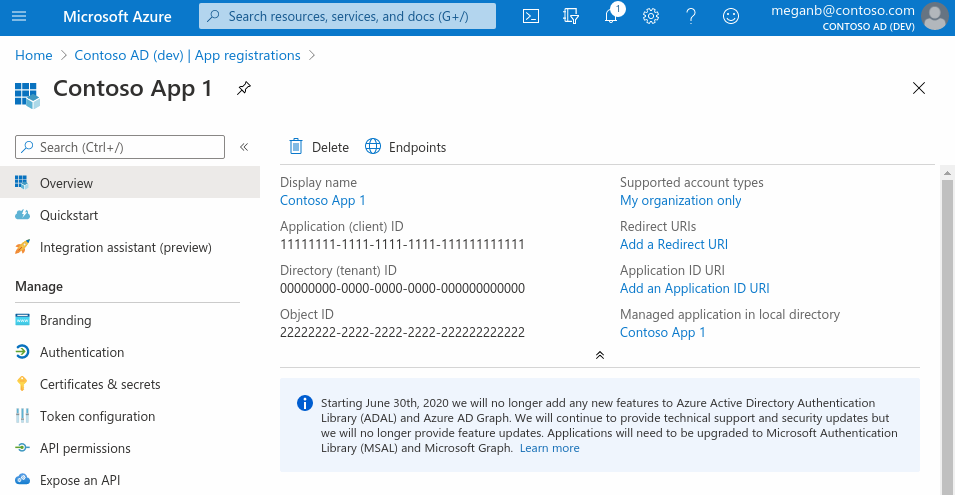

## Description

Microsoft Azure AD Component is designed to access users and group data from Azure AD, as well as manage roles, and permissions.

## Credentials

Microsoft Azure AD uses the OAuth 2.0.
How to register an application look [here](https://learn.microsoft.com/en-us/azure/active-directory/develop/quickstart-register-app).
Redirect URI for EIO platform is `https://your-tenant.address/callback/oauth2`

- `Client ID` can be found at `Application (client) ID` (see picture)
- `Client Secret` follow link `Client credentials` (see picture) and use `Value` section

During credentials creation you would need to:
- select `OAuth2` drop-down list ``Type``.
- select existing Auth Client from drop-down list ``Choose Auth Client`` or create the new one.
  For creating Auth Client you should specify following fields:

| Field name             | Mandatory | Description                                                           |
|------------------------|-----------|-----------------------------------------------------------------------|
| Name                   | true      | your Auth Client's name                                               |
| Client ID              | true      | your OAuth Client ID                                                  |
| Client Secret          | true      | your OAuth Client Secret                                              |
| Authorization Endpoint | true      | set: `https://login.microsoftonline.com/common/oauth2/v2.0/authorize` |
| Token Endpoint         | true      | set: `https://login.microsoftonline.com/common/oauth2/v2.0/token`     |

- fill field ``Scopes`` as `offline_access Directory.Read.All Directory.ReadWrite.All Directory.AccessAsUser.All` and add another scopes if you need it.
- click on ``Authenticate`` button - the process would take you to Exact Online to log-in and give permissions to the platform to access your service.
- click on ``Verify`` button for verifying your credentials
- click on ``Save`` button for saving your credentials

## Triggers

This component has no trigger functions. This means it will not be accessible to
select as a first component during the integration flow design.

## Actions

### Make Raw Request

Executes custom request.

#### Configuration Fields

* **Don't throw error on 404 Response** - (optional, boolean): Treat 404 HTTP responses not as error, defaults to `false`.

#### Input Metadata

* **Url** - (string, required): Path of the resource relative to the base URL.
* **Method** - (string, required): HTTP verb to use in the request, one of `GET`, `POST`, `PUT`, `PATCH`, `DELETE`.
* **Request Body** - (object, optional): Body of the request to send.

#### Output Metadata

* **Status Code** - (number, required): HTTP status code of the response.
* **HTTP headers** - (object, required): HTTP headers of the response.
* **Response Body** - (object, optional): HTTP response body.

#### Known Limitations

* The REST API architecture comprises a variety of endpoints and methods (verbs). While the Make Raw Request action is intended to cover all possible cases, certain edge cases such as the PUT method may not have been thoroughly tested.
