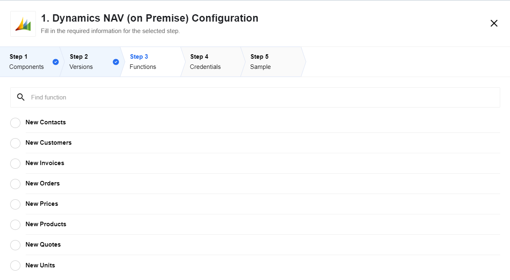

## Description

Microsoft Dynamics NAV is a global enterprise resource planning (ERP) solution
that provides small and midsize businesses greater control over their finances
and can simplify their supply chain, manufacturing, and operations.

## Credentials

| Property name | Required |
|--------------|--------|
| Username     | true   |
| Password     | true   |
| User Domain  | true   |
| Service URL  | true   |

## Triggers

1.  New Products
2.  New Contacts
3.  New Units
4.  New Prices
5.  New Customers
6.  New Quotes
7.  New Orders
8.  New Invoices

## Actions

1.  Create/Update Contact
2.  Create/Update Customer

## Microsoft Dynamics NAV integration component

This is a private component to work with the Microsoft Dynamics NAV software in
your integration flows, developed specifically to run on {{site.data.tenant.name}} platform.

The component supports both triggers and actions, which means you can use it
either to execute or to act upon a certain event. For example, you can create
and update contacts or push new products and new customers to other applications
for further data processing.

Due to the fact that it is under the proprietary license, you cannot change or
extend this connector yourself. If you need some specific additional triggers
and / or actions, please contact our pre-sales team first to discuss the details.

