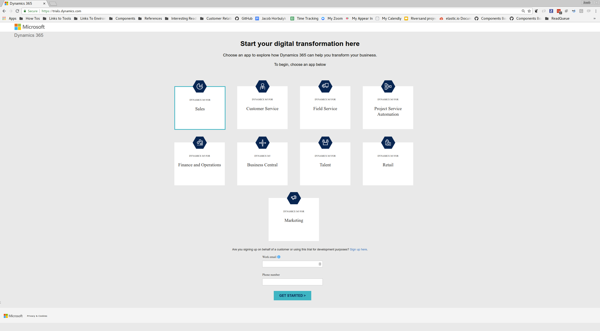
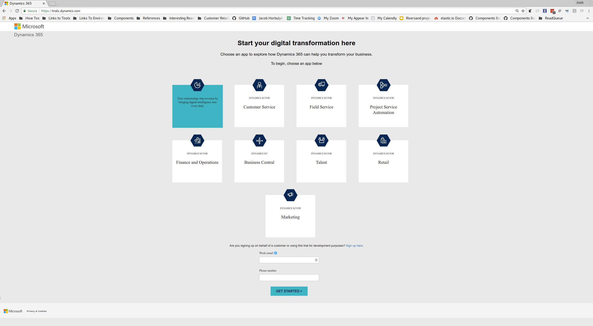
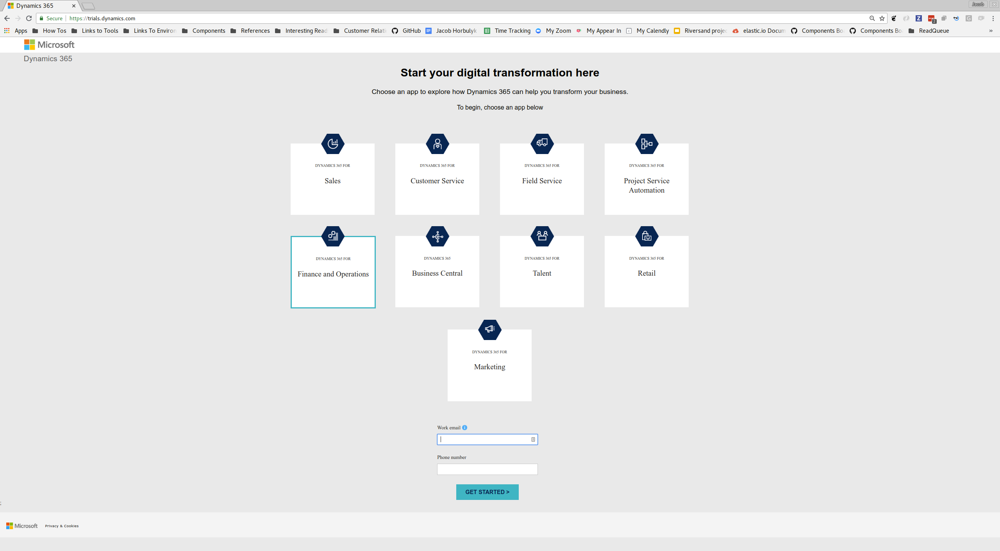
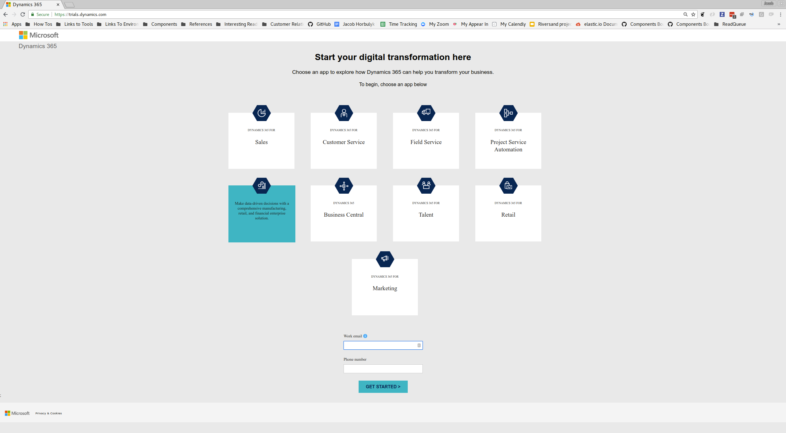

Microsoft Dynamics CRM is a product in the Microsoft Dynamics family.  It is a
CRM within that product family.

Microsoft Dynamics Finance and Operations is a product in the Microsoft Dynamics family.  It is a
ERP within that product family.

This component can interact with both of these systems and possibly other systems in the dynamics family that expose OData APIs that support authentication through OAuth.

## OData API Summary

Like other members of the Dynamics product family, Business Central exposes
[OData APIs](http://www.odata.org/documentation/) for editions published after
approximately 2015.  These APIs have the following caveats:

* Authentication is done with OAuth.  Both the [`Authorization Code Flow`](https://tools.ietf.org/html/rfc6749#section-1.3.1) and the [`Resource Owner Password Credentials Grant Flow`](https://tools.ietf.org/html/rfc6749#section-1.3.3).  There is a postman collection which demonstrates the Resource Owner Password Credentials Grant Flow case.  The corresponding environment variables are in BitWarden
* The URL of the OData root  is hard to find.  For CRM it is `/api/data/v8.2`.  For Finance and Operations it is `/data`.

## Test Instance Set Up - Using Cloud Trial Instance
A trial instance of Business Central can be requested from
https://trials.dynamics.com/ and selecting `Business Central`.  Sometimes this
trial expires or otherwise shuts down.  If this occurs, the below steps can be
followed to re-create it:

1. Visit https://trials.dynamics.com/
2. Select:
   * App type: `Sales` (for CRM)
   * Work email: (give your work e-mail)
   * Phone number: (give your phone number)

3. Click `Get Started`.
4. You should get a message saying that you already have an account.  Sign in if
necessary.
5. You will get a message saying you already have a Dynamics 365 license.
8. You should now be able to visit https://eiosales.crm4.dynamics.com/ and
interact with our test instance.  Sometimes this URL will be https://eiosales0.crm4.dynamics.com/ for no good reason.

## Support
A ticket can be filled with support through https://admin.dynamics.com/

One previous issue was resolved by using incognito mode.  A screenshot of that error is below.

## Integration Tests
An `.env` file for integration tests can be found in BitWarden.  It requires a valid access token for authentication to be manually provided first.  One can be obtained using the provided postman collection.
