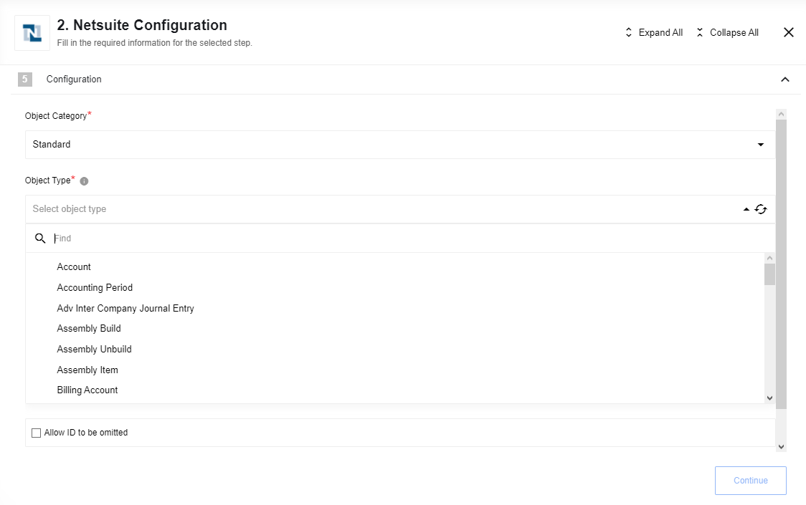
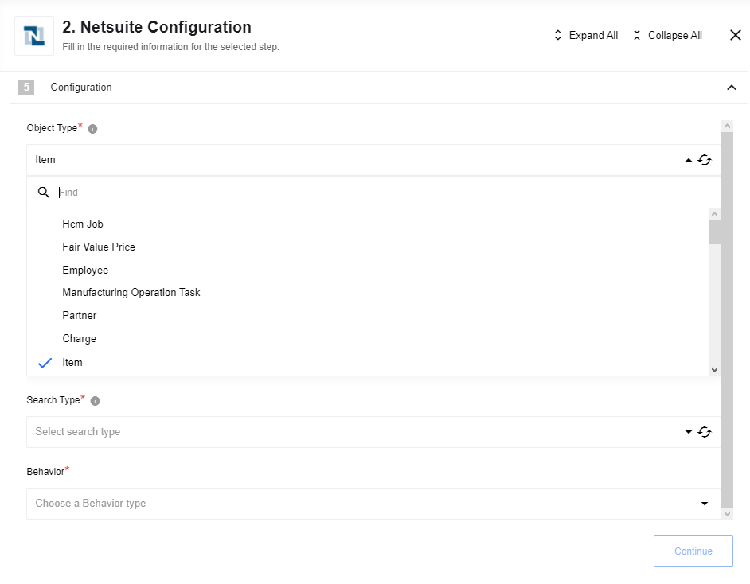
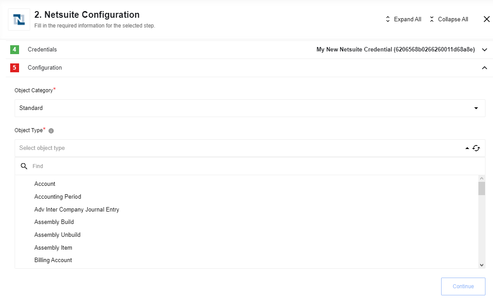

## Add Object

Creates a new record in NetSuite.

### Configuration Fields
*   **Object Category** (required): The record category (e.g., Standard, Custom).
*   **Object Type** (required): The specific NetSuite object type. This list is populated dynamically.

### Input Metadata
The input schema is generated dynamically based on the selected Object Type.

<details close markdown="block"><summary><strong>Input metadata for invoice object</strong></summary>

```json
{
  "entity": {
    "internalId": "5"
  },
  "currency": {
    "internalId": "1"
  },
  "tranDate": "2023-05-23",
  "itemList": {
    "item": [
      {
        "description": "General Donation",
        "amount": 1000,
        "item": {
          "internalId": "12"
        },
        "quantity": 1,
        "rate": "100",
        "taxCode": {
          "internalId": "5"
        },
        "customFieldList": {
          "customField": [
            {
              "type": "SelectCustomFieldRef",
              "scriptId": "asd_d3",
              "value": {
                "name": "Charity type",
                "internalId": "2"
              }
            }
          ]
        }
      }
    ]
  },
  "customFieldList": {
    "customField": [
      {
        "type": "StringCustomFieldRef",
        "scriptId": "custbody_sf_field-one",
        "value": "Bank Transfer"
      },
      {
        "type": "StringCustomFieldRef",
        "scriptId": "custbody_sf_field-two",
        "value": "Individual One-Off"
      },
      {
        "type": "StringCustomFieldRef",
        "scriptId": "custbody_sf_field-three",
        "value": "John Doe"
      },
      {
        "type": "StringCustomFieldRef",
        "scriptId": "custbody_sf_field-four",
        "value": "ABC-987"
      }
    ]
  }
}
```
</details>

## Delete Object By Id

Deletes a record from NetSuite using its Internal or External ID.


### Configuration Fields

*   **Object Category** (required): (e.g., Standard, Custom).
*   **Object Type** (required): The NetSuite object type. Populated dynamically.

### Input Metadata

Input fields are generated dynamically. 

**Input metadata for Transaction objects:**

```json
{
  "internalId": "string",
  "externalId": "string",
  "deletionReasonCode": "deleteionReasonCodeString",
  "deletionReasonMemo": "deletionReasonMemoString"
}
```

<details close markdown="block"><summary><strong>Deletion Reason Usage Notes:</strong></summary>

> **Please Note:** the following about the `deletionReason` parameter:
> The `deletionReason` complex type includes two fields: `deletionReasonCode` and `deletionReasonMemo`. The `deletionReasonCode` must identify a deletion reason that is listed at Setup > Accounting > Accounting Lists. If the "Use Deletion Reasons" feature is enabled and you use a `deletionReasonCode` that does not exist, the request fails with an `INVALID_REF_KEY` error.
> Deletion reasons can be saved only for transactions. However, in SOAP web services, you must use the `deletionReason` parameter even when referencing other record types, and even when the "Use Deletion Reasons" feature is not enabled. For situations where it is not appropriate to identify a deletion reason, pass in a value of `null`.
> Even when a deletion reason is required, you can use a value of `null`. In these cases, the system automatically populates the deletion reason fields with default values: `Other` for `deletionReasonCode` and `This transaction was deleted by script or web service for deletionReasonMemo`.
> The `deletionReason` complex type is defined in the core XSD.
> For more details about the "Use Deletion Reasons" feature, see "Recording a Reason for Deleting a Transaction" in the NetSuite Help Center.
</details>

<br>

**Input metadata for other objects:**

```json
{
  "internalId": "string",
  "externalId": "string"
}
```

### Output Metadata

```json
{
  "internalId": "string"
}
```

## Get Item Availability
Retrieves real-time availability for a specific item.

### Configuration Fields
*   **Item Type** (required): The category of item (e.g., Assembly Item, Inventory Item).
*   **Allow Empty Results** (boolean, optional): If enabled, the action emits an empty object instead of an error if the item is not found.

### Input Metadata
*   **Item Internal ID** (string, optional)
*   **Item External ID** (string, optional)

> **Please Note:** Either the `Internal ID` or `External ID` must be provided.

**Input metadata example:**
```json
{
  "internalId": "1234"
}
```

### Output Metadata
Dynamically generated based on the selected Item Type.

## Lookup Object By Id

Retrieves a specific record by its ID.



### Configuration Fields
*   **Object Category** (required): (e.g., Standard, Custom).
*   **Object Type** (required): The NetSuite object type.
*   **Allow ID to be omitted** (boolean, optional).
*   **Allow Zero Results** (boolean, optional).

## Lookup Objects

Searches for objects in NetSuite that match specific criteria.



This action supports three search methodologies:
*   [**Basic Search**](#basic-search): Filter records using native fields.
*   [**Joined Search**](#joined-search): Filter records using fields from associated records.
*   [**Advanced Search**](#advanced-search): Leverages saved searches or provides granular control over filters and return columns.

### Configuration Fields
*   **Object Type** (required): The NetSuite object type to search.
*   **Search Type** (required): The search methodology (Basic, Joined, or Advanced).
*   **Behavior** (required): Defines how multiple results are handled:
    *   **Emit individually**: Each record is emitted as a separate message.
    *   **Fetch all**: Emits a single message containing an array of all results.
    *   **Fetch Page**: Emits a single message containing the first page of results.

### Basic Search

Filters records of a specific type using its native fields. Specifying return columns is not supported in Basic Search. The full list of available objects to search can be found  in the Help Center (may vary for each installation). You can find the entire metadata of each object there as well.

**Reference:** Log in to NetSuite and navigate to: **SuiteCloud > SuiteCloud Platform Introduction > SuiteCloud Records Reference Tools > SuiteScript Records Browser**.


Then choose Schema Browser > 'common' from the dropdown list and open the `Search` tab at the left.


What you should do next is to build a correct search request using object fields and operators.

#### Search operators

It is just the recommended list. You should always use an actual one based on the Help center of your account.

<details close markdown="block"><summary><strong>GetSelectValueFilterOperator:</strong></summary>

* contains
* is
* startsWith

</details>

<details close markdown="block"><summary><strong>SearchDateFieldOperator:</strong></summary>

* after
* before
* empty
* notAfter
* notBefore
* notEmpty
* notOn
* notOnOrAfter
* notOnOrBefore
* notWithin
* on
* onOrAfter
* onOrBefore
* within

</details>

<details close markdown="block"><summary><strong>SearchDoubleFieldOperator:</strong></summary>

* between
* empty
* equalTo
* greaterThan
* greaterThanOrEqualTo
* lessThan
* lessThanOrEqualTo
* notBetween
* notEmpty
* notEqualTo
* notGreaterThan
* notGreaterThanOrEqualTo
* notLessThan
* notLessThanOrEqualTo

</details>

<details close markdown="block"><summary><strong>SearchEnumMultiSelectFieldOperator:</strong></summary>

* anyOf
* noneOf

</details>

<details close markdown="block"><summary><strong>SearchLongFieldOperator:</strong></summary>

* between
* empty
* equalTo
* greaterThan
* greaterThanOrEqualTo
* lessThan
* lessThanOrEqualTo
* notBetween
* notEmpty
* notEqualTo
* notGreaterThan
* notGreaterThanOrEqualTo
* notLessThan
* notLessThanOrEqualTo

</details>

<details close markdown="block"><summary><strong>SearchMultiSelectFieldOperator:</strong></summary>

* anyOf
* noneOf

</details>

<details close markdown="block"><summary><strong>SearchStringFieldOperator:</strong></summary>

* contains
* doesNotContain
* doesNotStartWith
* empty
* hasKeywords
* is
* isNot
* notEmpty
* startsWith

</details>

<details close markdown="block"><summary><strong>SearchTextNumberFieldOperator:</strong></summary>

* between
* empty
* equalTo
* greaterThan
* greaterThanOrEqualTo
* lessThan
* lessThanOrEqualTo
* notBetween
* notEmpty
* notEqualTo
* notGreaterThan
* notGreaterThanOrEqualTo
* notLessThan
* notLessThanOrEqualTo

</details>

#### Basic Search Samples

##### **Search for contacts by email**
*   **Object Type**: Contact
*   **Search Type**: ContactSearchBasic

XML request:

<details close markdown="block"><summary><strong>Click to expand for more details:</strong></summary>

```xml
<soapenv:Envelope xmlns:xsi="http://www.w3.org/2001/XMLSchema-instance" xmlns:soapenv="http://schemas.xmlsoap.org/soap/envelope/" xmlns:urn="urn:messages_2019_1.platform.webservices.netsuite.com" xmlns:urn1="urn:core_2019_1.platform.webservices.netsuite.com">
    <soapenv:Header>
        <urn:applicationInfo>
            <urn:applicationId>YOURAPPLICATIONID</urn:applicationId>
        </urn:applicationInfo>
        <urn:passport>
            <urn1:email>YOUREMAIL</urn1:email>
            <urn1:password>YOURPASSWORD</urn1:password>
            <urn1:account>YOURACCOUNT</urn1:account>
        </urn:passport>
    </soapenv:Header>
    <soapenv:Body>
        <urn:search xmlns="urn:messages_2019_1.platform.webservices.netsuite.com">
            <urn:searchRecord xsi:type="ns4:ContactSearch" xmlns:ns4="urn:relationships_2019_1.lists.webservices.netsuite.com">
                <ns4:basic xsi:type="ns5:ContactSearchBasic" xmlns:ns5="urn:common_2019_1.platform.webservices.netsuite.com">
                    <ns5:email operator="is" xsi:type="ns6:SearchStringField" xmlns:ns6="urn:core_2019_1.platform.webservices.netsuite.com">
                        <ns6:searchValue xsi:type="xsd:string">tomsmith@tomsmith.com</ns6:searchValue>
                    </ns5:email>
                </ns4:basic>
            </urn:searchRecord>
        </urn:search>
    </soapenv:Body>
</soapenv:Envelope>
```

</details>

The same request for the component (JSON):

```json
{
  "email": {
    "searchValue": "tomsmith@tomsmith.com",
    "operator": {
      "value": "is"
    }
  }
}
```

Response:

<details close markdown="block"><summary><strong>Click to expand for more details:</strong></summary>

```json
{
  "results": [
    {
      "internalId": "4248",
      "lastModifiedDate": "2018-08-17T08:51:19.000+0000",
      "dateCreated": "2018-08-17T08:16:53.000+0000",
      "globalSubscriptionStatus": {
        "value": "_softOptIn"
      },
      "subsidiary": {
        "internalId": "3",
        "name": "Honeycomb Holdings Inc."
      },
      "isInactive": false,
      "isPrivate": false,
      "email": "tomsmith@tomsmith.com",
      "lastName": "Smith",
      "firstName": "Tom",
      "salutation": "Smith",
      "entityId": "Tom Smith"
    }
  ]
}
```

</details>

### Joined search

Execute a search on a record type based on search filter fields on an associated record type.
A joined search allows you search against a specific record type using the fields on an associated record as search filters.
In the NetSuite UI, you can identify which associated records provide joined filter criteria by first navigating to a record's search interface.

Once again, you can find the list of available objects in the Help Center. The component will dynamically fetch all the list with an available metadata. But you should always look at the documentation to build a correct search request.

#### Joined Search Samples

##### **Search for contacts associated with specific customers**
*   **Object Type**: Contact
*   **Search Type**: Contact Search Join

The following sample shows how to return an associated joined list of records. In this case, all contacts associated with customers of internalId 1, 2 and 3 are returned.

XML request:

<details close markdown="block"><summary><strong>Click to expand for more details:</strong></summary>

```xml
<soapenv:Envelope xmlns:xsi="http://www.w3.org/2001/XMLSchema-instance" xmlns:soapenv="http://schemas.xmlsoap.org/soap/envelope/" xmlns:urn="urn:messages_2019_1.platform.webservices.netsuite.com" xmlns:urn1="urn:core_2019_1.platform.webservices.netsuite.com">
    <soapenv:Header>
        <urn:applicationInfo>
            <urn:applicationId>YOURAPPLICATIONID</urn:applicationId>
        </urn:applicationInfo>
        <urn:passport>
            <urn1:email>YOUREMAIL</urn1:email>
            <urn1:password>YOURPASSWORD</urn1:password>
            <urn1:account>YOURACCOUNT</urn1:account>
        </urn:passport>
    </soapenv:Header>
    <soapenv:Body>
        <urn:search xmlns="urn:messages_2019_1.platform.webservices.netsuite.com">
            <urn:searchRecord xsi:type="ns1:ContactSearch" xmlns:ns1="urn:relationships_2019_1.lists.webservices.netsuite.com">
                <ns1:customerJoin xsi:type="ns2:CustomerSearchBasic" xmlns:ns2="urn:common_2019_1.platform.webservices.netsuite.com">
                    <ns2:internalId operator="anyOf" xsi:type="ns3:SearchMultiSelectField" xmlns:ns3="urn:core_2019_1.platform.webservices.netsuite.com">
                        <ns3:searchValue internalId="449" type="customer" xsi:type="ns3:RecordRef" />
                        <ns3:searchValue internalId="594" type="customer" xsi:type="ns3:RecordRef" />
                        <ns3:searchValue internalId="500" type="customer" xsi:type="ns3:RecordRef" />
                    </ns2:internalId>
                </ns1:customerJoin>
            </urn:searchRecord>
        </urn:search>
    </soapenv:Body>
</soapenv:Envelope>
```

</details>

The same request for the component (JSON):

```json
{
  "customerJoin": {
    "internalId": {
      "searchValue": [
        {
          "internalId": "449",
          "name": "customer"
        },
        {
          "internalId": "500",
          "name": "customer"
        },
        {
          "name": "customer",
          "internalId": "594"
        }
      ],
      "operator": {
        "value": "anyOf"
      }
    }
  }
}
```

Response:

<details close markdown="block"><summary><strong>Click to expand for more details:</strong></summary>

```json
{
  "results": [
    {
      "externalId": "Karen Austin / John Spear",
      "internalId": "912",
      "lastModifiedDate": "2019-07-24T09:54:53.000+0000",
      "dateCreated": "2015-06-07T20:47:55.000+0000",
      "globalSubscriptionStatus": {
        "value": "_softOptIn"
      },
      "supervisor": {
        "internalId": "27",
        "name": "Brad M Sparling"
      },
      "mobilePhone": "(123) 545-6666",
      "homePhone": "(222) 123-4321",
      "officePhone": "(123) 456-7890",
      "subsidiary": {
        "internalId": "1",
        "name": "Honeycomb Mfg."
      },
      "isInactive": false,
      "isPrivate": false,
      "defaultAddress": "Brandy Dough<br>7829 N. Commerce Avenue<br>San Francisco CA <br>United States",
      "email": "bdickens@ramsey.com",
      "phone": "(123) 456-7890",
      "title": "Purchasing",
      "lastName": "Dickens",
      "firstName": "Brandy",
      "entityId": "Brandy Dickens"
    },
    {
      "internalId": "1545",
      "lastModifiedDate": "2019-07-24T09:56:22.000+0000",
      "dateCreated": "2015-03-18T14:35:42.000+0000",
      "globalSubscriptionStatus": {
        "value": "_softOptIn"
      },
      "supervisor": {
        "internalId": "1516",
        "name": "Brenda Jones"
      },
      "homePhone": "(713) 456-7878",
      "subsidiary": {
        "internalId": "1",
        "name": "Honeycomb Mfg."
      },
      "isInactive": false,
      "isPrivate": false,
      "defaultAddress": "123<br>Ave B<br>Houston TX 78665<br>United States",
      "email": "adminaccess2@ramsey.com",
      "phone": "(713) 456-7878",
      "lastName": "Samms",
      "firstName": "Brandy",
      "entityId": "Brandy Samms"
    }
  ]
}
```

</details>

##### **Search items with a price equal to 10**
*   **Object Type**: Item
*   **Search Type**: Item Search Join

The following sample shows how to search for all items that have a price level of 10.00.

XML request:

<details close markdown="block"><summary><strong>Click to expand for more details:</strong></summary>

```xml
<soapenv:Envelope xmlns:xsi="http://www.w3.org/2001/XMLSchema-instance" xmlns:soapenv="http://schemas.xmlsoap.org/soap/envelope/" xmlns:urn="urn:messages_2019_1.platform.webservices.netsuite.com" xmlns:urn1="urn:core_2019_1.platform.webservices.netsuite.com">
    <soapenv:Header>
        <urn:applicationInfo>
            <urn:applicationId>YOURAPPLICATIONID</urn:applicationId>
        </urn:applicationInfo>
        <urn:passport>
            <urn1:email>YOUREMAIL</urn1:email>
            <urn1:password>YOURPASSWORD</urn1:password>
            <urn1:account>YOURACCOUNT</urn1:account>
        </urn:passport>
    </soapenv:Header>
    <soapenv:Body>
        <urn:search xmlns="urn:messages_2019_1.platform.webservices.netsuite.com">
            <urn:searchRecord xmlns:q1="urn:accounting_2019_1.lists.webservices.netsuite.com" xsi:type="q1:ItemSearch">
                <q1:basic>
                    <type operator="anyOf" xmlns="urn:common_2019_1.platform.webservices.netsuite.com">
                        <searchValue xmlns="urn:core_2019_1.platform.webservices.netsuite.com">_inventoryItem</searchValue>
                    </type>
                </q1:basic>
                <q1:pricingJoin>
                    <rate operator="equalTo" xmlns="urn:common_2019_1.platform.webservices.netsuite.com">
                        <searchValue xmlns="urn:core_2019_1.platform.webservices.netsuite.com">10</searchValue>
                    </rate>
                </q1:pricingJoin>
            </urn:searchRecord>
        </urn:search>
    </soapenv:Body>
</soapenv:Envelope>
```

</details>

The same request for the component (JSON):

```json
{
  "pricingJoin": {
    "rate": {
      "operator": {
        "value": "equalTo"
      },
      "searchValue": 10
    }
  },
  "basic": {
    "type": {
      "operator": {
        "value": "anyOf"
      },
      "searchValue": [
        "_inventoryItem"
      ]
    }
  }
}
```

Response

<details close markdown="block"><summary><strong>Click to expand for more details:</strong></summary>

```json
{
  "results": [
    {
      "externalId": "ITEM163",
      "internalId": "163",
      "customFieldList": {
        "customField": [
          {
            "value": false,
            "scriptId": "custitem16",
            "internalId": "194"
          }
        ]
      },
      "supplyReplenishmentMethod": {
        "internalId": "REORDER_POINT",
        "name": "Reorder Point"
      },
      "currency": "USA",
      "availableToPartners": false,
      "isInactive": true,
      "offerSupport": false,
      "isOnline": true,
      "displayName": "Reserve Pinot Noir 2000",
      "itemId": "Reserve Pinot Noir 2000",
      "outOfStockBehavior": {
        "value": "_default"
      },
      "onSpecial": false,
      "dontShowPrice": false,
      "showDefaultDonationAmount": false,
      "isDonationItem": false,
      "sitemapPriority": {
        "value": "_auto"
      },
      "excludeFromSitemap": false,
      "autoReorderPoint": true,
      "seasonalDemand": false,
      "autoPreferredStockLevel": true,
      "autoLeadTime": true,
      "leadTime": 0,
      "useBins": false,
      "cost": 6,
      "overallQuantityPricingType": {
        "value": "_byLineQuantity"
      },
      "costEstimateType": {
        "value": "_averageCost"
      },
      "useMarginalRates": false,
      "costCategory": {
        "internalId": "3",
        "name": "Default"
      },
      "shipIndividually": false,
      "enforceMinQtyInternally": true,
      "roundUpAsComponent": false,
      "isSpecialOrderItem": false,
      "isDropShipItem": false,
      "trackLandedCost": false,
      "costingMethodDisplay": "Average",
      "weightUnit": {
        "value": "_lb"
      },
      "weight": 5,
      "billExchRateVarianceAcct": {
        "internalId": "152",
        "name": "5097 Bill Exchange Rate Variance"
      },
      "billPriceVarianceAcct": {
        "internalId": "151",
        "name": "5096 Bill Price Variance"
      },
      "billQtyVarianceAcct": {
        "internalId": "150",
        "name": "5095 Bill Quantity Variance"
      },
      "matchBillToReceipt": false,
      "assetAccount": {
        "internalId": "120",
        "name": "Inventory Asset"
      },
      "taxSchedule": {
        "internalId": "1",
        "name": "S1"
      },
      "incomeAccount": {
        "internalId": "56",
        "name": "4002 Sales : Sales - Merchandise"
      },
      "includeChildren": true,
      "salesDescription": "Reserve Pinot Noir 2000",
      "cogsAccount": {
        "internalId": "121",
        "name": "Cost of Goods Sold"
      },
      "copyDescription": false,
      "purchaseDescription": "Reserve Pinot Noir 2000",
      "lastModifiedDate": "2016-01-18T08:05:19.000+0000",
      "createdDate": "2015-06-12T21:29:35.000+0000"
    },
    {
      "externalId": "ITEM164",
      "internalId": "164",
      "customFieldList": {
        "customField": [
          {
            "value": false,
            "scriptId": "custitem16",
            "internalId": "194"
          }
        ]
      },
      "supplyReplenishmentMethod": {
        "internalId": "REORDER_POINT",
        "name": "Reorder Point"
      },
      "currency": "USA",
      "availableToPartners": false,
      "isInactive": true,
      "offerSupport": false,
      "isOnline": true,
      "displayName": "Crystallus 2002",
      "itemId": "Crystallus 2002",
      "outOfStockBehavior": {
        "value": "_default"
      },
      "onSpecial": false,
      "dontShowPrice": false,
      "showDefaultDonationAmount": false,
      "isDonationItem": false,
      "sitemapPriority": {
        "value": "_auto"
      },
      "excludeFromSitemap": false,
      "autoReorderPoint": true,
      "seasonalDemand": false,
      "autoPreferredStockLevel": true,
      "autoLeadTime": true,
      "leadTime": 0,
      "useBins": false,
      "cost": 5,
      "overallQuantityPricingType": {
        "value": "_byLineQuantity"
      },
      "costEstimateType": {
        "value": "_averageCost"
      },
      "useMarginalRates": false,
      "costCategory": {
        "internalId": "3",
        "name": "Default"
      },
      "shipIndividually": false,
      "enforceMinQtyInternally": true,
      "roundUpAsComponent": false,
      "isSpecialOrderItem": false,
      "isDropShipItem": false,
      "trackLandedCost": false,
      "costingMethodDisplay": "Average",
      "weightUnit": {
        "value": "_lb"
      },
      "weight": 5,
      "billExchRateVarianceAcct": {
        "internalId": "152",
        "name": "5097 Bill Exchange Rate Variance"
      },
      "billPriceVarianceAcct": {
        "internalId": "151",
        "name": "5096 Bill Price Variance"
      },
      "billQtyVarianceAcct": {
        "internalId": "150",
        "name": "5095 Bill Quantity Variance"
      },
      "matchBillToReceipt": false,
      "assetAccount": {
        "internalId": "120",
        "name": "Inventory Asset"
      },
      "taxSchedule": {
        "internalId": "1",
        "name": "S1"
      },
      "incomeAccount": {
        "internalId": "56",
        "name": "4002 Sales : Sales - Merchandise"
      },
      "includeChildren": true,
      "salesDescription": "Crystallus 2002",
      "cogsAccount": {
        "internalId": "121",
        "name": "Cost of Goods Sold"
      },
      "copyDescription": false,
      "purchaseDescription": "Crystallus 2002",
      "lastModifiedDate": "2016-01-18T08:05:19.000+0000",
      "createdDate": "2015-06-12T21:29:35.000+0000"
    }
  ]
}
```

</details>

### Advanced search

Allows referencing pre-existing saved searches or dynamically defining complex criteria and return columns. For more details, consult the **"Advanced Searches in SOAP Web Services"** section in your NetSuite Help Center.

Advanced searching provides users with the ability to:

* Perform a search that references an existing saved search
* Perform a search that references an existing saved search, and then overrides existing search return columns with new search return columns
* Perform a search that references an existing saved search, and then provides additional search filter criteria (on top of the criteria already specified in the saved search)
* Perform a search that specifies search criteria and search result columns

The SOAP web services API includes advanced search objects for all records that have an existing search interface.

> **Please check** your 'Advanced Search' Help center section in order to build a correct request. You can find it in the following way:

Log in to your **NetSuite account >  Suite Cloud (Customization, Scripting, and Web Services) > SuiteTalk Web Services > SuiteTalk SOAP Web Services Platform Guide > SOAP Web Services operations > search > Advanced Searches in SOAP Web Services**.

The component will always fetch all the existing metadata for the advanced search for you. All you should do is to delete what you don't need and to build a correct request based on the documentation.

#### Known Limitations
 - Enum values for condition operators accessible only in the `Basic search` type.
 - Input metadata for property columns absent for object type: `Transaction` and  `Advance Search` search type.
 - The following transaction searches are not supported:
   <details close markdown="block"><summary><strong>Click to expand for more details:</strong></summary>

     - Blanket Purchase Order
     - CCard Refund
     - Commission
     - Credit Card
     - Currency Revaluation
     - Customer Payment Authorization
     - Deprecated Custom Transaction
     - Finance Charge
     - Fulfillment Request
     - GL Impact Adjustment
     - Inventory Count
     - Inventory Distribution
     - Inventory Status Change
     - Inventory Worksheet
     - Liability Adjustment
     - Ownership Transfer
     - Payroll Adjustment
     - Payroll Liability Check
     - Period End Journal
     - Purchase Contract
     - Request For Quote
     - Revenue Arrangement
     - Revenue Commitment
     - Revenue Commitment Reversal
     - Revenue Contract
     - Sales Tax Payment
     - Statement Charge
     - Store Pickup Fulfillment
     - System Journal
     - Tax Liability Cheque
     - Tegata Payable
     - Tegata Receivable
     - Transfer
     - Vendor Request For Quote
   </details>

#### Advanced Search Samples

##### **Execute a saved search**
*   **Object Type**: Customer
*   **Search Type**: Customer Search Advanced

The following sample shows how to find customers, using saved search (by a keyword in an email).

XML request:

<details close markdown="block"><summary><strong>Click to expand for more details:</strong></summary>

```xml
<soapenv:Envelope xmlns:xsi="http://www.w3.org/2001/XMLSchema-instance" xmlns:soapenv="http://schemas.xmlsoap.org/soap/envelope/" xmlns:urn="urn:messages_2019_1.platform.webservices.netsuite.com" xmlns:urn1="urn:core_2019_1.platform.webservices.netsuite.com">
    <soapenv:Header>
        <urn:applicationInfo>
            <urn:applicationId>YOURAPPLICATIONID</urn:applicationId>
        </urn:applicationInfo>
        <urn:passport>
            <urn1:email>YOUREMAIL</urn1:email>
            <urn1:password>YOURPASSWORD</urn1:password>
            <urn1:account>YOURACCOUNT</urn1:account>
        </urn:passport>
    </soapenv:Header>
    <soapenv:Body>
        <urn:search xmlns="urn:messages_2019_1.platform.webservices.netsuite.com">
            <urn:searchRecord xmlns:q1="urn:relationships_2019_1.lists.webservices.netsuite.com" xsi:type="q1:CustomerSearchAdvanced" savedSearchId="740" />
        </urn:search>
    </soapenv:Body>
</soapenv:Envelope>
```

</details>

The same request for the component (JSON):

```json
{
  "savedSearchId": "740"
}
```

Response:

<details close markdown="block"><summary><strong>Click to expand for more details:</strong></summary>

```json
{
  "results": [
    {
      "basic": {
        "salesRep": [
          {
            "searchValue": {
              "internalId": "1008"
            }
          }
        ],
        "phone": [
          {
            "searchValue": "937-287-2222"
          }
        ],
        "internalId": [
          {
            "searchValue": {
              "internalId": "980"
            }
          }
        ],
        "entityId": [
          {
            "searchValue": "D&H Manufacturing"
          }
        ],
        "billState": [
          {
            "searchValue": "OH"
          }
        ],
        "billCity": [
          {
            "searchValue": "Dayton"
          }
        ],
        "billAddress1": [
          {
            "searchValue": "410 E. Fifth St."
          }
        ]
      }
    }
  ]
}
```
</details>

## Lookup Objects By Custom Field

Finds records matching a specific custom string field.

### Configuration Fields
*   **Object Category** (required): (e.g., Standard, Custom).
*   **Object Type** (required): Populated dynamically.

**Input Metadata:**
*   `customFieldName` (string, required): The script ID of the custom field (e.g., `custbody_tran_number`).
*   `customFieldValue` (string, required): The value to match (e.g., `ABC-123`). 

```json
{
  "customFieldName": "custbody_tran_number",
  "customFieldValue": "ABC-123"
}
```

## Update Object

Modifies an existing record in NetSuite.

### Configuration Fields
*   **Object Category** (required): (e.g., Standard, Custom).
*   **Object Type** (required): Populated dynamically.

### Input Metadata

Fetched dynamically based on the selected Object Type. Sample:

<details close markdown="block"><summary><strong>Input metadata for Invoice object:</strong></summary>

```json
{
  "internalId": "13817",
  "entity": {
    "internalId": "5"
  },
  "currency": {
    "internalId": "1"
  },
  "tranDate": "2023-05-23",
  "itemList": {
    "item": [
      {
        "description": "General Donation",
        "amount": 1000,
        "item": {
          "internalId": "12"
        },
        "quantity": 1,
        "rate": "100",
        "taxCode": {
          "internalId": "5"
        },
        "customFieldList": {
          "customField": [
            {
              "type": "SelectCustomFieldRef",
              "scriptId": "asd_d3",
              "value": {
                "name": "Charity type",
                "internalId": "2"
              }
            }
          ]
        }
      }
    ]
  },
  "customFieldList": {
    "customField": [
      {
        "type": "StringCustomFieldRef",
        "scriptId": "custbody_sf_field-one",
        "value": "Bank Transfer"
      },
      {
        "type": "StringCustomFieldRef",
        "scriptId": "custbody_sf_field-two",
        "value": "Individual One-Off"
      },
      {
        "type": "StringCustomFieldRef",
        "scriptId": "custbody_sf_field-three",
        "value": "John Doe"
      },
      {
        "type": "StringCustomFieldRef",
        "scriptId": "custbody_sf_field-four",
        "value": "ABC-987"
      }
    ]
  }
}
```
</details>

## Upsert Object By Id

Updates an existing record or creates a new one if the ID is not found.



### Configuration Fields
*   **Object Category** (required): (e.g., Standard, Custom).
*   **Object Type** (required): Populated dynamically.

## Upsert Custom Fields

Can upsert custom fields in NetSuite. 

Currently, You can upsert custom fields only from developer mode.
You should to use property **type**, which can accept next values:

-   `BooleanCustomFieldRef`
-   `DateCustomFieldRef`
-   `DoubleCustomFieldRef`
-   `LongCustomFieldRef`
-   `MultiSelectCustomFieldRef`
-   `SelectCustomFieldRef`
-   `StringCustomFieldRef`

### Custom Field Examples

- **`BooleanCustomFieldRef`**

```javascript
{
  "internalId": "1",
  "scriptId": "script1",
  "value": true,
  "type": "BooleanCustomFieldRef"
}
```

- **`DateCustomFieldRef`**

```javascript
{
  "internalId": "1",
  "scriptId": "script1",
  "value": "2018-01-01T00:00:00.000+00:00",
  "type": "DateCustomFieldRef"
}
```

- **`DoubleCustomFieldRef`**

```javascript
{
  "internalId": "1",
  "scriptId": "script1",
  "value": 3456.24,
  "type": "DoubleCustomFieldRef"
}
```

- **`LongCustomFieldRef`**

```javascript
{
  "internalId": "1",
  "scriptId": "script1",
  "value": 987979999,
  "type": "LongCustomFieldRef"
}
```

- **`MultiSelectCustomFieldRef`**

```javascript
{
  "internalId": "1",
  "scriptId": "script1",
  "value": [
      {
      "name":"item1",
      "internalId":"2134",
      "externalId":"9878",
      "typeId":"21"
      },
      {
        "name":"item2",
        "internalId":"2135",
        "externalId":"9879",
        "typeId":"21"
      }
  ],
  "type": "MultiSelectCustomFieldRef"
}
```

- **`SelectCustomFieldRef`**

```javascript
{
  "internalId": "1",
  "scriptId": "script1",
  "value": {
      "name":"item1",
      "internalId":"2134",
      "externalId":"9878",
      "typeId":"21"
      },
  "type": "SelectCustomFieldRef"
}
```

- **`StringCustomFieldRef`**

```javascript
{
  "internalId": "1",
  "scriptId": "script1",
  "value": "some value",
  "type": "StringCustomFieldRef"
}
```