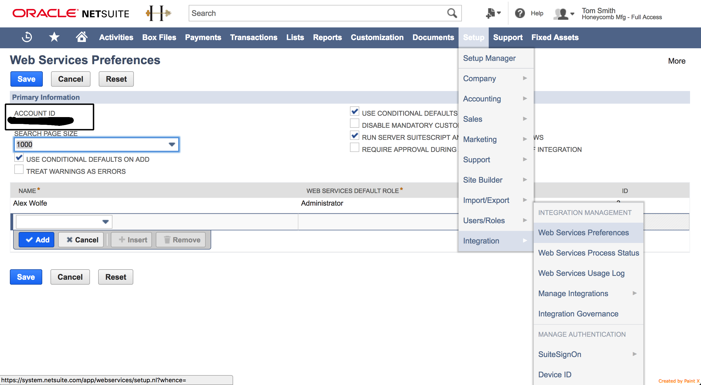

## API version

**2022.1** NetSuite version is used and supported. The component will work with other NS versions in most cases. But 100% compatibility could not be guaranteed.

## Requirements

### Environment variables
Environment variable `EIO_REQUIRED_RAM_MB` must be configured before any component's activity (credentials verify, retrieve sample).

| Variable | Value |
| :------------ | :---------- |
| EIO_REQUIRED_RAM_MB | 1024 |

### Enable web-service communication
NetSuite’s Web Services SOAP interface allows you to communicate with the ERP and to integrate external systems with it. NetSuite's native SDK, which is used for the communication in the component, uses NetSuite’s SOAP Web Services under the hood. By default web service communication is disabled in NetSuite. So it should be enabled in order to allow component make calls. To enable Web Service communication:

1. Go to Setup -> Company -> Enable Features.
2. Open SuiteCloud tab and tick there the 'Web Services' checkbox in the SuitTalk section.
3. Press Save.

## Credentials

Netsuite connector since version 3.0.0 only supports a token based authentication mechanisms. Support of a user credentials mechanism has been removed by Netsuite SOAP API.

To use Token-Based authentication you must at first setup a Netsuite account: Enable Integration:

1. Go to **Setup** > **Company** > **Enable Features** > **Suite Cloud** > **Manage Authentication**.
2. Enable Token-Based Authentication.
3. Go to menu **Setup** > **Integrations** > **Manage Integrations**.
4. Click **New** button.
5. Set the name to whatever you want. Please make sure to tick the Token-Based Authentication option, uncheck the `TBA: AUTHORIZATION FLOW` and `AUTHORIZATION CODE GRANT` option, and check the `TBA: ISSUETOKEN ENDPOINT` option.
6. Copy Consumer Key and Consumer secret values to be used in credentials. As they will be not available later.

### Create a Role and assign to a User:

1. Go to **Setup** > **Users/Roles** > **Manage Roles** > **New**.
2. Create a role and assign necessary permissions for a connector (Access to any Netsuite object types, transactions, etc.).
3. The role must have `User Access Tokens` and `SOAP Web Services` permissions for integration using TBA
4. Assign the Role to the desired user that will be used for integration. Go to **Lists** > **Employees** > **Edit user** > **Access tab** > **Roles subtab**.

### Create an Access Token for the Integration record, User, and Role:

1. Go to **Setup** > **Users/Roles** > **Access Tokens** > **New**.
2. Select the Integration record, User, and Role created or referenced in the previous steps.
3. Token Id and Token Secret will be displayed after tapping the save button. Copy the Consumer Key and Consumer secret values as they as will not be available after you leave the page.

All the credentials fields are required:

1. **Domain**. To find your domain endpoint go to **Setup** > **Company** > **Setup Tasks > **Company Information** (Administrator) in the NetSuite UI. Your domains are listed on the Company URL's subtab. Should be something like `https://{accountId}.suitetalk.api.netsuite.com`.
2. **Account**. Account Number to access NetSuite API. This number is required for the component to connect to NetSuite via native SuiteTalk API. Can be found here:
    1. Go to **Setup** -> **Integration** -> **Web Services Preferences**.
    2. Find `ACCOUNT ID` field there.
    
    
> **Important!** Make sure you have copied an account name exactly how it is specified in Netsuite UI.

3. **Consumer Key**.
4. **Consumer Secret**.
5. **Token Id**.
6. **Token Secret**.
