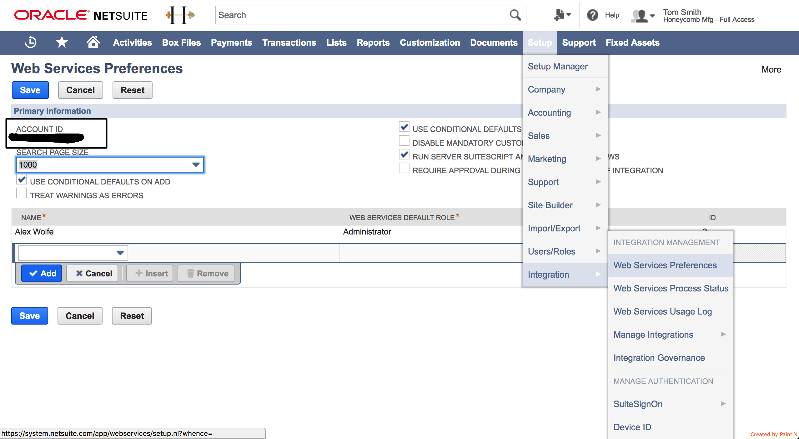
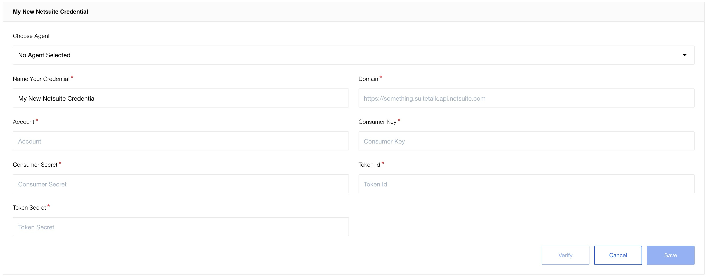

## Table of Contents
* [General information](#general-information)
   * [Description](#description)
   * [Purpose](#purpose)
   * [How it works](#how-it-works)
   * [API version](#api-version)
* [Requirements](#requirements)
   * [Environment variables](#environment-variables)
   * [Enable web-service communication](#enable-web-service-communication)
* [Credentials](#credentials)
   * [Get credentials in NetSuite](#get-credentials-in-netsuite)
   * [Authentication on the platform](#authentication-on-the-platform)
* [Triggers](#triggers)
* [Actions](#actions)
* [Links](#links)

## General information

### Description
{{page.description}}

### Purpose
Main purpose of this component is to provide functionality to interact with NetSuite ERP system.

### How it works
Communication with NetSuite API established using NetSuite's native SDK. 

### API version

**2022.1** NetSuite version is used and supported. The component will work with other NS versions in most cases. But 100% compatibility could not be guaranteed.

## Requirements

### Environment variables

Component requires 1024 MB of RAM memory to properly function. It is recommended
to increase the RAM memory prior any activity (credentials verify, retrieve sample). Contact [support](mailto:{{site.data.tenant.supportEmail}}) for more.

| Variable            | Value  |
| ------------------- |:------:| 
| EIO_REQUIRED_RAM_MB | 1024   | 

### Enable web-service communication

NetSuite’s Web Services SOAP interface allows you to communicate with the ERP
and to integrate external systems with it. NetSuite's native SDK, which is used
for the communication in the component, uses NetSuite’s SOAP Web Services under
the hood.

By default web service communication is disabled in NetSuite. So it should be
enabled in order to allow component make calls. To enable Web Service communication:

1.  Go to Setup -> Company -> Enable Features
2.  Open SuiteCloud tab and tick there the 'Web Services' checkbox in the SuitTalk section
3.  Press Save

## Credentials

Netsuite connector since version 3.0.0 only supports a token based authentication mechanisms. Support of a user credentials mechanism has been removed by Netsuite SOAP API.

### Get credentials in NetSuite

To use Token-Based authentication you must at first setup a Netsuite account: Enable Integration:

1. Go to **Setup** > **Company** > **Enable Features** > **Suite Cloud** > **Manage Authentication**.
2. Enable Token-Based Authentication.
3. Go to menu **Setup** > **Integrations** > **Manage Integrations**.
4. Click **New** button.
5. Set the name to whatever you want. Please make sure to tick the Token-Based Authentication option, uncheck the `TBA: AUTHORIZATION FLOW` and `AUTHORIZATION CODE GRANT` option, and check the `TBA: ISSUETOKEN ENDPOINT` option.
6. Copy Consumer Key and Consumer secret values to be used in credentials. As they will be not available later.

#### Create a Role and assign to a User:

1. Go to **Setup** > **Users/Roles** > **Manage Roles** > **New**.
2. Create a role and assign necessary permissions for a connector (Access to any Netsuite object types, transactions, etc.).
3. The role must have `User Access Tokens` and `SOAP Web Services` permissions for integration using TBA
4. Assign the Role to the desired user that will be used for integration. Go to **Lists** > **Employees** > **Edit user** > **Access tab** > **Roles subtab**.

#### Create an Access Token for the Integration record, User, and Role:

1. Go to **Setup** > **Users/Roles** > **Access Tokens** > **New**.
2. Select the Integration record, User, and Role created or referenced in the previous steps.
3. Token Id and Token Secret will be displayed after tapping the save button. Copy the Consumer Key and Consumer secret values as they as will not be available after you leave the page.

All the credentials fields are required:

1. **Domain**. To find your domain endpoint go to **Setup** > **Company** > **Setup Tasks > **Company Information** (Administrator) in the NetSuite UI. Your domains are listed on the Company URL's subtab. Should be something like `https://{accountId}.suitetalk.api.netsuite.com`.
2. **Account**. Account Number to access NetSuite API. This number is required for the component to connect to NetSuite via native SuiteTalk API. Can be found here:
    1. Go to **Setup** -> **Integration** -> **Web Services Preferences**.
    2. Find `ACCOUNT ID` field there.
    
    
> **Please Note:** Make sure you have copied an account name exactly how it is specified in Netsuite UI.

3. **Consumer Key**.
4. **Consumer Secret**.
5. **Token Id**.
6. **Token Secret**.

### Authentication on the platform

In order to use the functions of the NetSuite component, you need to go through the authentication process. 

Please paste the required fields described in the steps above. After filling in all fields, click **Verify** to validate the credentials, then click **Save** to store them.

## Triggers

NetSuite component includes the following triggers:

  1. [Get New and Updated Objects Polling](/components/netsuite/triggers#get-new-and-updated-objects-polling)                            
  Generic trigger that polls NetSuite instance for new and/or updated objects (of any type available in the NetSuite).

  2. [Polling objects](/components/netsuite/triggers#polling-objects)  
  Find an object or a set of objects was updated since last polling of time.

The following NetSuite triggers are deprecated:

  1. [Search Entity (deprecated)](/components/netsuite/deprecated-functions#search-entity-deprecated)                                                  
  Deprecated. Use [Get New and Updated Objects Polling](/components/netsuite/triggers#get-new-and-updated-objects-polling) trigger instead. Find an object or a set of objects using filter criteria (field, operator, value).

## Actions

NetSuite component includes the following actions:

  1. [Add Object](/components/netsuite/actions#add-object)       
  Add an object to NetSuite.

  2. [Delete Object By Id](/components/netsuite/actions#delete-object-by-id)       
  Deletes an object by the ID provided.

  3. [Get Item Availability](/components/netsuite/actions#get-item-availability)      
  Allows to get an item availability based on its type and internal ID provided.

  4. [Lookup Object By Id](/components/netsuite/actions#lookup-object-by-id)       
  Lookup an object by the ID provided.

  5. [Lookup Objects](/components/netsuite/actions#lookup-objects)       
  Looks for objects available in NetSuite which meet given criteria.

  6. [Upsert Object By Id](/components/netsuite/actions#upsert-object-by-id)       
  Either update an object in NetSuite by an ID provided or inserts as a new object if it does not exist.

  7. [Lookup Objects By Custom Field](/components/netsuite/actions#lookup-objects-by-custom-field)       
  Looks for objects available in NetSuite which meet given custom string field criteria.

  8. [Update Object](/components/netsuite/actions#update-object)        
  Update an object in NetSuite.

  9. [Upsert custom fields](/components/netsuite/actions#upsert-custom-fields)
  Can upsert custom fields in NetSuite. 

The following NetSuite actions are deprecated:

  1. [Lookup Customer (deprecated)](/components/netsuite/deprecated-functions#lookup-customer-deprecated)       
  Deprecated. Use [Lookup Object By Id](/components/netsuite/actions#lookup-object-by-id) action instead. This action enables to find the customer by provided ID.

  2. [Lookup Invoice (deprecated)](/components/netsuite/deprecated-functions#lookup-invoice-deprecated)       
  Deprecated. Use [Lookup Object By Id](/components/netsuite/actions#lookup-object-by-id) action instead. This action can be used to find invoices by provided ID.

  3. [Upsert Customer (deprecated)](/components/netsuite/deprecated-functions#upsert-customer-deprecated)       
  Deprecated. Use [Lookup Object By Id](/components/netsuite/actions#lookup-object-by-id) action instead. Create new or update existing customer by provided external ID.

  4. [Upsert Contact (deprecated)](/components/netsuite/deprecated-functions#upsert-contact-deprecated)       
  Deprecated. Use [Upsert Object By Id](/components/netsuite/actions#upsert-object-by-id) action instead. Create new or update existing contact by provided external ID.

  5. [Upsert Invoice (deprecated)](/components/netsuite/deprecated-functions#upsert-invoice-deprecated)       
  Deprecated. Use [Upsert Object By Id](/components/netsuite/actions#upsert-object-by-id) action instead. Create new or update existing invoice by provided external ID.

  6. [Upsert Sales Order (deprecated)](/components/netsuite/deprecated-functions#upsert-sales-order-deprecated)       
  Deprecated. Use [Upsert Object By Id](/components/netsuite/actions#upsert-object-by-id) action instead. Create new or update existing sales order by provided external ID.

  7. [Upsert Vendor (deprecated)](/components/netsuite/deprecated-functions#upsert-vendor-deprecated)       
  Deprecated. Use [Upsert Object By Id](/components/netsuite/actions#upsert-object-by-id) action instead. Create new or update existing vendor by provided external ID.

## Links

* [NetSuite API docs](http://www.netsuite.com/portal/developers/resources/suitetalk-documentation.shtml).

* [Open Integration Hub Standards](https://github.com/openintegrationhub/Connectors/blob/master/Adapters/AdapterBehaviorStandardization/StandardizedActionsAndTriggers.md#lookup-objects-plural).