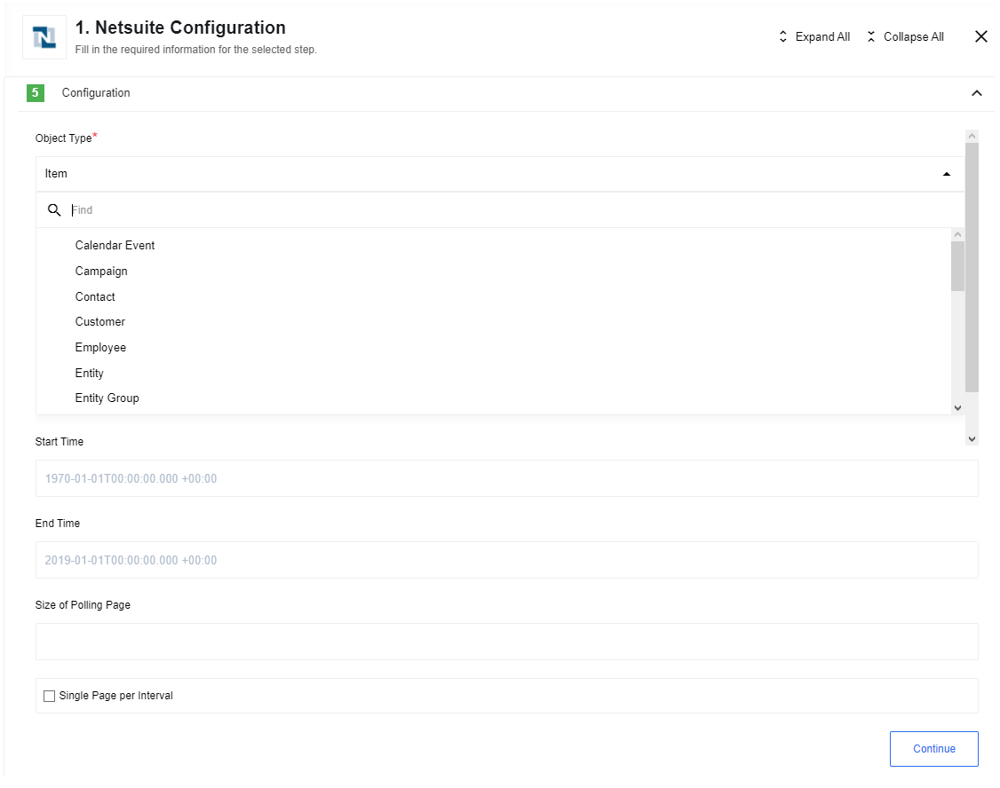

## Get New and Updated Objects Polling

Generic trigger that polls NetSuite instance for new and/or updated objects (of any type available in the NetSuite).

### Get New and Updated Objects Polling. Config fields

* Object Type (dropdown)

* Start Time (string, optional): Indicates the beginning time to start polling from (defaults to the beginning of time)

* End Time (string, optional): If provided, don’t fetch records modified after this time (defaults to never)

* Size of Polling Page (optional; string). Indicates the size of pages to be fetched. Defaults to 1000. CAN NOT be less then 5.

* Single Page per Interval (dropdown/checkbox: yes/no; default yes). Indicates that if the number of changed records exceeds the maximum number of results in a page, instead of fetching the next page immediately, wait until the next flow start to fetch the next page.

First, the system reads all the objects of the chosen type and processes it further along with your designed integration flow.
It will also create an initial state of fetched objects, we call it a *snapshot*, in order to have something to compare with after your data is updated.

After the initial read, any further requests for an update or create new object in NetSuite will be compared to this snapshot and in case any changes are detected they will be passed along with the integration flow as well.

## Polling objects

Find an object or a set of objects was updated since last polling of time.

### Input fields

- **Object Type -**
Object type to poll (only for objects which support lastModifiedDate filtering)

- **Start Time -**
Indicates the beginning time to start polling from (defaults to the beginning of time, in next format yyyy-MM-ddTHH:mm:ss.SSS XXX)

- **End Time -**
If provided, don’t fetch records modified after this time (defaults to never, in next format yyyy-MM-ddTHH:mm:ss.SSS XXX)

**Size of Polling Page -**
Indicates the size of pages to be fetched. Defaults to 1000.

- **Single Page per Interval -**
Indicates that if the number of changed records exceeds the maximum number of results in a page, instead of fetching the next page immediately, wait until the next flow start to fetch the next page.

### Known Limitations

At the moment trigger supports polling of next object types:

- Calendar Event,
- Campaign
- Contact
- Customer
- Employee
- Entity
- Entity Group
- Folder
- Issue
- Item
- Item Demand Plan
- Item Supply Plan
- Job
- Opportunity
- Originating Lead
- Partner
- Phone Call
- Project Task
- Solution
- Support Case
- Task
- Transaction
- Vendor
