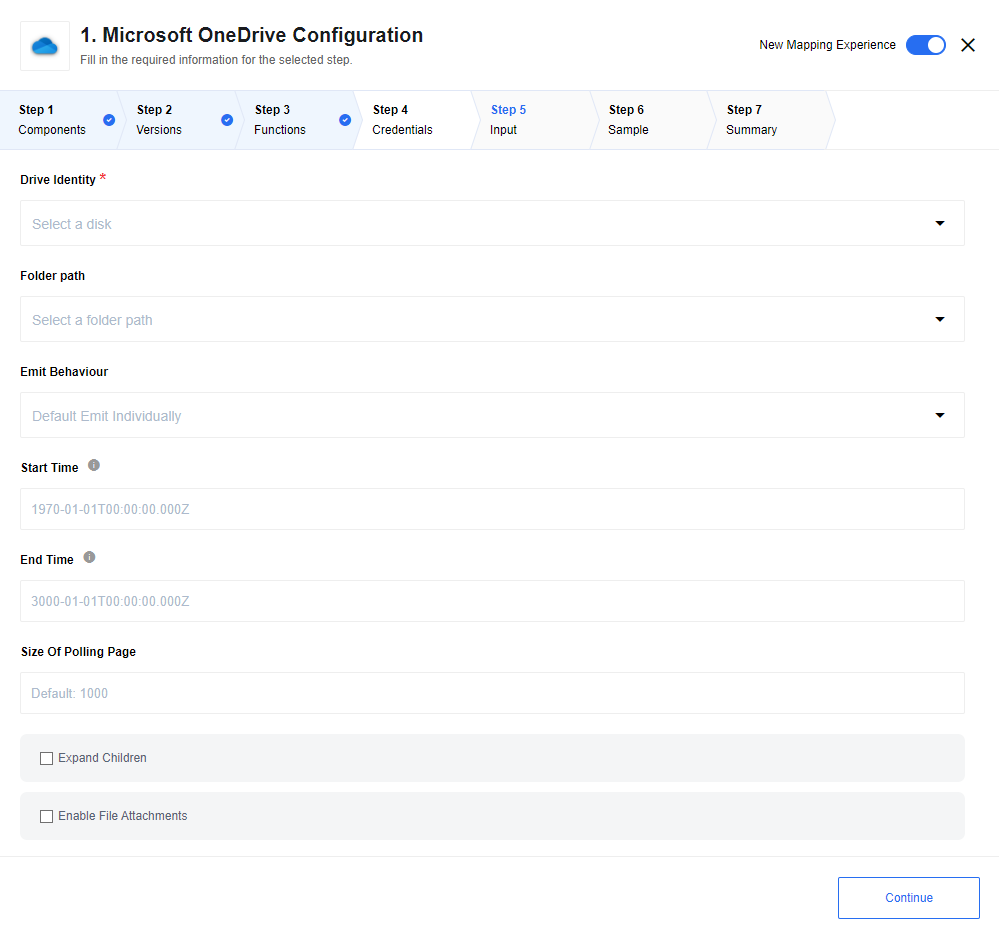
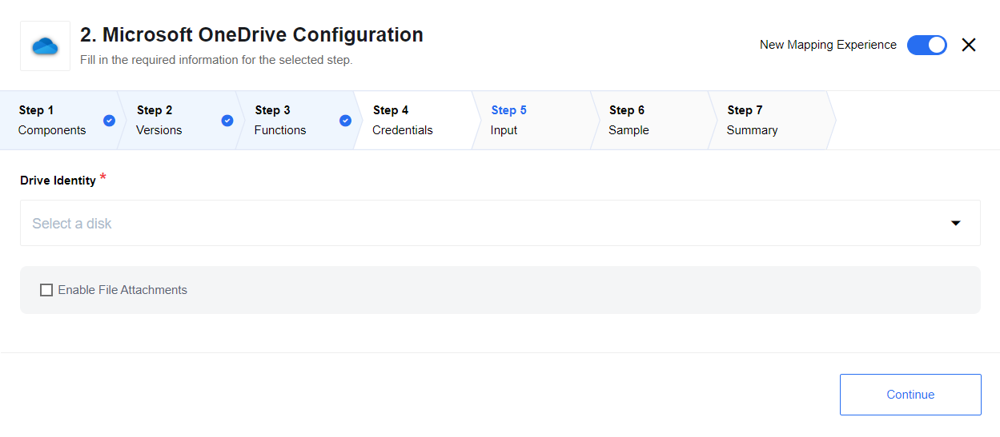
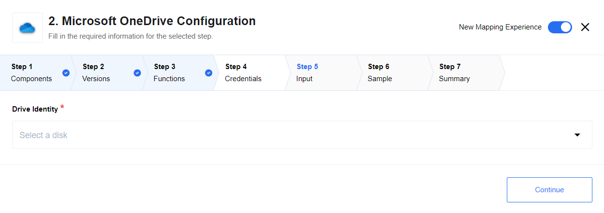
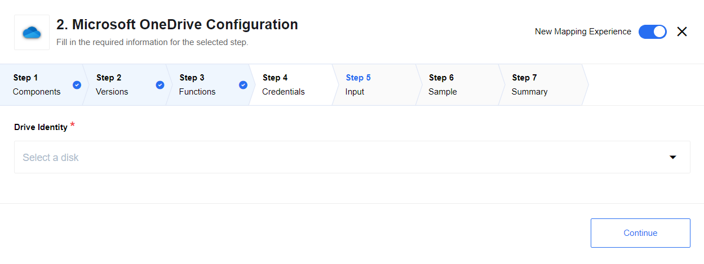
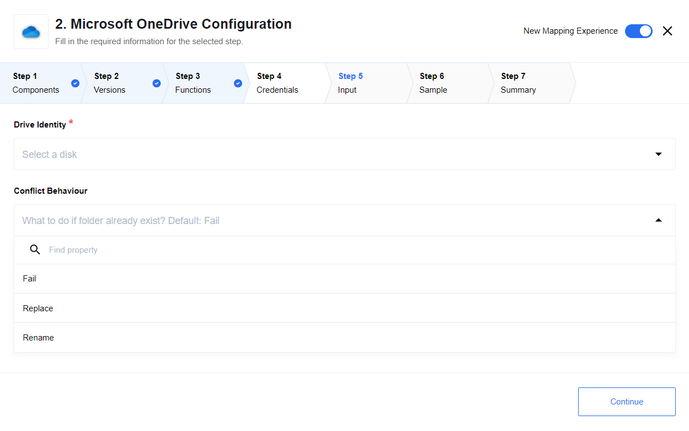

## General information

Microsoft OneDrive component for the [{{site.data.tenant.name}} platform](http://www.{{site.data.tenant.name}}).

### Description

This is the component for working with Microsoft OneDrive storage service on [{{site.data.tenant.name}} platform](http://www.{{site.data.tenant.name}}).

### Purpose

The component provides ability to connect to Microsoft OneDrive storage service.

### Completeness Matrix

The [component completeness](completeness-matrix) matrix gives the technical
details about Salesforce objects this component covers.

## Requirements

### Environment variables

| Name|Mandatory|Description|Values|
|----|---------|-----------|------|
| `OAUTH_CLIENT_ID`| true | Microsoft Graph Application OAuth2 Client ID | Can be found in your application page on [https://portal.azure.com](https://portal.azure.com) |
| `OAUTH_CLIENT_SECRET`| true | Microsoft Graph Application OAuth2 Client Secret | Can be found in your application page on [https://portal.azure.com](https://portal.azure.com) |
| `ATTACHMENT_MAX_SIZE`| false | For `elastic.io` attachments configuration. Maximal possible attachment size in bytes. By default set to 1000000 and according to platform limitations CAN'T be bigger than that. | Up to `1000000` bytes|

> Please Note: From the platform version [20.51](/releases/2020-12-17) we deprecated the
> component `LOG_LEVEL` environment variable. Now you can control logging level per each step of the flow.

### Credentials

To create new credentials you need to authorize in Microsoft system using OAuth2 protocol.

## Triggers

### Get New And Updated Files Polling

Triggers to get all new and updated files since last polling. Polling is provided by `lastModifiedDateTime` file's property.



#### List of Expected Config fields

* **Drive Identity** - OneDrive instance to work with.
* **Folder path** - Dropdown with folders to poll files from.
* **Emit Behavior** -  Available options: default is `Emit Individually` emits each object in separate message, `Fetch All` emits all objects in one message.
* **Start Time** - Start datetime of polling. Default min date: `-271821-04-20T00:00:00.000Z`.
* **End Time** - End datetime of polling. Default max date: `+275760-09-13T00:00:00.000Z`.
* **Size Of Polling Page** - Indicates the size of pages to be fetched. Defaults to `1000`.
* **Expand Children** - Checkbox, trigger retrieves files from subfolders of chosen path, if enabled. Disabled by default.
* **Enable File Attachments** - Checkbox for attaching files content to response. Disabled by default.

## Actions

### Get File

Action to get item from OneDrive by provided path in selected disc.



#### Input fields description

* **Drive Identity** - OneDrive instance to work with. Selects by owner
* **Enable File Attachments** - checkbox for attaching files content to action response

#### Metadata fields description

* **Path** - Full path to item to create or replace

#### Input example:

```
{
    "path": "base_folder/inner_folder/file.any"
}
```

### Upsert File

Action upserts (create or replace) with first file from attachment by provided path in Microsoft One Drive



#### Input fields description

* **Drive Identity** - OneDrive instance to work with. Selects by owner

#### Metadata fields description

* **Path** - Full path to item to create or replace

#### Input example:

```
{
    "path": "base_folder/inner_folder/file.any"
}
```

### Delete File

Action to delete item from OneDrive by provided path in selected disc.
Returns filename if file was deleted and empty message if already wasn't exist



#### Input fields description

* **Drive Identity** - OneDrive instance to work with. Selects by owner

#### Metadata fields description

* **Path** - Full path to item to delete

#### Input example:

```
{
    "path": "base_folder/inner_folder/file.any"
}
```

### Create Folder

Create new folder in provided `path`. If `path` not exist component will fail.



#### Input fields description

* **Drive Identity** - OneDrive instance to work with. Selects by owner
* **Conflict Behaviour** - behaviour in case folder already exists. Default: `Fail`. Options: `Fail`, `Replace`, `Rename`.
    1. `Fail` - fails if folder with same name already exists under provided `path`
    2. `Rename` - rename folder if folder with same name already exists under provided `path`. Examples: `exists` -> `exists_1`, `exists_1` -> `exists_1_1`
    3. `Replace` - replace folder if folder with same name already exists under provided `path`. Note: files inside folder will not be replaced, but last modified date of folder will be updated

#### Metadata fields description

* **Path** - Path to to folder where new folder will be created. Use empty string or `/` for root
* **Name** - Name of new folder

## Known Limitations

1. Attachments mechanism does not work with [Local Agent Installation](/references/local-agents-requesting#compatible-operating-systems)
