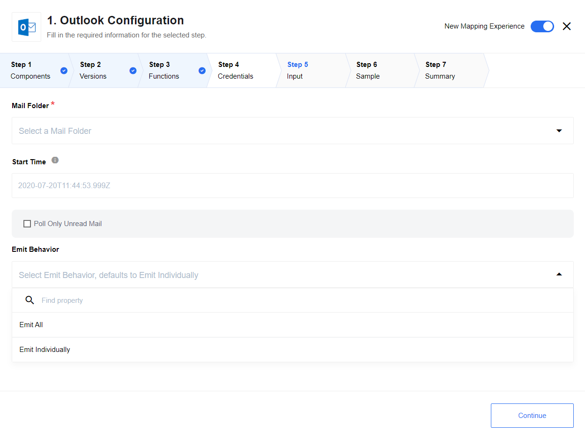
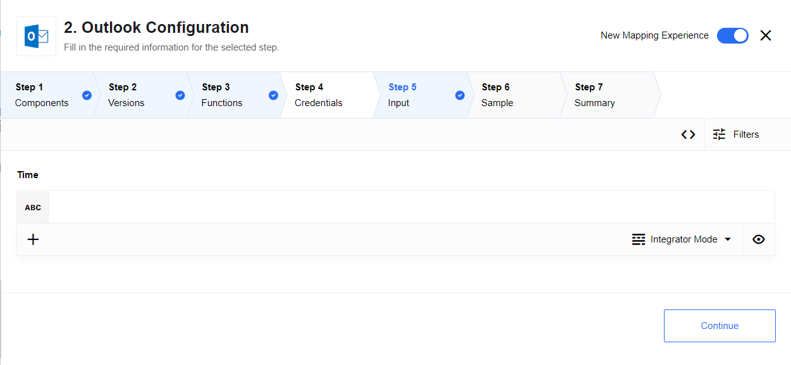
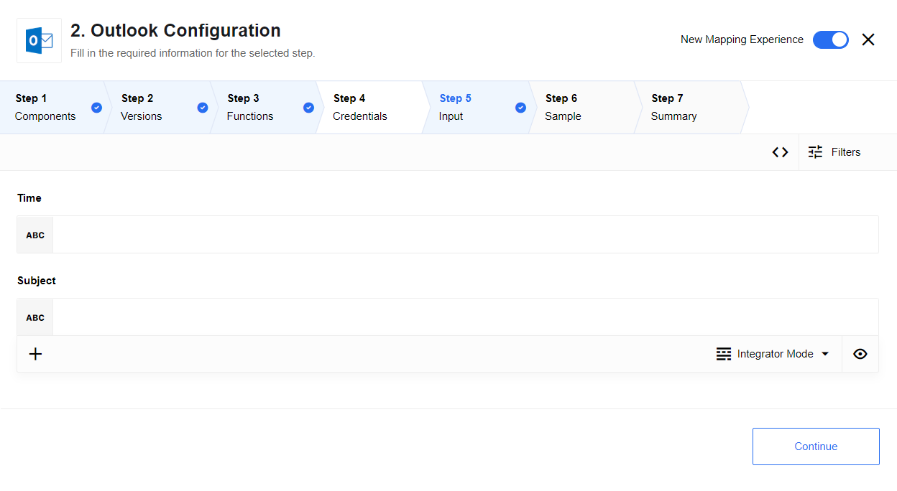
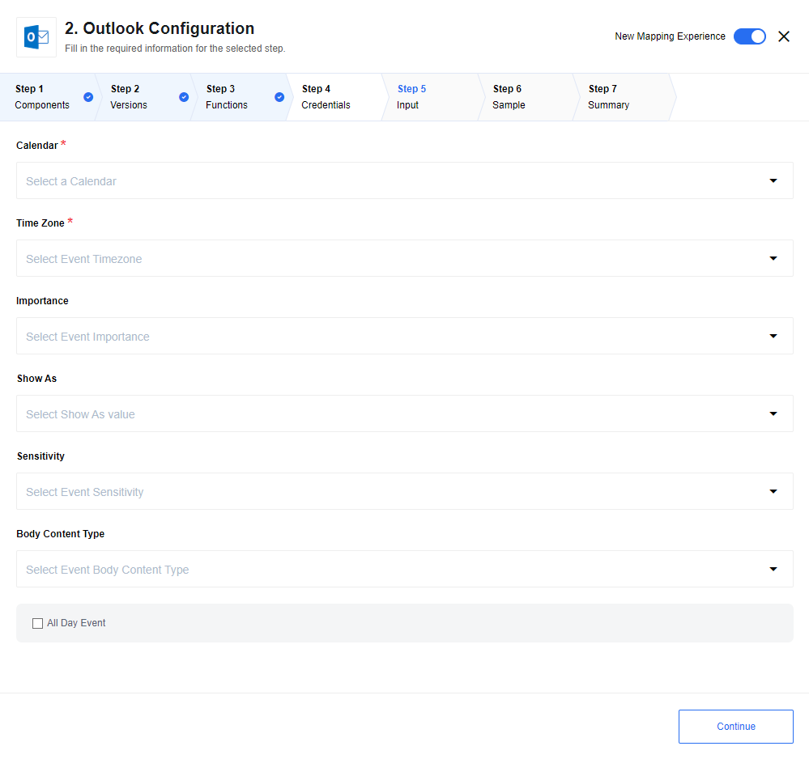
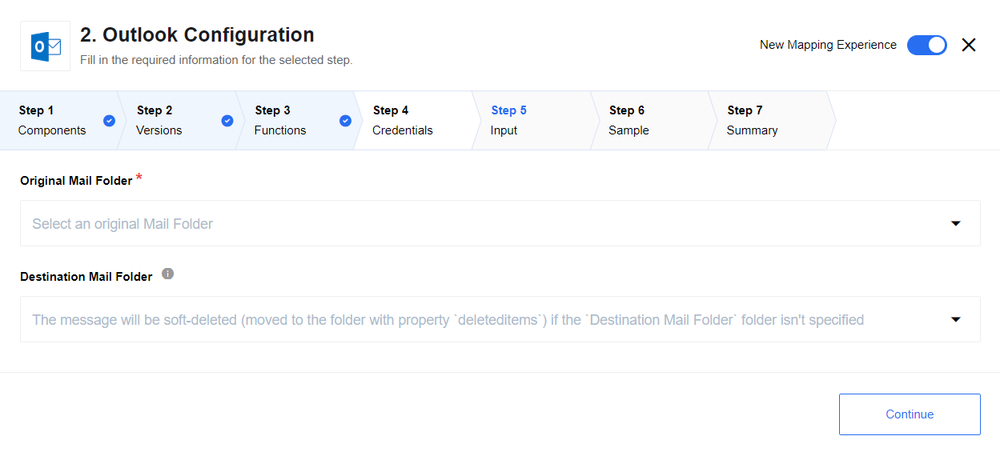

## Description

[Outlook](https://outlook.live.com/) is a personal information manager web app from Microsoft consisting of webmail, calendaring, contacts, and tasks services.

### API version

The component uses [Microsoft Graph REST API v1.0](https://docs.microsoft.com/en-us/graph/overview?view=graph-rest-1.0).

## Requirements

To create the credentials you would need:

- select existing Auth Client from drop-down list `Choose Auth Client` or create a new one. To create a new client you should specify the following fields:

| Field name             | Mandatory | Description                                                                                                              |
|------------------------|-----------|--------------------------------------------------------------------------------------------------------------------------|
| Name                   | true      | your Auth Client's name                                                                                                  |
| Client ID              | true      | your OAuth client key                                                                                                    |
| Client Secret          | true      | your OAuth client secret                                                                                                 |
| Authorization Endpoint | true      | your OAuth authorization endpoint. Use `https://login.microsoftonline.com/common/oauth2/v2.0/authorize`                  |
| Token Endpoint         | true      | your OAuth Token endpoint for refreshing access token. Use `https://login.microsoftonline.com/common/oauth2/v2.0/token`  |

- fill field ``Name Your Credential``
- click on ``Authenticate`` button - if you have not logged in Salesforce before then log in by entering data in the login window that appears
- click on ``Verify`` button for verifying your credentials
- click on ``Save`` button for saving your credentials

This is the list of the scopes that the credentials for the entire component might require. If you want to limit the scope of the credentials, feel free to only select the required scopes (space separated list):
* openid
* offline_access
* User.Read
* Contacts.Read
* Profile
* Calendars.ReadWrite
* Mail.ReadWrite
* Mail.Send

offline_access is required for each credential.

Example of the scopes for the `Send Mail` action: `offline_access Mail.Send`

> **Please Note!** To be able to verify the credentials you need these scopes: `offline_access User.Read`

> You can find more details in [dedicated OAuth2 App creation page](create-oauth-app).

### Environment variables

| Name                      |Mandatory|Description|Values|
|---------------------------|---------|-----------|------|
| `MAIL_RETRIEVE_MAX_COUNT` | false | Define max count mails could be retrieved per one `Poll for New Mail` trigger execution. Defaults to 1000| 1000 |
| `TOP_LIST_MAIL_FOLDER`    | false | Define the maximum number of folders that can be found for dropdown fields containing a list of Mail Folder. Defaults to 100| 100 |

> Please Note: From the platform version [20.51](/releases/20/51) we deprecated the
> component `LOG_LEVEL` environment variable. Now you can control logging level per each step of the flow.

## Triggers

### Contacts

Triggers to poll all new contacts from Outlook since last polling. Polling is provided by `lastModifiedDateTime` contact's property.
Per one execution it is possible to poll 900 contacts.

### Poll for New Mail

Triggers to poll all new mails from specified folder since last polling. Polling is provided by `lastModifiedDateTime` mail's property.



Per one execution it is possible to poll 1000 mails by defaults, this can be changed by using environment variable `MAIL_RETRIEVE_MAX_COUNT`.

#### List of Expected Configuration fields

* **Mail Folder** - Drop-down list with available Outlook mail folders
* **Start Time** - Start date-time of polling. Defaults: `1970-01-01T00:00:00.000Z`
* **Poll Only Unread Mail** - Check-Box, if set, only unread mails will be poll
* **Emit Behavior** -  Options are: default is `Emit Individually` emits each mail in separate message, `Emit All` emits all found mails in one message

## Actions

### Check Availability

The action retrieves events for the time specified in `Time` field or for the current time (in case if `Time` field is empty) and returns `true` if no events found, or `false` otherwise.



### Find Next Available Time

The action retrieves events for the time specified in `Time` field or for the current time (in case if `Time` field is empty).
Returns specified time if no events found, otherwise calculates the new available time based on found event. If no time specified, the result time will be emitted in UTC time zone (e.g. 2023-08-20T10:00:00Z)



### Create Event

The action creates event in specified calendar with specified options.



#### List of Expected Configuration fields

* **Calendar** - Drop-down list with available Outlook calendars
* **Time Zone** - Drop-down list with available time zones
* **Importance** - Drop-down list, options are: `Low`, `Normal`, `High`
* **Show As** - Drop-down list, options are: `Free`, `Tentative`, `Busy`, `Out of Office`, `Working Elsewhere`, `Unknown`
* **Sensitivity** - Drop-down list, options are: `Normal`, `Personal`, `Private`, `Confidential`
* **Body Content Type** - Drop-down list, options are: `Text`, `HTML`
* **All Day Event** - Check-Box, if set, all day event will be created

### Move Mail

The action moves message with specified id from the original mail folder to a specified destination mail folder or soft-deletes message if the destination folder isn't specified.



#### List of Expected Configuration fields

* **Original Mail Folder** - Drop-down list with available Outlook mail folders - from where mail should be moved, required field.
* **Destination Mail Folder** - Drop-down list with available Outlook mail folders - where mail should be moved, not required field.
If not specified, the message will be soft-deleted (moved to the folder with property `deleteditems`).

### Send Mail

The action simply send a message to a recipient(s).

#### Expected input metadata

GIVE IT HERE???

[/lib/schemas/sendMail.in.json](/lib/schemas/sendMail.in.json)

#### Expected output metadata

GIVE IT HERE???

In case of a success, output metadata simply repeats the incoming message. I.e. output message schema is exactly the same as for input message.
[/lib/schemas/sendMail.out.json](/lib/schemas/sendMail.in.json)

#### Message Example

```json
{
  "subject": "Hello",
  "toRecipients": [
    {
      "emailAddress": {
        "address": "email@example.com",
        "name": "John"
      }
    }
  ],
  "body": {
    "content": "Hello, I am an email content text",
    "contentType": "text"
  }
}
```

## Known issues and limitations

### Current implementation uses AD V2.0 OAuth2

Second version of AD protocol has some advantages, see [here](https://docs.microsoft.com/en-us/azure/active-directory/azuread-dev/azure-ad-endpoint-comparison) for more information.

### OData output for lastModifiedDateTime has a precision issue

Apparently the `lastModifiedDateTime` returned by MS Graph has no milliseconds
in it is obvious that filter query accept and treat millisecond values correctly
there is a workaround for that issue implemented in the code, however you need to
keep an eye on it.
