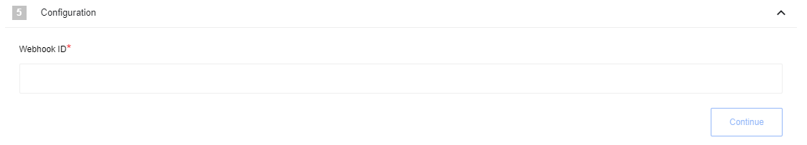
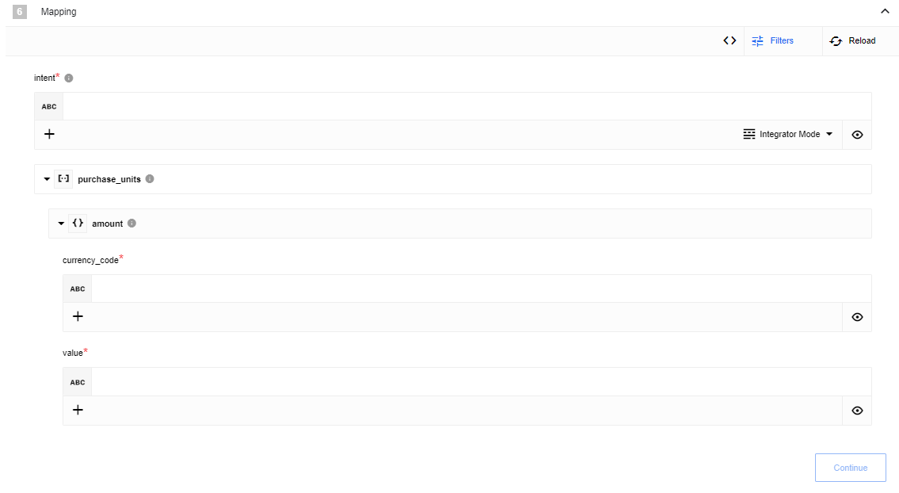
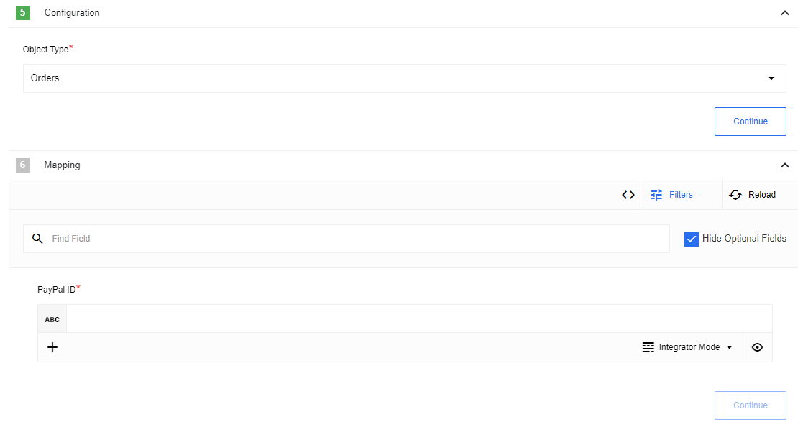

## General information

{{page.description}}

> For more information you can visit [PayPal REST API documentation](https://developer.paypal.com/api/rest/)

## Credentials

To use paypal API you need to **Create App** in [developer account](https://developer.paypal.com/) and use *Client ID* and *Secret* from there, to do this go to:

DASHBOARD -> My Apps & Credentials -> REST API apps:

You will also need to configure your credentials during flow configuration.

Component credentials configuration Fields:

 * **Environment**  (Dropdown: Production or Sandbox, required) - Indicates what URL base needs to be used `api.sandbox.paypal.com` or `api.paypal.com`
  * **Client ID**  (string, required) - from App
  * **Secret**  (string, required) - from App

## Triggers

### Webhook trigger

Creates webhook subscriptions on the PayPal side and receives events to the flow.

#### Configuration Fields

* **Webhook ID** - (string, required) - webhook ID that becomes available after [creating a webhook](https://developer.paypal.com/docs/api/webhooks/v1/#webhooks_post).
It is necessary to set the Internet accessible URL configured to listen for incoming POST notification messages containing event information when webhook creates.
To implement this mechanism, the following steps must be taken:
1. Create a flow with a random id in the config field
2. Publish flow, after which the webhook URL will become available.
3. Copy the URL of the elastic.io webhook
4. Create a webhook on the PayPal side with the URL generated in the previous step.
5. Edit the flow and specify the webhook ID created in the previous step.

#### Input Metadata

There is no Input Metadata

#### Output Metadata

Data received in the request

### Get New And Updated Objects Polling

Polls PayPal API for new and updated objects.

#### Configuration Fields

* **Object Type** - (required, dropdown) currently supported only `Disputes` and `Transactions` object.
* **Time stamp field to poll on** - (required, dropdown) Indicates just new items or new and modified items: `Created` or `Updated`.

#### Input Metadata

Input metadata is absent for triggers

#### Output Metadata

Output metadata is generated dynamically and depends on Object Type

#### Known Limitations

1. `Transactions` always use `Created` date to poll
2. It takes a maximum of three hours for executed transactions to appear in the list transactions call and even more time is sandbox

### Receive Instant Payment Notification

Webhook trigger for receive IPN.
Instant Payment Notification ([IPN](https://developer.paypal.com/api/nvp-soap/ipn/)) is a message service that automatically notifies merchants of events related to PayPal transactions.

You can test your trigger using [Instant Payment Notification (IPN) simulator](https://developer.paypal.com/developer/ipnSimulator): set your webhookURL to `IPN handler URL` field, select any value of `Transaction type`, set `receiver_email` the same, as `Expected Email Address` from configuration and press `Send IPN`.

#### Configuration Fields

* **Expected Email Address** - (required, string)

#### Input Metadata

There is no Input Metadata

#### Output Metadata

All Transaction data (including success/fail)

### Receive Payment Data Transfer

Webhook trigger for receive PDT.
Payment Data Transfer ([PDT](https://developer.paypal.com/api/nvp-soap/payment-data-transfer/)) is a notification service that, once activated, can send transaction-related information immediately to merchants who are using PayPal payment buttons.

#### Configuration Fields

* **Identity Token** - (required, string)

#### Input Metadata

There is no Input Metadata

#### Output Metadata

All Transaction data (including success/fail)

## Actions

### Create Object

Creates PayPal object

#### Configuration Fields

* **Object Type** - (dropdown, required) For example `Orders`.

#### Input Metadata

Inputs for request fields.

#### Output Metadata

The object creation result as reported by the system.

### Update Object

Updates PayPal object

#### Configuration Fields

* **Object Type** - (dropdown, required) For example `Orders`.

#### Input Metadata

* **PayPal ID** - (string, required) ID of the object.
Other input fields depending on selected object.

#### Output Metadata

If request succeed - [empty object will be returned.](https://developer.paypal.com/docs/api/orders/v2/#orders_patch)

### Make Raw Request

Executes custom request

#### Configuration Fields

* **Don't throw error on 404 Response** - (optional, boolean) Treat 404 HTTP responses not as error, defaults to `false`.

#### Input Metadata

* **Url** - (string, required) Path of the resource relative to the base URL.
* **Method** - Allowed values `GET`, `POST`, `PUT`, `PATCH`, `DELETE`, required. HTTP verb to use in the request.
* **Request Body** - (object, optional) Body of the request to send

#### Output Metadata

* **Status Code** - (number, required) HTTP status code of the response, required.
* **HTTP headers** - (object, required) HTTP headers of the response, required.
* **Response Body** - (object, optional) HTTP response body.

### Make a Payment

Executes request of making new Payment depending on provided data.
Creates a sale, an authorized payment to be captured later, or an order. To create a sale, authorization, or order, include the payment details in the JSON request body. Set the intent to sale, authorize, or order.

#### Input Metadata

* **Intent** - (enum, required) The payment intent. Value is:

   `sale`. Makes an immediate payment.

   `authorize`. Authorizes a payment for capture later.

   `order`. Creates an order.

* **Payer** - (object, required) The source of the funds for this payment. Payment method is PayPal Wallet payment or bank direct debit. Value `paypal` must be specified as the value of the `payment_method`.
* **Transactions** - (array, required) An array of objects - payment-related `transactions`. The value for this input field should be formed as a JSON array of objects containing all the necessary data as objects, such as: *amount*, *description*, *custom*, *invoice_number*, *payment_options*, *soft_descriptor*, *item_list*. A transaction defines
what the payment is for and who fulfills the payment. For update and execute payment calls, the `transactions` object accepts the amount object only.

* **Note To Payer** - (string, required) A free-form field that clients can use to send a note to the payer.
* **Redirect Urls** - (object, required) A set of redirect URLs that you provide for PayPal-based payments.

#### Output Metadata

The object as reported by the system

### Lookup Object (at most one)

Action designed to lookup one object by unique field

#### Config Fields

* **Object Type** Dropdown, required: Indicates Object Type to find
* **Allow ID to be omitted** Checkbox: When selected, the ID field becomes optional, otherwise it is a required field
* **Allow zero results** Checkbox: When selected, if zero results are returned, the empty object {} is emitted, otherwise typically an error would be thrown.

#### Input Metadata

* **ID value** (string): Depending on the value of `Allow ID to be omitted` this is optional or required.

#### Output Metadata

The object as reported by the system
