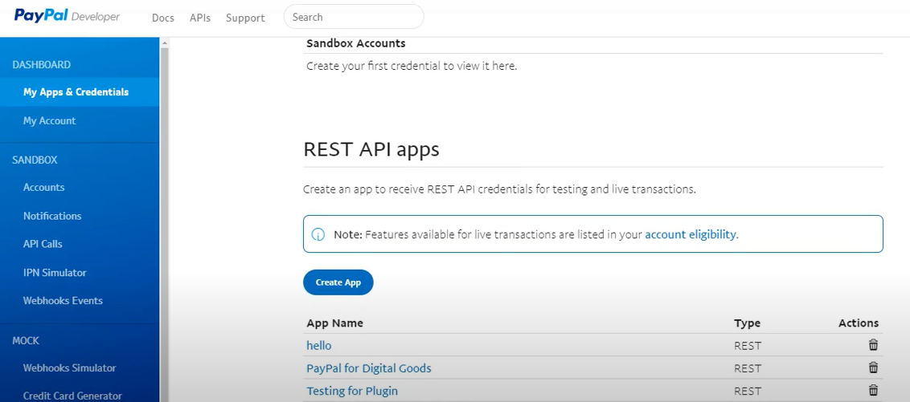
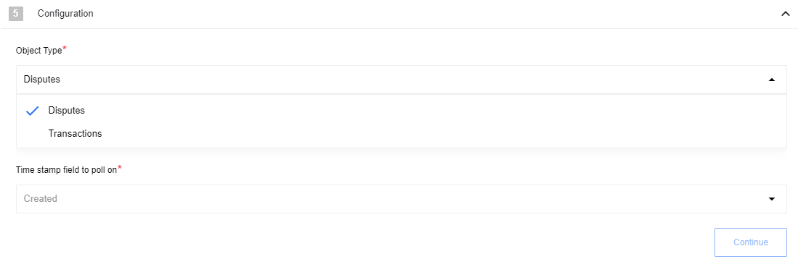
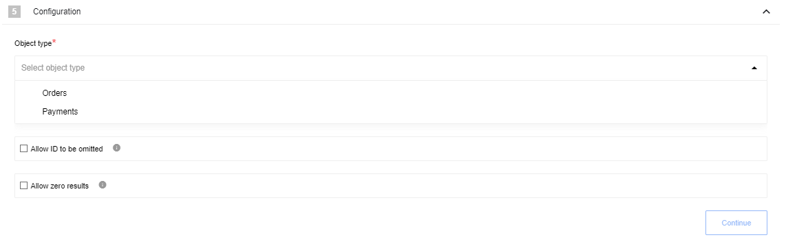

## General information

{{page.description}}

## Credentials

To use paypal API you need to **Create App** in [developer account](https://developer.paypal.com/) and use *Client ID* and *Secret* from there, to do this go to:

DASHBOARD -> My Apps & Credentials -> REST API apps:

You will also need to configure your credentials during flow configuration.

Component credentials configuration Fields:

 * **Environment**  (Dropdown: Production or Sandbox, required) - Indicates what URL base needs to be used `api.sandbox.paypal.com` or `api.paypal.com`
  * **Client ID**  (string, required) - from App
  * **Secret**  (string, required) - from App

## Triggers

### Get New And Updated Objects Polling

Polls PayPal API for new and updated objects.

#### Configuration Fields

* **Object Type** - (required, dropdown) currently supported only `Disputes` and `Transactions` object.
* **Time stamp field to poll on** - (required, dropdown) Indicates just new items or new and modified items: `Created` or `Updated`.

#### Input Metadata

Input metadata is absent for triggers

#### Output Metadata

Output metadata is generated dynamically and depends on Object Type

#### Known Limitations

1. `Transactions` always use `Created` date to poll
2. It takes a maximum of three hours for executed transactions to appear in the list transactions call and even more time is sandbox

## Actions

### Make Raw Request

Executes custom request

#### Configuration Fields

* **Don't throw error on 404 Response** - (optional, boolean) Treat 404 HTTP responses not as error, defaults to `false`.

#### Input Metadata

* **Url** - (string, required) Path of the resource relative to the base URL.
* **Method** - Allowed values `GET`, `POST`, `PUT`, `PATCH`, `DELETE`, required. HTTP verb to use in the request.
* **Request Body** - (object, optional) Body of the request to send

#### Output Metadata

* **Status Code** - (number, required) HTTP status code of the response, required.
* **HTTP headers** - (object, required) HTTP headers of the response, required.
* **Response Body** - (object, optional) HTTP response body.

### Make a Payment

Executes request of making new Payment depending on provided data.
Creates a sale, an authorized payment to be captured later, or an order. To create a sale, authorization, or order, include the payment details in the JSON request body. Set the intent to sale, authorize, or order.

#### Input Metadata

* **Intent** - (enum, required) The payment intent. Value is:

   `sale`. Makes an immediate payment.

   `authorize`. Authorizes a payment for capture later.

   `order`. Creates an order.

* **Payer** - (object, required) The source of the funds for this payment. Payment method is PayPal Wallet payment or bank direct debit. Value `paypal` must be specified as the value of the `payment_method`.
* **Transactions** - (array, required) An array of objects - payment-related `transactions`. The value for this input field should be formed as a JSON array of objects containing all the necessary data as objects, such as: *amount*, *description*, *custom*, *invoice_number*, *payment_options*, *soft_descriptor*, *item_list*. A transaction defines
what the payment is for and who fulfills the payment. For update and execute payment calls, the `transactions` object accepts the amount object only.

* **Note To Payer** - (string, required) A free-form field that clients can use to send a note to the payer.
* **Redirect Urls** - (object, required) A set of redirect URLs that you provide for PayPal-based payments.

#### Output Metadata

The object as reported by the system

### Lookup Object (at most one)

Action designed to lookup one object by unique field

#### Config Fields

* **Object Type** Dropdown, required: Indicates Object Type to find
* **Allow ID to be omitted** Checkbox: When selected, the ID field becomes optional, otherwise it is a required field
* **Allow zero results** Checkbox: When selected, if zero results are returned, the empty object {} is emitted, otherwise typically an error would be thrown.

#### Input Metadata

* **ID value** (string): Depending on the value of `Allow ID to be omitted` this is optional or required.

#### Output Metadata

The object as reported by the system
