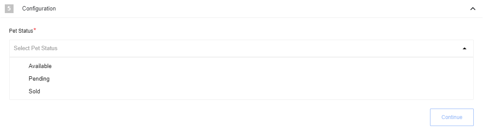
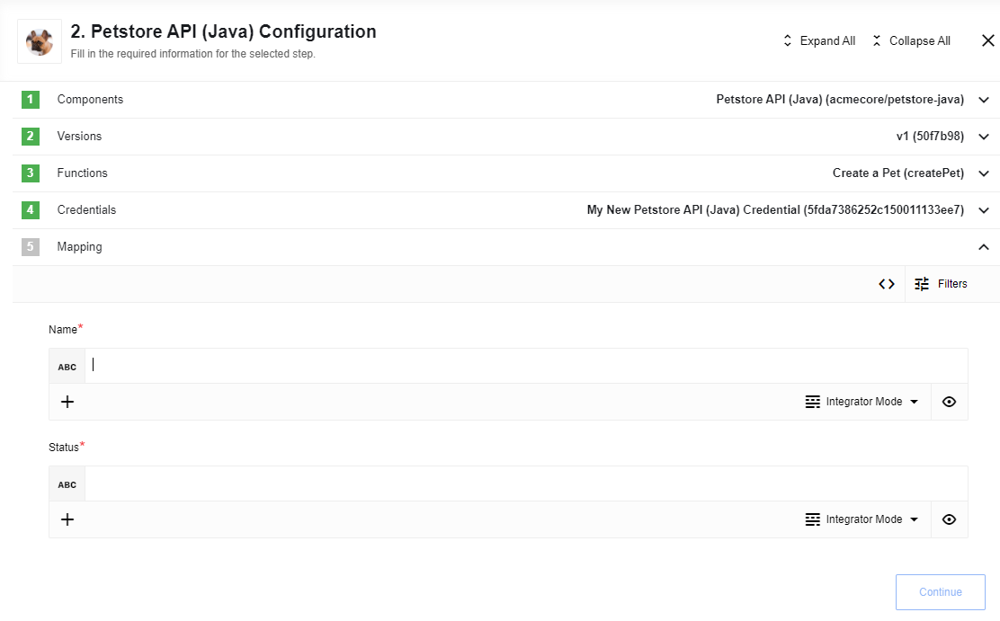

## Description

A fully working and operational component template to use for starting development of your
own component for the [{{site.data.tenant.name}} platform](http://www.{{site.data.tenant.name}})..
This component comes with a basic architecture which you can use on the platform.

Our documentation on [building components in java](/guides/building-java-component)
has more about each including file and their function.

### Technical Notes

The [technical notes](technical-notes) page gives some technical details about Petstore-nodejs component like [changelog](/components/petstore-nodejs/technical-notes#changelog).

## Requirements

To use this component you must be registered platform user. Please see our home
page at [{{site.data.tenant.name}}](http://www.{{site.data.tenant.name}}) to learn how to register.

### Authentication

To authenticate use `secret` as an API key.

## Triggers

### Get Pets By Status

Retrieves pets from the Petstore API by given pet status using Dynamic or Static
Data Sample. The difference is how these functions are made. However, both can have
the following statuses defined by the Petstore API.

The input fields are:

*   `Available` - select to get all pets with status `Available`.
*   `Pending` - select for `Pending`.
*   `Sold` - select for `Sold`.

## Actions

### Creates a new pet

Creates a new Pet by making a `POST` to `/pet` endpoint of the API.

The input fields are:

*   `name` - the name of the pet.
*   `status` - the status which can have one `Available`, `Pending` and `Sold` values.
