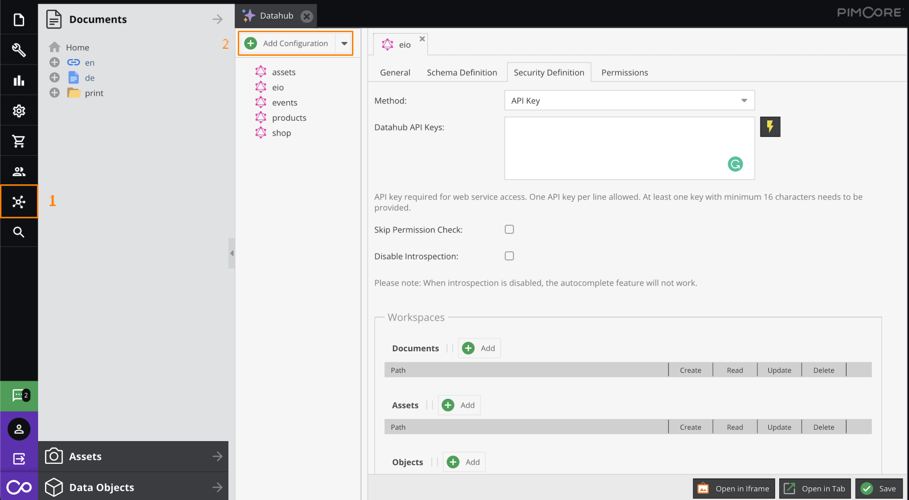

## General information

### Description

Pimcore data can be exposed with [Datahub](https://pimcore.com/docs/data-hub/current/). Under the hood it utilizes GraphQL query language.
For the component to work this bundle must be installed and enabled.

Once the bundle is installed you can go to Datahub - Add Configurations -> GraphQL and setup query, mutation schemas, API keys, permission access, etc. from there.



### API version

The component has been tested with Pimcore v10.5.14.

### Environment variables

No required variables.

## Credentials

* **Endpoint** - (string, required) set endpoint to your Pimcore GraphQL API.
* **Type** - (dropdown, required) may be used when authorization is needed. Currently API Key only is available
  * **API Key Auth** - use HTTP Basic access authentication
    * **Header Key** - custom HTTP Header
    * **Header Value** - HTTP Header value

## Triggers

This component has no trigger functions. This means it will not be accessible to select as a first component during the integration flow design.

## Actions

### Raw Request

Action to execute provided raw GraphQL request string

#### Configuration Fields

There is no configuration fields in this action.

#### Input Metadata

* **Query** (string, required) - Your query, represented as text inside **"query"** key.

<details close markdown="block"><summary><strong>Click to expand for more details</strong></summary>

  ```
  query {
    getCar(id: 308) {
      name
      description
      color
      priceInEUR
    }
  }
  ```
</details>

#### Output Metadata

* Depends on Query execution result, represented as object inside **"data"** key.

<details close markdown="block"><summary><strong>Click to expand for more details</strong></summary>

```json
{
  "data": {
    "getCar": {
      "name": "600",
      "description": "<p>The BMW 600 is a four-seater microcar produced by the German automaker BMW from mid-1957 until November 1959. Partially based on the BMW Isetta two-seater, it was BMW's first postwar four-seater economy car. It was not a sales success, but it began the design process for its more successful successor, the BMW 700.</p>\n",
      "color": [
        "red",
        "white"
        ],
      "priceInEUR": 47195.95
    }
  }
}
```

</details>
