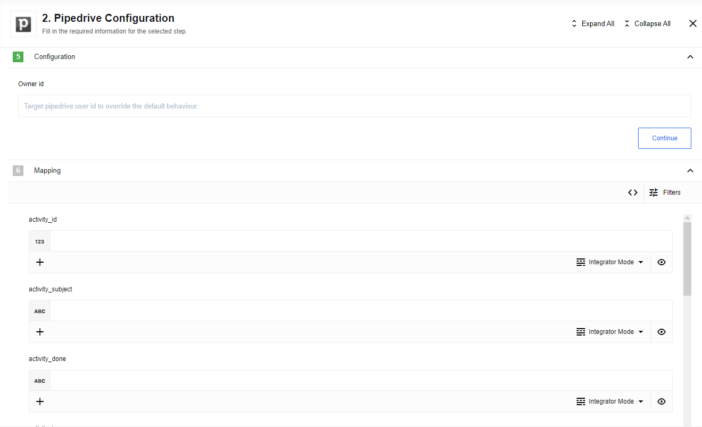
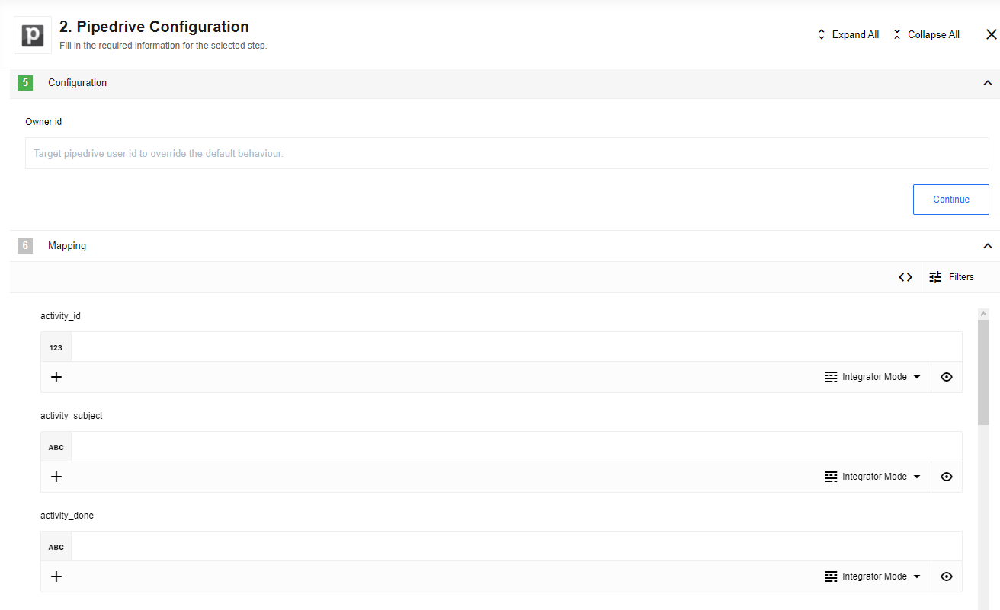
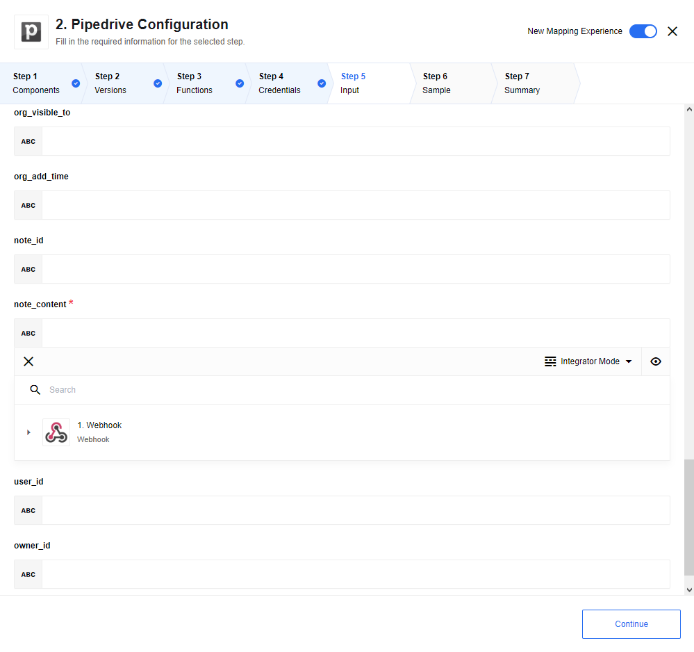
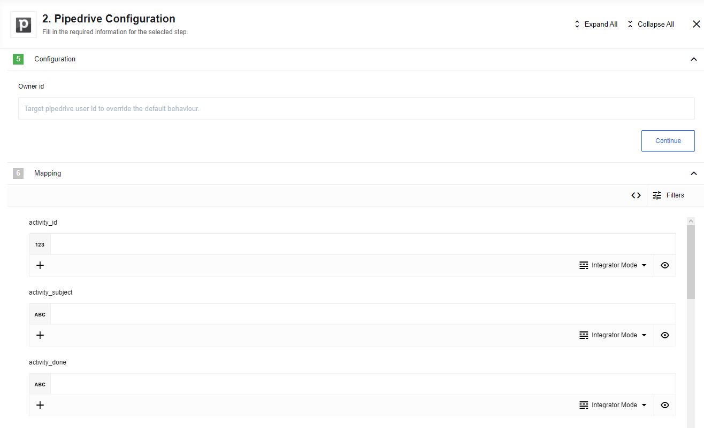
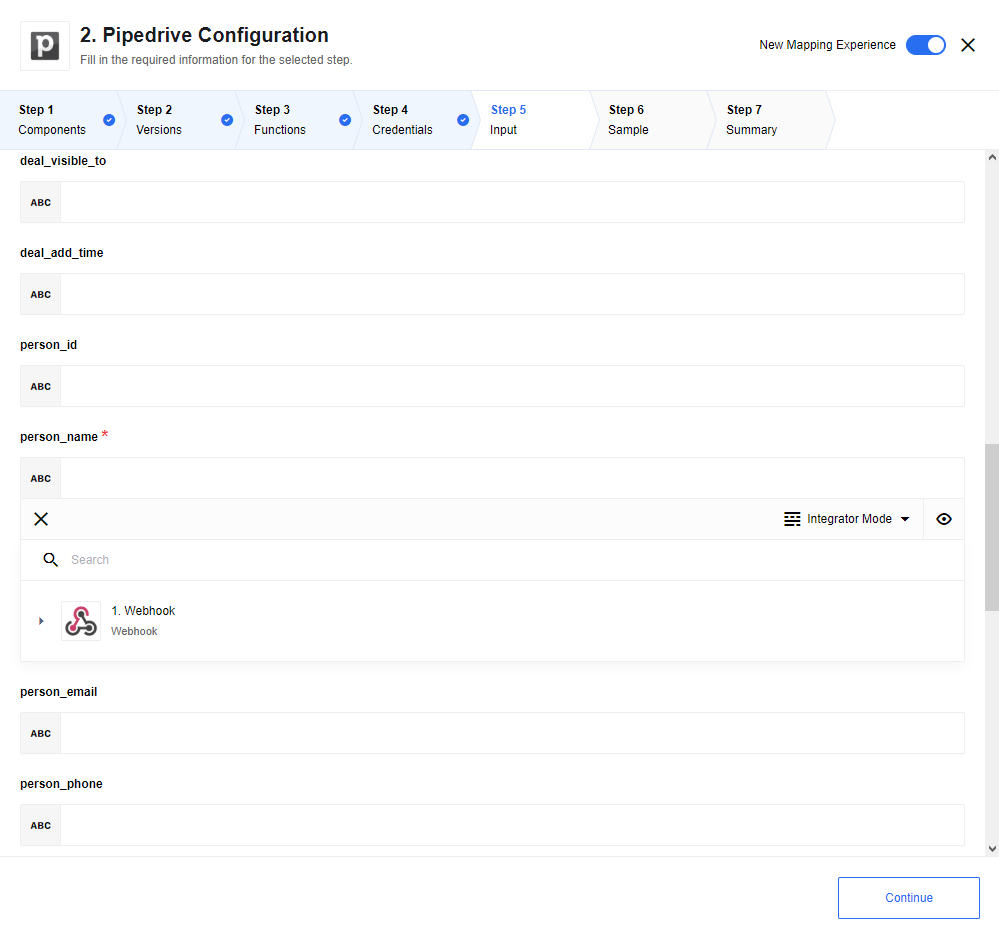

Pipedrive Component component for the [{{site.data.tenant.name}} platform](http://www.{{site.data.tenant.name}}).

## Getting started

### Authentication

You need to configure your company domain and access token to authenticate the
pipedrive component for pipedrive.

### Create Deals

You can create deals with the help of the `createDeal` action. It will
automatically create an organisation, a contact, a deal and a notice for the deal for you.

## Triggers

This component has no trigger functions. This means it will not be accessible to
select as a first component during the integration flow design.

## Actions

### Create Activity

Create a new activity in pipedrive:

### Create Deals

Create a new deal in pipedrive:

### Create Note

Create a new note in pipedrive:

### Create Organisation

Create a new organisation in pipedrive:

### Create Person

Create a new person in pipedrive:

## Known issues

No known issues are there yet.
