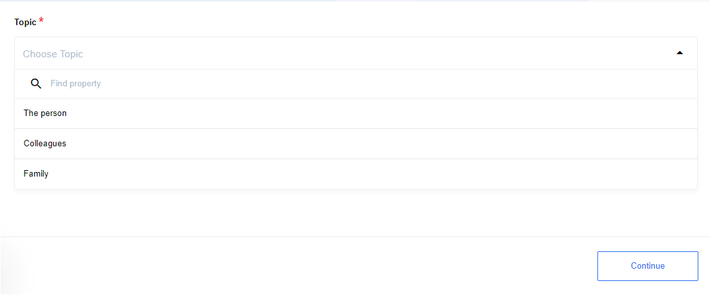
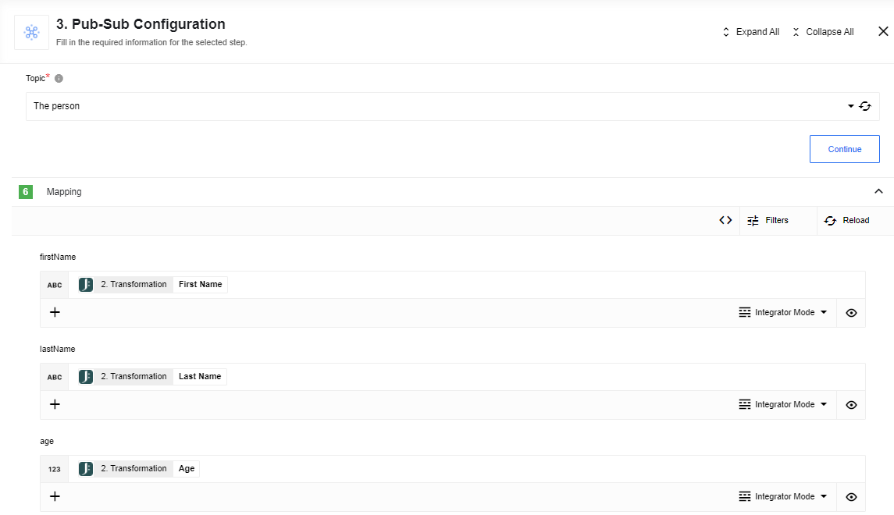
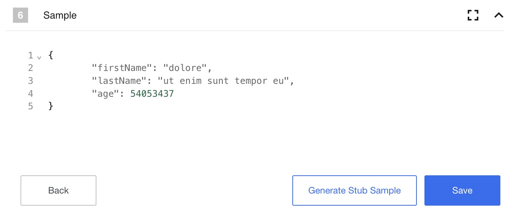

## Description

Pub-Sub component is designed to implement a [publish–subscribe](https://en.wikipedia.org/wiki/Publish-subscribe_pattern) messaging pattern. The pattern characterizes a method of transferring data between publishers that generates messages according to a general pattern rather than for a specific client, called a Subscriber within this paradigm. The subscriber, in turn, receives only the necessary messages without knowing anything about the publishers, if they exist.
In the {{site.data.tenant.name}} platform, working within this pattern is done with a *Pub-Sub component*, which can be both Publisher and Subscriber. As a result, we can create as many flows as we want with *Pub-Sub components* in Publisher mode, which will send messages to as many flows as we wish with *Pub-Sub components* in Subscriber mode, whose messages will be strictly limited to a template which the platform calls Topic.

### Pub-sub function

The advantage of the publish-subscribe pattern is that we can keep publishers and subscribers working independently of each other and exchanging between them as needed within a strict patterning framework. That is, we can have several independent threads running simultaneously and asynchronously.
For an example, consider the following situation. We want to collect data from at least one news source, convert that data into the formats we need, and somehow interact with it and store it.

### Technical Notes

The [technical notes](technical-notes) page gives some technical details about Pub-Sub component like [changelog](/components/pub-sub/technical-notes#changelog).

### Requirements

#### Environment variables

By default no environment variable is necessary to operate the component.

## Topics

Work with *Pub-Sub* should start with a description of the data template that will be transferred between the sources, that is, with Topic.

A Topic is a named JSON schema to be used to communicate in a PubSub style.
Topic can be created via UI or [API-call]({{site.data.tenant.apiDocsUri}}/v2#/topics/post_workspaces__workspace_id__topics) and contains following information:
- a unique name within the Workspace
- JSON schema describing the objects to be exchanged

When creating a Topic, we need to initially imagine the format of the data that will be forwarded. For a faster generation of Topic, you can use the Generate schema from the JSON sample button. This will allow you to load a ready-made JSON and generate a schema based on it.

{% include img.html max-width="80%" url="img/topic-create.png" title="Create topic" %}

For example, we need Topic, which contains all the basic news parameters that might be needed. For the example, let's create the following JSON schema:

{% include img.html max-width="150%" url="img/topic-details.png" title="Topic details" %}

<details close markdown="block"><summary><strong>JSON Schema</strong></summary>

```JSON
{
  "type": "object",
  "properties": {
    "id": {
      "type": "string"
    },
    "title": {
      "type": "string"
    },
    "content": {
      "type": "string"
    },
    "content_hash": {
      "type": "string"
    },
    "date": {
      "type": "string"
    },
    "sentiment": {
      "type": "number"
    },
    "LastUpdate": {
      "type": "string"
    },
    "IndexDate": {
      "type": "string"
    },
    "language_id": {
      "type": "string"
    },
    "datasource_type": {
      "type": "string"
    },
    "host": {
      "type": "string"
    },
    "collection": {
      "type": "array"
    },
    "url": {
      "type": "string"
    },
    "datasource": {
      "type": "string"
    }
  }
}
```
</details>

## Triggers

### Subscribe

Trigger, which receives data of a certain type from a Topic as an input and starts the Flow execution after this.
When you create a Subscriber Flow you must choose a Topic on which your flow will be listening for messages.
You can create as many Subscriber Flows as you want, and they will process messages from the Publisher independently.

<details close markdown="block"><summary><strong>Click to expand for more details:</strong></summary>



>**Please Note:** Topics can only be accessed if they are already in your workspace.Topic can be created via UI or [API-call](https://api.elastic.io/docs/v2/#pub/sub-topics).



For our example, we have created a special flow that publishes messages for our trigger.

>**Please Note:** You need to know what your flow sample will look like in order to work with it further.

Since we know what our sample should be, we can add it manually:



This sample can be used later in your Flows as usual.

```
    {
        "firstName": "dolore",
        "lastName": "ut enim sunt tempor eu",
        "age": 54053437
    }
```

</details>

## Actions

### Publish

Action that publishes a message of a certain type to the topic to be later received by loosely coupled Subscribers.
During the creation of a Publisher Flow you must choose a `topic` created earlier, by which your Publisher Flow will communicate with it's Subscribers. As you can see, we have already used this action for our `Subscribe` trigger before. After you have chosen the topic you need, you can enter new data.

<details close markdown="block"><summary><strong>Click to expand for more details:</strong></summary>


Connection between the Publisher and the Subscriber is loosely coupled. This means that your Publisher will never
know if there any subscribers at all, and if they processed incoming message.

</details>

## Usage example - Publisher flow

Now let's move on to the implementation of our Publisher flow. Let's imagine that some service collects news from some resources and transmits the data within our Topic template to the flow via Webhook. After that, we put the Pub-Sub component in Publisher mode and configure it as follows: specify the Topic we created earlier, then in the mapping tab based on our JSON schema we will need to specify the contents of the fields of this schema.

{% include img.html max-width="80%" url="img/pub-sub-config-1.png" title="Pub-Sub Configuration" %}

Also, prepare our Subscribers. For the example, we will use three flows, each of which will perform a specific function.

{% include img.html max-width="80%" url="img/three-flows.png" title="Three flows" %}


### First flow - E-mail sender

The first flow takes some fields from the received message and does an E-mail to the required addresses.

{% include img.html max-width="80%" url="img/email-sender.png" title="E-mail sender" %}

### Second flow - Write statistics in Spreadsheets

The second flow writes the necessary information in Google Spreadsheets.

{% include img.html max-width="80%" url="img/write-statistics.png" title="Write statistics in Spreadsheets" %}

### Third flow - Write data to FTP

The third flow is a prototype of the database, which should store all the data obtained. For a simpler implementation, a CSV document was chosen, which is stored on a remote FTP Server.

{% include img.html max-width="80%" url="img/csv-configuration.png" title="CSV configuration" %}

By sending a request to Webhook in the Publisher thread we start three flows at once.

{% include img.html max-width="80%" url="img/executions.png" title="Executions" %}

As a result, we will get:

* an E-mail to the specified address

{% include img.html max-width="75%" url="img/new-mail.png" title="New Mail" %}

* a Google Spreadsheet with the selected data

{% include img.html max-width="100%" url="img/news-statistics-spreadsheet.png" title="News Statistics Spreadsheet" %}

* a CSV document on the remote server

{% include img.html max-width="100%" url="img/csv-table.png" title="CSV Table" %}

### Conclusion

As a result, the **PubSub** component is a powerful tool to perform any number of asynchronously performed tasks on a specified data template, with the ability to select specific data from Topic and further manipulate them, which simplifies the work and increases the speed of tasks of various types.
