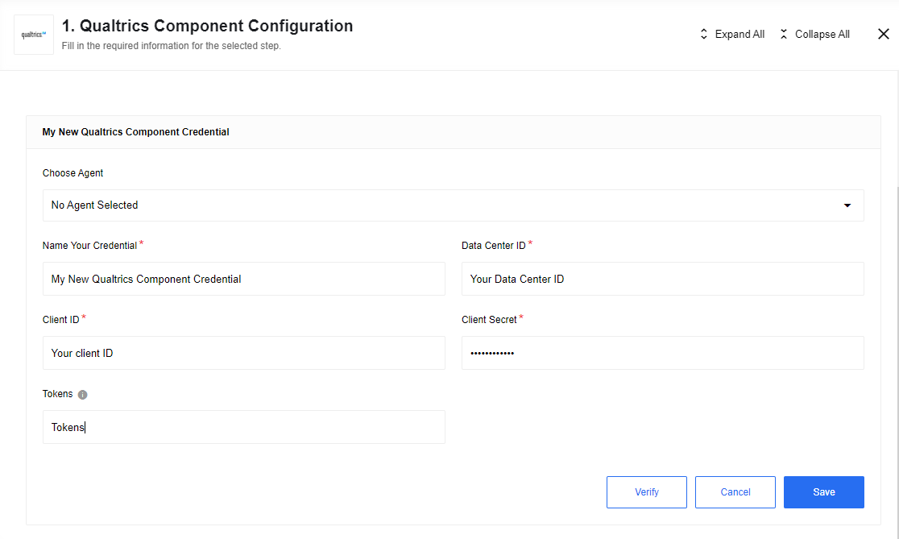
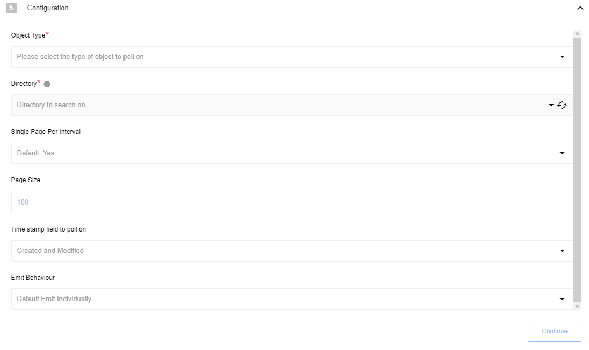
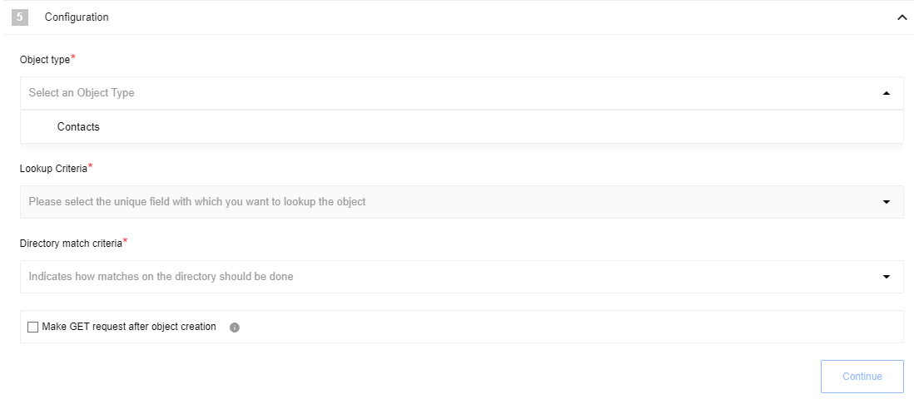
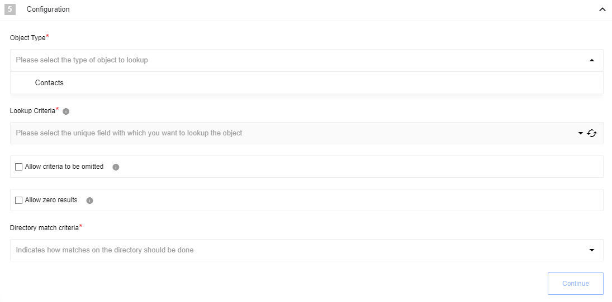
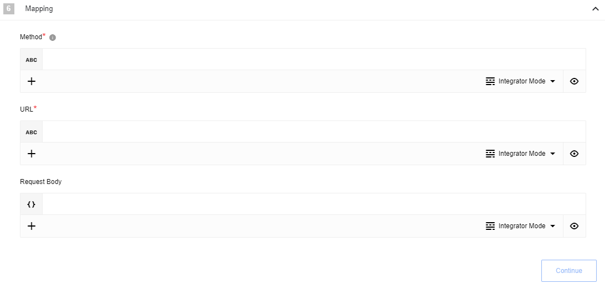
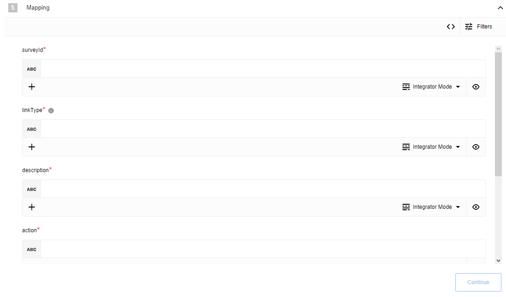
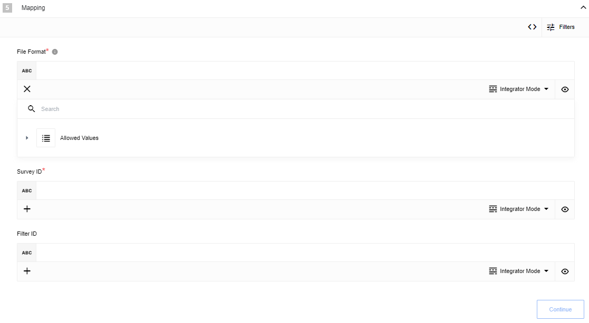

## Environment variables

| Name                  | Mandatory | Description                                                                  | Values                |
|-----------------------|-----------|------------------------------------------------------------------------------|-----------------------|
| `API_RETRIES_COUNT`   | false     | Set how many time system try to make request to API on errors (3 by default) | any `integer` above 0 |
| `API_RETRY_DELAY`     | false     | Delay between retry attempts in milliseconds (10000 by default)              | any `integer` above 0 |
| `API_REQUEST_TIMEOUT` | false     | HTTP requests timeout in milliseconds (15000 by default)                     | any `integer` above 0 |


## Credentials

Component credentials configuration fields:
* **Data Center ID**  (string, required) - To call the API, component need to use the proper URL, look like this: `https://{datacenterid}.qualtrics.com/API/V3/pathToRequest`. The `{datacenterid}` is something you will need to look for in your account settings. You find your datacenter by following these [steps](https://api.qualtrics.com/ZG9jOjg3NzY5NA-api-quick-start#getting-your-api-url).
* **Client ID**  (string, required)
* **Client Secret**  (string, required)
* **Tokens**  (JSON String, optional) - Place to store access tokens & other received metadata (e.g. expiry time). Example:

```
 "{\"access_token\":\"access_token_value\",\"token_type\":\"bearer\",\"expires_in\":86400,\"tokenExpiryTime\":\"2021-11-11T23:18:00.470Z\"}"
```




It is used `Client Credentials` OAuth as an auth mechanism and how to obtain `Client ID` and `Client Secret` you can find [there](https://api.qualtrics.com/ZG9jOjg3NzY5NA-api-quick-start#getting-oauth-set-up-for-authentication).

## Triggers

### Get New and Updated Objects Polling

Retrieve all the updated or created objects within a given time range.



#### Configuration Fields

* **Object Type** - (string, required): Object-type to lookup on. E.g `Contacts`.
* **Page Size** - (string, optional): The maximum number of items to return per request. Must be >= 1 and <= 100, default: 100 - see [documentation](https://api.qualtrics.com/c79e78a949572-search-directory-contacts#Query-Parameters).
* **Single Page Per Interval** - (dropbox, optional): `Yes`/`No`, defaults to `Yes`. Indicates that if the number of changed records exceeds the maximum number of results in a page, instead of fetching the next page immediately, wait until the next flow start to fetch the next page.
* **Timestamp field to poll on** - (string, optional): `Created`/`Created and Modified`, defaults to `Created and Modified`. Indicates just new items or new and modified items.
* **Emit behavior** - (dropbox, optional): `Emit Individually`/`Emit Page`, defaults to `Emit Individually`.  
* **Directory** - (dropbox, required): Directory to search on.  

#### Input/Output Metadata

##### Input Metadata

There is no Input Metadata

##### Output Metadata

Output metadata depends on `Emit Behaviour` configuration field. If it is equal to `Emit Individually`, result object metadata will be used.
If it is equal to `Emit Page` - object with property `result` that is array of polled objects will be used.

## Actions

### Upsert Object

Updates (of record found) or creates a new object.



#### Configuration Fields

* **Object Type** - (dropdown, required): Object-type to upsert. E.g `Contacts`.
* **Lookup Criteria** - (dropdown, required): A list of object parameters that can uniquely identify the object in the database. E.g `Qualtrics ID`.
* **Directory match criteria** - (dropdown, required): Either `Directory ID` or `Directory Name`. Indicates how matches on the directory should be done.
* **Make `GET` request after object creation** - (checkbox, defaults to false): Make GET request after new object created in order to retrieve it's metadata, object id only is returned when this option is disabled. All metadata fields are returned regardless of the field configuration, in case of object update.
The field was added in order to handle [limitation #2](#known-limitations).

#### Input Metadata

* **Lookup Criteria Value** - (string, optional): Value for unique search criteria in `Lookup Criteria` configuration field.
* **Directory Name/ID** - (string, required): Value for `Directory match criteria` configuration field.
And dynamically generated fields according to chosen `Object Type`.

#### Output Metadata

'Make `GET` request after object creation' set to `true`
'Make `GET` request after object creation' set to `false`

### Lookup Object (at most one)

Lookup a single object by a selected field that uniquely identifies it.



#### Configuration Fields

* **Object Type** - (dropdown, required): Object-type to lookup on. E.g `Contacts`.
* **Lookup Criteria** - (dropdown, required): A list of object parameters that can uniquely identify the object in the database. `Qualtrics ID`, `Email`, `Phone` or `external data reference`.
* **Allow criteria to be omitted** - (boolean, optional): If selected field `Lookup Criteria Value` becomes optional.
* **Allow zero results** - (boolean, optional): When selected, if the object is not found - an empty object will be returned instead of throwing error.
* **Directory match criteria** - (dropdown, required): Either `Directory ID` or `Directory Name`. Indicates how matches on the directory should be done.

#### Input Metadata

* **Lookup Criteria Value** - (string, required unless `Allow criteria to be omitted` is selected): Value for unique search criteria in `Lookup Criteria` configuration field.
* **Directory Name/ID** - (string, required): Value for `Directory match criteria` configuration field.

### Make Raw Request

Executes custom request.



#### Configuration Fields

* **Don't throw error on 404 Response** - (optional, boolean): Treat 404 HTTP responses not as error, defaults to `false`.

#### Input Metadata

* **Url** - (string, required): Path of the resource relative to the URL base (https://{datacenterid}.qualtrics.com/API/v3/): example `/whoami` (it is possible to use both options: path with forward slash at the beginning and without it).
  **Note** It is allowed the version part of the API to be overridable, just put at the beginning of your Url version prefix like `v2` (example: `v2/whoami`). Otherwise, default to v3.
* **Method** - (string, required): HTTP verb to use in the request, one of `GET`, `POST`, `PUT`, `PATCH`, `DELETE`.
* **Request Body** - (object, optional): Body of the request to send.

#### Output Metadata

* **Status Code** - (number, required): HTTP status code of the response.
* **Response Body** - (object, optional): HTTP response body.

### Generate Custom Distribution Link

Designed to generate survey links but not send them out.



#### Configuration Fields

There is no configuration fields

#### Input Metadata

* **surveyId** - (string, required): The survey ID associated with the distributions.
* **linkType** - (string, required): Type of the link. One of 'Individual', 'Multiple', or 'Anonymous'.
* **description** - (string, required): Any custom description.
* **expirationDate** - (string, optional): Link expiry date.
* **mailingListId** - (string, required): The mailing list or contact group associated with the distribution(s).

### Getting Survey Responses

Designed to [Getting Survey Responses](https://api.qualtrics.com/ZG9jOjg3NzY3MA-getting-survey-responses-via-the-new-export-ap-is#getting-survey-responses)



The general process of getting survey responses requires four steps:

1. [Create Response Export API](https://api.qualtrics.com/6b00592b9c013-start-response-export)
2. [Request the export status](https://api.qualtrics.com/37e6a66f74ab4-get-response-export-progress) using the Get Response Export Progress API.

>**Please Note:** The result object contains a 'status' value. Action keeping looping until the status has the value `complete`. Action sleep 15 seconds between requests. It is possible to overwrite this timeout using the environment variable API_REQUEST_TIMEOUT.

   If after 19 minutes status hasn't the value `complete`, the action will throw `Response ready timed out (19 minutes)` error.
4. [Get Response Export File](https://api.qualtrics.com/41296b6f2e828-get-response-export-file)
5. Unzip the file to find the survey responses in the format you requested
After completing these steps, the resulting file will be uploaded to the platform data storage and URL for uploading this file will emit.

#### Configuration Fields

There is no configuration fields

#### Input Metadata

* **File Format** - (string, required): The possible formats are `csv`, `json`, `ndjson`, `spss`, `tsv`, `xml`(see [documentation](https://api.qualtrics.com/6b00592b9c013-start-response-export#request-body))
* **Survey ID** - (string, required): The survey ID for generate Response Export File
* **Filter ID** - (string, required): See [documentation](https://api.qualtrics.com/ZG9jOjg3NzY3MA-getting-survey-responses-via-the-new-export-ap-is#exporting-with-a-filter)

## Known limitations

1. To ensure service health and stability, Qualtrics enforces a limit on how rapidly APIs can be called. See detail information [here](https://api.qualtrics.com/a5e9a1a304902-limits).
2. Pay attention, if you are going to fetch more then 10 000 objects by `Get New and Updated Objects Polling` trigger, it is possible to face with "httpStatus": "400 - Bad Request" and "errorCode": "BRE_0.5".
3. Qualtrics API may response with 404 error, when GET request is made to get object that was just created by it's id.
This case may be faced in Upsert action when 'Make `GET` request after object creation' option is enabled, so usage of this option make action to retrieve all object's metadata, but in some cases it may cause 404 error, however in fact object will be created.
