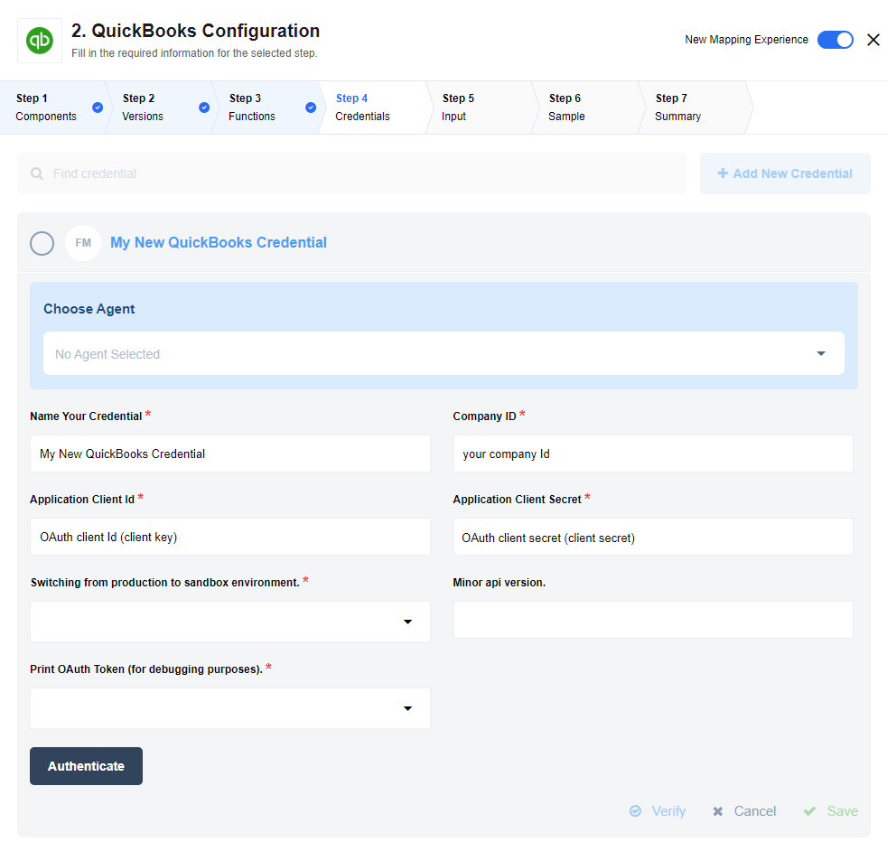

## Latest changelog

**1.1.0 (January 30, 2020)**

* Update sailor version to 2.6.1

> To see the full **changelog** please use the following [link](/components/quickbooks/changelog).

## OAuth keys and credentials

Here is the information about [how to retrieve OAuth keys](https://developer.intuit.com/docs/00_quickbooks_online/1_get_started/40_get_development_keys).

The keys could be found by appending the `application_id` in the following way:
```
https://developer.intuit.com/v2/ui#/app/appdetail/{{application_id}}/{{application_id}}/keys
```



#### Minor api version

This field represents current API [minor version](https://developer.intuit.com/app/developer/qbo/docs/develop/explore-the-quickbooks-online-api/minor-versions#minor-version-summary).
For default it's 26.

## Working with dynamic metadata

To create custom fields on the *Configure input* step, you should first choose an
entity (object) type you want to work with. Click on the *Object type to...* and wait for data uploading.
Then you'll see a list of entities which are available for this action or trigger. You should choose one.


Then you wait for uploading metadata (input object structure). After metadata uploaded you can complete input object to retrieve response sample.


Structure of the input object will be based on entityType field content.

## Triggers

### Polling Trigger

Allows to get entries by chosen type. On the first request, trigger provides all
existing objects by current type. On the next iterations, trigger will provide
ONLY objects which were changed since a previous request.
**This trigger supports all type of business entities.**

This trigger supports response pagination. The maximum number of entities that
can be returned in a response is 1000. If the result size is not specified, the
default number is 1000. If a query returns many entities, fetch the entities in chunks.
To set response size you you should set/change 'Batch Size for request pagination' field in trigger settings.

## Actions

### Insert Object

Allows to add a new entity to your company. To Insert entity you must provide
mandatory fields and fields which you want to update. This action is available
ONLY for entities which can't be updated with API. **This action contains dynamic metadata.**

## Upsert Object

Allows to add a new object or update one of the existing objects in your company.
To add a new object you should provide business required fields in the request body.
To update entity you should provide primary key and fields which you want to update.
**This action contains dynamic metadata.**

## Delete Object

Allows to remove existing entity in your division. To remove contact you need to
provide a primary key in the request body. **This action contains dynamic metadata.**


# Current Limitations

For now, API [XSD description](https://developer.intuit.com/docs/00_quickbooks_online/2_build/20_explore_the_quickbooks_online_api/80_minor_versions) doesn't have any information
about required fields, so be careful while creating insert, update or upsert requests.

Entities metadata structure was created from `v3_minor_version_26` XSD version.
Be careful, metadata was created once from the XSD, and now is stored in the component `schemas/io`.

**The QuickBooks API has some limitations for request number:**

*   Sandbox servers: Throttled at 100 requests per minute, per individual app.
*   Production servers: Throttled to 500 requests per minute, per realm ID.

Here is [more information about the request limitations](https://developer.intuit.com/docs/00_quickbooks_online/2_build/20_explore_the_quickbooks_online_api/80_minor_versions).

## Actions

### General Update & Upsert Actions

To prevent problems with concurrent access QuickBooks API entities have SyncToken
field. This field is required for update API request.
If you provide wrong SyncToken your request will be rejected with 400 code.

## Additional info

*  [QuickBooks Online REST API documentation](https://developer.intuit.com/docs/00_quickbooks_online/2_build/20_explore_the_quickbooks_online_api)
*  Here is how to [create custom fields for QuickBooks API](https://developer.intuit.com/docs/00_quickbooks_online/2_build/60_tutorials/0040_create_custom_fields).
