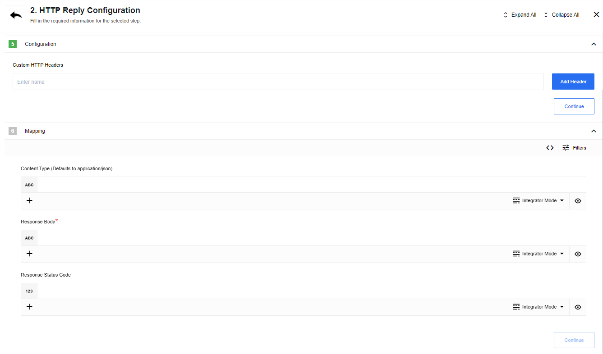

## Latest changelog

**1.1.3 (November 6, 2020)**

* Update sailor version to 2.6.18

> To see the full **changelog** please use the following [link](changelog).

## Description

The HTTP Reply integration connector makes webhooks reply with the data produced
inside integration workflows, with the result of massively speeding up the data processing.

### Authentication

This component requires no authentication.

### Environment variables

For debugging purposes there is: `LOG_LEVEL` - `trace` | `debug` | `info` | `warning` | `error` that controls logger level.

## Asynchronous vs. Synchronous messaging

For some integration flow cases, a simple acknowledgement of the messaging receipt
is sufficient, since this kind of transmission makes the message delivery more
reliable and decouples the sender from the receiver (e.g., G. Hohpe & B. Woolf, 2009).

However, in many other cases, a two-way messaging conversation is a requirement.
In this scenario, sender-receiver pair transforms into a requester and replier
pair. Firstly the requestor sends a request message and waits for a reply message
and then the replier receives the request message and responds with a reply message.

These two approaches are called: **Asynchronous** (one-way) and **Synchronous**
(two-way) messaging transmission types. At {{site.data.tenant.name}} all
integration flows are asynchronous in nature unless **HTTP Reply** or
**Request-reply** component is added. It enables the two-way messaging conversation
through the request-reply pattern transforming the flow into a synchronous one.

## Triggers

This component has no trigger functions. This means it will not be accessible to
select as a first component during the integration flow design.

## Actions

### Reply

List of Expected Config fields:

- Custom HTTP Headers - the `non-required` header names separated by comma (e.g `Content-Type`, `Content-Language`)
- Content Type (default `application/json`) - the `non-required` header value tells the client what the content type of the returned content actually is. The component supports only types with `text/...` or `application/...` in the beginning of the header name.
- Response Body - the `required` field supports JSONata expressions. Max length of a JSONata expression is 1000 symbols.



### Use cases for HTTP Reply

The use-cases of HTTP Reply component are numerous. It can be used for simple
cases of getting an answer from the flow upon the completion of the process till
complex cases like:

  * Checking the status of information from a Data Base on the availability of a record.
  * Chatbots as a separate application.
  * Communicator between {{site.data.tenant.name}} as backend and a third party mobile application as frontend.

#### Example: Advantage of Synchronous messaging

Here is a typical scenario: Integration flow is set to expect an incoming message via [WebHook](/components/webhook/) which is then processed further. The only acknowledgement that is given in this case is a simple Thank You from the [WebHook](/components/webhook/), nothing more.

```json
{
  "requestId": "lv25ymyo15twhgp",
  "message": "thank you"
}
```

The sender has no idea what have to happen with the message. If everything goes according to the plan, the message from outside would trigger the integration flow to execute without giving any verbose answer. This kind of communication is called asynchronous communication. However, what if you require a more meaningful response from the flow in order to process or execute something on your end? A simple thank you would not suffice here.

If you require to receive a meaningful, configurable response and immediately then it is better to use HTTP Reply in your integration flow. Here is a typical response from already configured request-reply two-way pattern:

```json
{
"notification" :"A message was submitted by John Newman",
"subject" : "Sender used a subject Hello",
"email" : "Email was sent by john.newman@example.com"
}
```
## Request-reply mechanism

In all of the use cases described above, the basic principle is the same: there is an incoming message which is passed through the integration flow for processing and a reply is sent back to the waiting entry point with on output information. Logic is the following:


* **Incoming message:** the [WebHook](/getting-started/webhooks-flow) receives a payload in the correct and acceptable form which is then passed further. However, the WebHook is kept active or in keep-alive state and told to expect an HTTP reply before reporting back to the original sender of the payload.

* **The message is processed:** the incoming message is mapped into the fields expected by the component and further processed by it. For a simplicity of the presentation, we have one component here but many more components can be here which would consequently process the incoming message through the different actions.

* **The message is delivered to request-reply:** an outcoming data from the component (the last one in the chain) can be returned directly without mapping or, the mapping can be performed to have only the specific fields returned using the Response Body. At this stage, incoming fields from the component can also be mapped into the custom headers of choice.

* **Custom Headers can be added (optional):** Custom headers can be added to further customise the returned message if it is required by the system which sent the original incoming message.

* **HTTP Reply is sent back:** At this stage, the message is sent back directly to the first entry point, the WebHook in our case. The message contains the Response Body + headers.

## Pre-requirements to use HTTP-reply

There are several specific requirements that need to be fulfilled before the
request-response mechanism can be used. There are:

*   If a custom Node.js component is to be used in the flow with request-reply then then [sailor-node.js](/references/sailor-compatibility-matrix) version should be 1.3.0 or above to support the messaging in the flow. We recommend to use the most recent sailor version.
*   If a custom Java component is to be used then please use `sailor-jvm` version 2.0.0 or above.
*   Care must be met to have all the steps tested in advance so the proper fields are mapped.
