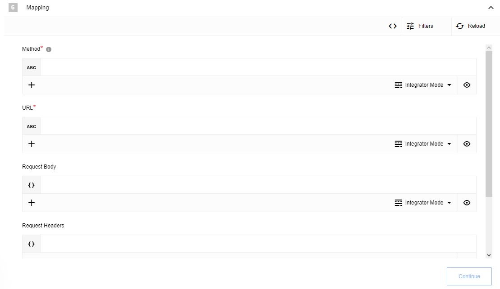

## Description

A version of the REST API component which uses NTLM Authentication

## Credentials

Component credentials configuration fields:
* **Username**  (string, required)
* **Password**  (string, required)
* **Domain**  (string, optional)
* **Workstation**  (string, optional)
* **Base URI**  (string, optional) - If provided, all requests made with the action should be appended to this base URL

## Triggers

This component has no trigger functions. This means it will not be accessible to
select as a first component during the integration flow design.

## Actions

### Make Raw Request

Executes custom request.

#### Configuration Fields

* Error Tolerance (dropdown, required): Determines behavior for when an erroneous HTTP code is received. Options are as follows:
  * **No Errors Tolerated**: Any HTTP status code >= 400 should result in an error being thrown
  * **Only Not Found Errors Tolerated**: HTTP status codes of 404, 410 or similar should result in a message being produced with the status code and the HTTP reponse. All other error codes should result in an error being thrown.
  * **None**: Regardless of the HTTP error code, the component should produce an outbound message with the status code and the HTTP response.
  * **Manual**: A range of error codes to throw errors on can be configured via the message input.

#### Input Metadata

* Url (string, required): Path of the resource relative to the URL base. If there is no URL base, or if then this should be treated as the full URl.
* Method (string enum, required): HTTP Verb for the request.
* HTTP headers (object, optional): HTTP headers to attach to the request
* Request Body (object, optional): Body of the request to send
* If **Error Tolerance** is **Manual**:
  * HTTP Codes to throw errors (array of error ranges, optional default to `[]`): A double array with a list of ranges of HTTP response codes to throw errors upon receiving Use a syntax that matches retry-axios. Example: `[[400, 403], [405,599]]` - Throw errors on all errors apart from 404.
    If array is empty, no error would be thrown, produce an outbound message with the status code and the HTTP response.

#### Output Metadata

* Status Code (integer, required): HTTP status code of the request
* HTTP Headers (object, optional): HTTP headers of the response
* Response Body (object, optional): JSON representation of the response body from the request
