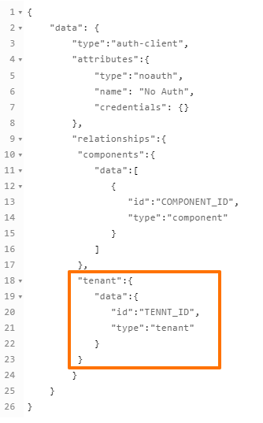

## Authorization methods

To use the REST API component with any restricted access API, you need provide the authorization information.


*Example above shows how to add the username/password to access the API during the integration flow design.*

You can add the authorization methods during the integration flow design or by going to the left side-bar, choosing `Credentials > REST API V2`
and adding there.


*Example above shows how to add new credential to access the API from Credentials page.*

REST API component supports 4 authorization types:

*   `No Auth` - use this method to work with any open REST API
*   `Basic Auth` - use it to provide login credentials like **username/password**
*   `API Key Auth` - use it to provide `API Key` to access the resource
*   `OAuth2` - use it to provide `Oauth2` credentials to access the resource. Currently it is implemented `Authorization code` OAuth2 flow.

To create `OAuth2` credential you have to choose Auth-client or create the new one. It must contains `Name`, `Client ID`, `Client Secret`, `Authorization Endpoint` and `Token Endpoint`. For more information please check the documentation of the API you want to connect to.


*Example above shows how to add new Auth-client to access the API.*

Here you can see how to select an existing `client`:


>**Please note** that the result of creating a credential is an HTTP header automatically placed for you. You can also specify the authorization in the headers section directly.

### Auth-client creation

The REST-API-v2 component has a possibility to use 4 types of auth-clients:

* `oauth2` - this is the OAuth2 type
* `basic` - a basic type with username and password only
* `api_key` - this is for API Key and header key
* `noauth` - no authentication is required

For all 4 cases, an auth-client must be created before you can use them. This means even for the `noauth` you must have auth-client .
Each auth-client is unique to a component. That means if you deploy another copy of the REST-API-V2 component to our platform you would need to create all 4 types of auth-clients for this component to work. Here you can see an example what `noauth` body should look like:



As you can see in the ???orange block???,  the above API call body is for creating `noauth` type auth-client for the whole tenant. You can choose between `component`, `workspace`, `contract` and `tenant` levels. For more information please visit out [API documentation]({{site.data.tenant.apiBaseUri}}/docs/v2/#create-auth-client).

<details close markdown="block"><summary><strong>noauth body in json</strong></summary>

```json
{
    "data": {
        "type":"auth-client",
        "attributes":{
            "type":"noauth",
            "name": "No Auth",
            "credentials": {}
        },
        "relationships":{
         "components":{
            "data":[
               {
                  "id":"COMPONENT_ID",
                  "type":"component"
               }
            ]
         },
         "tenant":{
            "data":{
               "id":"TENNT_ID",
               "type":"tenant"
            }
         }
        }
    }
}
```

</details>

> **Please Note:** authClientTypes must be exactly the same as specified in the component structure.
```json
"authClientTypes": [
    "oauth2",
    "basic",
    "api_key",
    "noauth"
  ]
```

### Environment variables

| NAME                       | DESCRIPTION    | DEFAULT   | OPTIONAL |
|----------------------------|------------------------|-----------|----------|
| REQUEST_TIMEOUT            | HTTP authorization request timeout in milliseconds.                                                   | 10000     | true     |
| REQUEST_RETRY_DELAY        | Delay between authorization retry attempts in milliseconds                                            | 5000      | true     |
| REQUEST_MAX_RETRY          | Number of HTTP authorization request retry attempts.                                                  | 3         | true     |
