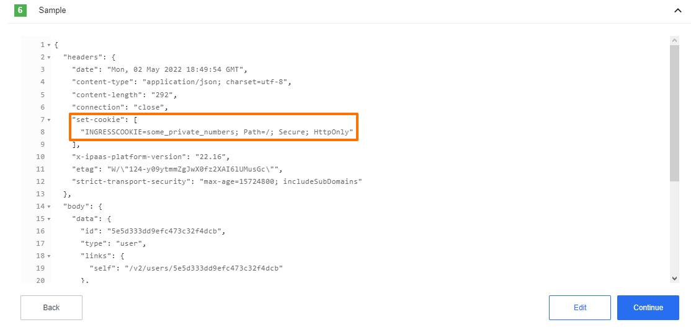

## Cookies

Sometimes it's required to read and set cookies. To read cookies you should have gain access to the `Set-Cookie` headers of the _HTTP Response_,
in this case you should check the ``Don`t throw Error on Failed Calls`` option. Please note that HTTP Response may have **multiple**
`Set-Cookie` headers therefore you should expect to find an **array** of values in the HTTP Response

To *set* Cookies you could simply use the HTTP header on your *Response* called `Cookie` to a cookie value to a
list of name-value pairs in the form of `<cookie-name>=<cookie-value>`.

Pairs in the list are separated by a semicolon and a space `('; ')`
like `yummy_cookie=choco; tasty_cookie=strawberry`. More information on setting the cookies can be found [here](https://developer.mozilla.org/en-US/docs/Web/HTTP/Headers/Cookie).
