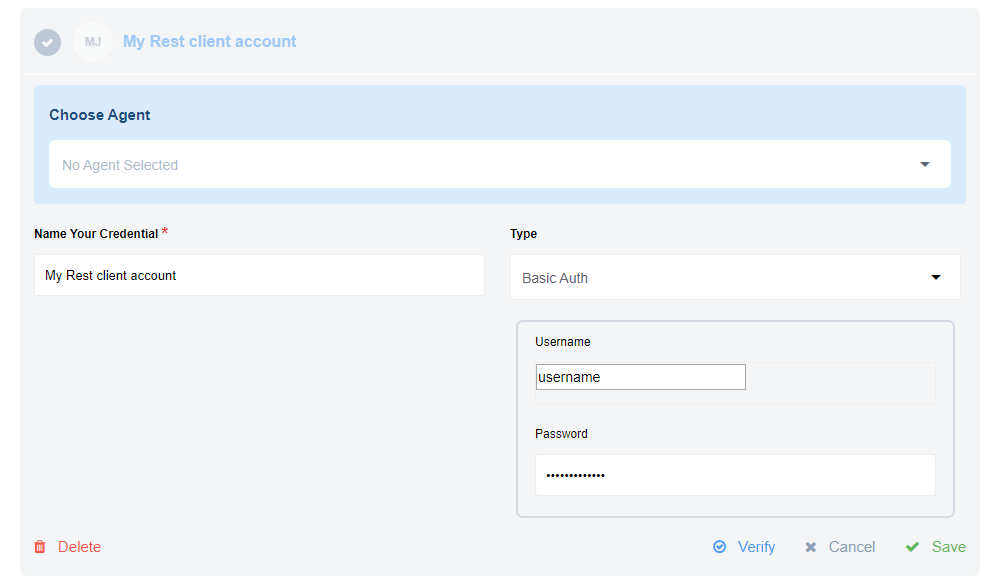

## Deprecated authentication method

To use the REST API component with any restricted access API provide the authorisation information.

*Example above shows how to add the username/password to access the API during the integration flow design.*

You must the authorisation methods during the integration flow design or by
navigating to your `Integrate > Credentials > REST API` from the main menu and
adding there. REST API component supports 4 authorisation types.

> **Please note:** The result of creating a credential is an HTTP header automatically placed for you. You can also specify the authorisation in the [headers section directly](#defining-http-headers).

### No Auth

Use **No Auth** method to work with any open REST API. You don't need
to Verify it, just Save it and proceed further.

### Basic Auth

Use **Basic Auth** to provide login credentials like **username/password**.

> **Please note:** If you intend to make calls to our own API then you MUST use this method. Use your email address as username and your API-Key as a password.

### API Key Auth

Use **API Key Auth** method for systems where an `API Key` is required to access
the resource. You need the **Header Name** (like `api-key`) and **Header Value**
(the value of API-KEY).

### OAuth2

Use **OAuth2** method when the external resource dictates an `Oauth2` authorisation to
access their resources.

> Before you can fill-in the configuration fields, we strongly suggest creating
> the OAuth2 app at service side. Here is an example how you could create an
> [OAuth2 app for Salesforce](/components/salesforce/creating-oauth-app-for-salesforce).

To help you get started here is our Callback URL (`{{site.data.tenant.appURL}}/callback/oauth2`)
to use during OAuth2 App creation at the third party service side.

There are six configuration fields here from which four are mandatory:

*   **Client Id** - This is the standard Client ID of your OAuth2 app.
*   **Client Secret** - The Client Secret of your OAuth2 app.
*   **Auth URI** - This is the authorisation URL which you should get from the service to which you are connecting. As an example Salesforce uses `https://login.salesforce.com/services/oauth2/authorize` address. Other services have similar addresses.
*   **Token URI** - This would be the URL where you make a call to obtain your access token. Using the Salesforce as an example, here is their `https://login.salesforce.com/services/oauth2/token` address to obtain tokens.
*   Scopes - A comma-separated list of special scopes your case needs. Something like `users:write, teams:write`
*   Additional parameters - A comma-separated list of any additional parameters that your case requires. For example `prompt:consent, access_type:offline` could be given.
