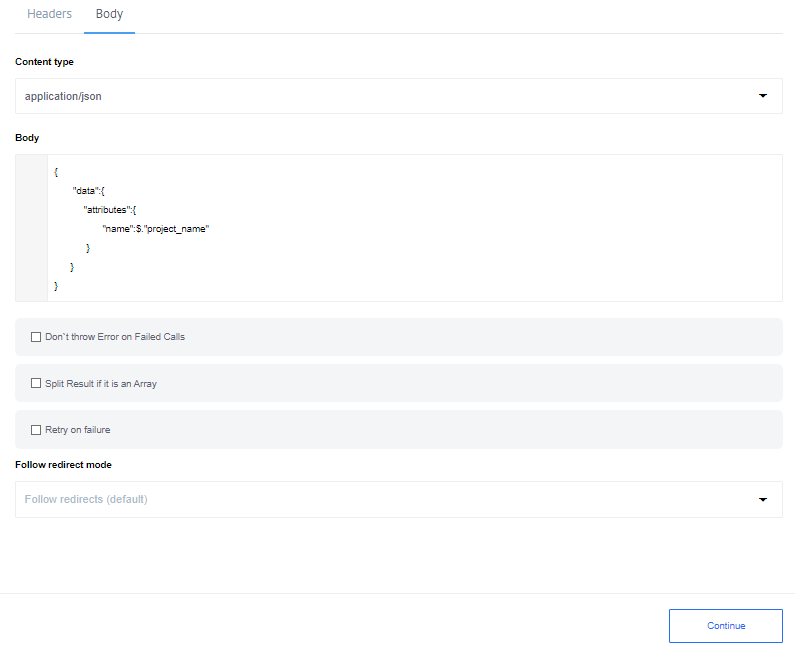
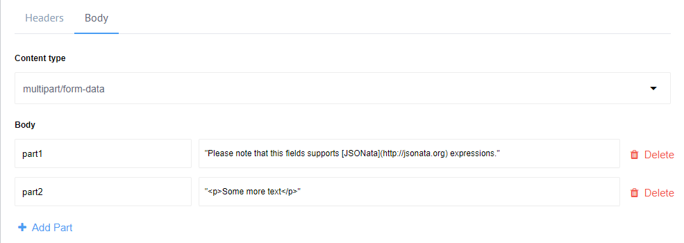

## Deprecated authentication method

To use the *REST API component* with any restricted access API provide the authorisation information.


*Example above shows how to add the username/password to access the API during the integration flow design.*

You must the authorisation methods during the integration flow design or by
navigating to your `Integrate > Credentials > REST API` from the main menu and
adding there. REST API component supports 4 authorisation types.

> **Please note:** The result of creating a credential is an HTTP header automatically placed for you. You can also specify the authorisation in the [headers section directly](#defining-http-headers).

### No Auth

Use **No Auth** method to work with any open REST API. You don't need
to Verify it, just Save it and proceed further.

### Basic Auth

Use **Basic Auth** to provide login credentials like **username/password**.

> **Please note:** If you intend to make calls to our own API then you MUST use this method. Use your email address as username and your API-Key as a password.

### API Key Auth

Use **API Key Auth** method for systems where an `API Key` is required to access
the resource. You need the **Header Name** (like `api-key`) and **Header Value**
(the value of API-KEY).

### OAuth2

Use **OAuth2** method when the external resource dictates an `Oauth2` authorisation to
access their resources.

> Before you can fill-in the configuration fields, we strongly suggest creating
> the OAuth2 app at service side. Here is an example how you could create an
> [OAuth2 app for Salesforce](/components/salesforce/creating-oauth-app-for-salesforce).

To help you get started here is our Callback URL (`{{site.data.tenant.appURL}}/callback/oauth2`)
to use during OAuth2 App creation at the third party service side.

There are six configuration fields here from which four are mandatory:

*   **Client Id** - This is the standard Client ID of your OAuth2 app.
*   **Client Secret** - The Client Secret of your OAuth2 app.
*   **Auth URI** - This is the authorisation URL which you should get from the service to which you are connecting. As an example Salesforce uses `https://login.salesforce.com/services/oauth2/authorize` address. Other services have similar addresses.
*   **Token URI** - This would be the URL where you make a call to obtain your access token. Using the Salesforce as an example, here is their `https://login.salesforce.com/services/oauth2/token` address to obtain tokens.
*   Scopes - A comma-separated list of special scopes your case needs. Something like `users:write, teams:write`
*   Additional parameters - A comma-separated list of any additional parameters that your case requires. For example `prompt:consent, access_type:offline` could be given.

## HTTP Request (Request library)

In a REST API component the trigger and action perform the same function - *HTTP request* witch will send a `GET`/`POST`/`PUT`/`PATCH`/`DELETE` requests and parse the response back to the flow.

### Configuration options

*   `Don't throw Error on Failed Calls` - if enabled return *Error*, *Error code*, and *Stack trace* in message body otherwise throw error in flow.
* `Split Result if it's an Array` - if enabled and response is an array, create a message for each item of array. Otherwise, create one message with response array.
* `Retry on failure` - enabling rebound feature for following HTTP status codes:

    * `408` -- Request Timeout
    * `423` -- Locked
    * `429` -- Too Many Requests
    * `500` -- Internal Server Error
    * `502` -- Bad Gateway
    * `503` -- Service Unavailable
    * `504` -- Gateway Timeout
    * DNS lookup timeout
    
* `Do not verify SSL certificate (unsafe)` - disable verifying the server SSL certificate - unsafe.
* `Follow redirect mode` - If you want to disable *Follow Redirect* functionality, you can use the option *Follow redirect mode*. By default *Follow redirect* mode option has value *Follow redirects*.
* `Delay` - If you want to slow down requests to your API you can set a delay value (in seconds) and the component will delay calling the next request after the previous request. The time for the delay is calculated as `Delay/Call` Count and shouldn't be more than 1140 seconds (19 minutes due to platform limitations). The Call Count value by default is 1. If you want to use another value, please set the Call Count field. Notice: See [Known Limitations](#known-limitations) about *Delay* value.
* `Call Count` - the field should be used only in pair with *Delay*, default to 1.
* `Request timeout` - Timeout period in milliseconds (1-1140000) while component waiting for server response also can be configured with `REQUEST_TIMEOUT` environment variable if configuration field is not provided. Defaults to 100000 (100 sec). 
> Notice: Specified for component `REQUEST_TIMEOUT` environment variable would be overwritten by specified value of *Request timeout*, the default value would be also overwritten.

### Output

The messages produced by the *REST API* component will have the following properties:

* `headers`: Object containing the HTTP response headers
* `statusCode`: HTTP Status Code of the Response. Number between `100` and `599`
* `statusMessage`: Human readable equivalent to the response code
* `body`: The contents of the HTTP response body:
  * When the content type header includes `json`, then the result will be parsed into the corresponding object
  * When the content type header includes `xml`, then the result will be converted into the JSON equivalent of the represented XML using the same rules as above
  * When the content type header includes one of `image`, `msword`, `msexcel`, `pdf`, `csv`, `octet-stream` or `binary` the request body contents will be stored as an attachment and there will be no `body` property in the outgoing message
  * When there is no body (because the content-length is 0), then there will be no `body` property in the outbound message.
  * If there is another content type, then the response will be treated as text
  * If the content type header is omitted, then an attempt to convert the result to JSON will be made. If that fails, then the result will be treated as if it were text.

> For more details you can see the [usage example](/components/rest-api/usage-example).

## Defining request body

If the HTTP method is any other but `GET`, you will see a **Body** tab appear next to the Header tab. The **Body** tab enables
configuration options such as the **content type** drop-down menu and the **body input field**.

Here is the list of all supported **content types**:

*   `multipart/form-data`
*   `application/x-www-form-urlencoded`
*   `text/plain`
*   `application/json`
*   `application/xml`
*   `text/xml`
*   `text/html`

The **body input field** changes according to the chosen content type.

>**Notes:**
1.  **Response body** will be stored in `msg.body`
2.  Request body that causes empty response body will return `{}`

## Sending JSON data

Here is how to send a JSON data in the body. Change the **content type** to
`application/json` and the **body input part** would change accordingly to accept
JSON object. Please note that this field supports [JSONata](http://jsonata.org) expressions.



*Example shows the JSON in the body where the `name` parameter value gets mapped using the value of `project_name` from the previous step of integration.*

## Sending XML data

To send an `XML` data, set the content type to `application/xml` or `text/xml` and place the `XML` in the body input field between double-quotes like:

```
"
<note>
  <to>" & fname & "</to>
  <from>Jani</from>
  <heading>Reminder</heading>
  <body>Don't forget me this weekend!</body>
</note>
"
```

Use a JSONata expression to include and map any values coming from the previous steps. It will replace the variable with a real value in the final mapping. Note that the rest of `XML` gets passed as a `string`.

## Sending Form data

To send a form data, two content types are available:

*   `application/x-www-form-urlencoded` - used to submit simple values to a form
*   `multipart/form-data` - used to submit (non-alphanumeric) data or file attachment in payload

In both cases the payload gets transmitted in the message body.

In case of `application/x-www-form-urlencoded` content type, add the necessary parameters by giving the name and the values like:


> **Please note:** the parameter value fields support [JSONata](http://jsonata.org) expressions.*

This HTTP request would submit `key1=value1&key2=value2` in the message body.

In case of `multipart/form-data` content type, add the parameters similarly.



The transmitted HTTP request body would be:

```
--__X_BOUNDARY__
Content-Disposition: form-data; name="part1"

Please note that this fields supports [JSONata](http://jsonata.org) expressions.
--__X_BOUNDARY__
Content-Disposition: form-data; name="part2"

<p>Some more text</p>
--__X_BOUNDARY__--
```

Notice how different parts get separated by the boundary. This form is capable of supporting attachments as well.

## Working with XML

This component will try to parse XML content types in the HTTP Response assuming the `Content-Type` header has a
**MIME Content Type** with `xml` in it (e.g. `application/xml`).
In this case response body will be parsed to JSON using `xml2js` node library and following settings:

```js
{
    trim: false,
    normalize: false,
    explicitArray: false,
    normalizeTags: false,
    attrkey: '_attr',
    tagNameProcessors: [
        (name) => name.replace(':', '-')
    ]
}
```

for more information please see the
[Documenattion of XML2JS library](https://github.com/Leonidas-from-XIV/node-xml2js#options)

## HTTP Headers

You can get HTTP response header only if ``Don`t throw Error on Failed Calls`` option is checked.
In this case output structure of component will be:

```js
    {
      headers:<HTTP headers>,
      body:<HTTP response body>,
      statusCode:<HTTP response status code>
      statusMessage:<HTTP response status message>
    }
```

## Defining HTTP headers

Use this section to add the request headers.


Each header has a name and a value. Header name should be colon-separated
name-value pairs in clear-text `string` format. The header value can use
[JSONata](http://jsonata.org/) expressions.

> **Please note: HTTP Response headers** will not be stored, the components stores body and attachment only.

### Environment Variables

| NAME                       | DESCRIPTION    | DEFAULT   | OPTIONAL |
|----------------------------|------------------------|-----------|----------|
| REQUEST_TIMEOUT            | HTTP authorization request timeout in milliseconds.                                                   | 10000     | true     |
| REQUEST_RETRY_DELAY        | Delay between authorization retry attempts in milliseconds.                                            | 5000      | true     |
| REQUEST_MAX_RETRY          | Number of HTTP authorization request retry attempts.                                                  | 3         | true     |
| REFRESH_TOKEN_RETRIES          | Number of [Rebound attempts](/guides/rebound.html#how-the-rebound-works) for processing the message.                                                  | 10        | true     |