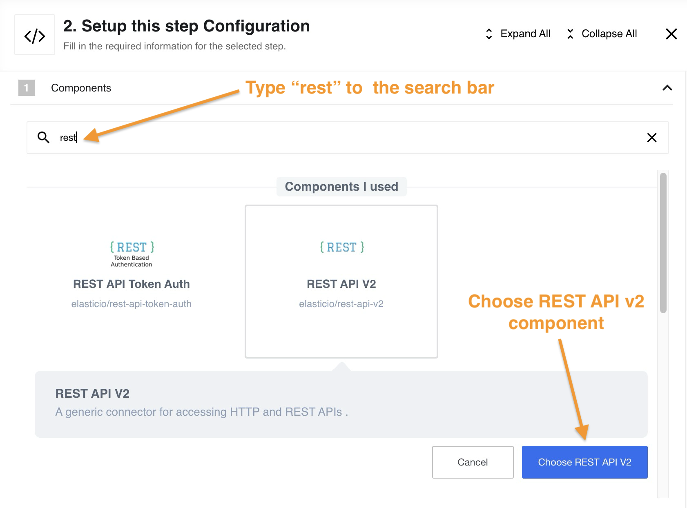
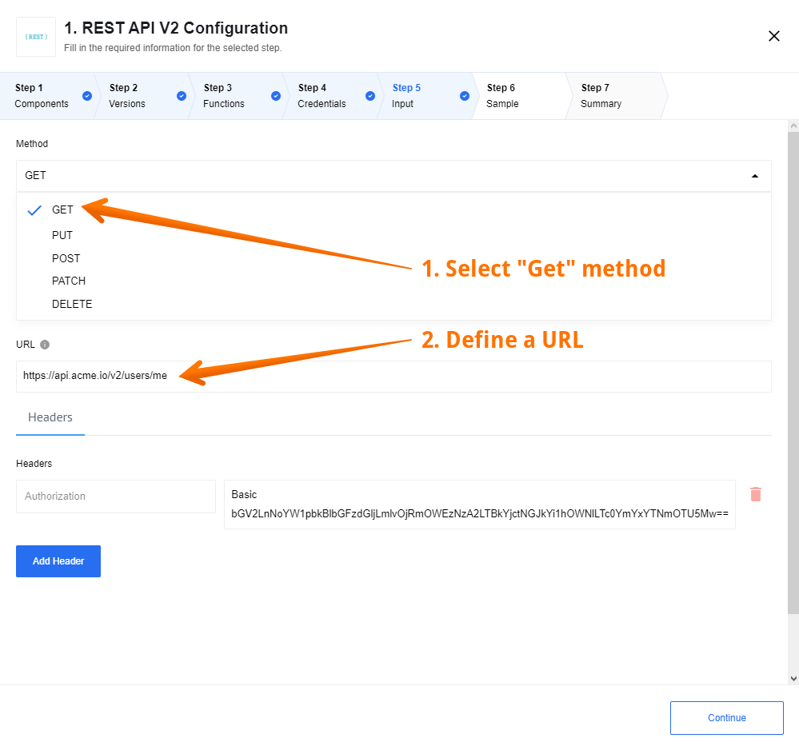
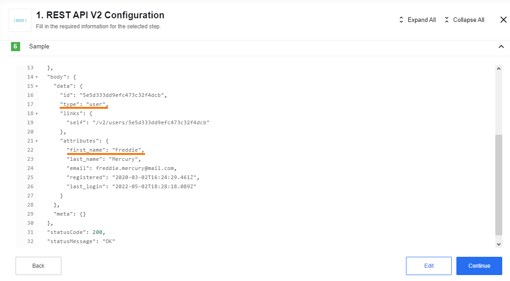

## Introduction

The REST API is designed so that you can connect and request almost any REST API without having to create a separate component.

There are countless APIs and not all have separate components. In this case, you can simply take the REST API component,  configure the request for your API and use it as if this component was made specifically for the API you selected.

Triggers and actions are implemented in the component using the HTTP request. This component function is based on the API call.
In a nutshell, an API call is a process that takes place when you send a request after setting up your API with the correct endpoints. Your information is transferred, processed, and feedback is returned back.

## Quick Start

The best way to understand a REST API component is to see it in action. We'll start with a simple example. First of all, you need to create a flow and find the component in the list:

Since there is only one function in the component, this step is performed automatically. The next step is to configure the credentials. We'll use the Basic Auth type. In this case your Username is your `E-mail`, and your Password is your `API` key:

>**Please Note:** For information on other methods of authorization please read the [Authorization methods](authorization-methods) page.

Now we need to configure the input. In our case, we use the `GET` request, which returns information upon request using the URL. We use `{{site.data.tenant.apiBaseUri}}/v2/users/me` as URL. As a result, we should get information about us as a user of the platform.

>**Please Note:** For information on HTTP request function and all `GET`/`POST`/`PUT`/`PATCH`/`DELETE` requests please read the [HTTP request function](http-request) page.

After retrieving a Sample, we will receive information about our own profile as expected.

We're done. Our simplest flow using the REST API component did its job. If you want to see more complex examples using other components in conjunction with REST API component please read our [Usage example](usage-example).

## Authorization methods

REST API component supports 4 authorization types:

*   `No Auth` - use this method to work with any open REST API
*   `Basic Auth` - use it to provide login credentials like **username/password**
*   `API Key Auth` - use it to provide `API Key` to access the resource
*   `OAuth2` - use it to provide `Oauth2` credentials to access the resource. Currently it is implemented `Authorization code` OAuth2 flow.

For more information please read the [Authorization methods](authorization-methods) page.

## HTTP request function

In a REST API component the trigger and action perform the same function - HTTP request witch will send a `GET`/`POST`/`PUT`/`PATCH`/`DELETE` requests and parse the response back to the flow.

For more information on HTTP request function and how to:

* Define request body
* Send XML data
* Work with XML
* Send JSON data
* Send Form data

For more details please read the [HTTP request function](http-request) page.

## Technical Details

Technical questions may arise while working with the component. You can find out about what changes have occurred with the component during its existence in [Technical Notes](technical-notes) page. If you need detailed information about deprecated functions of a component (for example, you are working with a long-established flow) please read [Deprecated functions](deprecated-functions) page.

## Known Limitations

**1.** The component can parse any of json and xml content types.
They are:
* application/json
* application/xml
* text/xml
* etc.

> **Please note:** if content type is not indicated in response header, component will try to parse response as json. If it gets parse exception, it returns response as is.

**2.** Attachments limitations:

  1. Maximal possible size for an attachment is 10 MB.

  2. Attachments mechanism does not work with [Local Agent Installation](/references/local-agents-requesting#compatible-operating-systems)

**3.** We suggest not to set Delay value more then time period between two executions of the flow.
Please keep in mind that delay can influence on time of next execution.
For example, the flow has type `Ordinary` and scheduled to execution for every 1 minute, but the delay is set to 120 sec, so the next execution will be started only after 120 sec, instead of 1 minute.
