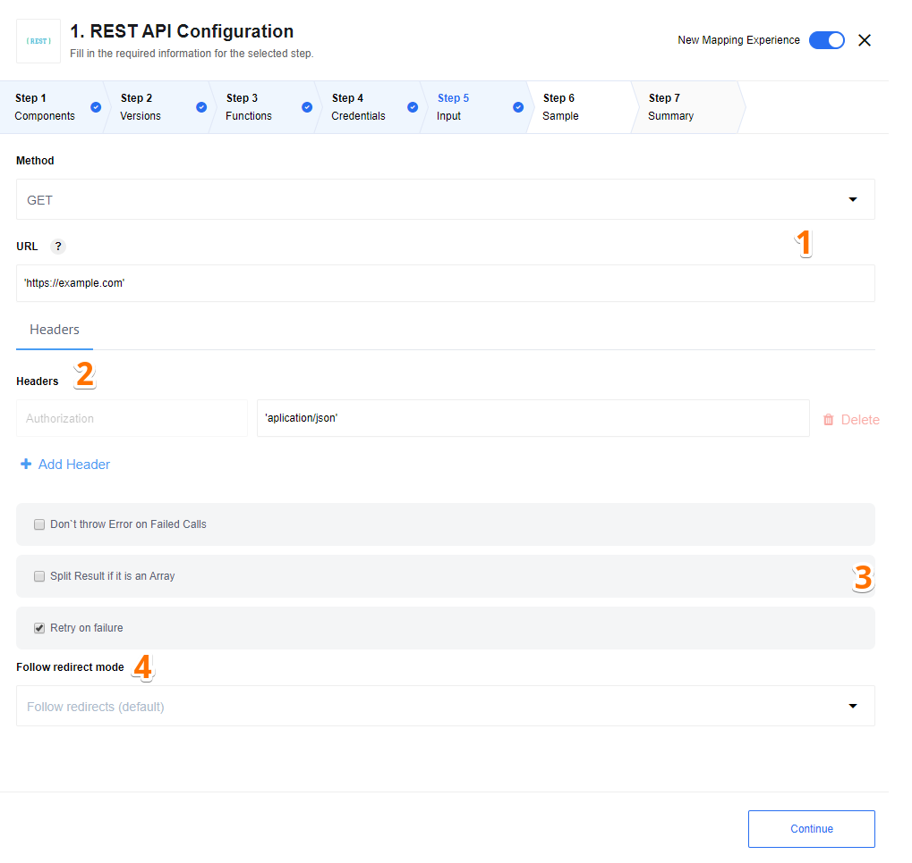
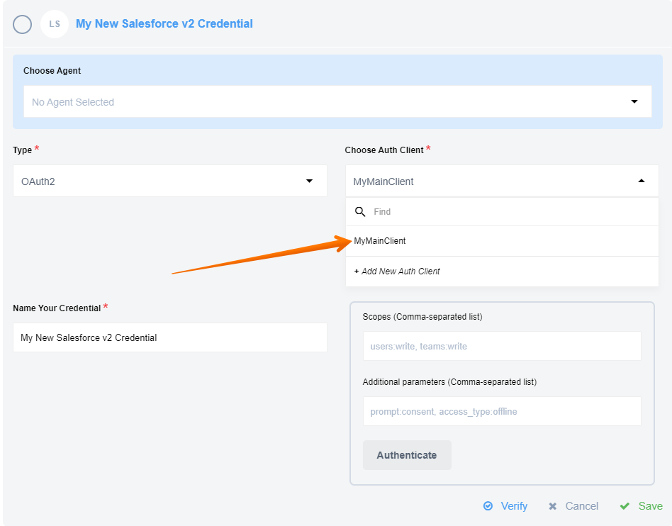
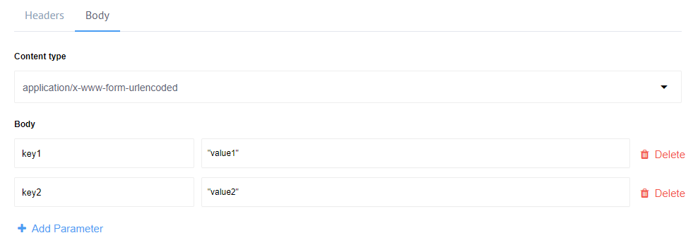
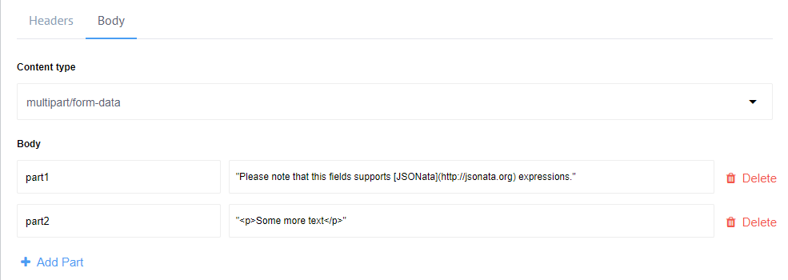
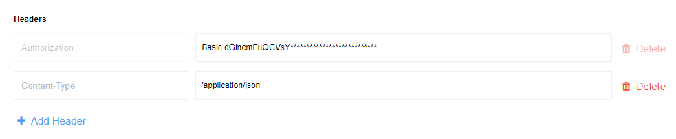

## Introduction

The example below shows the development team creation using the REST API component
with our own [REST API service](https://api.{{site.data.tenant.name}}/docs "{{site.data.tenant.name}} REST API service").



*Numbers show: (1) The URL and method of the REST API resource, (2) the HTTP call headers, (3) configuration options (4) follow redirect mode, (5) delay, (6) call count and (7) request timeout.*

**1.**  HTTP methods and URL
 * REST API component supports the following HTTP methods: `GET`, `PUT`, `POST`, `DELETE` and `PATCH`.
 * The URL of the REST API resources. Accepts JSONata expressions, meaning the URL address evaluates [JSONata](http://jsonata.org/) expressions.

**2.** Request Headers and Body
 * Definition of request [headers](#defining-http-headers)
 * Definition of request [body](#defining-http-body), if the HTTP method is not `GET`

**3.** Configuration options
 * ``Don`t throw Error on Failed Calls`` - if enabled return error, error code and stacktrace in message body otherwise throw error in flow.
 * ``Split Result if it is an Array`` - if enabled and response is array, creates message for each item of array. Otherwise create one message with response array.  
 * ``Retry on failure`` - enabling [rebound](https://support.elastic.io/support/solutions/articles/14000044750-why-and-where-we-use-the-rebound-) feature for following HTTP status codes:
    - 408: Request Timeout
    - 423: Locked
    - 429: Too Many Requests
    - 500: Internal Server Error
    - 502: Bad Gateway
    - 503: Service Unavailable
    - 504: Gateway Timeout
    - DNS lookup timeout
 * ``Do not verify SSL certificate (unsafe)`` - disable verifying the server certificate - **unsafe**.

**4.** ``Follow redirect mode`` - If you want to disable Follow Redirect functionality, you can use option ``Follow redirect mode``.By default ``Follow redirect mode`` option has value ``Follow redirects``.

**5.** ``Delay`` - If you want to slow down requests to your API, you can set delay value (in seconds) and the component will delay calling the next request after the previous request.
Time for the delay is calculated as `Delay`/ `Call Count` and shouldn't be more than 1140 seconds (19 minutes due to platform limitation).
The `Call Count` value by default is 1. If you want to use another value, please set the `Call Count` field.

>**Notice:** See [Known Limitations](/components/rest-api/index#known-limitations) about `Delay` value.

**6.** ``Call Count`` - the field should be used only in pair with `Delay`, default to 1.

**7.** ``Request timeout`` - Timeout period in milliseconds (1-1140000) while component is waiting for server response. This can also be configured with REQUEST_TIMEOUT environment variable if configuration field is not provided. Defaults to 100000 (100 sec).
Notice: Specified for component REQUEST_TIMEOUT environment variable would be overwritten by specified value of Request timeout, default value would be also overwritten.

## Authorisation methods

To use the REST API component with any restricted access API, you need provide the authorization information.


*Example above shows how to add the username/password to access the API during the integration flow design.*

You can add the authorization methods during the integration flow design or by going to the left side-bar, choosing `Credentials > REST API V2`
and adding there.


*Example above shows how to add new credential to access the API from Credentials page.*

REST API component supports 4 authorisation types:

*   `No Auth` - use this method to work with any open REST API
*   `Basic Auth` - use it to provide login credentials like **username/password**
*   `API Key Auth` - use it to provide `API Key` to access the resource
*   `OAuth2` - use it to provide `Oauth2` credentials to access the resource. Currently it is implemented `Authorization code` OAuth2 flow.

To create `OAuth2` credential you have to choose Auth-client or create the new one. It must contains `Name`, `Client ID`, `Client Secret`, `Authorization Endpoint` and `Token Endpoint`. For more information please check the documentation of the API you want to connect to.


*Example above shows how to add new Auth-client to access the API.*

Here you can see how to select an existing `client`:



>**Please note** that the result of creating a credential is an HTTP header automatically placed for you. You can also specify the authorisation in the headers section directly.

### Environment variables

| NAME                       | DESCRIPTION    | DEFAULT   | OPTIONAL |
|----------------------------|------------------------|-----------|----------|
| REQUEST_TIMEOUT            | HTTP authorization request timeout in milliseconds.                                                   | 10000     | true     |
| REQUEST_RETRY_DELAY        | Delay between authorization retry attempts in milliseconds                                            | 5000      | true     |
| REQUEST_MAX_RETRY          | Number of HTTP authorization request retry attempts.                                                  | 3         | true     |

## Trigger & Action

In a REST API component the trigger and action perform the same function - HTTP request witch will send a `GET`/`POST`/`PUT`/`PATCH`/`DELETE` requests and parse the response back to the flow.

### Output

The messages produced by the REST API component will have the following properties:

* `headers`: Object containing the HTTP response headers
* `statusCode`: HTTP Status Code of the Response. Number between `100` and `599`
* `statusMessage`: Human readable equivalent to the response code
* `body`: The contents of the HTTP response body:
  * When the content type header includes `json`, then the result will be parsed into the corresponding object
  * When the content type header includes `xml`, then the result will be converted into the JSON equivalent of the represented XML using the same rules as above
  * When the content type header includes one of `image`, `msword`, `msexcel`, `pdf`, `csv`, `octet-stream` or `binary` the request body contents will be stored as an attachment and there will be no `body` property in the outgoing message
  * When there is no body (because the content-length is 0), then there will be no `body` property in the outbound message.
  * If there is another content type, then the response will be treated as text
  * If the content type header is omitted, then an attempt to convert the result to JSON will be made. If that fails, then the result will be treated as if it were text.

> For more details you can see the [usage example](/components/rest-api/usage-example).

## Defining request body

If the HTTP method is any other but `GET`, you will see a **Body** tab appear next to the Header tab. The **Body** tab enables
configuration options such as the **content type** drop-down menu and the **body input field**.

Here is the list of all supported **content types**:

*   `multipart/form-data`
*   `application/x-www-form-urlencoded`
*   `text/plain`
*   `application/json`
*   `application/xml`
*   `text/xml`
*   `text/html`

The **body input field** changes according to the chosen content type.

>**Notes:**
1.  **Response body** will be stored in `msg.body`
2.  Request body that causes empty response body will return `{}`

### Sending JSON data

Here is how to send a JSON data in the body. Change the **content type** to
`application/json` and the **body input part** would change accordingly to accept
JSON object. Please note that this field supports [JSONata](http://jsonata.org) expressions.


*Example shows the JSON in the body where the `name` parameter value gets mapped using the value of `project_name` from the previous step of integration.*

### Sending XML data

To send an `XML` data, set the content type to `application/xml` or `text/xml` and place the `XML` in the body input field between double-quotes like:

```
"
<note>
  <to>" & fname & "</to>
  <from>Jani</from>
  <heading>Reminder</heading>
  <body>Don't forget me this weekend!</body>
</note>
"
```

Use a JSONata expression to include and map any values coming from the previous steps. It will replace the variable with a real value in the final mapping. Note that the rest of `XML` gets passed as a `string`.

### Sending Form data

To send a form data, two content types are available:

*   `application/x-www-form-urlencoded` - used to submit simple values to a form
*   `multipart/form-data` - used to submit (non-alphanumeric) data or file attachment in payload

In both cases the payload gets transmitted in the message body.

In case of `application/x-www-form-urlencoded` content type, add the necessary parameters by giving the name and the values like:



> **Please note:** the parameter value fields support [JSONata](http://jsonata.org) expressions.*

This HTTP request would submit `key1=value1&key2=value2` in the message body.

In case of `multipart/form-data` content type, add the parameters similarly.



The transmitted HTTP request body would be:

```
--__X_BOUNDARY__
Content-Disposition: form-data; name="part1"

Please note that this fields supports [JSONata](http://jsonata.org) expressions.
--__X_BOUNDARY__
Content-Disposition: form-data; name="part2"

<p>Some more text</p>
--__X_BOUNDARY__--
```

Notice how different parts get separated by the boundary. This form is capable of supporting attachments as well.

### Working with XML

This component will try to parse XML content types in the HTTP Response assuming the `Content-Type` header has a
**MIME Content Type** with `xml` in it (e.g. `application/xml`).
In this case response body will be parsed to JSON using `xml2js` node library and following settings:

```js
{
    trim: false,
    normalize: false,
    explicitArray: false,
    normalizeTags: false,
    attrkey: '_attr',
    tagNameProcessors: [
        (name) => name.replace(':', '-')
    ]
}
```

for more information please see the
[Documenattion of XML2JS library](https://github.com/Leonidas-from-XIV/node-xml2js#options)

## HTTP Headers

You can get HTTP response header only if ``Don`t throw Error on Failed Calls`` option is checked.
In this case output structure of component will be:

```js
    {
      headers:<HTTP headers>,
      body:<HTTP response body>,
      statusCode:<HTTP response status code>
      statusMessage:<HTTP response status message>
    }
```

### Defining HTTP headers

Use this section to add the request headers.



Each header has a name and a value. Header name should be colon-separated
name-value pairs in clear-text `string` format. The header value can use
[JSONata](http://jsonata.org/) expressions.

> **Please note: HTTP Response headers** will not be stored, the components stores body and attachment only.

## Cookies

Sometimes it's required to read and set cookies. To read cookies you should have gain access to the `Set-Cookie` headers of the _HTTP Response_,
in this case you should check the ``Don`t throw Error on Failed Calls`` option. Please note that HTTP Response may have **multiple**
`Set-Cookie` headers therefore you should expect to find an **array** of values in the HTTP Response


To _set_ Cookies you could simply use the HTTP header on your _Response_ called `Cookie` to a cookie value to a
list of name-value pairs in the form of <cookie-name>=<cookie-value>. Pairs in the list are separated by a semicolon and a space ('; ')
like `yummy_cookie=choco; tasty_cookie=strawberry`. More information on setting the cookies can be found [here](https://developer.mozilla.org/en-US/docs/Web/HTTP/Headers/Cookie).

## Attachments

With the REST API component, you can send binary data as attachment. You just need to choose
`multipart/form-data` Content type and attachments from the input message will be
included to the request payload automatically.

REST API component automatically load binary data to attachments with next content
types in response headers:

*   `image/*`
*   `text/csv`
*   `application/msword`
*   `application/msexcgel`
*   `application/pdf`
*   `application/octet-stream`
*   `application/x-binary`
*   `application/binary`
*   `application/macbinary`

## Exception handling

Rest API component uses exception handling logic below:


## Known Limitations

**1.** The component can parse any of json and xml content types.
They are:
* application/json
* application/xml
* text/xml
* etc.

> **Please note:** if content type is not indicated in response header, component will try to parse response as json. If it gets parse exception, it returns response as is.

**2.** Attachments limitations:

  1. Maximal possible size for an attachment is 10 MB.

  2. Attachments mechanism does not work with [Local Agent Installation](/references/local-agents-requesting#compatible-operating-systems)

**3.** OAuth2 authentication strategy limitation: [Access Token Response](https://www.oauth.com/oauth2-servers/access-tokens/access-token-response/) should   always contain `refresh_token` property (optional in OAuth2 standard). Reason behind it - platform shoud be able to refresh access token after it's expiration.  Possible solution - use `access_type:offline` in additional parameter which is supported by many OAuth2 providers.

**4.** We suggest not to set Delay value more than time period between two executions of the flow. Please keep in mind that delay can influence the time of next execution. For example, the flow has type `Ordinary` and scheduled for execution for every 60 sec, but the delay is set to 120 sec, so the next execution will be started only after 120 sec, instead of 60 seconds.
