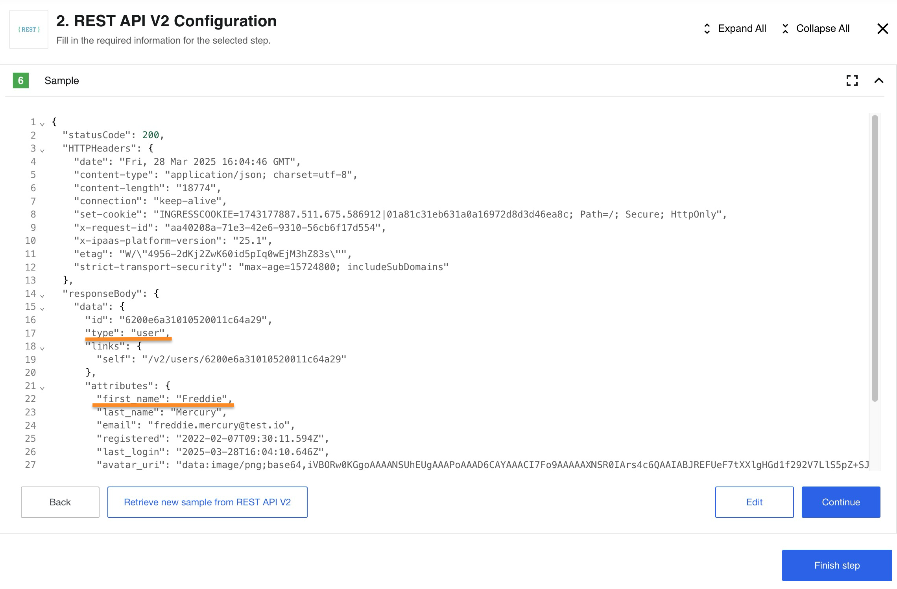

## Introduction

The **REST API** is designed so that you can connect and request almost any *REST API* without having to create a separate component.

There are countless API`s and not all have separate components. In this case, you can simply take the *REST API* component, configure the request for your API and use it as if this component was made specifically for the API you selected.

Triggers and actions are implemented in the component using the [HTTP request](http-request). This component function is based on the API call.
In a nutshell, an API call is a process that takes place when you send a request after setting up your API with the correct endpoints. Your information is transferred, processed, and feedback is returned back.

>**Please Note:** We highly recommend using only the second version of the component The *REST API v1* component has been deprecated and is no longer supported. We highly recommend migrating to the actual version of componet. *REST API v2* component offers improved functionality and ongoing maintenance. If you still using REST API v1 component please update your codebase to utilize the *REST API v2* component as soon as possible to ensure compatibility with future updates and benefit from the latest features.

## Quick Start

The best way to understand a *REST API* component is to see it in action. We'll start with a simple example. First of all, you need to create a flow and find the component in the list:

Since there is only one function in the component, this step is performed automatically. The next step is to configure the credentials. We'll use the Basic Auth type. In this case your Username is your `E-mail`, and your Password is your `API` key:

>**Please Note:** For information on other methods of authorization please read the [Authorization methods](authorization-methods) page.

Now we need to configure the input. In our case, we use the `GET` request, which returns information upon request using the URL. We could use the platform API as URL example. As a result, we should get information about us as a user of the platform.

>**Please Note:** For information on HTTP request function and all `GET`/`POST`/`PUT`/`PATCH`/`DELETE` requests please read the [HTTP request function](http-request) page.

After retrieving a Sample, we will receive information about our own profile as expected.

We're done. Our simplest flow using the REST API component did its job. If you want to see more complex examples using other components in conjunction with REST API component please read our [Usage example](usage-example).

## Authorization methods

REST API component supports 4 authorization types:

*   `No Auth` - use this method to work with any open *REST API*
*   `Basic Auth` - use it to provide login credentials like **username/password**
*   `API Key Auth` - use it to provide `API Key` to access the resource
*   `OAuth2` - use it to provide `Oauth2` credentials to access the resource. Currently it is implemented `Authorization code` OAuth2 flow.

For more information please read the [Authorization methods](authorization-methods) page.

## Configuration options

*   `Don't throw Error on Failed Calls` - if enabled return *Error*, *Error code*, and *Stack trace* in message body otherwise throw error in flow.
* `Split Result if it's an Array` - if enabled and response is an array, create a message for each item of array. Otherwise, create one message with response array.
* `Retry on failure` - enabling rebound feature for following HTTP status codes:

    * `408` -- Request Timeout
    * `423` -- Locked
    * `429` -- Too Many Requests
    * `500` -- Internal Server Error
    * `502` -- Bad Gateway
    * `503` -- Service Unavailable
    * `504` -- Gateway Timeout
    * DNS lookup timeout
    
* `Do not verify SSL certificate (unsafe)` - disable verifying the server SSL certificate - unsafe.
* `Follow redirect mode` - If you want to disable *Follow Redirect* functionality, you can use the option *Follow redirect mode*. By default *Follow redirect* mode option has value *Follow redirects*.
* `Delay` - If you want to slow down requests to your API you can set a delay value (in seconds) and the component will delay calling the next request after the previous request. The time for the delay is calculated as `Delay/Call` Count and shouldn't be more than 1140 seconds (19 minutes due to platform limitations). The Call Count value by default is 1. If you want to use another value, please set the Call Count field. Notice: See [Known Limitations](#known-limitations) about *Delay* value.
* `Call Count` - the field should be used only in pair with *Delay*, default to 1.
* `Request timeout` - Timeout period in milliseconds (1-1140000) while component waiting for server response also can be configured with `REQUEST_TIMEOUT` environment variable if configuration field is not provided. Defaults to 100000 (100 sec). 
> Notice: Specified for component `REQUEST_TIMEOUT` environment variable would be overwritten by specified value of *Request timeout*, the default value would be also overwritten.

## Environment Variables

| NAME                       | DESCRIPTION    | DEFAULT   | OPTIONAL |
|----------------------------|------------------------|-----------|----------|
| REQUEST_TIMEOUT            | HTTP authorization request timeout in milliseconds.                                                   | 10000     | true     |
| REQUEST_RETRY_DELAY        | Delay between authorization retry attempts in milliseconds.                                            | 5000      | true     |
| REQUEST_MAX_RETRY          | Number of HTTP authorization request retry attempts.                                                  | 3         | true     |
| REFRESH_TOKEN_RETRIES          | Number of [Rebound attempts](/guides/rebound.html#how-the-rebound-works) for processing the message.                                                  | 10        | true     |

## HTTP request function

In a REST API component the trigger and action perform the same function - HTTP request witch will send a `GET`/`POST`/`PUT`/`PATCH`/`DELETE` requests and parse the response back to the flow.

For more information on HTTP request function and how to:

* Define request body
* Send XML data
* Work with XML
* Send JSON data
* Send Form data

For more details please read the [HTTP request function](http-request) page.

## Technical Details

Technical questions may arise while working with the component. You can find out about what changes have occurred with the component during its existence in [Technical Notes](technical-notes) page. If you need detailed information about deprecated functions of a component (for example, you are working with a long-established flow) please read [Deprecated functions](deprecated-functions) page.

## Known Limitations

**1.** The component can parse any of JSON and XML content types.
They are:
* `application/json`
* `application/xml`
* `text/xml`
* etc.

> **Please note:** if content type is not indicated in response header, component will try to parse response as JSON. If it gets parse exception, it returns response as is.

**2.** Attachments limitations:

  1. Maximal possible size for an attachment is 10 MB.

  2. Attachments mechanism does not work with [Local Agent Installation](/references/local-agents-requesting#compatible-operating-systems)

**3.** We suggest not to set *Delay* value more then time period between two executions of the flow.
Please keep in mind that delay can influence on time of next execution.
For example, the flow has type `Ordinary` and scheduled to execution for every 1 minute, but the delay is set to 120 sec, so the next execution will be started only after 120 sec, instead of 1 minute.
