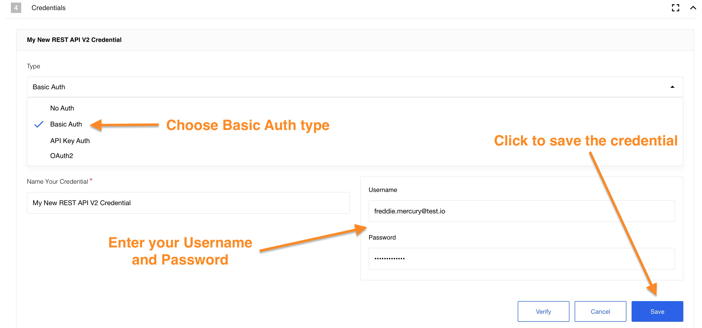
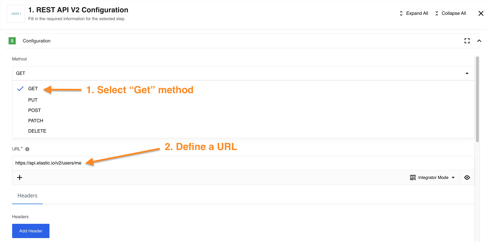

## Table of Contents

* [Description](#description)
  * [Technical Notes](#technical-notes)
  * [Quick Start](#quick-start)
* [Credentials](#credentials)
* [Actions](#actions) 
  * [HTTP Request (Axios Library)](#http-request-axios-library)
* [Triggers](#triggers) 
  * [HTTP Request (Axios Library)](#http-request-axios-library) 
* [Examples of Usage](#examples-of-usage)
  * [Uploading Files](#uploading-files)
  * [Sending XML or Text Data](#sending-xml-or-text-data)
  * [Sending JSON Data](#sending-json-data)
* [Known limitations](#known-limitations)

## Description

The **REST API** is designed so that you can connect and request almost any *REST API* without having to create a separate component.

There are countless API's and not all have separate components. In this case, you can simply take the *REST API* component, configure the request for your API and use it as if this component was made specifically for the API you selected.

Triggers and actions are implemented in the component using the [HTTP request](#http-request-axios-library). This component function is based on the API call.
In a nutshell, an API call is a process that takes place when you send a request after setting up your API with the correct endpoints. Your information is transferred, processed, and feedback is returned back.

>**Please Note:** We highly recommend using only the second version of the component The *REST API v1* component has been deprecated and is no longer supported. We highly recommend migrating to the actual version of componet. *REST API v2* component offers improved functionality and ongoing maintenance. If you still using REST API v1 component please update your codebase to utilize the *REST API v2* component as soon as possible to ensure compatibility with future updates and benefit from the latest features.

### Technical Notes

Technical questions may arise while working with the component. You can find out about what changes have occurred with the component during its existence in [Technical Notes](technical-notes) page. If you need detailed information about deprecated functions of a component (for example, you are working with a long-established flow) please read [Deprecated functions](deprecated-functions) page.

### Quick Start

The best way to understand a *REST API* component is to see it in action. We'll start with a simple example. First of all, you need to create a flow and find the component in the list:

Since the [Request library](/components/rest-api/deprecated-functions.html#http-request-request-library) is deprecated, select *HTTP Request (Axios Library)* function in the component. 

The next step is to configure the credentials. Choose *Create new credential* button in the credentials section:

We'll use the Basic Auth type. In this case your Username is your `E-mail`, and your Password is your `API` key:

>**Please Note:** For information on other methods of authorization please read the [Authorization methods](authorization-methods) page.

Now we need to configure the input. In our case, we use the `GET` request, which returns information upon request using the URL. We could use the [platform API]({{site.data.tenant.apiBaseUri}}/docs/v2#/users/get_users_me) as URL example. As a result, we should get information about us as a user of the platform.

>**Please Note:** For information on HTTP request function and all `GET`/`PUT`/`POST`/`PATCH`/`DELETE` requests please read the [HTTP request](#http-request-axios-library).

After retrieving a Sample, we will receive information about our own profile as expected.

We're done. Our simplest flow using the REST API component did its job. If you want to see more complex examples using other components in conjunction with REST API component please read our [Usage example](usage-example).

## Credentials

REST API component supports 4 authorization types:

*   `No Auth` - use this method to work with any open *REST API*
*   `Basic Auth` - use it to provide login credentials like **username/password**
*   `API Key Auth` - use it to provide `API Key` to access the resource
*   `OAuth2` - use it to provide `Oauth2` credentials to access the resource. Currently it is implemented `Authorization code` OAuth2 flow.

For more information please read the [Authorization methods](authorization-methods) page.

## Actions

### HTTP Request (Axios Library)

#### Configuration Fields

* **Method** (dropdown, required): The HTTP verb to use in the request, which can be one of `GET`, `POST`, `PUT`, `DELETE`, or `PATCH`.
* **URL** (string, required) - The URL of the REST API resource.
* **Headers** tab: This includes the `Add Header` button, which is used to add custom headers to your request. Each header consists of two fields: the first is used as the header key, and the second is used as the header value.
* **Body** tab (available only if `Method` is not `GET`) has the following fields:
  * **Content Type** (string, required): The type of data that you are going to send.
  * **Body** (object/string/dynamic fields, required) - Based on the provided `Content Type`, the component will generate the appropriate fields:
    * If `multipart/form-data` or `application/x-www-form-urlencoded` is selected, there will be an `Add Part` button used to add parts to your request; each part consists of a key and a value.
    * For other cases, a single input field for the body will be generated, allowing you to input an object (using a JSONata expression) or text (if you need to send XML).
* **Error Handling Policy** (dropdown, optional, default `Retry by component`) - The component considers the following codes as errors that can be handled: *`408`*, *`423`*, *`429`*, everything greater than *`500`*, and *`ECONNABORTED`* (timeout). You can select one of the available options:
  * `Retry by component` - The component will attempt to retry this request.
  * `Use rebound functionality` - The component will send the incoming message back to the queue; after some time, this message will return (you can find more information about how rebounds work in the platform documentation).
  * `Don't retry (throw error)` - The component will throw an error directly.
  * `Emit error as message (don't throw errors)` - The component will send a message with the response received from the server.
* **Maximum Retries** (number, optional, default `10`) - Set the maximum number of retry attempts. This option is only applicable when the `Error Handling Policy` is set to `Retry by component`.
* **Error Codes for retry** (string, optional) - A comma-separated list of codes or ranges. By default, the error handling policy applies when you receive HTTP codes 408, 423, 429, and any codes greater than 500. However, you can override these codes using this field.
  
  * You can specify exact codes: `401, 404, 503`.
  * You can also use ranges: `400-401, 405-410, 502-509`.
  * You can combine them: `403, 404, 500-599`.

  Note: You can only include codes above 299 here, and you cannot include 401 if OAuth2 authentication is selected.
* **Download as Attachment** (boolean) - If checked, the component will download response data to internal storage as an attachment, and you will receive a URL to it instead of the response body.
* **Upload File** (boolean) - If checked, you will be able to upload data via two available methods: 
  * For body content type `application/octet-stream`, provide the URL to the file from internal or external storage directly in the "Body" field as a string.
  * For body content type `multipart/form-data`, specify any key as a string (e.g., `file`) and the value as an object (switch the field to "JSONata Mode"), where one of the object keys should be `url`, pointing to the file. Available parameters in this case:
    * `url` (string, required) - The link to the file from internal or external storage.
    * `filename` (string, optional) - The name of the file.
    * `knownLength` (number, optional) - The size of the file.
* **Do Not Verify SSL Certificate (unsafe)** (boolean) - Check this option if you want to disable SSL certificate verification on the server.
* **Maximum Redirects** (number, optional, default `5`) - Defines the maximum number of redirects to follow. If set to 0, no redirects will be followed.
* **Delay in ms** (number, optional, default `0`) - Delay the next request after the previous request by the specified milliseconds. The maximum delay is 1140000 (19 minutes), with a default of 0.
* **Request Timeout** (number, optional, default `100000` - 100 seconds) - The timeout period in milliseconds while the component waits for a server response. It should be a positive integer between `1` and `1,140,000` (19 minutes).
* **Response Size Limit** (number, optional) - The maximum response size in bytes, with a maximum and default of 20MB for regular requests and 100MB for attachments (if `Download as Attachment` is checked).
* **Request Size Limit** (number, optional, default `unlimited`) - The maximum size of the HTTP request content in bytes.
* **Response Encoding** (string, optional, default `utf8`) - Indicates the encoding to use for decoding responses. In some cases, when you need to extract data from the message, you can use `base64` here.

#### Input Metadata
None

#### Output Metadata
* **statusCode** (number, required) - The HTTP status code of the response.
* **HTTPHeaders** (object, required) - The response headers.

If `Download as Attachment` is checked:
* **attachmentUrl** (string, required) - The link to your file stored in internal storage.
If `Download as Attachment` is unchecked:
* **responseBody** (object/string) - The content of the response.

## Triggers

### HTTP Request (Axios Library)
Refer to the actions section [HTTP Request (Axios Library)](#http-request-axios-lib).

## Examples of Usage

### Uploading Files
To upload a file, ensure that you check the `Upload File` option in the configuration. You will then have the following options:

#### Upload Using `application/octet-stream`

1. Add the URL to which you will upload the file.
2. Set the Body content type to `application/octet-stream`.
3. In the body, provide the URL to the data source from which you need to retrieve the file.

#### Upload Using `multipart/form-data`

1. Add the URL to which you will upload the file.
2. Set the Body content type to `multipart/form-data`.
3. Press the `Add Part` button.
4. Enter a key that describes the field containing the data; a common name is `file`.
5. Switch to `JSONata mode`.
6. Create an object with the key `url`—this will be the data source from which you need to retrieve the file.

### Sending XML or Text Data

1. In `Integrator mode`, you can simply place your text or XML inside the body.
2. Mapping from previous steps is also available.

You can switch to `JSONata mode` if you need to utilize JSONata expressions.

### Sending JSON Data

1. In `JSONata mode`, you can simply place your JSON inside the body.
2. Mapping from previous steps and any JSONata expressions are also available.

## Known Limitations

**1.** The component can parse any of JSON and XML content types.
They are:
* `application/json`
* `application/xml`
* `text/xml`
* etc.

> **Please note:** if content type is not indicated in response header, component will try to parse response as JSON. If it gets parse exception, it returns response as is.

**2.** Attachments limitations:

  1. Maximal possible size for an attachment is 10 MB.

  2. Attachments mechanism does not work with [Local Agent Installation](/references/local-agents-requesting#compatible-operating-systems)

**3.** We suggest not to set *Delay* value more then time period between two executions of the flow.
Please keep in mind that delay can influence on time of next execution.
For example, the flow has type `Ordinary` and scheduled to execution for every 1 minute, but the delay is set to 120 sec, so the next execution will be started only after 120 sec, instead of 1 minute.