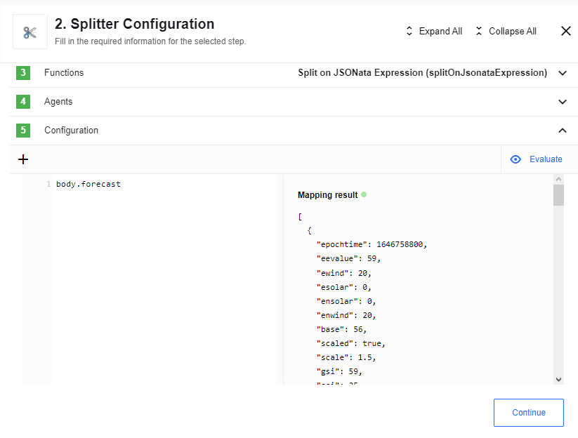
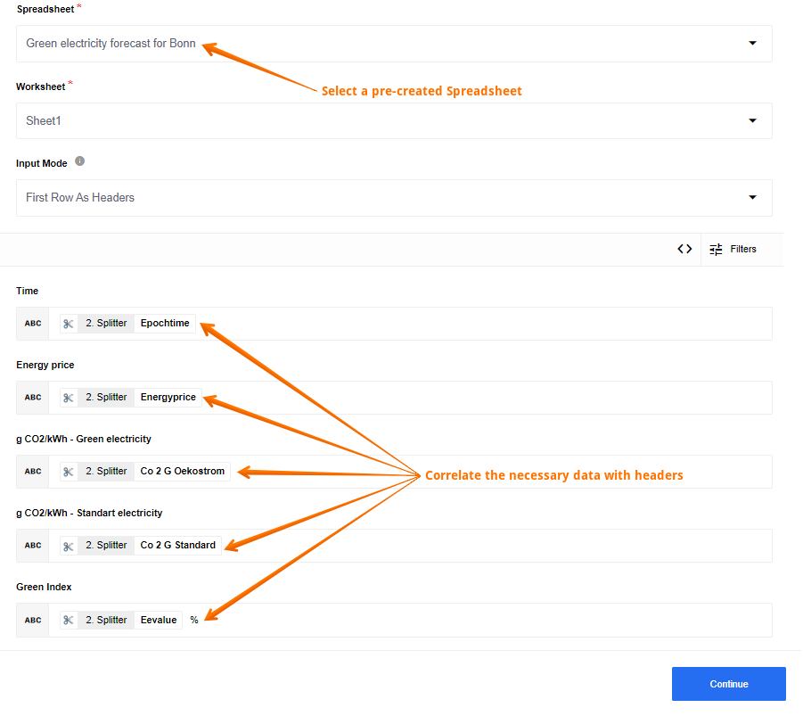

## Introduction

REST API component can be used for all sorts of purposes - from receiving [NYT news articles](https://developer.nytimes.com/docs/archive-product/1/overview) for a given month, going back to 1851 to communicating between online stores and search engines. We want to show you an example of the use of REST API component in which we will use data on green energy to understand when there is a lot of renewable electricity on the grid that can be used in a household. If the Green Index is high enough, a lot of electricity is available from renewable sources. During this time, you can use household appliances climate-friendly.

## Flow example

In this example, we want to create a table that shows the efficiency of using green energy over a certain period of time. To accomplish the task, we created this flow:

Use the REST API component to get the necessary information on green energy. To do this, select the `GET` function and define a `URL`. In our case, we use [Currently GrünstromIndex](https://gruenstromindex.de) website as a source of information:

As a Sample you will receive the necessary data:

After that please process the data using a [Splitter component](/components/splitter/index):

The last component that we use in the integration flow is the [Google Spreadsheet component](/components/gspreadsheet/index). Here select a pre-created spreadsheet with firs rows as headers and match the information you need with these headers:

After you publish the draft and run the integration flow, your spreadsheet will be updated with the data received from your flow:

