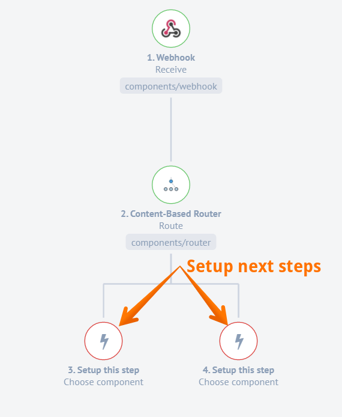

This component implements the [Content-Based Router](http://www.enterpriseintegrationpatterns.com/patterns/messaging/ContentBasedRouter.html) pattern from Enterprise Integration Patterns (EIP).

## Latest changelog

**0.0.6 (July 3, 2020)**

* Update sailor version to 2.6.13
* Fix problems with flow control

> To see the full **changelog** please use the following [link](/components/router/changelog).

## Triggers

This component has no trigger functions. This means it will not be accessible to
select as a first component during the integration flow design.

## Actions

### Route

This action is responsible for performing the only function of the component, which is described in the header.

Here is how to use Route action:

First you have to define a new flow branch,


then you have to define a routing criteria


and setup your next steps:



## Environment Variables

  `LOG_LEVEL` - `trace` | `debug` | `info` | `warning` | `error` controls logger level

## How it works?

Here is the sample integration flow with CBR inside it:

```json
{
    "data": {
        "attributes": {
            "name": "CBR Test",
            "type": "ordinary",
            "graph": {
                "nodes": [
                    {
                        "command": "platform/webhook:receive@latest",
                        "fields": {
                            "payload": "test"
                        },
                        "id": "in"
                    },
                    {
                        "command": "platform/router:route@latest",
                        "id": "router"
                    },
                    {
                        "command": "platform/code:execute@latest",
                        "fields": {
                            "code": "this.logger.info('one');emitter.emit('data',msg)"
                        },
                        "id": "one"
                    },
                    {
                        "command": "platform/code:execute@latest",
                        "fields": {
                            "code": "this.logger.info('two');emitter.emit('data',msg)"
                        },
                        "id": "two"
                    },
                    {
                        "command": "platform/code:execute@latest",
                        "fields": {
                            "code": "this.logger.info('default');emitter.emit('data',msg)"
                        },
                        "id": "default"
                    }
                ],
                "edges": [
                    {
                        "source": "in",
                        "target": "router"
                    },
                    {
                        "config": {
                            "condition": "$number(test) > 10"
                        },
                        "source": "router",
                        "target": "one"
                    },
                    {
                        "config": {
                            "condition": "$number(test) > 20"
                        },
                        "source": "router",
                        "target": "two"
                    },
                    {
                        "source": "router",
                        "target": "default"
                    }
                ]
            }
        },
        "type": "flow"
    }
}
```


The content based router (CBR) component has a single input and multiple outputs (edges).
Outgoing edge from CBR component should have a configuration property called ``condition`` that defines a [JSONata](http://jsonata.org/) expression. Expression on each edge is validated based on message that arrived to the CBR component.
If condition is evaluated to ``true`` then a copy of the message is sent to the component connected to the outgoing edge.

If condition is not defined on the outgoing edge, then this edge considered to be **default** edge. Default edge will get all
messages that didn't matched **any** other edges. Please note - CBR component may only have a single **default** edge.
Multiple default edges will fail validation of {{site.data.tenant.name}} API.

Now let us examine our sample from above:
 - Incoming webhook has a message like

 ```json
    {
        "test":"12345"
    }
 ```

 - As you can see CBR component has 3 outgoing edges, conditions are
  - ``$number(test) > 10`` for edge that is connected to step ID ``one``
  - ``$number(test) > 30`` for edge that is connected to step ID ``two``
  - Last edge has no condition, therefore a default edge connected to step ``default``

> For more information please visit our [Content-Based Routing](/guides/content-based-router) page.
