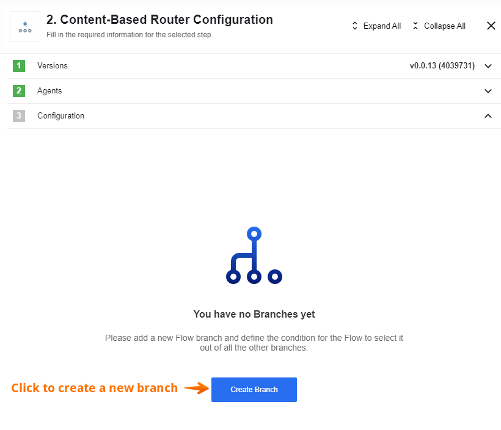
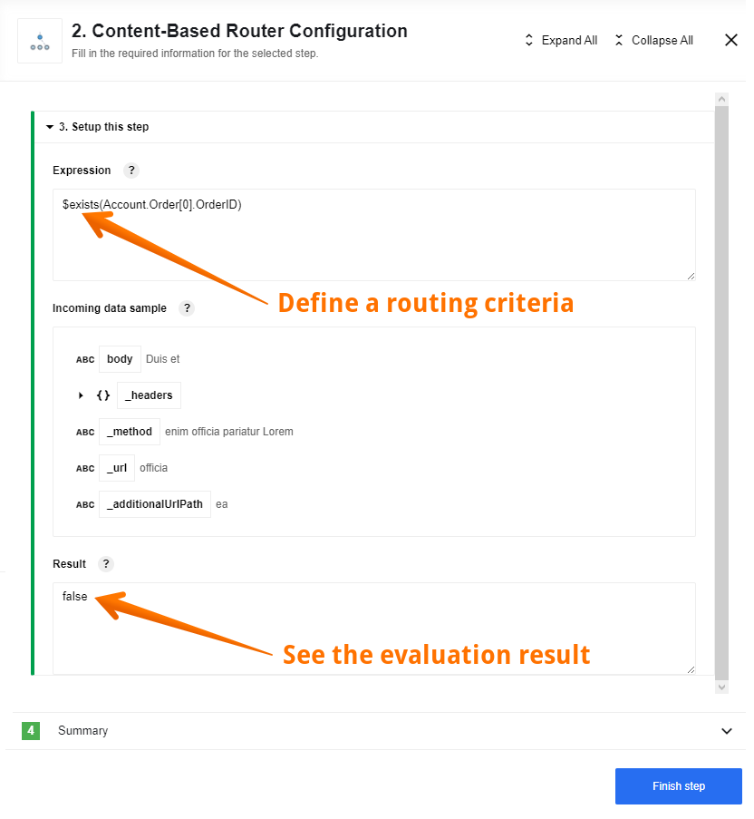

This component implements the [Content-Based Router](http://www.enterpriseintegrationpatterns.com/patterns/messaging/ContentBasedRouter.html) pattern from Enterprise Integration Patterns (EIP).

## Triggers

This component has no trigger functions. This means it will not be accessible to
select as a first component during the integration flow design.

## Actions

### Route

This action is responsible for performing the only function of the component, which is described in the header. Here is how to use Route action:

First you have to define a new flow branch,

then you have to define a routing criteria

and setup your next steps:

For a better understanding of how the component is used in flows, we recommend that you look at the example of using the component router, which you can find in [this article](router-usage-example).

If you want to know more of how the routing mechanism works, please read [this article](/guides/content-based-router).

If you are interested in the details of how a component works under the hood, you can read[ this article](router-inside).

## Environment Variables

> Please Note: From the platform version [20.51](/releases/20/51) we deprecated the
> component `LOG_LEVEL` environment variable. Now you can control logging level per each step of the flow.
