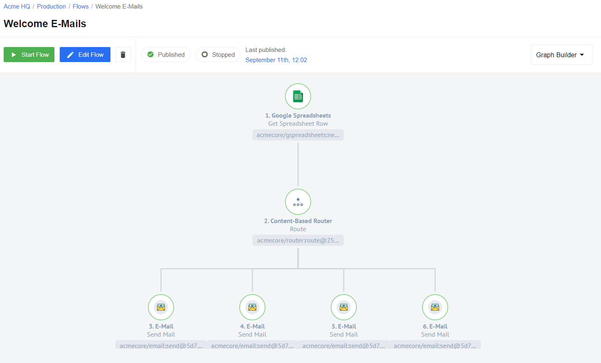
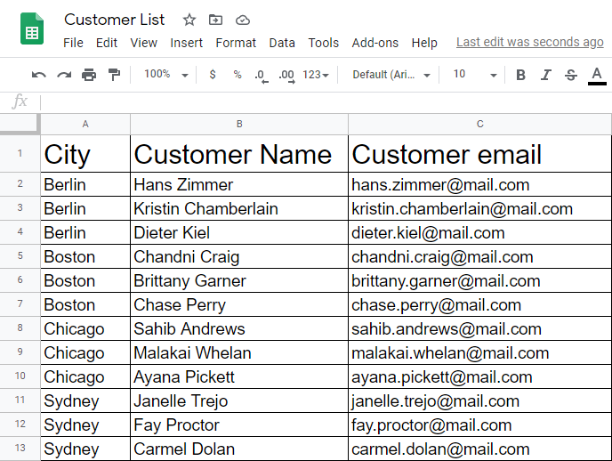
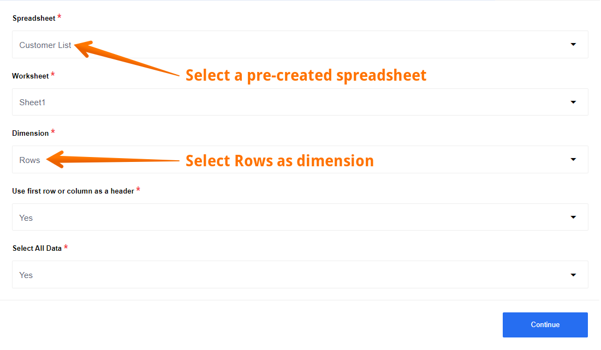
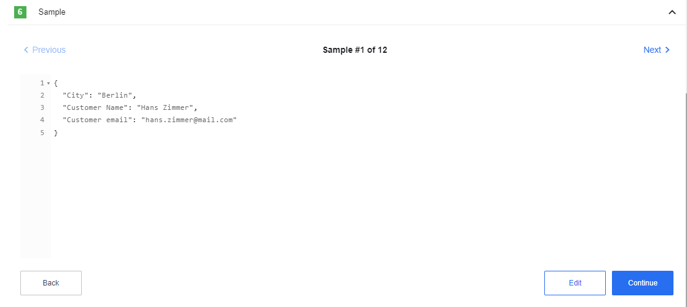
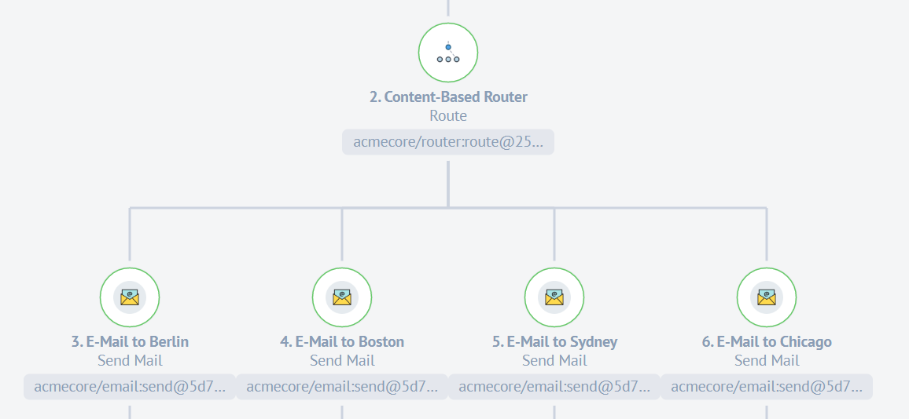
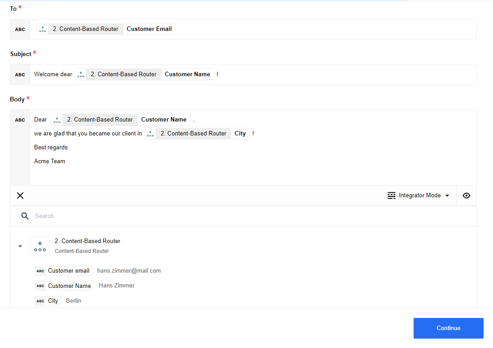

## Introduction

In the vast majority of cases, the Router component is used to sort and distribute data.
You can separate data streams according to different criteria, which will allow you to create a tree structure in your flow.
We can say that in most situations it is impossible to build complex flows without using this extremely simple, but very usefull component.

In this article, we will show you a simple and typical example of using a Router component.
However, in more complex flows, the functionality of the Router component does not change - only the number of branches and routing floors will change.

In our case, we are using tables as a small database containing customer data for a small company. We will be using the [Google Spreadsheet](/components/gspreadsheet/) component as the trigger and source of information for our flow. The flow itself performs the simplest function - it sends a e-mail to a new client from different cities.
It is at the moment where we decide which city to send the e-mail to that we will use the Router component.
With it, we will simply create several different branches to determine which city we send the information we need to.

## Flow example

In this example, we want to send welcome emails to new customers in different cities. To accomplish the task, we created this flow:

As mentioned earlier, our source of information is the Google spreadsheet. It contains three parameters - city name, customer name and his email:

First, use a Google Spreadsheets component **"Get Spreadsheet Row"** function that will allow you to use the information from the pre-created spreadsheet you saw above. Use a row as a dimension and first row as a header.

Here you can see a Sample. All the data we need - city, customer name and customer email - we received and divided into 12 separate Samples.

After that use a [Router component](/components/router/index) to sort the data by city. Create 4 different branches, in each of which select a criteria for routing. In our case, this is the name of the city: Berlin, Chicago, Sydney and Boston:

As you can see in the screenshot, if the expression is correct for a specific message, the city is really Berlin for example, then our result will be **true**. In this case, **3. branch** will be selected and we will send the data further along this path to the next component.

Here you can see 4 brunches, each of which sends a welcome email to customers in different cities:

The last step is to configure the [E-mail component](/components/email). We are welcoming a new client in one of 4 cities. Thanks to the Router component, each client will receive a message in accordance with their city:

