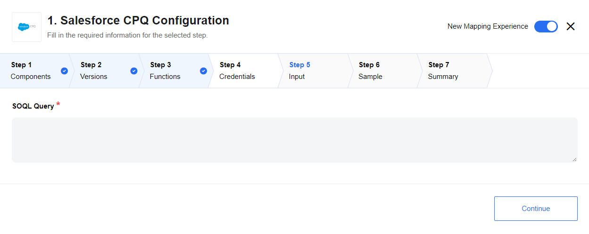
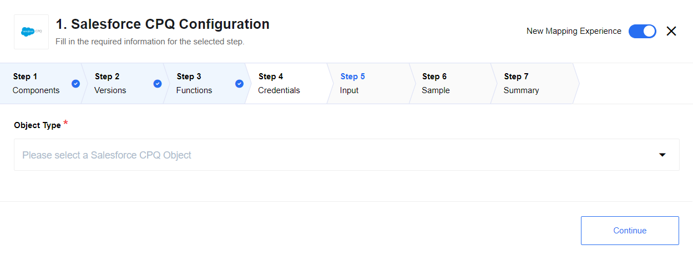
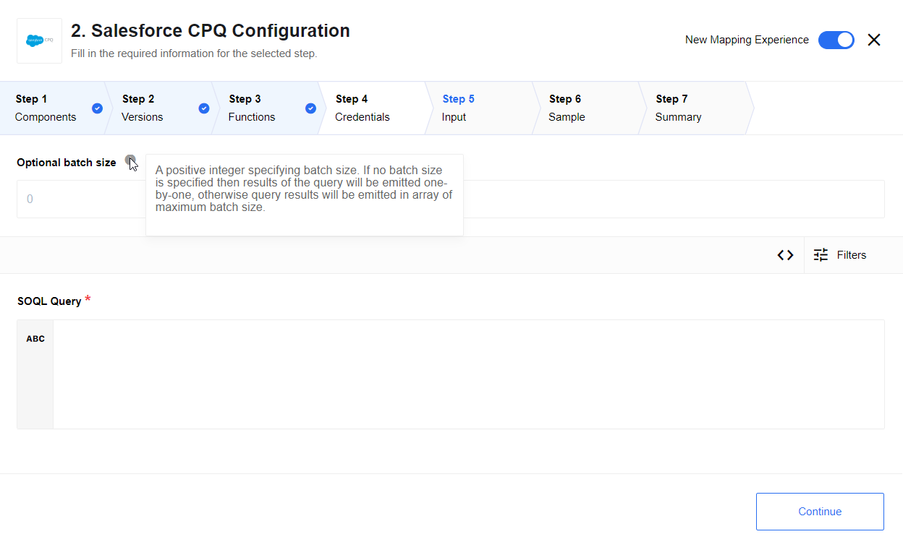
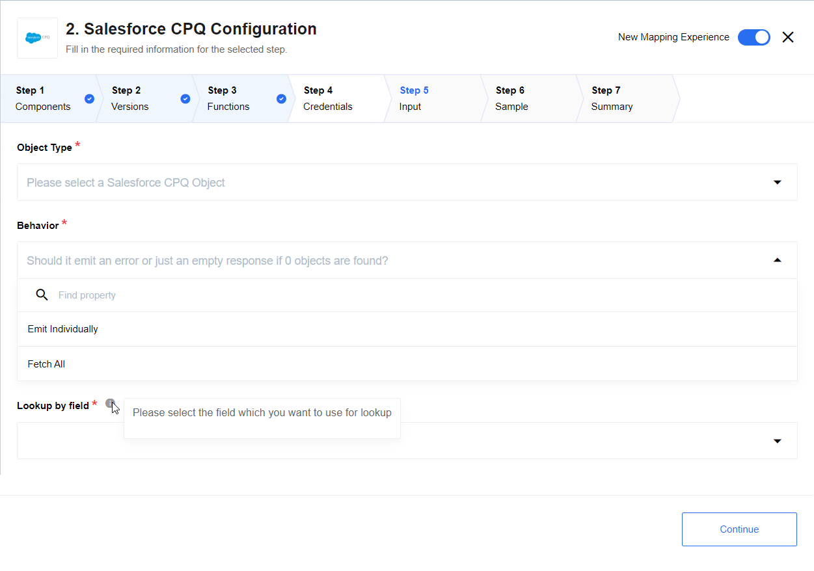
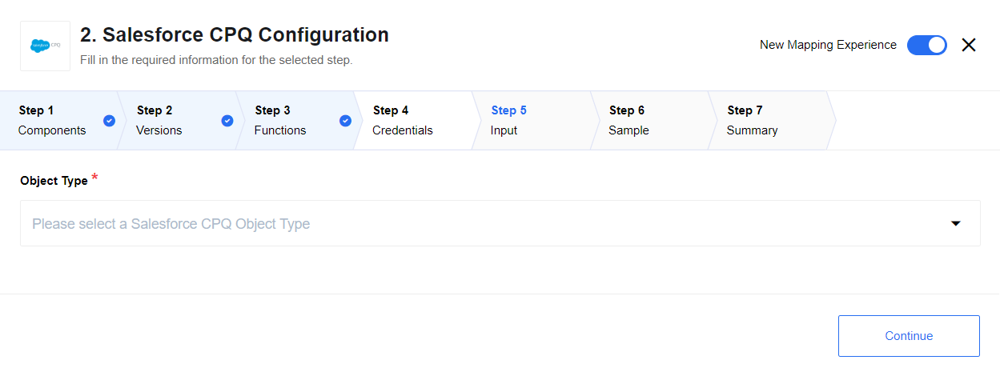
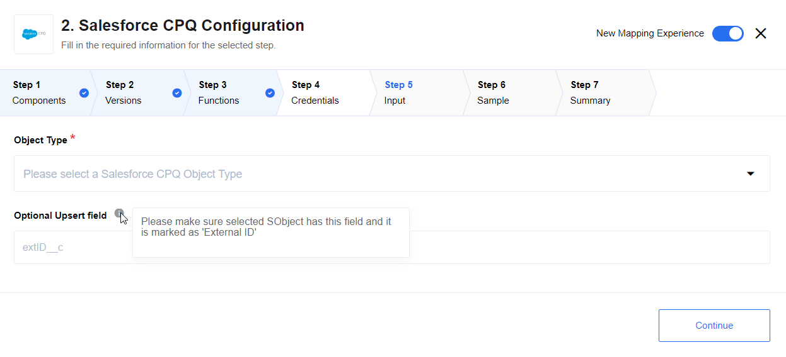

## Component Deprecated

Component got deprecated. Please use [Salesforce component](/components/salesforce/index) instead.

## Description

The component gives sales teams and channel partners the necessary tools to quickly configure, price and quote complex solutions.
Automate discounts, pricing, and approvals to maximize revenue and margins.

### How works.  API version / SDK version

The component uses [JSForce library](https://jsforce.github.io/) under the hood
to work with Salesforce objects (both native Salesforce and custom CPQ objects).

[Salesforce Spring ’17](https://releasenotes.docs.salesforce.com/en-us/spring17/release-notes/salesforce_release_notes.htm) API version is tested and fully compatible. More recent versions should also work fine.

## Requirements

### Environment variables

Authentication occurs via OAuth 2.0.
In the component repository you need to specify OAuth Client credentials as environment variables:

*   `SALESFORCE_KEY` - your OAuth client key
*   `SALESFORCE_SECRET` - your OAuth client secret

### Create a new App in Salesforce

In order to make OAuth work, you need a new App in your Salesforce. During app creation process you will be asked to specify
the callback URL, to process OAuth authentication via elastic.io platform your callback URL should be

### Credentials

#### Environment

Choose one of 2 available options:
*   Production
*   Sandbox

And click **Authenticate**. Then in the modal window, which should appear, input
your Salesforce credentials and grant access for the component.

## Triggers

### SOQL Query

Will continuously run the same SOQL Query and emit results one-by-one. You can
use the **Object** input field to type an SOQL query like `"SELECT ID, Name from Contact where Name like 'John Smi%'"`.

### Get New and Updated Objects Polling

Will poll for existing and updated objects where you can select any custom or
build-in object for your Salesforce CPQ instance. Use the **Object** input
field to select the type of object from which you need to get updates, like `Account`.

## Actions

Each action creates a single object. Input metadata is fetched dynamically from
your Salesforce account. Output metadata is the same as input metadata, so you
may expect all fields that you mapped as input to be returned as output.

### SOQL Query

Use the Salesforce Object Query Language (SOQL) to search your organization’s
Salesforce data for specific information. SOQL is similar to the `SELECT`
statement in the widely used Structured Query Language (`SQL`) but is designed
specifically for Salesforce data. This action allows you to interact with your
data using the SOQL.

Here are the input fields and the descriptions for them:

*   **Optional batch size** - A positive integer specifying batch size. If no batch size is specified then results of the query will be emitted one-by-one, otherwise query results will be emitted in array of maximum batch size.
*   **Allow all results to be returned in a set** - checkbox which allows to emit query results in single array. `Optional batch size` option is ignored in this case.
*   **SOQL Query** - Input field where you should type the SOQL query. E.g. `"SELECT ID, Name from Contact where Name like 'John Smi%'"`

### Lookup object

Use the Lookup object action to search your organization’s Salesforce data for a
specific information. Here are the input fields and the descriptions for them:

*   **Object Type** - Input field where you should choose the object type, which you want to find. E.g. `Account`
*   **Allow zero results** - If set to `Yes` and the result of the search equals yo 0 objects, then en empty object will be emitted. An error will be thrown otherwise.
*   **Lookup by field** - Input field where you should choose the lookup field which you want to use for result filtering. E.g. `Id`.
*   **Optional batch size** - A positive integer specifying batch size. If no batch size is specified then results of the query will be emitted one-by-one, otherwise query results will be emitted in array of maximum batch size.

> For now, you can specify all unique, lookup, externalId/Id fields.

##### Execution result handling

| Condition | Execution result |
|---------- |------------------|
| Lookup failed - we were not able to find any parent object. | Lookup action emits a single message with empty body if `Allow zero results` is set to `Yes` or an error otherwise. |
| Lookup found a single object, e.g. we were able to identify an parent Account to the Contact | A single message will be emitted, found object will be a body of the message |
| Lookup found multiple objects (that may happen when lookup is made by non-unique field) | Each found object will be emitted with the separate message |

### Delete Object

Delete a record or records by ID.

#### Input field description

* **Object** - Input field where you should choose the object type, which you want to find. E.g. `Account`. Only Salesforce CPQ custom objects (which start with `SBQQ__` prefix) are retrieved here.

### Upsert object by ID

Use the Upsert object action create a new object if it does not exist or update
an existing one if it exists. Here are the input fields and the descriptions for them:

*   **Object** - Input field where you should choose the object type, which you want to find. E.g. `Account`
*   **Optional Upsert field** - Input field where you should specify the external Id name field. E.g. `ExtId__c`.

You should specify **external** or **internal Id** for making some updates in
Salesforce object. If you want to create new Object you should always specify
**Optional Upsert field** and value of external Id in input body structure.

## Known limitations

Some CPQ-specific functionality is not at the moment supported. All the CPQ-specific
objects are available for lookup, edit, create, but some CPQ API
(full list can be found [here](https://developer.salesforce.com/docs/atlas.en-us.cpq_dev_api.meta/cpq_dev_api/cpq_api_models.htm)) is still a functionality to be added.

## Related links

[Get Started with Salesforce CPQ API](https://developer.salesforce.com/docs/atlas.en-us.cpq_dev_api.meta/cpq_dev_api/cpq_api_get_started.htm)
