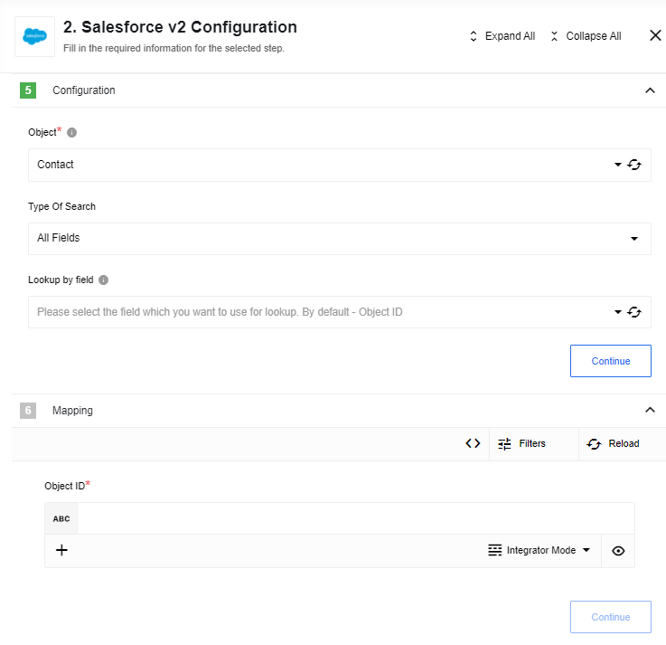
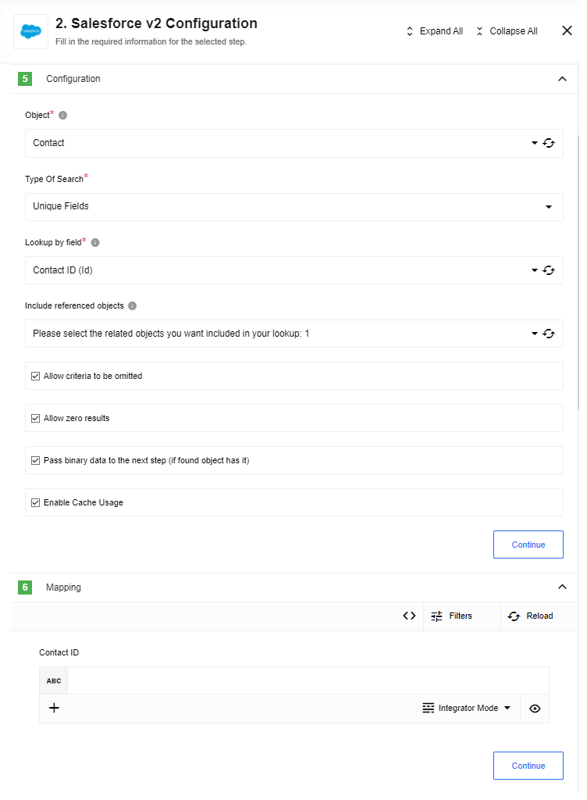
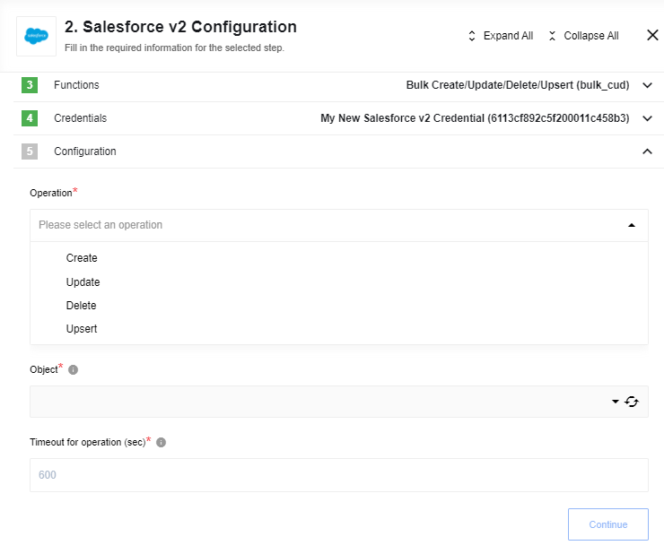
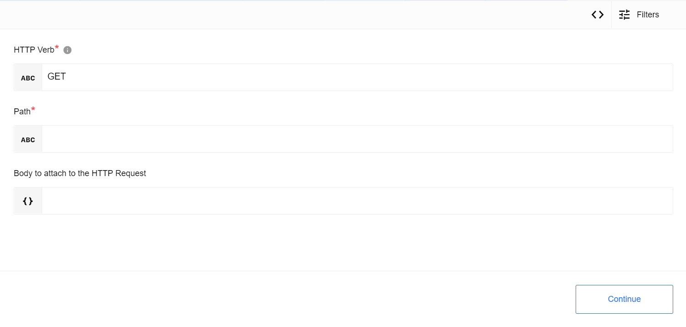

## Query action

Executing a SOQL Query that may return many objects. Each resulting object is emitted one-by-one. Use the Salesforce Object Query Language (SOQL) to search your organization’s Salesforce data for specific information. SOQL is similar to the SELECT statement in the widely used Structured Query Language (SQL) but is designed specifically for Salesforce data. This action allows you to interact with your data using SOQL.
Empty object will be returned, if query doesn't find any data.

### Input fields description

* **Include deleted** - checkbox, if checked - deleted records will be included into the result list.

### Input fields description

* **Optional batch size** - A positive integer specifying batch size. If no batch size is specified then results of the query will be emitted one-by-one, otherwise, query results will be emitted in an array of maximum batch size.
* **Allow all results to be returned in a set** - checkbox which allows emitting query results in a single array. `Optional batch size` option is ignored in this case.
* **SOQL Query** - Input field where you should type the SOQL query. E.g. `"SELECT ID, Name from Contact where Name like 'John Smi%'"`
* **Max Fetch Count** - limit for a number of messages that can be fetched. 1,000 is the default value when the variable is not set.

## Create Object action

Creates a new Selected Object.
Action creates a single object. Input metadata is fetched dynamically from your Salesforce account. Output metadata is the same as input metadata, so you may expect all fields that you mapped as input to be returned as output.

> **Please Note**:
In case of an **Attachment** object type you should specify `Body` in base64 encoding. `ParentId` is a Salesforce ID of an object (Account, Lead, Contact) which an attachment is going to be attached to.

### Input fields description

* **Object** - Input field where you should choose the object type, which you want to find. E.g. `Account`

* **Utilize data attachment from previous step (for objects with a binary field)** - a checkbox, if it is checked and an input message contains an attachment and specified object has a binary field (type of base64) then the input data is put into object's binary field. In this case any data specified for the binary field in the data mapper is discarded.

This action will automatically retrieve all existing fields of chosen object type that available on your Salesforce organization

### Limitations

When **Utilize data attachment from previous step (for objects with a binary field)** is checked and this action is used with Local Agent error would be thrown: 'getaddrinfo ENOTFOUND steward-service.platform.svc.cluster.local steward-service.platform.svc.cluster.local:8200'

## Delete Object action (at most 1)

Deletes an object by a selected field. One can filter by either unique fields or all fields of that sobject. Input metadata is fetched dynamically from your Salesforce account.

### Input field description

* **Object** - dropdown list where you should choose the object type, which you want to find. E.g. `Account`.

* **Type Of Search** -  dropdown list with two values: `Unique Fields` and `All Fields`.

* **Lookup by field** - dropdown list with all fields on the selected object, if on *Type Of Search* is chosen `All Fields`, or with all fields on the selected object where `type` is `id` or `unique` is `true` , if on *Type Of Search* is chosen `Unique Fields` then all searchable fields both custom and standard will be available for selection.

* **id** - `string`, salesforce object id

* **success** - `boolean`, if operation was successful `true`

* **errors** - `array`, if operation fails, it will contain description of errors

### Metadata description

Metadata for each particular `Object type` + `Lookup by field` is generating dynamically.

## Upsert Object action

Creates or Updates Selected Object.
Action creates a single object. Input metadata is fetched dynamically from your Salesforce account. Output metadata is the same as input metadata, so you may expect all fields that you mapped as input to be returned as output.

### Input field description

* **Object** - Input field where you should choose the object type, which you want to find. E.g. `Account`
* **Type Of Search** - Dropdown list with values: `Unique Fields`, `All Fields` and `External IDs`
  * `All Fields` - all available fields in the object
  * `Unique Fields` - fields where `type` is `id` or `unique` is `true`
  * `External IDs` - fields where `externalId` is `true`, this option uses built-in salesforce method [upsert](https://developer.salesforce.com/docs/atlas.en-us.api.meta/api/sforce_api_calls_upsert.htm).

   It works as following:
   * If there is no value in the lookup field - a new object will be created
   * If a lookup value is specified and `External IDs` selected as a Type Of Search - it is the most efficient (fast) way to go. In this case an object will be upserted directly on the Salesforce side. When this field has an attribute `Unique` it would guarantee that no errors are emitted.
   * If a lookup value is specified and one of `Unique Fields` or `All Fields` selected - then an action will first lookup for an existing object in Salesforce:
      * If no objects found - a new one will be created
      * If 1 object found - it will be updated
      * If more than 1 object found - ar error `Found more than 1 Object` will be thrown
* **Lookup by field** - Dropdown list with fields on the selected object, depending on the *Type Of Search*

#### Expected input metadata

* lookup by - *name of filed selected in 'Lookup by field'*
* other fields, that used by selected **Object**

#### Expected output metadata

The result of creating or updating an object

* **id** - Unic identificator from salesforce
* **success** - Boolean result of creation/update object
* **errors** - Arrey of errors if they exist

### Limitations

When **Utilize data attachment from previous step (for objects with a binary field)** is checked and this action is used with Local Agent error would be thrown: 'getaddrinfo ENOTFOUND steward-service.platform.svc.cluster.local steward-service.platform.svc.cluster.local:8200'

## Lookup Object action (at most 1)

Lookup an object by a selected field.
Action creates a single object. Input metadata is fetched dynamically from your Salesforce account. Output metadata is the same as input metadata, so you may expect all fields that you mapped as input to be returned as output.

### Input field description

* **Object** - Dropdown list displaying all searchable object types. Select one type to query, e.g. `Account`.

* **Type Of Search** - Dropdown list with two values: `Unique Fields` and `All Fields`.

* **Lookup by field** - Dropdown list with all fields on the selected object if the *Type Of Search* is `All Fields`. If the *Type Of Search* is `Unique Fields`, the dropdown lists instead all fields on the selected object where `type` is `id` or `unique` is `true`.

* **Include linked objects** - Multiselect dropdown list with all the related child and parent objects of the selected object type. List entries are given as `Object Name/Reference To (Relationship Name)`. Select one or more related objects, which will be join queried and included in the response from your Salesforce Organization. Please see the **Limitations** section below for use case advisories.

* **Allow zero results** - Checkbox. If checked and nothing is found in your Salesforce Organization, an empty object will be returned. If not checked and nothing is found, the action will throw an error.

* **Pass binary data to the next component (if found object has it)** - Checkbox. If it is checked and the found object record has a binary field (primitive type `base64`), then its data will be passed to the next component as a binary attachment.

### Metadata description

Metadata contains one field whose name, type and mandatoriness are generated according to the value of the configuration fields *Lookup by field* and *Allow criteria to be omitted*.

### Limitations

When **Pass binary data to the next component (if found object has it)** is checked and this action is used with Local Agent error would be thrown: 'getaddrinfo ENOTFOUND steward-service.platform.svc.cluster.local steward-service.platform.svc.cluster.local:8200'

> **Please Note**:
Action has caching mechanism. By default action stores last 10 request-response pairs for 10 min duration.
This parameters can be changed by setting environment variables:

* **HASH_LIMIT_TIME** - Hash expiration time in milis
* **HASH_LIMIT_ELEMENTS** - Hash size number limit

## Lookup Objects action

Lookup a list of objects satisfying specified criteria.

### Input field description

* **Object** - dropdown list where you should choose the object type, which you want to find. E.g. `Account`.

* **Include deleted** - checkbox, if checked - deleted records will be included into the result list.

* **Output method** - dropdown list with following values: "Emit all", "Emit page", "Emit individually".

* **Number of search terms** - text field to specify a number of search terms (positive integer number [1-99] or 0).

* **Enable Cache Usage** - Flag to enable cache usage.

* **Max Fetch Count** - limit for a number of messages that can be fetched. 1,000 is the default value when the variable is not set.

> **Please Note**:
Action has caching mechanism. By default action stores last 10 request-response pairs for 10 min duration.
This parameters can be changed by setting environment variables:

* **HASH_LIMIT_TIME** - Hash expiration time in milis
* **HASH_LIMIT_ELEMENTS** - Hash size number limit

### Metadata description

Depending on the the configuration field *Output method* the input metadata can contain different fields:

*Output method* - "Emit page":

Field "Page size" - optional positive integer that defaults to 1000;
Field "Page number" - required non-negative integer (starts with 0, default value 0);

*Output method* - "Emit all":

Field "Maximum number of records" - optional positive integer (default value 1000);

*Output method* - "Emit individually":

Field "Maximum number of records" - optional positive integer (default value 10000);

Note that the number of records the component emits may affect the performance of the platform/component.

Groups of fields for each search term go next:

Field "Field name" - string represents object's field (a list of allowed values is available);
Field "Field value" - string represents value for selected field;
Field "Condition" - one of the following: "=", "!=", "<", "<=", ">", ">=", "LIKE", "IN", "NOT IN";

Between each two term's group of fields:

Field "Logical operator" - one of the following: "AND", "OR";

Output data is an object, with a field "results" that is an array of objects.

### Known limitations

If `Output method` set to `Emit page` maximum "Page number" must be less or equal to "Page size"/2000

## Bulk Create/Update/Delete/Upsert action

Bulk API provides a simple interface for quickly loading large amounts of data from CSV file into Salesforce (up to 10'000 records).

Action takes a CSV file from the attachment as an input. CSV file format is described in the [Salesforce documentation](https://developer.salesforce.com/docs/atlas.en-us.api_bulk_v2.meta/api_bulk_v2/datafiles.htm)

### Input field description

* **Operation** - dropdown list with 3 supported operations: `Create`, `Update` and `Delete`.

* **Object** - dropdown list where you should choose the object type to perform bulk operation. E.g. `Case`.

* **Timeout** - maximum time to wait until the server completes a bulk operation (default: `600` sec).

Result is an object with a property **result**: `array`. It contains objects with 3 fields.

* **id** - `string`, salesforce object id

* **success** - `boolean`, if operation was successful `true`

* **errors** - `array`, if operation failed contains description of errors

### Metadata description

* **External ID Field** - a name of the External ID field for `Upsert` operation. E.g. `my_external_id__c`

### Limitations

* No errors thrown in case of failed Object Create/Update/Delete/Upsert (`"success": "false"`).
* External ID is needed for Upsert.
* Object ID is needed for Update and Delete.
* Salesforce processes up to 10'000 records from the input CSV file.

## Bulk Query action

Fetches records to a CSV file.

### Input field description

* **SOQL Query** - Input field where you should type the SOQL query. E.g. `"SELECT ID, Name from Contact where Name like 'John Smi%'"`

Result is a CSV file in the attachment.

## Raw Request

### Input Metadata

* HTTP Verb - Allowed values GET, POST, PUT, PATCH, DELETE, HEAD, Required. HTTP verb to use in the request.
* Path - String, Required. Path to make request to (without `/services/data/v{SALESFORCE_API_VERSION}`, e.g. to list sobjects - type here not `https://{INSTANCE_NAME}.salesforce.com/services/data/v{SALESFORCE_API_VERSION}/sobjects` but just type `sobjects` instead)
* Request Body - Object, Optional. Body to attach to the HTTP Request

### Output Metadata

* Response Object (Object, optional): HTTP response body

### Resources List

* More information about available resources you can find [here](https://developer.salesforce.com/docs/atlas.en-us.api_rest.meta/api_rest/resources_list.htm)

### Request Examples

* Examples of using REST API resources can be found [here](https://developer.salesforce.com/docs/atlas.en-us.api_rest.meta/api_rest/dome_user_tasks.htm)

### Known limitations

For the methods PUT and HEAD you need to specify the whole path (e.g. `services/OpportunityLineItem/00kR0000001WJJAIA4/OpportunityLineItemSchedules`) which have conflicts with `/services/data/v{SALESFORCE_API_VERSION}/{RESOURCE}` path, so Raw Request does not work for these two methods (PUT and HEAD) just for now.
