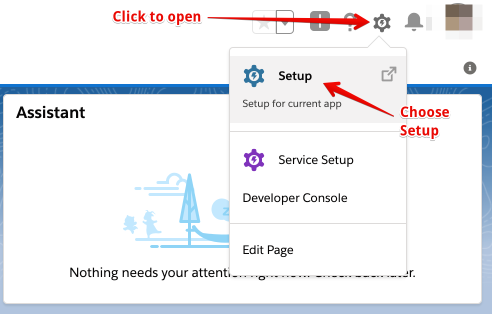
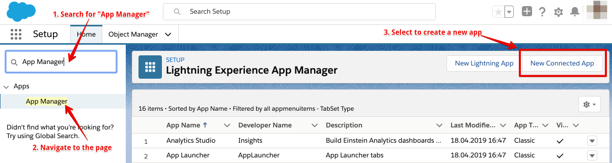
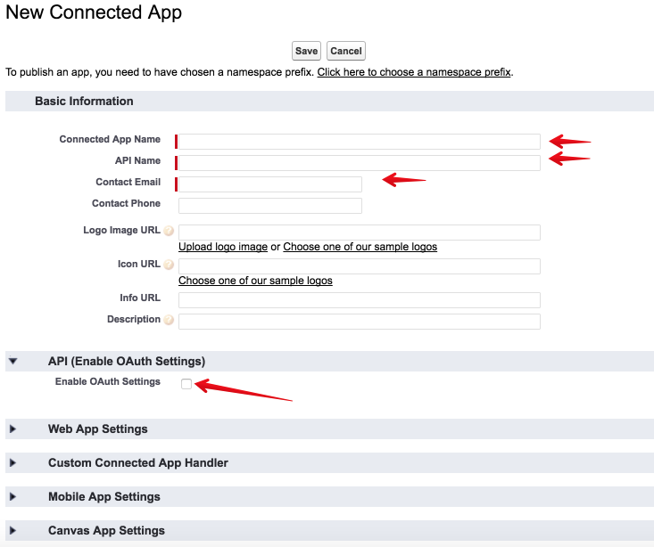
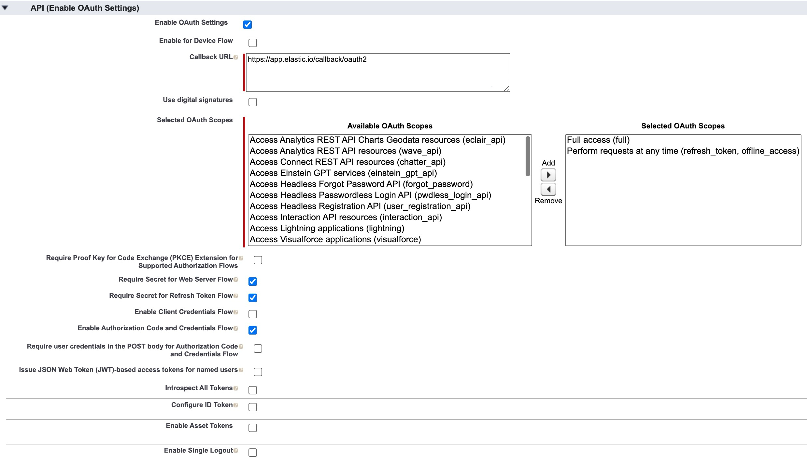
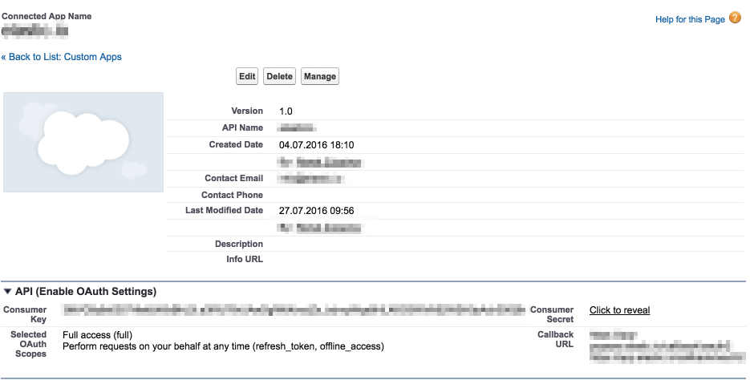

## Purpose

> When you deploy the Salesforce component separately into a dedicated tenant or
> into your developer team it can not use the OAuth App specifically created for
> our main {{site.data.tenant.name}} tenant. For this purposes you must create a
> different OAuth App and add the required environment variables to the component setup.

Salesforce [documentation page](https://help.salesforce.com/articleView?id=connected_app_create.htm&type=5)
gives all specific details and explanation on how to create any app. We will go
through the necessary steps to show where to locate those setup options.

## Create new OAuth App

To start you need to navigate to the Setup section. Please log-in to your account
and select the Setup menu.

Next on the left-side menu use the **Quick Find** and search for `App Manager`,
click to navigate to the page, and press on `New Connected App` to start.

It will open a new page which should look like this:

Fill-in the required details for **Connected App Name**, **API Name** and
**Contact Email** and also select the check-box called **Enable OAuth Settings**
at **API (Enable OAuth Settings)** section. After enabling this check-box it will
extend into the following setup:

*  **Callback URL** - put the correct URL which should of the `https://your-tenant-address/callback/oauth2` form.
*  **Selected Oauth Scopes** - The Salesforce documentation explains [API (Enable OAuth Settings)](https://help.salesforce.com/articleView?id=connected_app_create.htm&type=5) part requirements. In particular, a special care must be taken to select at least these two settings:
   *   **Full access (full)** - which allows access to all data accessible by the logged-in user, and encompasses all other scopes. This option, however, doesn't return a `refresh_token`. For that purposes you need to explicitly request the `refresh_token` scope to get one.
   *   **Perform requests on your behalf at any time (refresh_token, offline_access)** - This option would allows a `refresh_token` to be returned if you are eligible to receive one. This lets the app interact with the user's data while the user is offline. **The `refresh_token` scope is synonymous with offline_access**.

Press save to create your OAuth App.

## After creating the OAuth App

After creating the OAuth App Salesforce would show you a screen containing all
the necessary details of your newly created OAuth App.

From this setup you would need to copy the **Consumer Key** and the **Consumer Secret**
for use in your custom installation of Salesforce component.

> These two keys would need to be defined as Environment Variables for your
> custom deployed component.

Here is where those two keys fit into the picture. After the deployment, your
repository looks like this.

Click **You can configure environment variables here** link to configure variables
for this specific component.

You would need to create two variables here:

*   `OAUTH_CLIENT_ID` - your OAuth client key, meaning the **Consumer Key**.
*   `OAUTH_CLIENT_SECRET` - your OAuth client secret, meaning the **Consumer Secret**.

> **Note**: We renamed the environment variables `SALESFORCE_KEY` and `SALESFORCE_SECRET` to standardize the OAuth workflow.
