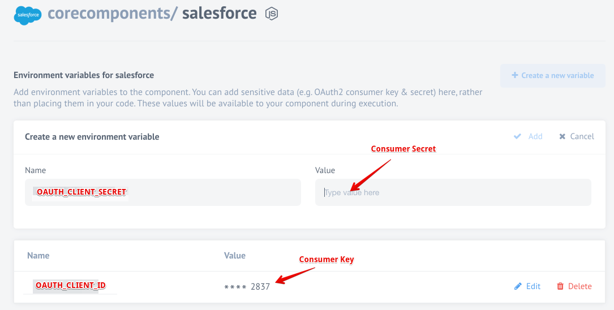

## Deprecated authentication method

### Credentials

During credentials creation you would need to:

*   Choose `Environment`

*   Enter ``Username`` and ``Password`` in a pop-up window after click on ``Authenticate`` button.

*   Verify and save your new credentials.

> **Note**: When you deploy the Salesforce component separately into a dedicated tenant or
> into your developer team it can not use the OAuth App specifically created for
> our main {{site.data.tenant.name}} tenant. For this purposes you must create a
> different OAuth App and add the required environment variables to the component setup.

### Authentication

Authentication occurs via OAuth 2.0.

In the component repository you need to specify OAuth Client credentials as environment variables:

- ```OAUTH_CLIENT_ID``` - your OAuth client key

- ```OAUTH_CLIENT_SECRET``` - your OAuth client secret

> **Note**: We renamed the environment variables `SALESFORCE_KEY` and `SALESFORCE_SECRET` to standardize the OAuth workflow.
To get these values you can check the
[creating OAuth App for Salesforce](creating-oauth-app-for-salesforce) article.

### Auth client creation

Here is where those two keys fit into the picture. After the deployment, your
repository looks like this.


Click **You can configure environment variables here** link to configure variables
for this specific component.



You would need to create two variables here:

*   `OAUTH_CLIENT_ID` - your OAuth client key, meaning the **Consumer Key**.
*   `OAUTH_CLIENT_SECRET` - your OAuth client secret, meaning the **Consumer Secret**.

> **Please Note**: We renamed the environment variables `SALESFORCE_KEY` and `SALESFORCE_SECRET` to standardize the OAuth workflow.

## Deprecated Triggers

### New Case trigger(deprecated)

Polls existing and updated Cases (fetches a maximum of 1000 objects per execution)

Trigger is `deprecated`. You can use [Get Updated Objects Polling](triggers#get-updated-objects-polling) trigger instead.

### New Lead trigger(deprecated)

Polls existing and updated Leads (fetches a maximum of 1000 objects per execution)

Trigger is `deprecated`. You can use [Get Updated Objects Polling](triggers#get-updated-objects-polling) trigger instead.

### New Contact trigger(deprecated)

Polls existing and updated Contacts (fetches a maximum of 1000 objects per execution)

Trigger is `deprecated`. You can use [Get Updated Objects Polling](triggers#get-updated-objects-polling) trigger instead.

### New Account trigger(deprecated)

Polls existing and updated Accounts (fetches a maximum of 1000 objects per execution)

Trigger is `deprecated`. You can use [Get Updated Objects Polling](triggers#get-updated-objects-polling) trigger instead.

### New Task trigger(deprecated)

Polls existing and updated Tasks (fetches a maximum of 1000 objects per execution)

Trigger is `deprecated`. You can use [Get Updated Objects Polling](triggers#get-updated-objects-polling) trigger instead.

## Get New and Updated Objects Polling trigger(Deprecated)

Polls existing and updated objects. You can select any custom or built-in object for your Salesforce instance.

This trigger is `deprecated`. Please use [Get Updated Objects Polling](triggers#get-updated-objects-polling)trigger instead.


## Deprecated Actions

### Lookup Object action(deprecated)

Lookup an object by a selected field.

Action creates a single object. Input metadata is fetched dynamically from your Salesforce account. Output metadata is the same as input metadata, so you may expect all fields that you mapped as input to be returned as output.

#### Input field description

* **Optional batch size** - A positive integer specifying batch size. If no batch size is specified then results of the query will be emitted one-by-one, otherwise, query results will be emitted in an array of maximum batch size.
* **Object** - Input field where you should choose the object type, which you want to find. E.g. `Account`
* **Lookup field** - Input field where you should choose the lookup field which you want to use for result filtering. E.g. `Id`.
* **Max Fetch Count** - limit for a number of messages that can be fetched. 1,000 is the default value when the variable is not set.

`For now, you can specify all unique, lookup, ExternalID/Id fields.`

#### Execution result handling

|Condition | Execution result |
|----------|------------------|
|Lookup failed - we were not able to find any parent object. |Lookup action emits a single message with an empty body.|
|Lookup found a single object, e.g. we were able to identify a parent Account to the Contact|A single message will be emitted, found object will be a body of the message|
|Lookup found multiple objects (that may happen when a lookup is made by non-unique field) | Each found object will be emitted with the separate message|

Action is `deprecated`. You can use [Lookup Object action](actions#lookup-objects-action) or [Lookup Object action (at most 1)](actions#lookup-object-action-at-most-1) instead.

### New Account action(deprecated)

Creates a new Account.
Action creates a single object. Input metadata is fetched dynamically from your Salesforce account. Output metadata is the same as input metadata, so you may expect all fields that you mapped as input to be returned as output.

#### Input fields description

This action will automatically retrieve all existing fields of `Account` object type that available on your Salesforce organization.

Action is `deprecated`. You can use [Create Object action](actions#create-object-action) instead.

### New Case action(deprecated)

Creates a new Case.

Action creates a single object. Input metadata is fetched dynamically from your Salesforce account. Output metadata is the same as input metadata, so you may expect all fields that you mapped as input to be returned as output.

#### Input fields description

This action will automatically retrieve all existing fields of `Case` object type that available on your Salesforce organization

Action is `deprecated`. You can use [Create Object action](actions#create-object-action) instead.

### New Contact action(deprecated)

Creates a new Contact.

Action creates a single object. Input metadata is fetched dynamically from your Salesforce account. Output metadata is the same as input metadata, so you may expect all fields that you mapped as input to be returned as output.

#### Input fields description

This action will automatically retrieve all existing fields of `Contact` object type that available on your Salesforce organization

Action is `deprecated`. You can use [Create Object action](actions#create-object-action) instead.

### New Event action(deprecated)

Creates a new Event.

Action creates a single object. Input metadata is fetched dynamically from your Salesforce account. Output metadata is the same as input metadata, so you may expect all fields that you mapped as input to be returned as output.

#### Input fields description
This action will automatically retrieve all existing fields of `Event` object type that available on your Salesforce organization

Action is `deprecated`. You can use [Create Object action](actions#create-object-action) instead.

### New Lead action(deprecated)

Creates a new Lead.

Action creates a single object. Input metadata is fetched dynamically from your Salesforce account. Output metadata is the same as input metadata, so you may expect all fields that you mapped as input to be returned as output.

#### Input fields description

This action will automatically retrieve all existing fields of `Lead` object type that available on your Salesforce organization

Action is `deprecated`. You can use [Create Object action](actions#create-object-action) instead.

### New Note action(deprecated)

Creates a new Note.

Action creates a single object. Input metadata is fetched dynamically from your Salesforce account. Output metadata is the same as input metadata, so you may expect all fields that you mapped as input to be returned as output.

#### Input fields description

This action will automatically retrieve all existing fields of `Note` object type that available on your Salesforce organization

Action is `deprecated`. You can use [Create Object action](actions#create-object-action) instead.

### New Task action(deprecated)

Creates a new Task.

Action creates a single object. Input metadata is fetched dynamically from your Salesforce account. Output metadata is the same as input metadata, so you may expect all fields that you mapped as input to be returned as output.

#### Input fields description

This action will automatically retrieve all existing fields of `Task` object type that available on your Salesforce organization

Action is `deprecated`. You can use [Create Object action](actions#create-object-action)s instead.
