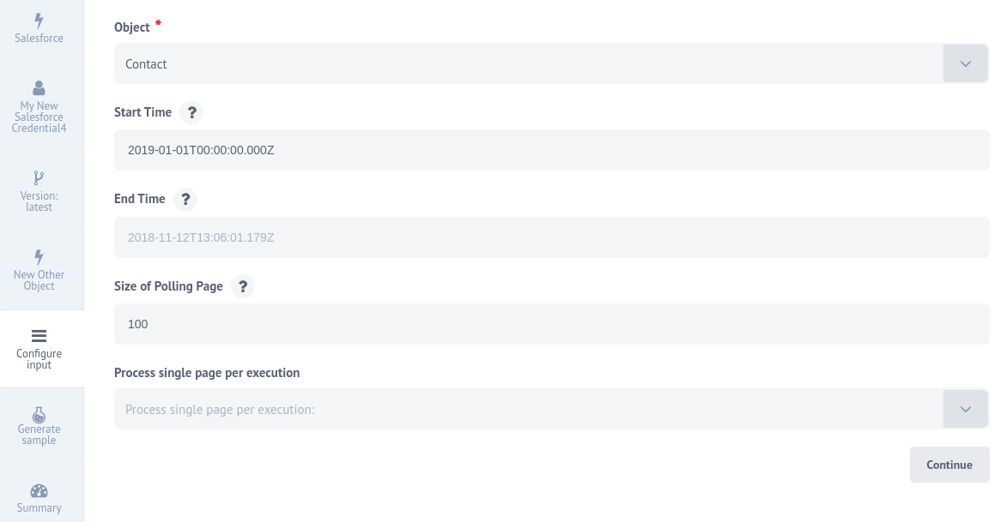
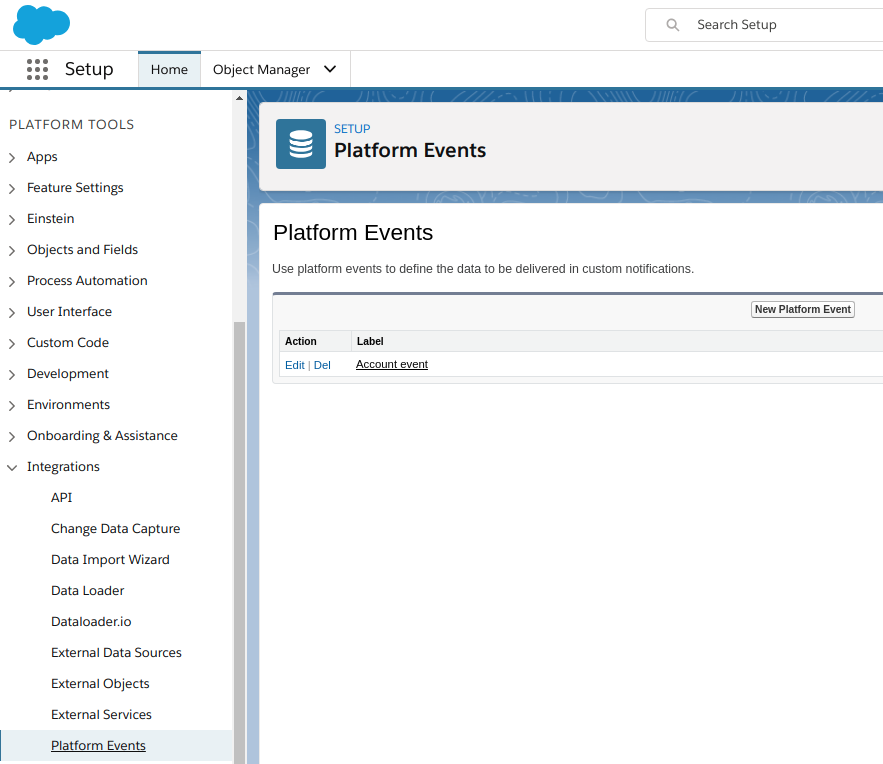

## Latest changelog

**1.2.1 (December 27, 2019)**

* Update sailor version to 2.5.4
* Refactor console.log to built in sailor logger
* Change build type to `docker`

> To see the full **changelog** please use the following [link](/components/salesforce/changelog).

## Description

Integration component to connect the Salesforce for the [{{site.data.tenant.name}} platform](http://www.{{site.data.tenant.name}}).

> **Note**: The component works with the Salesforce API. This means you must
> make sure your Salesforce edition has API Access enabled. To check which editions
> have API access see the [Salesforce editions with API Access](https://help.salesforce.com/articleView?id=000326486&type=1&mode=1) document.
> **If your edition has no API Access by default this component _will not work for you_.**

### API version

The component uses Salesforce - API Version 45.0, except:

-   Deprecated Actions and Triggers - API Version 25.0

### Authentication

Authentication occurs via OAuth 2.0.

In the component repository you need to specify OAuth Client credentials as environment variables:

- ```OAUTH_CLIENT_ID``` - your OAuth client key

- ```OAUTH_CLIENT_SECRET``` - your OAuth client secret

> **Note**: We renamed the environment variables `SALESFORCE_KEY` and `SALESFORCE_SECRET` to standardize the OAuth workflow.

To get these values you can check the
[creating OAuth App for Salesforce](creating-oauth-app-for-salesforce) article.

The [component completeness](completeness-matrix) matrix gives the technical
details about Salesforce objects this component covers.

### Credentials

During credentials creation you would need to:

*   Choose `Environment`

*   Enter ``Username`` and ``Password`` in a pop-up window after click on ``Authenticate`` button.

*   Verify and save your new credentials.

> **Note**: When you deploy the Salesforce component separately into a dedicated tenant or
> into your developer team it can not use the OAuth App specifically created for
> our main {{site.data.tenant.name}} tenant. For this purposes you must create a
> different OAuth App and add the required environment variables to the component setup.

## Triggers

Use this list to navigate to the action you seek.

*   [Query](#query-trigger)
*   [Get New and Updated Objects Polling](#get-new-and-updated-objects-polling)
*   [Subscribe to platform events](#subscribe-to-platform-events)

### Query trigger

Continuously runs the same SOQL Query and emits results one-by-one.
Use the Salesforce Object Query Language (SOQL) to search your organization’s Salesforce data for specific information. SOQL is similar to the SELECT statement in the widely used Structured Query Language (SQL) but is designed specifically for Salesforce data. This action allows you to interact with your data using SOQL.

#### List of Expected Config fields

* **SOQL Query** - Input field for your SOQL Query

### Get New and Updated Objects Polling

Polls existing and updated objects. You can select any custom or built-in object for your Salesforce instance.

#### Input field description

* **Object** - Input field where you should select the type of object which updates you want to get. E.g. `Account`;

* **Start Time** - Indicates the beginning time to start polling from. Defaults to `1970-01-01T00:00:00.000Z`;

* **End Time** - If provided, don’t fetch records modified after this time;

* **Size of Polling Page** - Indicates the size of pages to be fetched. You can set positive integer, max `10 000`, defaults to `1000`;

* **Process single page per execution** - You can select on of options (defaults to `yes`):

   1. `yes` - if the number of changed records exceeds the maximum number of results in a page, wait until the next flow start to fetch the next page;

   2. `no` - if the number of changed records exceeds the maximum number of results in a page, the next pages will fetching in the same execution.

For example, you have 234 “Contact” objects, 213 of them were changed from 2019-01-01.
You want to select all “Contacts” that were changed from 2019-01-01, set the page size to 100 and process single page per execution.

For you purpose you need to specify following fields:

   * Object: `Contact`

   * Start Time: `2019-01-01T00:00:00.000Z`

   * Size of Polling Page: `100`

   * Process single page per execution: `yes` (or leave this empty)



As a result, all contacts will be fetched in three calls of the trigger: two of them by 100 items, and the last one by 13.
If you select `no` in **Process single page per execution**, all 213 contacts will be fetched in one call of the trigger.


### Subscribe to platform events

>**NOTE:** REALTIME FLOWS ONLY

This trigger will subscribe for any platform Event using Salesforce streaming API.

#### Input field description

* **Event object name** - Input field where you should select the type of platform event which you want to subscribe E.g. `My platform event`

#### How to create new custom Platform event Entity:

`Setup --> Integrations --> Platform Events --> New Platform Event`



You can find more detail information in the [Platform Events Intro Documentation](https://developer.salesforce.com/docs/atlas.en-us.platform_events.meta/platform_events/platform_events_intro.htm).

#### Environment Variables

1. `SALESFORCE_API_VERSION` - API version for not deprecated actions and triggers e.g(46.0), default value 45.0

2. `LOG_LEVEL` - `trace` | `debug` | `info` | `warning` | `error` controls logger level

#### Limitations:

At the moment this trigger can be used only for **"Realtime"** flows.


## Deprecated Triggers

Use this list to navigate to the action you seek.

*   [New Case](#new-case-trigger)
*   [New Lead](#new-lead-trigger)
*   [New Contact](#new-contact-trigger)
*   [New Account](#new-account-trigger)
*   [New Task](#new-task-trigger)

### New Case trigger

Polls existing and updated Cases (fetches a maximum of 1000 objects per execution)

Trigger is `deprecated`. You can use [Get New and Updated Objects Polling](#get-new-and-updated-objects-polling) action instead.

### New Lead trigger

Polls existing and updated Leads (fetches a maximum of 1000 objects per execution)

Trigger is `deprecated`. You can use [Get New and Updated Objects Polling](#get-new-and-updated-objects-polling) action instead.

### New Contact trigger

Polls existing and updated Contacts (fetches a maximum of 1000 objects per execution)

Trigger is `deprecated`. You can use [Get New and Updated Objects Polling](#get-new-and-updated-objects-polling) action instead.

### New Account trigger

Polls existing and updated Accounts (fetches a maximum of 1000 objects per execution)

Trigger is `deprecated`. You can use [Get New and Updated Objects Polling](#get-new-and-updated-objects-polling) action instead.

### New Task trigger

Polls existing and updated Tasks (fetches a maximum of 1000 objects per execution)

Trigger is `deprecated`. You can use [Get New and Updated Objects Polling](#get-new-and-updated-objects-polling) action instead.

## Actions

Use this list to navigate to the action you seek.

*   [Query](#query-action)
*   [Create Object](#create-object)
*   [Delete Object](#delete-object)
*   [Upsert Object](#upsert-object)
*   [Lookup Object](#lookup-object-at-most-1)
*   [Lookup Objects](#lookup-objects)
*   [Bulk Create/Update/Delete](#bulk-createupdatedelete)
*   [Bulk Query](#bulk-query)

### Query action

Executing a SOQL Query that may return many objects. Each resulting object is emitted one-by-one. Use the Salesforce Object Query Language (SOQL) to search your organization’s Salesforce data for specific information. SOQL is similar to the SELECT statement in the widely used Structured Query Language (SQL) but is designed specifically for Salesforce data. This action allows you to interact with your data using SOQL.
Empty object will be returned, if query doesn't find any data.

#### Input fields description

* **Include deleted** - checkbox, if checked - deleted records will be included into the result list.

#### Input fields description

* **Optional batch size** - A positive integer specifying batch size. If no batch size is specified then results of the query will be emitted one-by-one, otherwise, query results will be emitted in an array of maximum batch size.
* **Allow all results to be returned in a set** - checkbox which allows emitting query results in a single array. `Optional batch size` option is ignored in this case.
* **SOQL Query** - Input field where you should type the SOQL query. E.g. `"SELECT ID, Name from Contact where Name like 'John Smi%'"`

### Create Object

Creates a new Selected Object.
Action creates a single object. Input metadata is fetched dynamically from your Salesforce account. Output metadata is the same as input metadata, so you may expect all fields that you mapped as input to be returned as output.

> **NOTE**:
In case of an **Attachment** object type you should specify `Body` in base64 encoding. `ParentId` is a Salesforce ID of an object (Account, Lead, Contact) which an attachment is going to be attached to.

#### Input fields description

* **Object** - Input field where you should choose the object type, which you want to find. E.g. `Account`

* **Utilize data attachment from previous step (for objects with a binary field)** - a checkbox, if it is checked and an input message contains an attachment and specified object has a binary field (type of base64) then the input data is put into object's binary field. In this case any data specified for the binary field in the data mapper is discarded.

This action will automatically retrieve all existing fields of chosen object type that available on your Salesforce organization

#### Limitations

When **Utilize data attachment from previous step (for objects with a binary field)** is checked and this action is used with Local Agent error would be thrown: 'getaddrinfo ENOTFOUND steward-service.platform.svc.cluster.local steward-service.platform.svc.cluster.local:8200'

### Delete Object

Deletes a Selected Object.

#### Input field description

* **Object** - Input field where you should choose the object type, which you want to delete. E.g. `Account`

#### Metadata description

* **id** - `string`, salesforce object id

Result is an object with 3 fields.

* **id** - `string`, salesforce object id

* **success** - `boolean`, if operation was successful `true`

* **errors** - `array`, if operation fails, it will contain description of errors

### Upsert Object

Creates or Updates Selected Object.
Action creates a single object. Input metadata is fetched dynamically from your Salesforce account. Output metadata is the same as input metadata, so you may expect all fields that you mapped as input to be returned as output.

#### Input field description

* **Object** - Input field where you should choose the object type, which you want to find. E.g. `Account`
* **Optional Upsert field** - Input field where you should specify the ExternalID name field. E.g. `ExtId__c`.
* **Utilize data attachment from previous step (for objects with a binary field)** - a checkbox, if it is checked and an input message contains an attachment and specified object has a binary field (type of base64) then the input data is put into object's binary field. In this case any data specified for the binary field in the data mapper is discarded.

You should specify **external** or **internal Id** for making some updates in salesforce object.
If you want to create new Object you should always specify **Optional Upsert field** and value of ExternalId in input body structure.

#### Limitations

When **Utilize data attachment from previous step (for objects with a binary field)** is checked and this action is used with Local Agent error would be thrown: 'getaddrinfo ENOTFOUND steward-service.platform.svc.cluster.local steward-service.platform.svc.cluster.local:8200'

### Lookup Object (at most 1)

Lookup an object by a selected field.
Action creates a single object. Input metadata is fetched dynamically from your Salesforce account. Output metadata is the same as input metadata, so you may expect all fields that you mapped as input to be returned as output.

#### Input field description

* **Object** - dropdown list where you should choose the object type, which you want to find. E.g. `Account`.

* **Type Of Search** -  dropdown list with two values: `Unique Fields` and `All Fields`.

* **Lookup by field** - dropdown list with all fields on the selected object, if on *Type Of Search* is chosen `All Fields`, or with all fields on the selected object where `type` is `id` or `unique` is `true` , if on *Type Of Search* is chosen `Unique Fields`.

* **Allow criteria to be omitted** - checkbox, if checked - search criteria can be omitted and the empty object will be returned, else - search criteria are required.

* **Allow zero results** - checkbox, if checked and nothing is found - empty object will be returned, else - action throw an error.

* **Pass binary data to the next component (if found object has it)** - a checkbox, if it is checked and found object has a binary field (type of base64) then its data will be passed to the next component as a binary attachment.

#### Metadata description

Metadata contains one field whose name, type and mandatoriness are generated according to the value of the configuration fields *Lookup by field* and *Allow criteria to be omitted*.

#### Limitations

When **Pass binary data to the next component (if found object has it)** is checked and this action is used with Local Agent error would be thrown: 'getaddrinfo ENOTFOUND steward-service.platform.svc.cluster.local steward-service.platform.svc.cluster.local:8200'

### Lookup Objects

Lookup a list of objects satisfying specified criteria.

#### Input field description

* **Object** - dropdown list where you should choose the object type, which you want to find. E.g. `Account`.

* **Include deleted** - checkbox, if checked - deleted records will be included into the result list.

* **Output method** - dropdown list with following values: "Emit all", "Emit page", "Emit individually".

* **Number of search terms** - text field to specify a number of search terms (positive integer number [1-99] or 0).

#### Metadata description

Depending on the the configuration field *Output method* the input metadata can contain different fields:

*Output method* - "Emit page":

Field "Page size" - optional positive integer that defaults to 1000;
Field "Page number" - required non-negative integer (starts with 0, default value 0);

*Output method* - "Emit all":

Field "Maximum number of records" - optional positive integer (default value 1000);

*Output method* - "Emit individually":

Field "Maximum number of records" - optional positive integer (default value 10000);

Note that the number of records the component emits may affect the performance of the platform/component.

Groups of fields for each search term go next:

Field "Field name" - string represents object's field (a list of allowed values is available);
Field "Field value" - string represents value for selected field;
Field "Condition" - one of the following: "=", "!=", "<", "<=", ">", ">=", "LIKE", "IN", "NOT IN";

Between each two term's group of fields:

Field "Logical operator" - one of the following: "AND", "OR";

Output data is an object, with a field "results" that is an array of objects.

### Bulk Create/Update/Delete

Bulk API provides a simple interface for quickly loading large amounts of data from CSV file into Salesforce (up to 10'000 records).

Action takes a CSV file from the attachment as an input. CSV file format is described in the [Salesforce documentation](https://developer.salesforce.com/docs/atlas.en-us.api_bulk_v2.meta/api_bulk_v2/datafiles.htm)

#### Input field description

* **Operation** - dropdown list with 3 supported operations: `Create`, `Update` and `Delete`.

* **Object** - dropdown list where you should choose the object type to perform bulk operation. E.g. `Case`.

* **Timeout** - maximum time to wait until the server completes a bulk operation (default: `600` sec).


Result is an object with a property **result**: `array`. It contains objects with 3 fields.

* **id** - `string`, salesforce object id

* **success** - `boolean`, if operation was successful `true`

* **errors** - `array`, if operation failed contains description of errors

#### Limitations

* No errors thrown in case of failed Object Create/Update/Delete (`"success": "false"`).
* Object ID is needed for Update and Delete.
* Salesforce processes up to 10'000 records from the input CSV file.


### Bulk Query

Fetches records to a CSV file.

#### Input field description

* **SOQL Query** - Input field where you should type the SOQL query. E.g. `"SELECT ID, Name from Contact where Name like 'John Smi%'"`

Result is a CSV file in the attachment.


## Deprecated Actions

Use this list to navigate to the action you seek.

*   [Lookup Object](#lookup-object-action)
*   [New Account](#new-account-action)
*   [New Case](#new-case-action)
*   [New Contact](#new-contact-action)
*   [New Event](#new-event-action)
*   [New Lead](#new-lead-action)
*   [New Note](#new-note-action)
*   [New Task](#new-task-action)

### Lookup Object action

Lookup an object by a selected field.

Action creates a single object. Input metadata is fetched dynamically from your Salesforce account. Output metadata is the same as input metadata, so you may expect all fields that you mapped as input to be returned as output.

#### Input field description

* **Optional batch size** - A positive integer specifying batch size. If no batch size is specified then results of the query will be emitted one-by-one, otherwise, query results will be emitted in an array of maximum batch size.
* **Object** - Input field where you should choose the object type, which you want to find. E.g. `Account`
* **Lookup field** - Input field where you should choose the lookup field which you want to use for result filtering. E.g. `Id`.

`For now, you can specify all unique, lookup, ExternalID/Id fields.`

#### Execution result handling

|Condition | Execution result |
|----------|------------------|
|Lookup failed - we were not able to find any parent object. |Lookup action emits a single message with an empty body.|
|Lookup found a single object, e.g. we were able to identify a parent Account to the Contact|A single message will be emitted, found object will be a body of the message|
|Lookup found multiple objects (that may happen when a lookup is made by non-unique field) | Each found object will be emitted with the separate message|

### New Account action

Creates a new Account.
Action creates a single object. Input metadata is fetched dynamically from your Salesforce account. Output metadata is the same as input metadata, so you may expect all fields that you mapped as input to be returned as output.

#### Input fields description

This action will automatically retrieve all existing fields of `Account` object type that available on your Salesforce organization.

Action is `deprecated`. You can use [Create Object](#create-object) action instead.

### New Case action

Creates a new Case.

Action creates a single object. Input metadata is fetched dynamically from your Salesforce account. Output metadata is the same as input metadata, so you may expect all fields that you mapped as input to be returned as output.

#### Input fields description

This action will automatically retrieve all existing fields of `Case` object type that available on your Salesforce organization

Action is `deprecated`. You can use [Create Object](#create-object) action instead.

### New Contact action

Creates a new Contact.

Action creates a single object. Input metadata is fetched dynamically from your Salesforce account. Output metadata is the same as input metadata, so you may expect all fields that you mapped as input to be returned as output.


#### Input fields description

This action will automatically retrieve all existing fields of `Contact` object type that available on your Salesforce organization

Action is `deprecated`. You can use [Create Object](#create-object) action instead.

### New Event action

Creates a new Event.

Action creates a single object. Input metadata is fetched dynamically from your Salesforce account. Output metadata is the same as input metadata, so you may expect all fields that you mapped as input to be returned as output.

#### Input fields description
This action will automatically retrieve all existing fields of `Event` object type that available on your Salesforce organization

Action is `deprecated`. You can use [Create Object](#create-object) action instead.

### New Lead action

Creates a new Lead.

Action creates a single object. Input metadata is fetched dynamically from your Salesforce account. Output metadata is the same as input metadata, so you may expect all fields that you mapped as input to be returned as output.

#### Input fields description

This action will automatically retrieve all existing fields of `Lead` object type that available on your Salesforce organization

Action is `deprecated`. You can use [Create Object](#create-object) action instead.

### New Note action

Creates a new Note.

Action creates a single object. Input metadata is fetched dynamically from your Salesforce account. Output metadata is the same as input metadata, so you may expect all fields that you mapped as input to be returned as output.

#### Input fields description

This action will automatically retrieve all existing fields of `Note` object type that available on your Salesforce organization

Action is `deprecated`. You can use [Create Object](#create-object) action instead.

### New Task action

Creates a new Task.

Action creates a single object. Input metadata is fetched dynamically from your Salesforce account. Output metadata is the same as input metadata, so you may expect all fields that you mapped as input to be returned as output.

#### Input fields description

This action will automatically retrieve all existing fields of `Task` object type that available on your Salesforce organization

Action is `deprecated`. You can use [Create Object](#create-object) action instead.

## Known limitations
Attachments mechanism does not work with [Local Agent Installation](/getting-started/local-agent)
