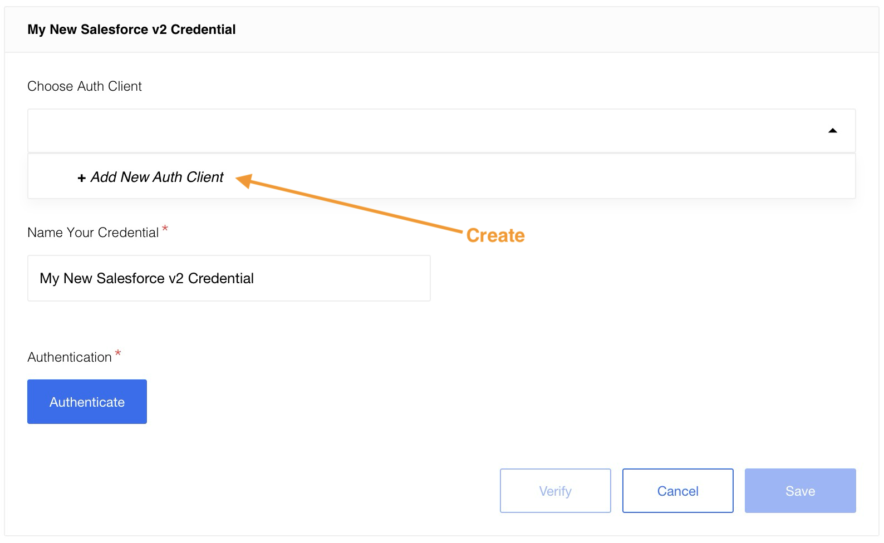
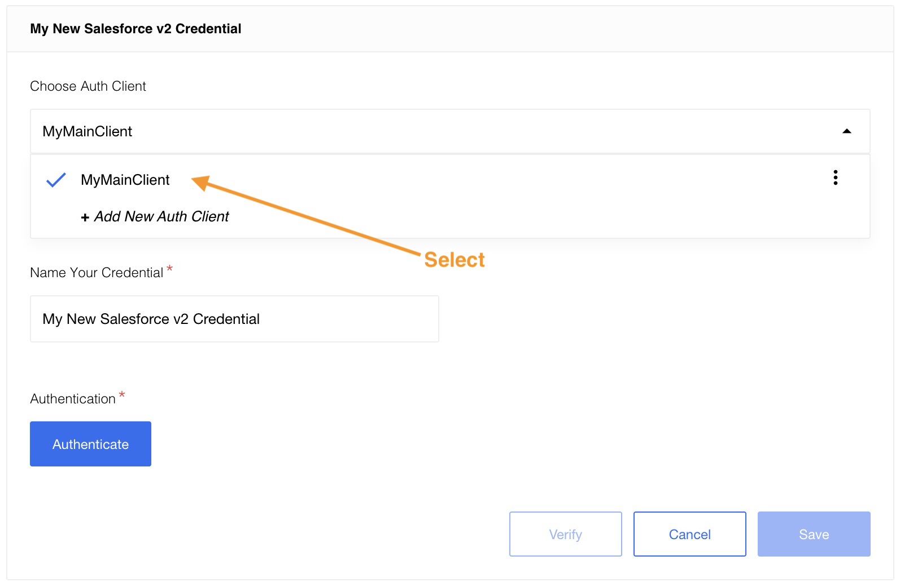

{{page.description}}

> **Please Note**: The component works with the Salesforce API. This means you must
> make sure your Salesforce edition has API Access enabled. To check which editions
> have API access see the [Salesforce editions with API Access](https://help.salesforce.com/articleView?id=000326486&type=1&mode=1) document.
> **If your edition has no API Access by default this component _will not work for you_.**

### API version

The component uses Salesforce - API Version 46.0 by defaults but can be overwritten
by the environment variable `SALESFORCE_API_VERSION`.

>**Please note:** Deprecated Actions and Triggers - API Version 25.0

### Environment variables

| Name                   | Mandatory | Description                                                                          | Values                   |
|------------------------|-----------|--------------------------------------------------------------------------------------|--------------------------|
| SALESFORCE_API_VERSION | false     | Determines API version of Salesforce to use                                          | Default: `46.0`          |
| REFRESH_TOKEN_RETRIES  | false     | Determines how many retries to refresh token should be done before throwing an error | Default: `10`            |
| HASH_LIMIT_TIME        | false     | Hash expiration time in ms                                                           | Default: `600000`        |
| HASH_LIMIT_ELEMENTS    | false     | Hash size number limit                                                               | Default: `10`            |
| UPSERT_TIME_OUT        | false     | Time out for `Upsert Object` action in ms                                            | Default: `120000` (2min) |

> Please Note: From the platform version [20.51](/releases/20/51) we deprecated the
> component `LOG_LEVEL` environment variable. Now you can control logging level per each step of the flow.

### Technical Notes

The [technical notes](technical-notes) page gives some technical details about
Salesforce component like [changelog](technical-notes#changelog) and the
[completeness matrix](technical-notes#completeness-matrix).

## Credentials

Authentication occurs via OAuth 2.0.

In order to make OAuth work, you need a new App in your Salesforce. During app
creation process you will be asked to specify the callback URL, to process OAuth
authentication via elastic.io platform your callback URL should be `{{site.data.tenant.appURL}}/callback/oauth2`.

More information you can find [here](https://help.salesforce.com/apex/HTViewHelpDoc?id=connected_app_create.htm).

### Credentials creation

During credentials creation you would need to:

*  select existing Auth-Client from drop-down list ``Choose Auth Client`` or create the new one.

For creating Auth Client you should specify following fields:

| Field name             | Mandatory | Description      |
|------------------------|-----------|------------------|
| Name                   | true      | your Auth Client's name    |
| Client ID              | true      | your OAuth client key      |
| Client Secret          | true      | your OAuth client secret   |
| Authorization Endpoint | true      | your OAuth authorization endpoint. For production use `https://login.salesforce.com/services/oauth2/authorize`, for sandbox - `https://test.salesforce.com/services/oauth2/authorize` |
| Token Endpoint         | true      | your OAuth Token endpoint for refreshing access token. For production use `https://login.salesforce.com/services/oauth2/token`, for sandbox - `https://test.salesforce.com/services/oauth2/token` |

- fill field ``Name Your Credential``
- click on ``Authenticate`` button - if you have not logged in Salesforce before then log in by entering data in the login window that appears
- click on ``Verify`` button for verifying your credentials
- click on ``Save`` button for saving your credentials

Here you can see how to select an existing `client`:

For more information pleas read our [Creating OAuth App for Salesforce](creating-oauth-app-for-salesforce) article.

> **Please Note**: When you deploy the Salesforce component separately into a dedicated tenant or
> into your developer team it can not use the OAuth App specifically created for
> our main {{site.data.tenant.name}} tenant. For this purposes you must create a
> different OAuth App and add the required environment variables to the component setup.

## Triggers

Salesforce component includes the following triggers:

1.  [Query trigger](triggers#query-trigger) Continuously runs the same `SOQL` query and emits results one-by-one. Use the Salesforce Object Query Language (`SOQL`) to search your organization’s Salesforce data for specific information.
2.  [Get New and Updated Objects Polling trigger](triggers#get-new-and-updated-objects-polling-trigger) Polls existing and updated objects. You can select any custom or built-in object for your Salesforce instance.
3.  [Subscribe to platform events](/components/salesforce/triggers#subscribe-to-platform-events-trigger) This trigger will subscribe for any platform Event using Salesforce streaming API. Realtime flows only.

> You can find information on deprecated triggers [here](deprecated-functions#deprecated-actions).

## Actions

Use this list to navigate to the action you seek.

1.  [Query action](actions#query-action) Executing a `SOQL` query that may return many objects. Each resulting object is emitted one-by-one. Use the Salesforce Object Query Language (`SOQL`) to search your organization’s Salesforce data for specific information.
2.  [Create Object action](actions#create-object-action) Creates a new Selected Object. Action creates a single object.
3.  [Delete Object action](actions#delete-object-action-at-most-1) Deletes an object by a selected field. One can filter by either unique fields or all fields of that object.
4.  [Upsert Object action](actions#upsert-object-action) Creates or Updates Selected Object. Action creates a single object.
5.  [Lookup Object action(at most 1)](actions#lookup-object-action-at-most-1) Lookup an object by a selected field. Action creates a single object.
6.  [Lookup Objects action](actions#lookup-objects-action) Lookup a list of objects satisfying specified criteria.
7.  [Bulk Create/Update/Delete/Upsert action](actions#bulk-createupdatedeleteupsert-action) Bulk API provides a simple interface for quickly loading large amounts of data from CSV file into Salesforce.
8.  [Bulk Query action](actions#bulk-query-action) Fetches records to a CSV file.

> You can find information on deprecated actions [here](deprecated-functions#deprecated-triggers).

## Permissions

Some user profiles in Salesforce have disabled permissions by default. To ensure that an object will be visible in the metadata of component's actions and triggers, it must have the required standard object permissions enabled.

- To enable it go to the Salesforce Setup page → ADMINISTRATION → Profiles, choose your profile, and press the Edit button.

    

- Make sure all required standard object permissions are enabled. For example, to use [Get New and Updated Objects Polling trigger](https://docs.elastic.io/components/salesforce/triggers#get-new-and-updated-objects-polling-trigger), you need to have: Read, Create, Edit permissions.

    
