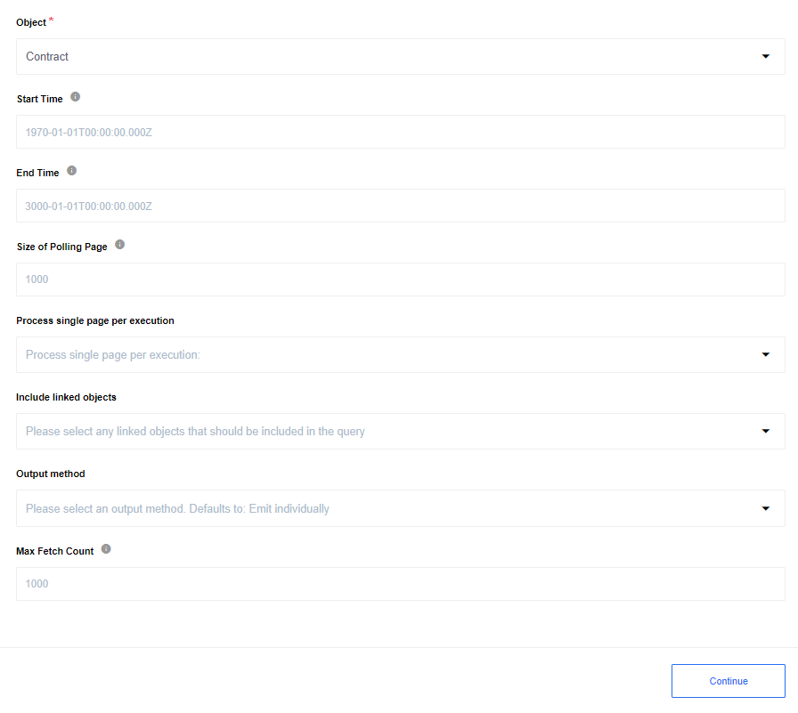

## Query trigger

Continuously runs the same SOQL Query and emits results one-by-one.
Use the Salesforce Object Query Language (SOQL) to search your organization’s Salesforce data for specific information. SOQL is similar to the SELECT statement in the widely used Structured Query Language (SQL) but is designed specifically for Salesforce data. This trigger allows you to interact with your data using SOQL.

### List of Expected Config fields trigger

* **SOQL Query** - Input field for your SOQL Query

* **Output method** - dropdown list with options: `Emit all` - all found records will be emitted in one array `records`, and `Emit individually` - each found object will be emitted individual. Optional field, defaults to: `Emit individually`.


### SOQL Query Input example

```
SELECT id, Name, Phone, Birthdate, Likes_Ice_Cream
FROM Contract
WHERE Phone != null
LIMIT 5
```

>**Please Note:** Max possible fetch size is 2000 objects per execution.

## Get New and Updated Objects Polling trigger

Polls existing and updated objects. You can select any custom or built-in object for your Salesforce instance.

### Input field description

* **Object** - Input field where you should select the type of object which updates you want to get. E.g. `Account`;

* **Start Time** - Indicates the beginning time to start polling from. Defaults to `1970-01-01T00:00:00.000Z`;

* **End Time** - If provided, don’t fetch records modified after this time;

* **Size of Polling Page** - Indicates the size of pages to be fetched. You can set positive integer, max `10 000`, defaults to `1000`;

* **Process single page per execution** - You can select on of options (defaults to `yes`):

   1. `yes` - if the number of changed records exceeds the maximum number of results in a page, wait until the next flow start to fetch the next page;

   2. `no` - if the number of changed records exceeds the maximum number of results in a page, the next pages will fetching in the same execution.

* **Include linked objects** - Multiselect dropdown list with all the related child and parent objects of the selected object type. List entries are given as `Object Name/Reference To (Relationship Name)`. Select one or more related objects, which will be join queried and included in the response from your Salesforce Organization. Please see the **Limitations** section below for use case advisories.

* **Output method** - dropdown list with options: `Emit all` - all found records will be emitted in one array `records`, and `Emit individually` - each found object will be emitted individual. Optional field, defaults to: `Emit individually`.

* **Max Fetch Count** - limit for a number of messages that can be fetched. 1,000 is the default value when the variable is not set.

For example, you have 234 “Contact” objects, 213 of them were changed from 2019-01-01.
You want to select all “Contacts” that were changed from 2019-01-01, set the page size to 100 and process single page per execution.

For you purpose you need to specify following fields:

   * Object: `Contact`

   * Start Time: `2019-01-01T00:00:00.000Z`

   * Size of Polling Page: `100`

   * Process single page per execution: `yes` (or leave this empty)



As a result, all contacts will be fetched in three calls of the trigger: two of them by 100 items, and the last one by 13.
If you select `no` in **Process single page per execution**, all 213 contacts will be fetched in one call of the trigger.

### Limitations

When a binary field (primitive type `base64`, e.g. Documents, Attachments, etc) is selected on **Include linked objects**, an error will be thrown: 'MALFORMED_QUERY: Binary fields cannot be selected in join queries. Instead of querying objects with binary fields as linked objects (such as children Attachments), try querying them directly.' There is also a limit to the number of linked objects that you can query at once - beyond two or three, depending on the number of fields in the linked objects, Salesforce could potentially return a Status Code 431 or 414 error, meaning the query is too long. Finally, due to a bug with multiselect dropdowns, it is recommended to deselect all of the elements in this field before you change your selection in the *Object* dropdown list.

## Subscribe to platform events trigger

This trigger will subscribe for any platform Event using Salesforce streaming API:


>**Please note:** REALTIME FLOWS ONLY

### Input field description

* **Event object name** - Input field where you should select the type of platform event which you want to subscribe E.g. `My platform event`

### How to create new custom Platform event Entity:

`Setup --> Integrations --> Platform Events --> New Platform Event`


You can find more detail information in the [Platform Events Intro Documentation](https://developer.salesforce.com/docs/atlas.en-us.platform_events.meta/platform_events/platform_events_intro.htm).
