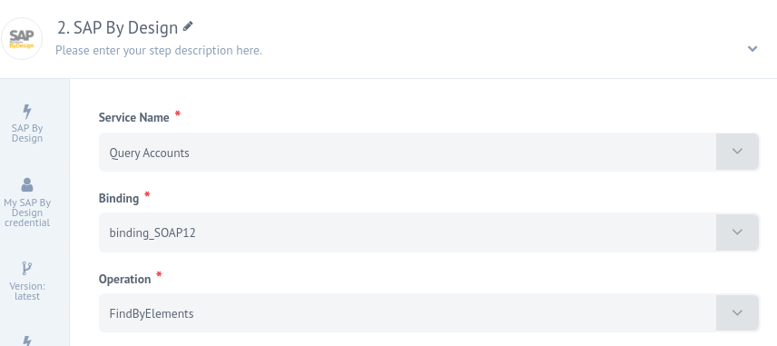
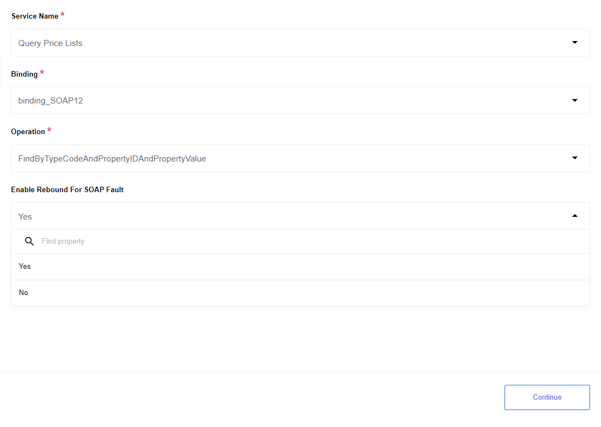
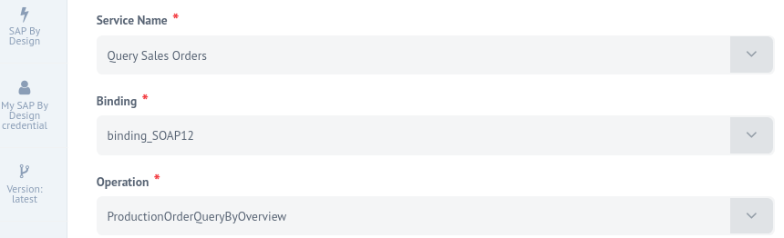
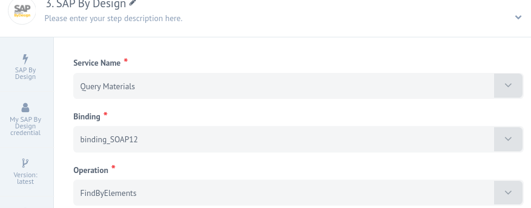
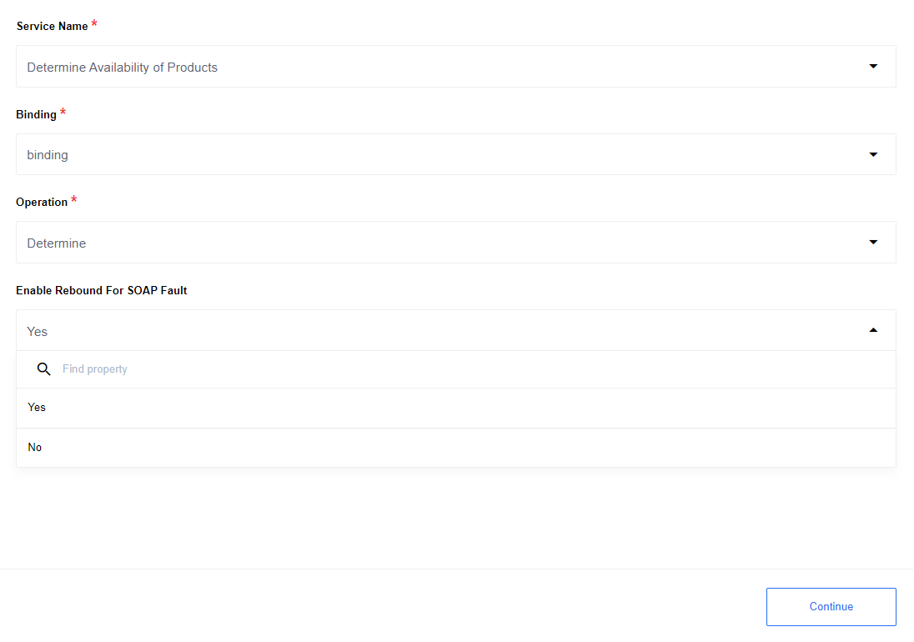

## Latest changelog

**2.1.3 (November 21, 2019)**

- Fix `Query Materials` processing in `Get New And Updated Objects Polling` trigger
- Add `Query Customer Contracts` Object Type for `Get New And Updated Objects Polling` trigger


> To see the full **changelog** please use the following [link](/components/sap-bydesign/changelog).

## Description

An iPaaS component that provides an opportunity to interact with SAP byDesign API.
SAP byDesign API integration with {{site.data.tenant.name}}

### Purpose

As an iPaaS platform {{site.data.tenant.name}} must have an opportunity to interact
with SAP Business byDesign API.

## Requirements

### Environment variables

| Name | Mandatory | Description | Values |
|---------------------|-------|-----------------------------------|-----------------------------------------------|
| EIO_REQUIRED_RAM_MB | false | Value of allocated memory         | `2048` recommended                            |
| ELASTICIO_REBOUND_LIMIT | false | Number of rebounds            | Default 5                                     |

> Please Note: From the platform version [20.51](/releases/2020-12-17) we deprecated the
> component `LOG_LEVEL` environment variable. Now you can control logging level per each step of the flow. 

### Credentials

| Property name | Required | Description | Example|
|-------------|--------|-------------------------------------|--------------|
| Service URL | true   | `https://my3443532.sapbydesign.com` |              |
| Username    | true   | Username for authentication         | `sapAdmin`   |
| Password    | true   | Password for authentication         | `adminPassw` |

**Important:** User should have access rights to get WSIL service descriptor and rights to call a service operation which was specified during the `Call Service` configuration.

## Triggers

### Get New And Updated Objects Polling. Config Fields

1. Polling Object - objects that going to be polled by the trigger.

2. Emit Behaviour - `Fetch All` emit all polled objects in one message, `Emit Individually` creates separate message for each object.

3. Polling Type - `Created` poll for created objects, `Updated` poll for updated objects
.
*Some objects have only `Created` or `Updated` Polling Type, e.g. `Query Customer Contracts`.*

4. Size Of Polling Page - the maximum number of objects retrieved by one poll call.

5. Start Datetime Of Polling - the start datetime of polling in the iso format.

### Supported Objects

At the moment only few object types are supported:

1. Query Materials

2. Query Sales Orders

3. Query Accounts

4. Query Customer Contracts

## Actions

### Call Service

Calls SAP byDesign service for specified binding and operation. The configuration
fields are:

| Input field | Required | Description | Example|
|--------------|------|----------------------------------|------------------|
| Service Name | true | Service of SAP By Design to call | `Query Accounts` |
| Binding      | true | SOAP Service binding             | `binding_SOAP12` |
| Operation    | true | SOAP Service operation           | `FindByElements` |
| Enable Rebound For SOAP Fault |false | Default: No. If Yes enables rebound for SOAP Fault | `Yes` or `No` |

## Additional info

### Rebound

1. Rebound for the SOAP Fault can be enabled with configuration parameter `Enable Rebound For SOAP Fault`: `Yes`.

2. Rebound enabled only for SOAP Fault code: `SOAP-ENV:Server`.

3. Number of rebounds can be controlled with the environment variable : `ELASTICIO_REBOUND_LIMIT`.
In case when user set `Enable Rebound For SOAP Fault`: `Yes` but did not specify `ELASTICIO_REBOUND_LIMIT`, component will act accordingly to `rebound` feature default behavior

## Request examples

  **1.** Query Accounts 

Example in metadata:

```json
{
    "CustomerByElementsQuery_sync": {
      "customerSelectionByElements": {
        "selectionByCreationDateTime": [
          {
            "inclusionExclusionCode": "I",
            "intervalBoundaryDateTime": "7",
            "upperBoundaryDateTime": "2019-01-01T00:00:00Z"
          }
        ]
      },
      "processingConditions": {
        "queryHitsMaximumNumberValue": 2,
        "queryHitsUnlimitedIndicator": false
      }
    }
}
```
  **2.** Query Price Lists 

Example in metadata:

```json
{
    "SalesPriceListFindByTypeCodeAndPropertyIDAndPropertyValueQuery_sync": {
      "salesPriceList": {
        "lastChangedDatetimeInterval": {
          "lowerBoundaryDateTime": "2001-01-01T00:00:00Z",
          "upperBoundaryDateTime": "2019-01-01T00:00:00Z"
        }
      }
    }
}
```

  **3.** Query Sales Orders .

Example in metadata:

```json
 {
    "SalesOrderByElementsQuery_sync": {
      "salesOrderSelectionByElements": {
        "selectionByLastChangedDate": [
          {
            "inclusionExclusionCode": "I",
            "IntervalBoundaryTypeCode": "7",
            "upperBoundaryDateTime": "2019-01-01T00:00:00Z"
          }
        ]
      },
      "processingConditions": {
        "queryHitsMaximumNumberValue": 2,
        "queryHitsUnlimitedIndicator": false
      }
    }
 }
```
   **4.** Query Materials 

Example in metadata:

```json
{
    "MaterialByElementsQuery_sync": {
      "materialSelectionByElements": {
        "SelectionByLastChangeSinceDateTime": "2001-01-01T00:00:00Z"
      },
      "processingConditions": {
        "queryHitsMaximumNumberValue": 2,
        "queryHitsUnlimitedIndicator": false
      }
    }
}
```

  **5.** Product Availability (Available To Promise Check) 

Example in metadata:

```json
{
    "ProductAvailabilityDeterminationQuery_sync": {
      "productAvailabilityDeterminationQuery": {
        "productAndSupplyPlanningArea": [
          {
            "supplyPlanningAreaID": {
              "value": "P1100"
            },
            "productInternalID": {
              "value": "P100101"
            },
            "productTypeCode": "1"
          }
        ],
        "productAvailabilityDeterminationHorizonDuration": "P2D",
        "considerScopeOfCheckIndicator": false
      }
    }
  }
```


## Limitations

1. Currently, the component documentation does not contain JSON schemas for each object types. The documentation contains only request examples and links to SOAP service documentation.

2. The component does not comply with OIH standards.

3. `Get New And Updated Objects Polling` trigger currently supports only few objects, please see [full list](#supported-objects).

4. Due to a platform feature 'retrieving sample' timeout a sample may not be retrieved during the component setup process. It is not a bug as it is caused by a heavy-weight Java process for serialization/deserialization of JAXB structure for SAP's WSDL. Which is normally of huge size. We are hardly working on this issue and it will likely be fixed in the nearest releases. But for now please be patient. As this issue is only for UI retrieve sample functionality it will NOT affect you in runtime.
