This document will guide you to get access to Web Service consuming from SAP Business ByDesign.

## Creating user for WS communication

**1.** Open your SAP instance (https://myXXXXXX.sapbydesign.com), log in as admin user and navigate to 'New Service Agent' menu

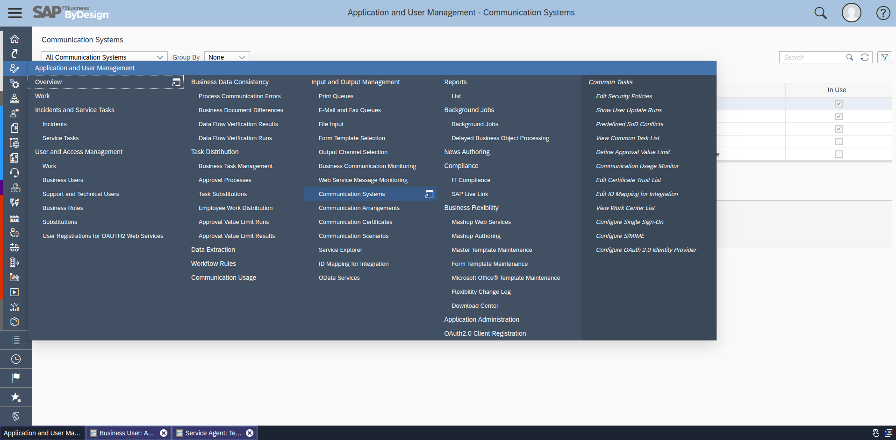

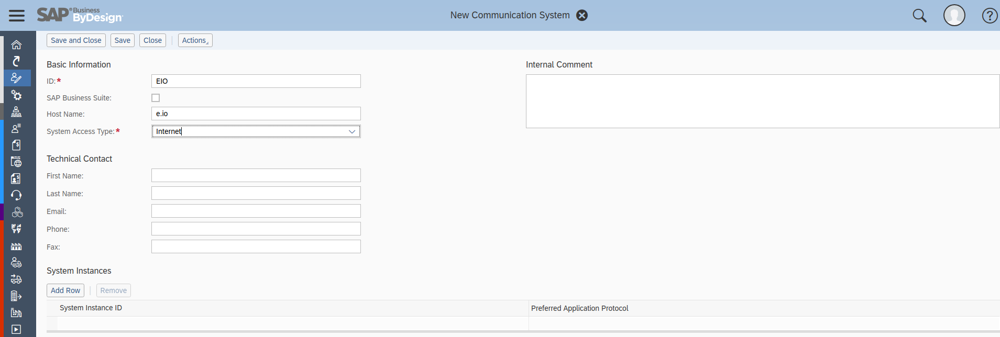

**2.** Fill all the required fields out and Save. Right after saving click 'Request User'

**3.** Navigate to Application and User Management -> Business Users. Choose your new requested user and edit Attributes and Access Rights. You should generate and save a new password for the user.

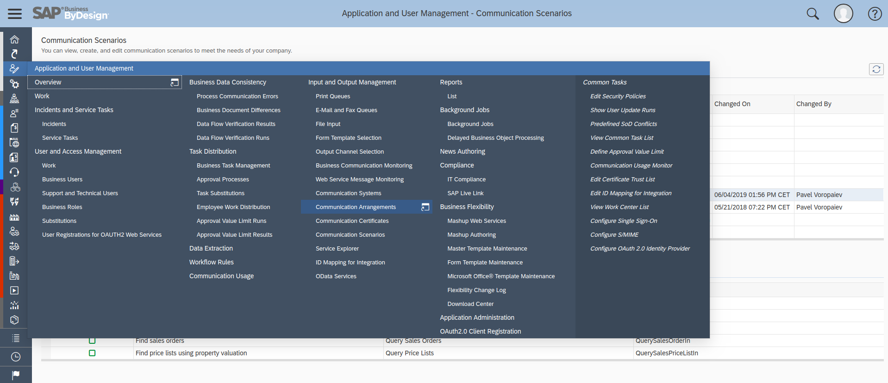

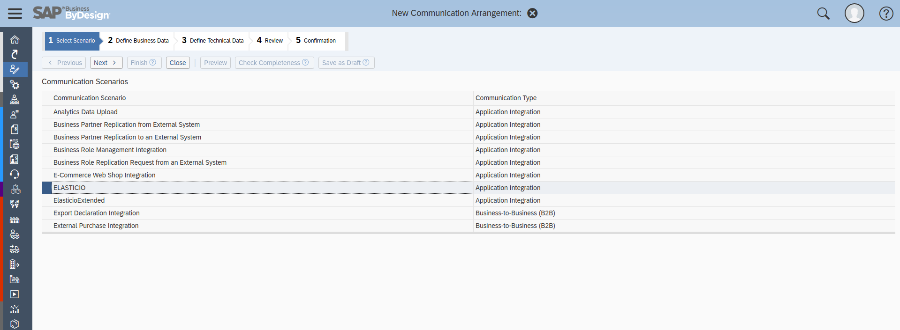

In the Access Right edit session assign all the needed rights under the 'Work Center and View Assignment' tab

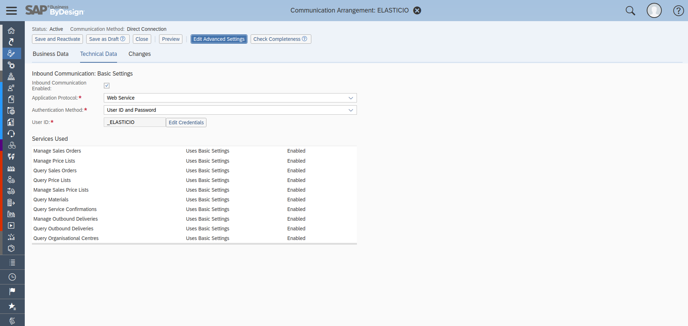

This user's login and password should be used for authentication in the {{site.data.tenant.name}} SAP ByD component.

## Setting up communication system for WS interactions

**1.** First you need to create a new communication system

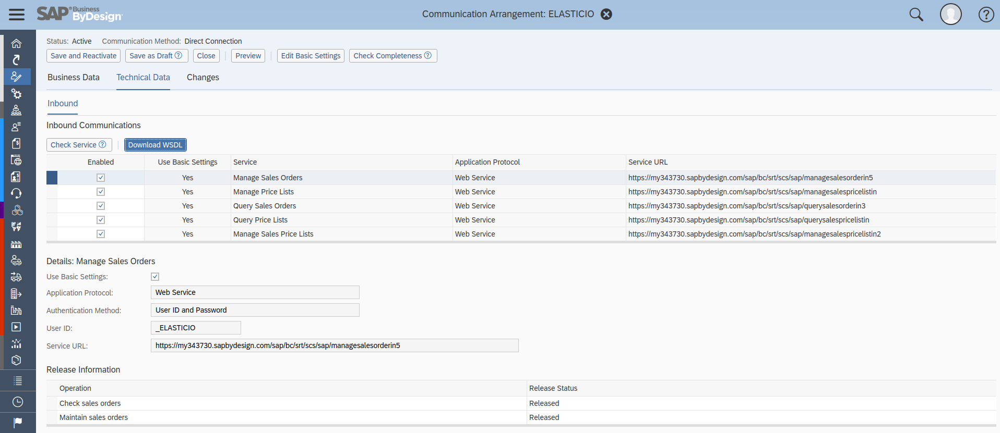

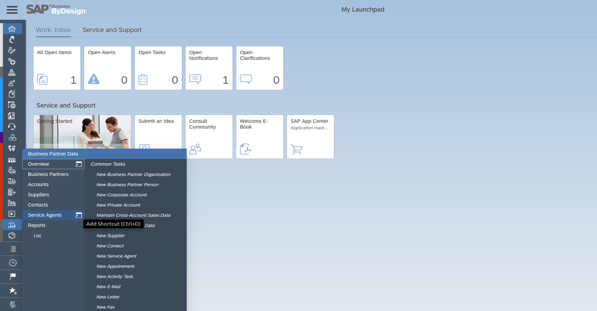

And set it as active (Actions -> Set to Active)
**2.** Next create a new Communication Scenario and check needed operations as Added.

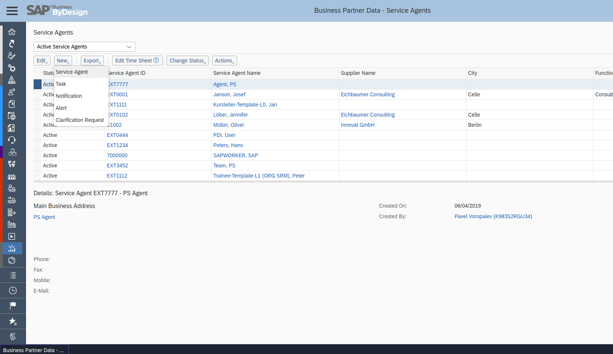

**3.** You have to create a new communication arrangement if you don´t have any in your system. (Jump to the next step if you have)

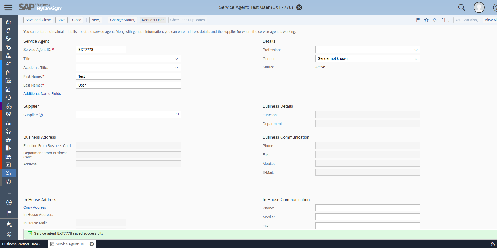

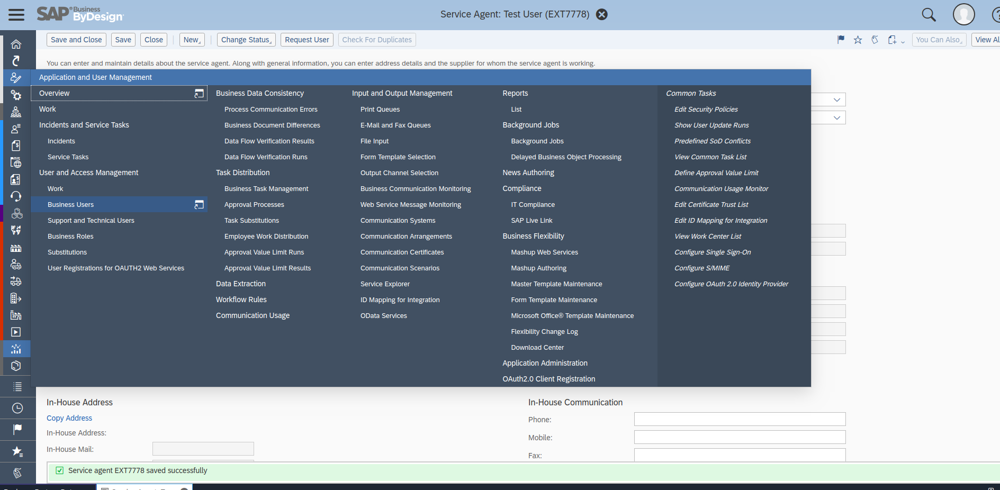

**4.** If you already have or created one, choose the communication arrangement you created and click on 'Edit' and open 'Technical Data' tab. Click on 'Edit Advanced Settings'. There you can download WSDL.

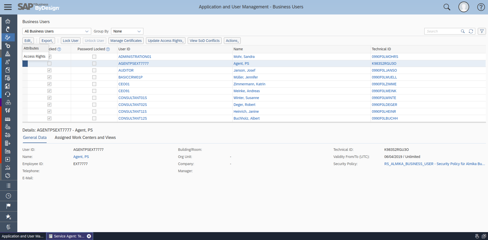

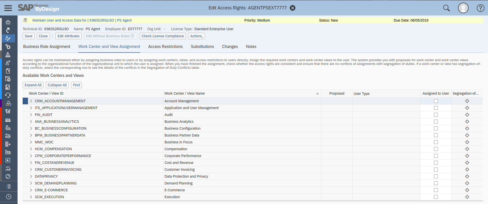
