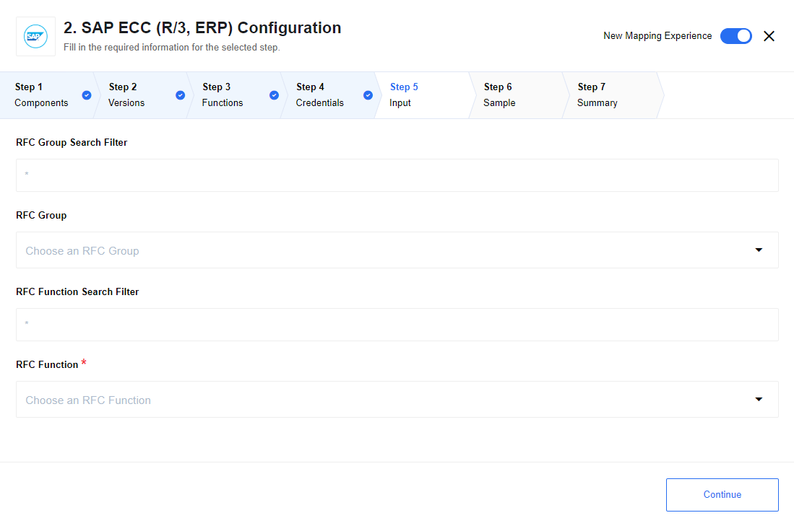

## Call RFC Service

Generic action which gives possibility to call an RFC function on the SAP ECC platform:



### Call RFC Service. Configuration fields

1.  `RFC Group Search Filter` - [wildcard expression](https://help.sap.com/doc/saphelp_470/4.7/es-ES/85/dae7c04bac11d1890e0000e8322f96/content.htm?no_cache=true) used for filtering groups, default value: `*`

2.  `RFC Group` - group of RFC functions, selected value is used by RFC Function field. Shows 100 groups that match regular expression provided in `RFC Group Search Filter` configuration parameter.

3.  `RFC Function Search Filter` - [wildcard expression](https://help.sap.com/doc/saphelp_470/4.7/es-ES/85/dae7c04bac11d1890e0000e8322f96/content.htm?no_cache=true) used for filtering functions, default value: `*`

4.  `RFC Function` - Required. Function to be called by component. Shows 100 functions that match regular expression provided in `RFC Function Search Filter` that belongs to group provided: in `RFC Group` configuration parameters.

> **Note 1:** When retrieving function's metadata you may get the following message:
> **We are sorry! Field `CustomFields[*]` can not be mapped with the graphical UI. Mapping of array elements is possible in "Developer Mode" using JSONata expressions.**
> Please contact our support for assistance and visit [http://docs.jsonata.org](http://docs.jsonata.org) for more examples of JSONata expressions.

> **Note 2:** as `RFC Function` and `RFC Group` fields shows not more than 100 items you need to complete filter fields of each configuration field in order to get needed object. You can find more information about *Wildcard Characters* in the [SAP Help Portal](https://help.sap.com/doc/saphelp_470/4.7/es-ES/85/dae7c04bac11d1890e0000e8322f96/content.htm?no_cache=true)

### Call RFC Service. Usage Examples

**1.** Call standard `STFC_CONNECTION` function.

`RFC Function Search Filter`: STFC_CONNECTION

`RFC Function`: STFC_CONNECTION

```json
{
  "importParameters": {
    "REQUTEXT": "Hello SAP"
  }
}
```
**2.** Call standard `RFC_SYSTEM_INFO` function.

`RFC Function Search Filter`: RFC_SYSTEM_INFO

`RFC Function`: RFC_SYSTEM_INFO

```json
{}
```

**3.** Call predefined `BAPI_CUSTOMER_GETLIST` function.

`RFC Function Search Filter`: BAPI_CUSTOMER_GETLIST

`RFC Function`: BAPI_CUSTOMER_GETLIST

```json
{
  "importParameters": {
    "MAXROWS": 100
  },
  "tableParameters": {
    "IDRANGE": [
      {
        "SIGN": "I",
        "OPTION": "NE",
        "HIGH": "0",
        "LOW": "0"
      }
    ]
  }
}
```
