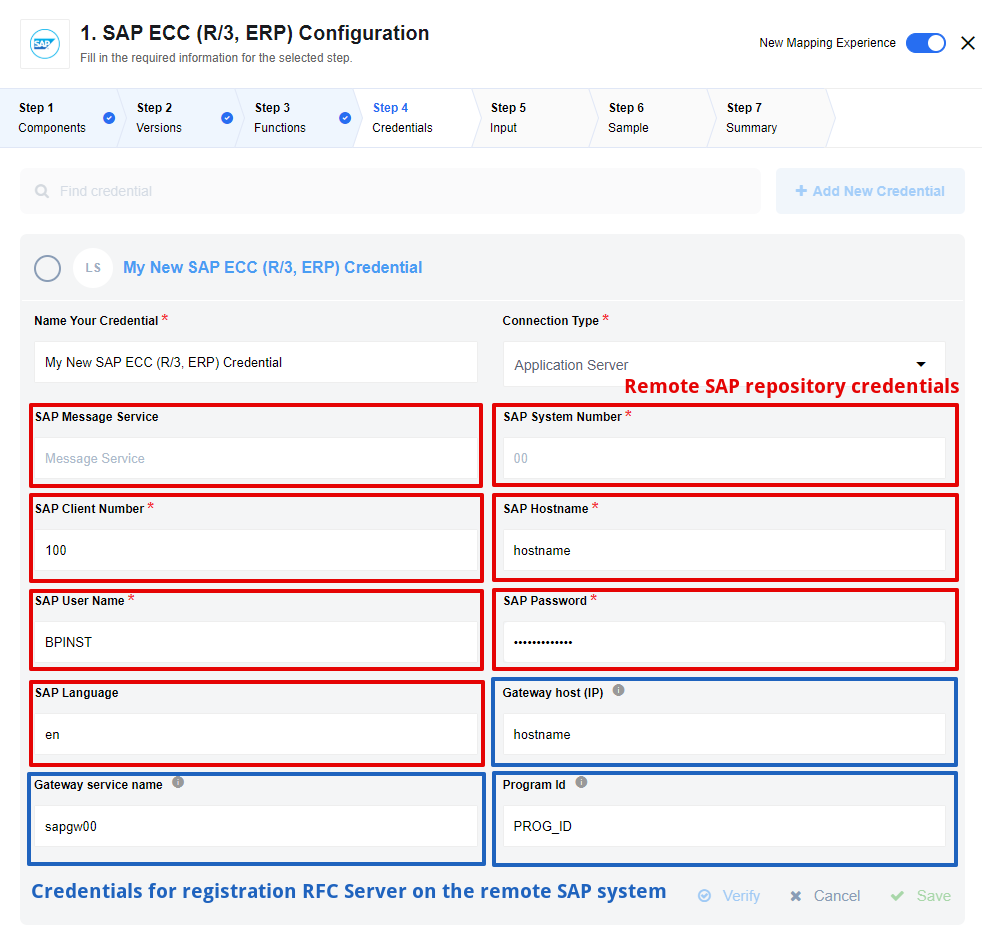

## RFC Server (Only for Realtime flows)

Generic trigger which gives possibility to receive RFC calls from the SAP ECC platform.

### RFC Server. Config fields

1. `RFC Group Search Filter` - [wildcard expression](https://help.sap.com/doc/saphelp_470/4.7/es-ES/85/dae7c04bac11d1890e0000e8322f96/content.htm?no_cache=true) is used for filtering groups, default value: `*`
2. `RFC Group` - group of RFC functions, selected value is used by RFC Function field. Shows 100 groups that match regular expression provided in `RFC Group Search Filter` configuration parameter.
3. `RFC Function Search Filter` - [wildcard expression](https://help.sap.com/doc/saphelp_470/4.7/es-ES/85/dae7c04bac11d1890e0000e8322f96/content.htm?no_cache=true) is used for filtering functions, default value: `*`
4. `RFC Function` - Required. Function to be called by the SAP ECC system. Shows 100 functions that match regular expression provided in `RFC Function Search Filter` that belongs to group provided: in `RFC Group` configuration parameters.

RFC Server provides an opportunity to expose any function, which exists on the remote SAP RFC repository.
For this purpose, credentials for the connection to the remote repository and RFC Server connection should be provided.
See example bellow:



Additionally, to this, the server supports `FTP_R3_TO_CLIENT` function can receive binary data from the remote sap system and upload this data to [attachments](guides/using-attachments).

### Configuration steps on the SAP ECC side

#### 1.Ensure, that registration of tp `EIO_SAP_CONNECTOR` from integration platform host allowed.

 By default the gateway is not allowing the program ID `EIO_SAP_CONNECTOR` to be registered from the integration platform host. In this case, RFC connection fails error below when try to extract data from SAP using **SAP ECC (R/3, ERP) Connector**.

```
LOCATION  SAP-Gateway on host <hostname> / sapgw
ERROR    registration of tp <program id> from host <external host>  not allowed
```

There are two possible reasons:

- Parameter  `gw/acl_mode = 1` and not reginfo file has been set. This is the default value for **NEW INSTALLATIONS** for **Netweaver  7.0x** since December 2012 (including 7.20) and for  **Netweaver 7.3X** since August 2012
- There is a **reginfo** file that doesn't allow the registration of that external program
So, The "reg_info" file from the SAP gateway that appears in the error message ("SAP-Gateway on host <hostname> / sapgw<nr>") creating a line that allows this registration.
The location of the "reg_info" file is specified by parameter `gw/reg_info` and should contain lines like:

 ```
 #VERSION=2
 P TP=<program ID> HOST=<external host> CANCEL=internal,<external host> ACCESS=*
  ...
 # the following lines should be the LAST lines in the reginfo
 #
 P TP=* HOST=<LIST> CANCEL=<LIST> ACCESS=<LIST>
 P TP=* HOST=local
 ```

 Also, you can use the Gateway ACL editor. See details by the [link](https://help.sap.com/doc/saphelp_nw75/7.5.5/en-US/e2/16d0427a2440fc8bfc25e786b8e11c/content.htm?no_cache=true).

 Then, reload the new settings via transaction **SMGW**.

#### 2.Create RFC Destination 'EIO_SERVER' using transaction **SM59**


- New destination must have type **T** (TCP/IP Connections)
- Select **Registered Server Program** activation type
- Specify Program ID which specified in the component credentials


