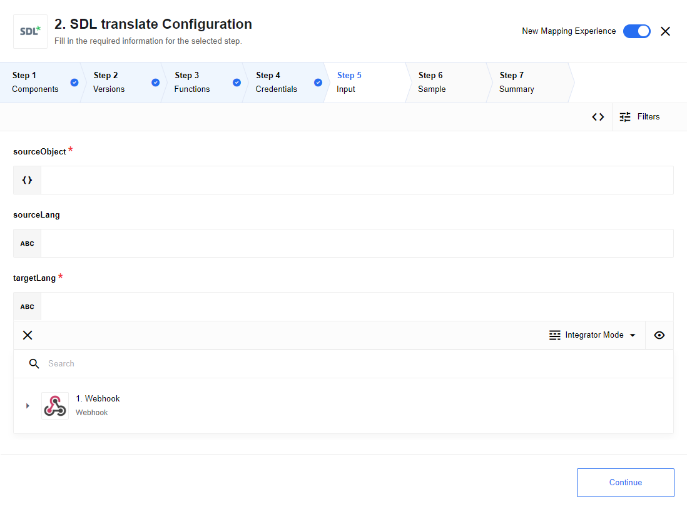

## Credentials

In oprder to authenticate, you need to retrieve an `apiKey` from your `SDL languagecloud` account

Guide of how to retrieve an [apiKey](https://languagecloud.sdl.com/translation-toolkit/api-documentation) (Getting started -> Generate API Key)

## Technical Notes

The [technical notes](technical-notes) page gives some technical details about Sdl-translate component like [changelog](/components/sdl-translate/technical-notes#changelog).

## Triggers

This component has no trigger functions. This means it will not be accessible to
select as a first component during the integration flow design.

## Actions

When specifying the language in a `Configure input` section, use two or three letter codes for that. For example,

    english -> en
    russian -> ru
    franch -> fr
    -----
    english -> eng
    russian -> rus
    franch -> fra

Such codes can be foud in a result of `Retrieve supported language pairs` action execution

### Retrieve supported languages

Action will return a list of supported language pairs with specified three letters codes for every language

### Translate phrase

If source language is not specified, action will use `detect language` feature and choose most probable option as source language


### Detect language


### Translate object properties



#### Usage example

input message:

```
{
    "sourceObject": {
        "hello": "hello world",
        "capital": "London is the capital of Great Britain"
    },
    "sourceLang": "en",
    "targetLang": "de"
}
```

output message:

```
{
    "hello": "Hallo Welt",
    "capital": "London ist die Hauptstadt von Großbritannien"
}
```

### Translate array of objects


#### Usage example

input message:

```
{
	"sourceArray": [
		{
            "hello": "hello world",
            "capital": "London is the capital of Great Britain"
		},
		{
			"color": "red",
			"mood": "great mood"
		}
	],
	"sourceLang": "en",
	"targetLang": "de"
}
```

output message:

```
{
    "translatedArray": [
    	{
    		"capital": "London ist die Hauptstadt von Großbritannien",
    		"hello": "Hallo Welt"
    	},
    	{
    		"mood": "großartige Stimmung",
    		"color": "rot"
    	}
    ]
}
```

## Known limitations

The component was not tested with the latest SDL version. Althouh it was fully tested with one the recent SDL releases, 100% compatibility can not be guaranteed

## Links

[Guide of how to retrieve an apiKey](https://languagecloud.sdl.com/translation-toolkit/api-documentation)
