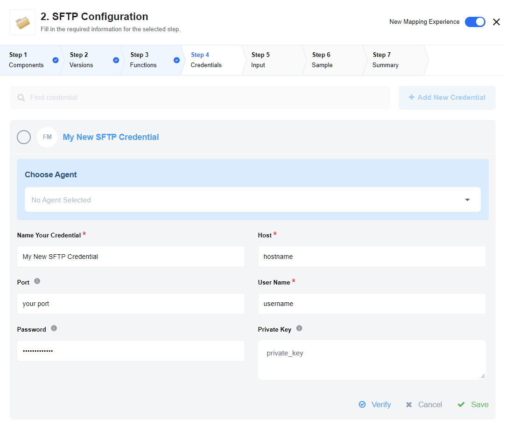

## Latest changelog

**1.4.1 (October 19, 2020)**

* Component code audit
* Update sailor to 2.6.17

> To see the full **changelog** please use the following [link](/components/sftp/changelog).

## General Information

### Description and Purpose

This component creates a connection to an SFTP server to read and upload files.

The optional environment variable `MAX_FILE_SIZE` should be set in settings to provide the maximum file size that can be uploaded in **megabytes (mb)**. The default value for `MAX_FILE_SIZE` is 100MB.

## Credentials

### Host

Host name of SFTP server

### Port

Optional, port of SFTP server. Defaults to 22 if not set.

### User Name

Username for SFTP server

### Password

Password for SFTP server.

>**Note**: field `Private Key` should stay empty in case you fill a password.

### Private Key

To access a secure SFTP servers that is configured with a key-based authentication you must at first upload your `Public key` to the SFTP server (please contact your server administrator to do this) and fill in this field with your `Private key`.

Also please pay attention that the field `Password` should be empty in this case.

## Triggers

SFTP component includes the following triggers:

  1. [Read files](/components/sftp/triggers#read-files)                            
  Will continuously poll remote SFTP location for files that match given pattern. Found files will be transferred as attachments to the next component.

  2. [Poll files](/components/sftp/triggers#poll-files)                        
  Triggers to get all new and updated files since last polling.

## Actions

SFTP component includes the following actions:

  1. [Upload files From Attachments Header](/components/sftp/actions#upload-files-from-attachments-header)                           
  Upload all files from the attachments header to a defined SFTP directory.

  2. [Upload File From URL](/components/sftp/actions#upload-file-from-url)                           
  Given a filename and a URL to an attachment stored in the platform, transfers the contents of the attachment to the SFTP server. The component returns a summary of the written file.

  3. [Delete file](/components/sftp/actions#delete-file)                        
  Action to delete file by provided full file path.

  4. [Download file by name](/components/sftp/actions#download-file-by-name)                           
  Finds a file by name in the provided directory and uploads (streams) to the attachment storage (a.k.a. steward).

  5. [Download files](/components/sftp/actions#download-files)                           
  Finds a file by criterias in the provided directory and uploads (streams) to the attachment storage (a.k.a. steward).

  6. [Move File](/components/sftp/actions#move-file)                           
  Action to move file on SFTP already exists in one location on an sftp server to be moved to another location on the same SFTP server. Target location MUST exist.

## Known limitations

* The maximum file size accepted by the SFTP component is limited to 100 MB.
* The attachments mechanism does not work with [Local Agent Installation](/getting-started/local-agent)
* `Get new and updated files` trigger mechanism is based on SFTP file `modifyTime` metadata field. For correct processing the trigger requires correct time configuration on the SFTP server.
* `Get new and updated files` trigger does not support empty files processing.
* `Get new and updated files` trigger does not support `fetch page` Emit Behaviour

## SSH2 SFTP Client API and Documentation links

The SFTP component uses [ssh2-sftp-client](https://www.npmjs.com/package/ssh2-sftp-client).

Explanation of [Unix file types](https://en.wikipedia.org/wiki/Unix_file_types)
