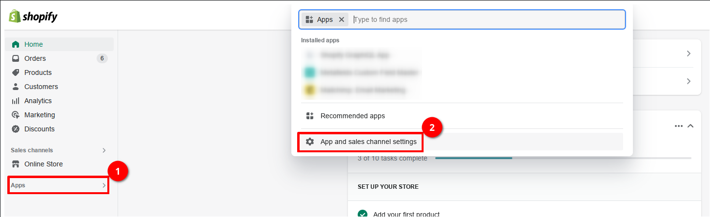
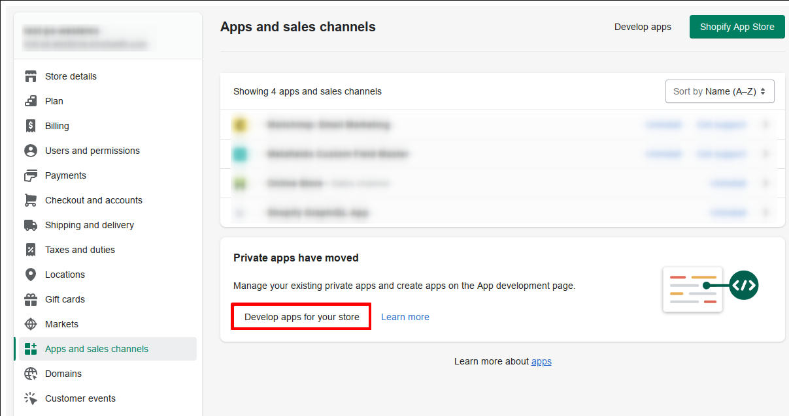
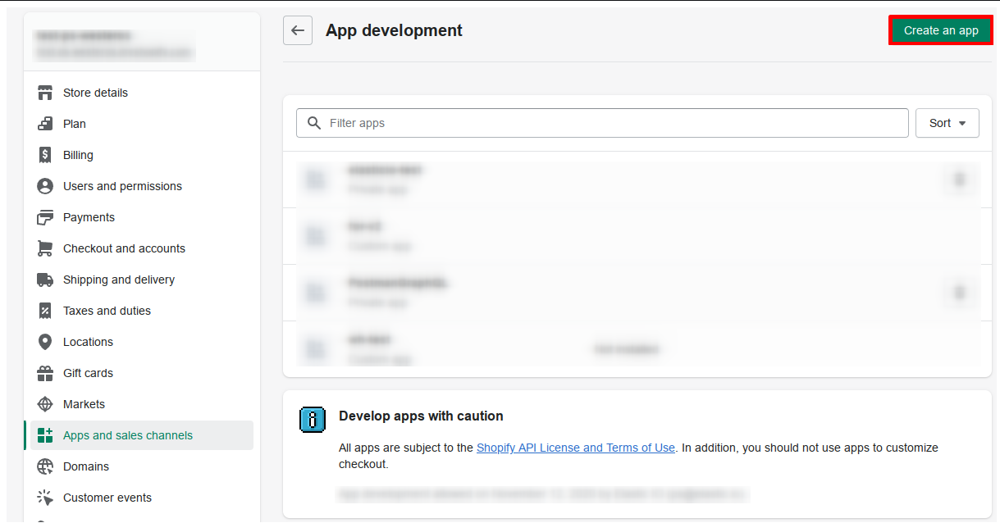
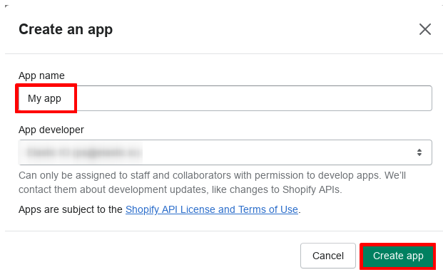
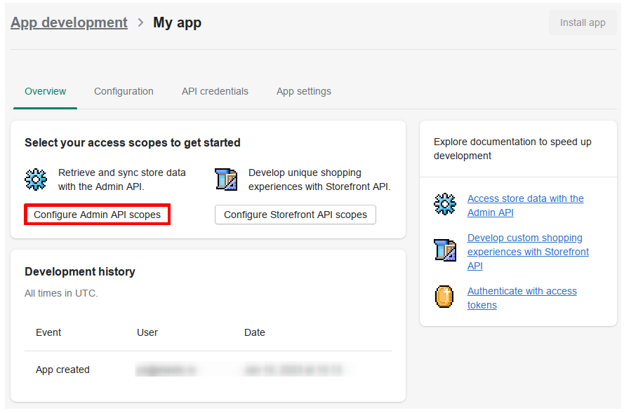
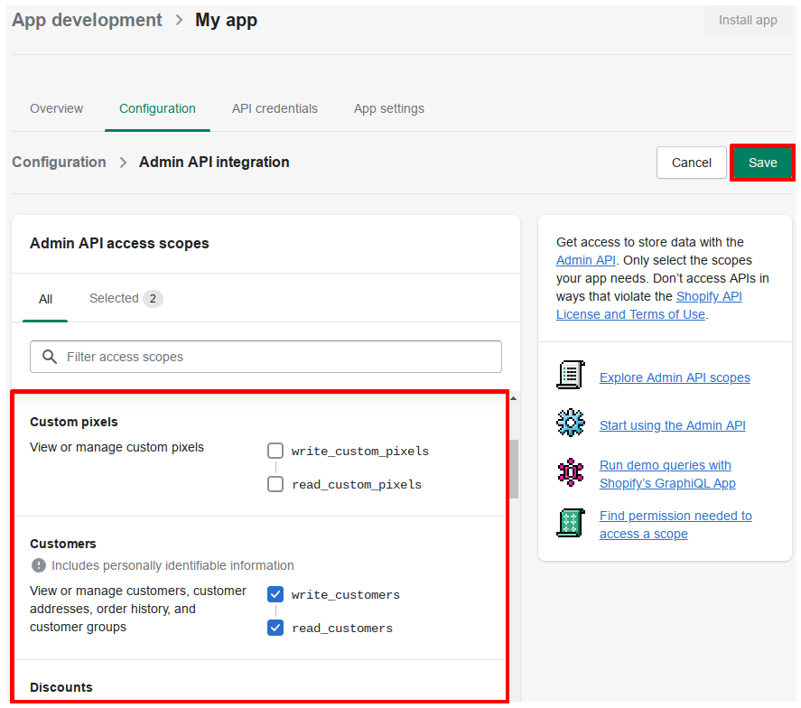
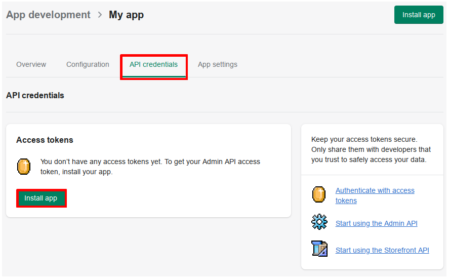
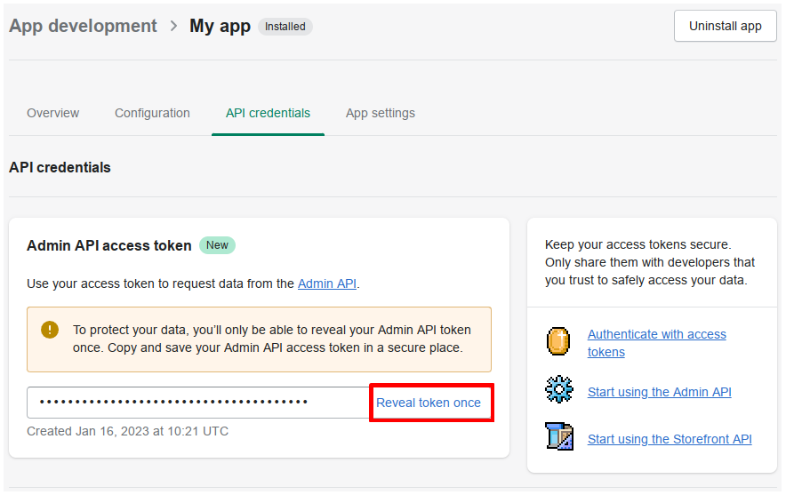
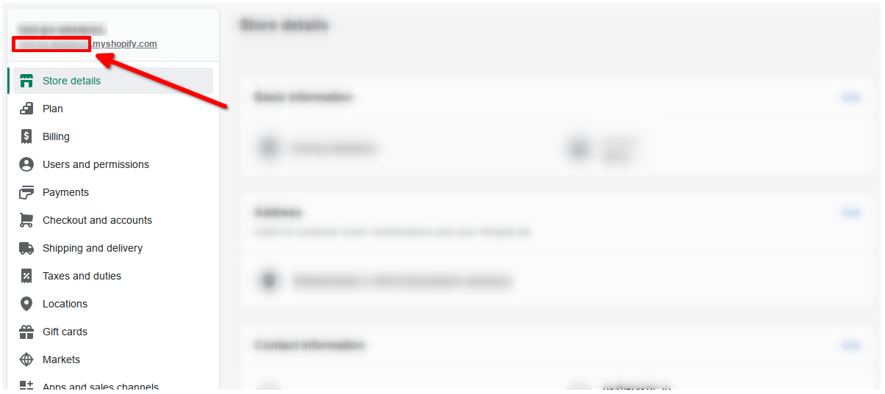

## Description

Shopify admin Component is designed to connect to Shopify [GraphQL](https://shopify.dev/api/admin-graphql) Admin API

Tested with API version: `2023-01`

## Credentials

To use this component you need to create a custom App:
1. Go to your store [Admin panel](https://accounts.shopify.com/store-login)
2. Open `App and sales channel settings`
3. Select `Develop apps for your store`
4. Then `Create an app` button
5. Provide any app name and press `Create app`
6. Follow to `Configure Admin API scopes`
7. Select access scopes - Objects, that component will have access to and press `Save`
8. Now you be able to install this app by pressing `Install app` button in `API credentials` section or in right upper corner
9. Finally you can get `Admin API access token` by selecting `Reveal token once`. It will be needed in component credentials configuration

<strong>Screenschot instructions</strong>

Component credentials configuration fields:

* **Store name** (string, required) - Provide you store name here, can be found in [Admin panel](https://accounts.shopify.com/store-login) as a part of store url

* **Admin API access token** (string, required) - this token you will get after app creation (look at instructions above)
* **API version** (string, required) - Provide API version you are going to work with. Currently component tested on `2023-01`, but should work with any available

> **Notes:**
* `Admin API access token` shows only once
* To rotate the API credentials for a custom app that was created in the Shopify admin, you need to uninstall and reinstall the app

## Triggers

This component has no trigger functions. This means it will not be accessible to
select as a first component during the integration flow design.

## Actions

### Make Raw Request

Executes custom request.

#### Configuration Fields

There is no configuration fields in this action.

#### Input Metadata

* **Url** - (string, required): Path of the resource relative to the base URL (`https://{store_name}.myshopify.com/admin/api/{api_version}/`) or full url
* **Method** - (string, required): HTTP verb to use in the request, one of `GET`, `POST`, `PUT`, `PATCH`, `DELETE`.
* **Request Body** - (object, optional): Body of the request to send.

#### Output Metadata

* **Status Code** - (number, required): HTTP status code of the response.
* **HTTP headers** - (object, required): HTTP headers of the response.
* **Response Body** - (object, optional): HTTP response body.

## Known limitations

* Look at [Shopify API rate limits](https://shopify.dev/api/usage/rate-limits), specially [GraphQL Admin API rate limits](https://shopify.dev/api/usage/rate-limits#graphql-admin-api-rate-limits)
