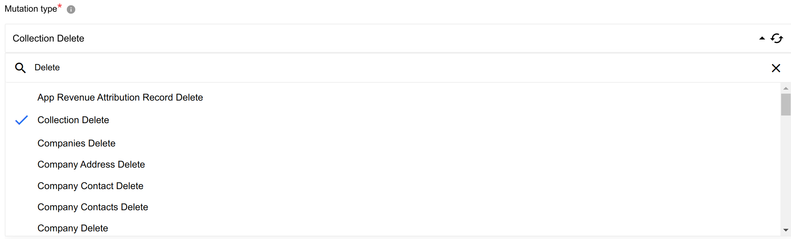
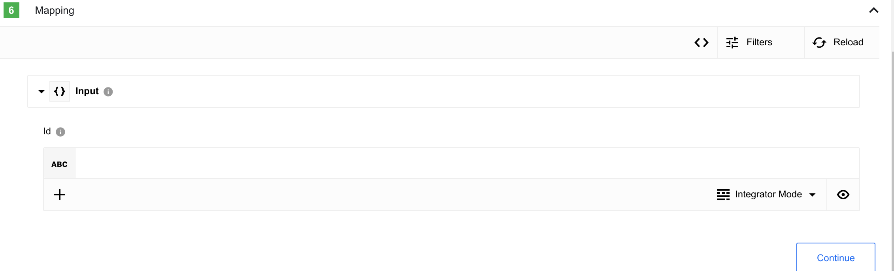
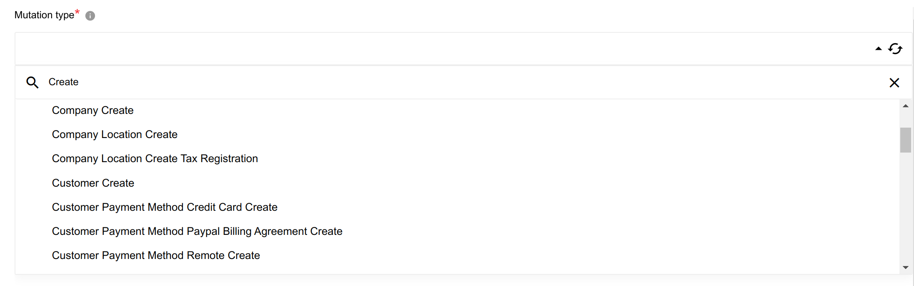
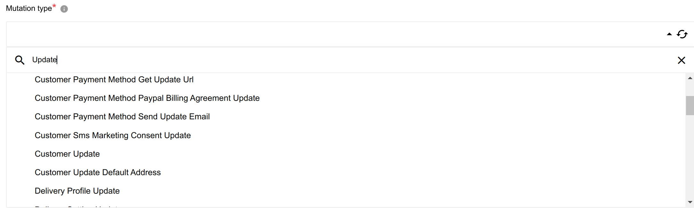

## Description

Shopify admin Component is designed to connect to Shopify [GraphQL](https://shopify.dev/api/admin-graphql) Admin API.

Tested with API version: `2023-01`.

## Credentials

To use this component you need to create a custom App:
1. Go to your store [Admin panel](https://accounts.shopify.com/store-login).
2. Open `App and sales channel settings`.
3. Select `Develop apps for your store`.
4. Then `Create an app` button.
5. Provide any app name and press `Create app`.
6. Follow to `Configure Admin API scopes`.
7. Select access scopes - Objects, that component will have access to and press `Save`.
8. Now you be able to install this app by pressing `Install app` button in `API credentials` section in the right upper corner.
9. Finally you can get `Admin API access token` by selecting `Reveal token once`. It will be needed in the component credentials configuration.
10. In addition, you may need to save `API secret key` if you going to use webhooks.

<details close markdown="block"><summary><strong>Screenshot instructions</strong></summary>


</details>

Component credentials configuration fields:

* **Store name** (string, required) - Provide you store name here, can be found in [Admin panel](https://accounts.shopify.com/store-login) as a part of store URL.


* **Admin API access token** (string, required) - this token you will get after app creation (look at instructions above)
* **API version** (string, required) - Provide the API version you are going to work with. The component has been tested on `2023-01`, but should work with any available.
* **API secret key** (string, required) - This field is used and required **only** for trigger - `Webhook` to [sign the request with an HMAC header](https://shopify.dev/apps/webhooks/configuration/https#step-5-verify-the-webhook).

> **Notes:**
* `Admin API access token` shows only once.
* To rotate the API credentials for a custom app that was created in the Shopify admin, you need to uninstall and reinstall the app.

## Triggers

### Webhook

Creates [webhook subscription](https://shopify.dev/docs/api/admin-graphql/2024-01/mutations/webhookSubscriptionCreate) for selected topics on the Shopify side to receive events.

#### Configuration Fields

* **Select topics** - (multi-select dropdown, required): Select available topics to create a subscription.
* **Skip validation** - (checkbox, optional): If checked - the component will not validate the incoming message to be sure that it comes from Shopify, use it for test purposes only!

#### Input Metadata

There is no input metadata.

#### Output Metadata
Event from the subscription on the selected topic.

#### Limitations
* **Generate Stub Sample** works only for the most used objects.
* This trigger doesn't support `Retrieve sample` functionality.
* If you use ordinary flow (The `Real-time` functionality not enabled) after flow starts you will need to run it once - just follow the webhook URL (to make the first execution) this action will create a subscription, error on this execution may be ignored.

### Get New and Updated Objects Polling

Retrieve all the updated or created objects within a given time range.

#### Configuration Fields

* **Object Type** - (dropdown, required): Object-type to lookup on. E.g `Customers`.

* **Timestamp field to poll on** - (dropdown, required): Can be either `Last Modified` or `Created dates` (updated or new objects, respectively).

* **Select basic fields for resulting object** - (dropdown, optional): Here only basic fields that can be included in the resulting object, may affect query cost.

* **You can provide additional fields here** - (string, optional): The resulting object can be expanded using GraphQL request, this field represents content from each `edges.node`, it may affect on query cost.

* **Size of Polling Page** - (optional, positive integer, defaults to 250, max 250): Indicates the size of pages to be fetched per request. If you query cost will be over shop limit, you can decrease page size.

* **Emit behavior** - (dropdown, optional): Indicates emit objects behavior - `Emit individually` (by default) or `Emit page`

* **Return Full Response** - (checkbox): Defines the format of emitted result: with service information or without.
  Examples for Object type `customers` are given below:
  
    <details close markdown="block"><summary><strong>Example for customer</strong></summary>

    ```graphql
        metafields(first: 2) {
        edges {
            node {
            namespace
            key
            value
            }
        }
        }
        addresses {
        address1
        country
        }
    ```

    </details>

<details close markdown="block"><summary><strong>Response with enabled "Return Full Response" checkbox and "Emit Behavior" = "Emit page"</strong></summary>

```json
{
    "data": {
      "customers": [
        {
          "id": "gid://shopify/Customer/2444144115794",
          "firstName": "Willy"
        },
        {
          "id": "gid://shopify/Customer/2444144148562",
          "firstName": "Tobi"
        },
        {
          "id": "gid://shopify/Customer/2444144181330",
          "firstName": "Mathilde"
        }
      ]
    },
    "extensions": {
      "cost": {
        "requestedQueryCost": 5,
        "actualQueryCost": 5,
        "throttleStatus": {
          "maximumAvailable": 1000,
          "currentlyAvailable": 40,
          "restoreRate": 50
        }
      }
    }
}
```
</details>


<details close markdown="block"><summary><strong>Response with disabled "Return Full Response" checkbox and "Emit Behavior" = "Emit page"</strong></summary>  

```json
{
  "results": [
    {
      "id": "gid://shopify/Customer/2444144115794",
      "firstName": "Willy"
    },
    {
      "id": "gid://shopify/Customer/2444144148562",
      "firstName": "Tobi"
    },
    {
      "id": "gid://shopify/Customer/2444144181330",
      "firstName": "Mathilde"
    }
  ]
}
```

</details>

#### Input Metadata

There is no input metadata.

#### Output Metadata

Resulting object will represent content from path `data\\{Object Type}\\edges\node`.

Depends on selected `Object Type`, selected or provided fields and `Emit behavior`:
- For `Emit Page` mode: 
    - An object with key `results` that has an array as its value (if `Page Size` > 0)
- For `Emit Individually` mode: 
    - Each object which fill the entire message.

## Actions

### Delete Object

Objects in Shopify can be deleted with [Execute mutation action](#execute-mutation).

To do that, filter the list of available mutation types in the `Mutation type` configuration field by `Delete` or `Remove` keyword.



In most cases you will get one input metadata field with object identifier.



<details close markdown="block"><summary><strong>Example of input metadata to delete a customer</strong></summary>

``` json
{
  "input": {
    "id": "gid://shopify/Customer/6657016299696"
  }
}
```
</details>

<details close markdown="block"><summary><strong>Example of input metadata to delete multiple companies</strong></summary>

``` json
{
  "companyIds": ["gid://shopify/Company/68616368"]
}
```
</details>

<details close markdown="block"><summary><strong>Example of input metadata to bulk delete draft orders using search</strong></summary>

```json
{
  "search": "query=name:\"#D12\""
}
```

</details>

### Create Object

Objects in Shopify can be created with [Execute mutation action](#execute-mutation).


To do that, filter the list of available mutation types in the `Mutation type` configuration field by `Create` keyword.



Input metadata will represent all needed fields to create an object.

<details close markdown="block"><summary><strong>Example of input metadata to create a customer</strong></summary>

``` json
{
  "input": {
    "firstName": "NewUser"
  }
}
```

</details>

### Update Object

Objects in Shopify can be updated with [Execute mutation action](#execute-mutation).

To do that, filter the list of available mutation types in the `Mutation type` configuration field by `Update` keyword.



Input metadata will represent all needed fields to update an object.

<details close markdown="block"><summary><strong>Example of input metadata to update a customer</strong></summary>

  ``` json
{
  "input": {
    "firstName": "NewUser2",
    "id": "gid://shopify/Customer/6664472461488"
  }
}
```

</details>

### Upsert Object 

Updates (of record found) or creates a new object.

#### Configuration Fields

* **Object type** - (dropdown, required): Currently supported only `Customers`.
* **Unique field to upsert** - (dropdown, required): This field will be used to search object, if object not found or field is empty, new object will be created.
* **Select basic fields for resulting object** - (dropdown, optional): Here provided only basic fields that can be included in resulting object, it may affect on query cost
* **You can provide additional fields here** - (string, optional): Resulting object can be expanded using GraphQL request, it may affect on query cost. 
Example for customer:
  ```
    customer {
      addresses {
        city
      }
    }
  ```
> **Please Note**: You need to select basic fields or provide additional fields for resulting object to execute mutation
* **Input as batch** - (checkbox, optional): If checked, the input metadata will be an array instead of a single object

#### Input Metadata

Dynamically generated fields according to chosen `Object type`.

#### Output Metadata

Result object from upsert. 

### Execute mutation

Execute any mutation available on selected API version. This action can be used to `Create`, `Update` or `Delete` Objects and any other operations that affect on Shopify data.

#### Configuration Fields

* **Mutation type** - (dropdown, required): Mutation type to execute. E.g `Customer Create`.
* **Select basic fields for resulting object** - (dropdown, optional): Here provided only basic fields that can be included in resulting object, it may affect on query cost.
* **You can provide additional fields here** - (string, optional): Resulting object can be expanded using GraphQL request, it may affect on query cost.

<details close markdown="block"><summary><strong>Example for customer</strong></summary>

```graphql
    customer {
      metafields(first: 2) {
        edges {
          node {
            namespace
            key
            value
          }
        }
      }
      addresses {
        address1
        country
      }
    }
```

</details>

>**Please Note:** You need to select basic fields or provide additional fields for resulting object to execute mutation

#### Input Metadata

Dynamically generated fields according to chosen `Mutation type`.

#### Output Metadata

Result object from executed mutation.

### Lookup Objects (plural)

Lookup a set of objects by defined criteria list. Can be emitted in different way.

#### Configuration Fields

* **Object Type** - (dropdown, required): Object-type to lookup on. E.g `Customers`.
* **Select basic fields for resulting object** - (dropdown, optional): Here provided only basic fields that can be included in resulting object, it may affect on query cost.
* **You can provide additional fields here** - (string, optional): Resulting object can be expanded using GraphQL request, it may affect on query cost.
* **Emit Behavior** - (dropdown, required): Defines the way result objects will be emitted, one of `Emit page` or `Emit individually`.
* **Return Full Response** - (checkbox): Defines the format of emitted result: with service information or without.
Examples for Object type `customers` are given below:

    <details close markdown="block"><summary><strong>Example for customer</strong></summary>

    ```graphql
        addresses {
        address1
        country
    }
    ```

    </details>

<details close markdown="block"><summary><strong>Response with enabled `Return Full Response` checkbox and `Emit Behavior` = `Emit page`</strong></summary>

```json
{
    "data": {
      "customers": [
        {
          "id": "gid://shopify/Customer/2444144115794",
          "firstName": "Willy"
        },
        {
          "id": "gid://shopify/Customer/2444144148562",
          "firstName": "Tobi"
        },
        {
          "id": "gid://shopify/Customer/2444144181330",
          "firstName": "Mathilde"
        }
      ]
    },
    "extensions": {
      "cost": {
        "requestedQueryCost": 5,
        "actualQueryCost": 5,
        "throttleStatus": {
          "maximumAvailable": 1000,
          "currentlyAvailable": 40,
          "restoreRate": 50
        }
      }
    }
}
```
</details>


<details close markdown="block"><summary><strong>Response with disabled `Return Full Response` checkbox and `Emit Behavior` = `Emit page`</strong></summary>

```json
{
  "results": [
    {
      "id": "gid://shopify/Customer/2444144115794",
      "firstName": "Willy"
    },
    {
      "id": "gid://shopify/Customer/2444144148562",
      "firstName": "Tobi"
    },
    {
      "id": "gid://shopify/Customer/2444144181330",
      "firstName": "Mathilde"
    }
  ]
}
```

- **Number of search terms** - (number, optional): text field to specify the number of search terms (positive integer number [1-99] or 0).
- **Emit empty object if no entities found** - (checkbox): If this checkbox is selected and objects are not found component will emit an empty object instead of skipping execution

</details>

#### Input Metadata

* **First** - (strings, optional): Indicates amount of objects per execution. Default to 250.
  Input Metadata is depending on the configuration field `Number of search terms`.
  If `Number of search terms` is empty or equal `0`, additional fields will not be generated.
  If `Number of search terms` = 1, one search term will be added to metadata.
  If `Number of search terms` > 1, a number of search term equal `Number of search terms` and a number of criteria link equal 'Number of search terms - 1' will de created in metadata.
  Each search term has 3 fields:
    - **Field name** - chosen entity's field name. You need to select the one field from Allowed Values section
        >**Please Note:** Allowed Values section contains fields that are allowed to use in query and fields with `-` sign, which means `NOT` modifier (see [here](https://shopify.dev/docs/api/usage/search-syntax#modifiers)).

    - **Condition** - You need to select the one condition from Allowed Values section
    - **Field value** - the value that the field must match with the specified condition
  Between search terms, there is Criteria Link. You need to select the one criteria from Allowed Values section


#### Output Metadata

Dynamically generated fields according to chosen `Object type` and selected fields.
For `Emit Page` mode: An object, with key `results` that has an array as its value.
For `Emit Individually` mode: Each object which fill the entire message.

#### Example

For instance, it is needed to execute following Shopify query:

```graphql
query{
    customers(first:10 query:"country:Canada AND -state:DISABLED"){
        edges{
            node{
                id
                state
                firstName
                addresses{
                    country
                }
            }
        }
    }
}
```

**1.** Select in `Object type` option `Customers`.
{% include img.html max-width="100%" url="img/example-1.png" title="Example 1" %}

**2.** From dropdown `Select basic fields for resulting object` select basic fields: `id`, `state` and `firstName`.
{% include img.html max-width="100%" url="img/example-2.png" title="Example 2" %}
>**Please Note**: Basic fields are fields that can be requested without specifying arguments or adding additional levels: `id`, `email`, etc.

**3.** Paste additional fields in field `You can provide additional fields here`:
{% include img.html max-width="100%" url="img/example-3.png" title="Example 3" %}
> **Please Note**: Additional fields are fields that can't be selected in `Basic fields` section. As rule, they are fields with specifying arguments or adding additional levels such as: `addresses{country}`.

**4.** Select `Emit Behavior`. If it is needed to receive each object individually, use `Emit individually`, in other cases, `Emit page` option - all objects will be returned in one array `result`. For example, lets use `Emit individually`.
{% include img.html max-width="100%" url="img/example-4.png" title="Example 4" %}

**5.** Specify `Number of search terms`: in example query we see 2 conditions, so set it to `2`.
{% include img.html max-width="100%" url="img/example-5.png" title="Example 5" %}

**6.** Push the button `Continue` and move to fill metadata.

**7.** Set `10` to field `First`.
{% include img.html max-width="100%" url="img/example-6.png" title="Example 6" %}

**8.** To map condition `country:Canada`:
- Select in `Field name` from Allowed Values dropdown option `country`:
{% include img.html max-width="100%" url="img/example-7.png" title="Example 7" %}
- Select in `Condition` from Allowed Values dropdown option `:`.
- Set in `Field value` value `Canada`.
{% include img.html max-width="100%" url="img/example-8.png" title="Example 8" %}

**9.** Select in `Logical operator` from Allowed Values dropdown option `AND`.

**10.** To map condition `-state:DISABLED`: set `Field name` to `-state`, `Condition` to `:` and `Field value` to `DISABLED`.
{% include img.html max-width="100%" url="img/example-9.png" title="Example 9" %}

**11.** Push the button `Continue` and move to `Sample` section.

**12.** Push the button `Retrieve new sample from Shopify admin component v2`.

**13.** Step is configured.

### Lookup Object By ID

Lookup a single object by its ID - only query with one argument `id` can be used in this action.

#### Configuration Fields

* **Object Type** - (dropdown, required): Object-type to lookup on. E.g `Customer`.
* **Select basic fields for resulting object** - (dropdown, optional): Here only basic fields can be included in the resulting object, it may affect query cost.
* **You can provide additional fields here** - (string, optional): The resulting object can be expanded using GraphQL request, it may affect query cost.

<details close markdown="block"><summary><strong>Example for customer</strong></summary>

  ```graphql
    addresses {
      address1
      country
  }
  ```

</details>

{% include img.html max-width="100%" url="img/lookup-by-id.png" title="Lookup Object By ID" %}

#### Input Metadata

* **ID Value** - (string, required): Value for ID of the object to lookup.

#### Output Metadata

Dynamically generated fields according to chosen `Object type` and selected fields.

### Make Raw Request

Executes custom request.

#### Configuration Fields

There is no configuration fields in this action.

#### Input Metadata

* **URL** - (string, required): Path of the resource relative to the base URL (`https://{store_name}.myshopify.com/admin/api/{api_version}/`) or full URL
* **Method** - (string, required): HTTP verb to use in the request, one of `GET`, `POST`, `PUT`, `PATCH`, `DELETE`.
* **Request Body** - (object, optional): Body of the request to send.

#### Output Metadata

* **Status Code** - (number, required): HTTP status code of the response.
* **HTTP headers** - (object, required): HTTP headers of the response.
* **Response Body** - (object, optional): HTTP response body.

> **Note:** GraphQL and REST endpoints are supported. You can find examples below.

#### GraphQL
* **URL** - `/graphql.json`.
* **Method** - `POST`.
* **Request Body** - `{"query": "query { products(first: 10) { edges { node { id title } } } }"}`.

#### REST
- **URL** - `/products.json?fields=id,title`.
- **Method** - `POST`.
* **Request Body** - `{}`.

## Known limitations

* Look at [Shopify API rate limits](https://shopify.dev/api/usage/rate-limits), specially [GraphQL Admin API rate limits](https://shopify.dev/api/usage/rate-limits#graphql-admin-api-rate-limits)
* If the component reaches API rate limit it will retry the request after waiting until the queue is restored up to 10 times: for example - a query costs `500` points, currently available only `100` points, the restore rate `50` points/second, the component will wait `8` seconds until available points will be restored and try again to get data.

  Be careful with several flows running at the same time, each of them can affect on total available points, if the component won't be able to get data after 10 retries, then the error `"Throttled"` will be thrown.
