## Table of Contents

* [Description](#description)
* [Credentials](#credentials)
* [Actions](#actions) 
  * [Delete Object](#delete-object)
  * [Create Object](#create-object) 
  * [Update Object](#update-object)
  * [Upsert Object](#upsert-object) 
  * [Execute Mutation](#execute-mutation) 
  * [Lookup Objects (plural)](#lookup-objects-plural)
  * [Lookup Object By ID](#lookup-object-by-id) 
  * [Make Raw Request](#make-raw-request)
* [Triggers](#triggers) 
  * [Get New and Updated Objects Polling](#get-new-and-updated-objects-polling)
  * [Webhook](#webhook)
* [Known Limitations](#known-limitations)


## Description

The Shopify Admin component is designed to connect to the Shopify [GraphQL](https://shopify.dev/api/admin-graphql) Admin API.

Tested with API version: `2023-01`.

## Credentials

To use this component, you need to create an App:

1. Go to the [Dev Dashboard](https://dev.shopify.com/dashboard/).  
2. Open the `Apps` tab.  
3. Click the `Create app` button.  
4. Enter any App name in the `Start from Dev Dashboard` section, for example, `EIO`.  
5. Click the `Create` button. You will be redirected to the App version creation page.  
6. We do not use the `App URL` field, so you can leave it as `https://example.com`.  
7. In the `Access` window, add the required Scopes that you plan to use in the component.  
8. Click the `Release` button.  
9. On the left side, select the `Settings` tab.  
10. Under the `Credentials` section, you will see `Client ID` and `Secret`. These will be required for the component credentials.  
11. Now, on the left side, select your App name, such as `EIO`, which we used when creating this app.  
12. On this page, next to the `Installs` section, you will see the `Install app` button. Click it.  
13. The previous action will open a new window where you need to select the shop that will be used with the component.  
14. Here, you can verify once again that all required scopes are included, then click the `Install` button.  
15. Now go to [Partner Dashboard Apps](https://partners.shopify.com/current/apps).  
16. Select your new app here, for example, `EIO`.  
17. Open the `Distribution` tab on the left side.  
18. Select the `Custom distribution` option.  
19. Enter your store URL here and click the `Generate Link` button.  

<details>
  <summary><strong>Deprecated instructions of creating a custom app</strong></summary>
  <br>
  <p>To use this component, you need to create a custom app:</p>

  <ol>
    <li>Go to your store's <a href="https://accounts.shopify.com/store-login">Admin panel</a>.</li>
    <li>Open <strong>App and sales channel settings</strong>.</li>
    <li>Select <strong>Develop apps for your store</strong>.</li>
    <li>Click the <strong>Create an app</strong> button.</li>
    <li>Provide an app name and click <strong>Create app</strong>.</li>
    <li>Go to <strong>Configure Admin API scopes</strong>.</li>
    <li>Select the access scopes for the objects the component will need to access and click <strong>Save</strong>.</li>
    <li>Install the app by clicking the <strong>Install app</strong> button in the <strong>API credentials</strong> section or in the top-right corner.</li>
    <li>Obtain the <strong>Admin API access token</strong> by selecting <strong>Reveal token once</strong>. This token is required for the component's credentials configuration.</li>
    <li>Optionally, save the <strong>API secret key</strong> if you plan to use webhooks.</li>
  </ol>

<br>

<details close markdown="block"><summary><strong>Screenshot instructions</strong></summary>

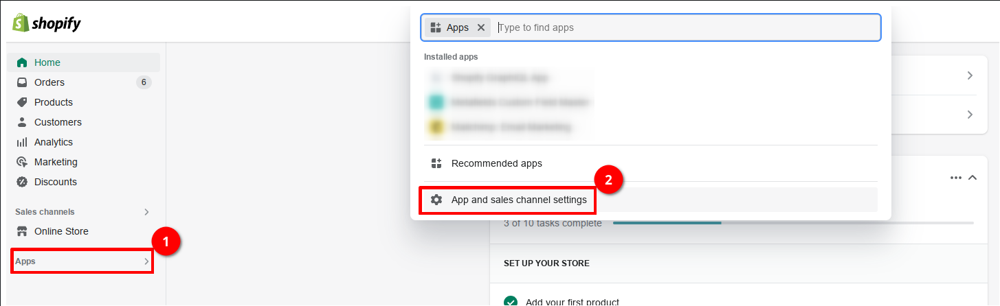
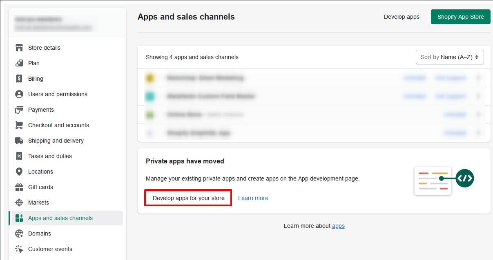
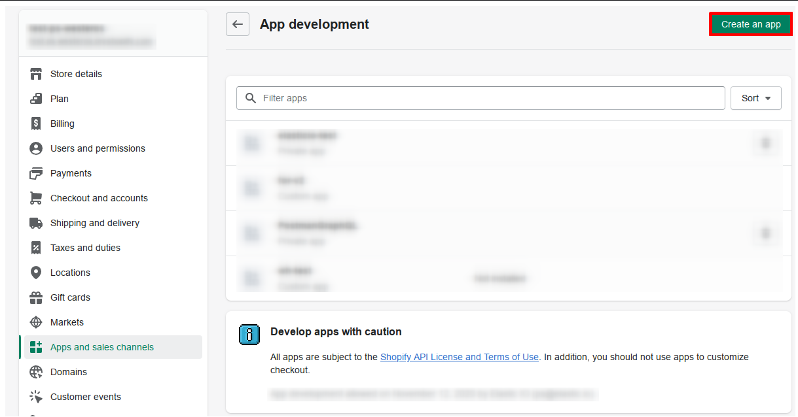
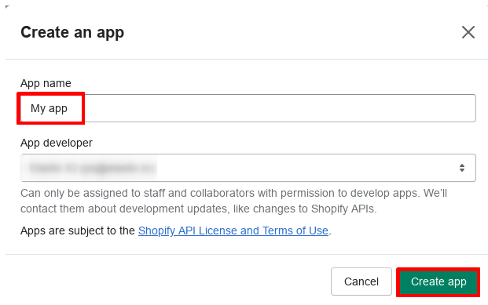
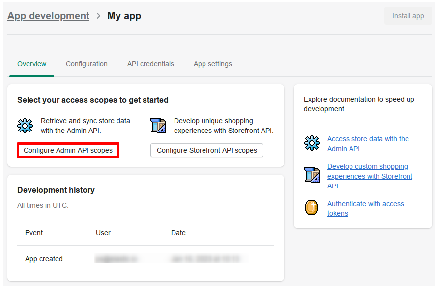
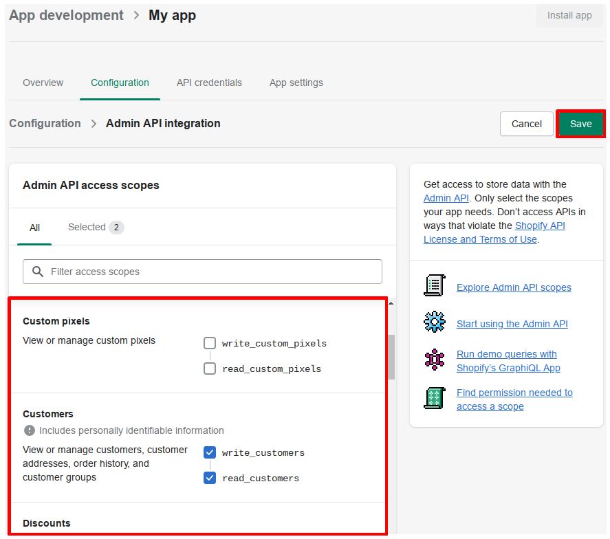
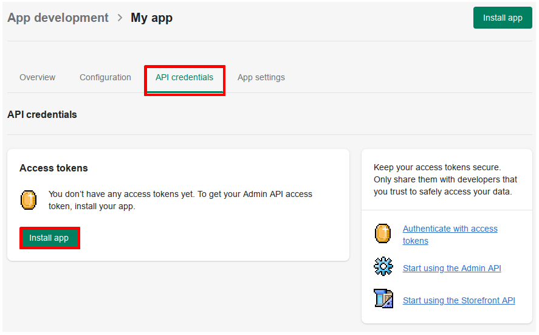
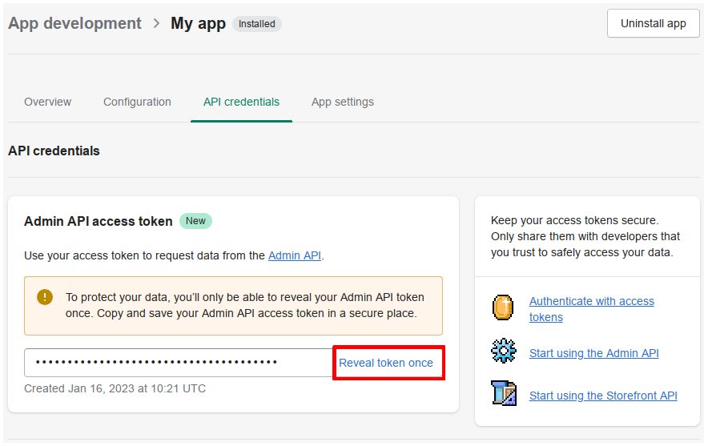

</details>

</details> <br>

Component credentials configuration fields: 
* **Store name** (string, required) - Provide your store name here. It can be found in the [Admin panel](https://accounts.shopify.com/store-login) as part of the store URL. <details></details>
* **Client ID** (string, optional) - The client ID for the app.
* **Client Secret** (string, optional) - The client secret for the app.
* **Admin API access token** (string, optional, **deprecated**) - The token obtained after app creation (see deprecated instructions above).
* **API version** (string, required) - The API version you intend to work with. The component has been tested on `2023-01`, but it is designed to work with any available version.
* **API secret key** (string, optional) - This field is required **only** for the `Webhook` trigger to [verify requests with an HMAC header](https://shopify.dev/apps/webhooks/configuration/https#step-5-verify-the-webhook).

> **Please Note:**
* The `Admin API access token` is shown only once.
* To rotate the API credentials for a custom app created in the Shopify admin, you must uninstall and reinstall the app.

## Actions

### Delete Object

Shopify objects can be deleted using the [Execute Mutation action](#execute-mutation).

To do this, filter the list of available mutation types in the `Mutation type` configuration field using keywords like `Delete` or `Remove`.

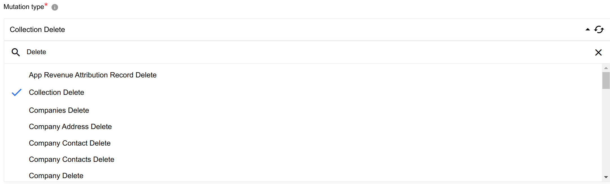

In most cases, you will receive one input metadata field for the object identifier.

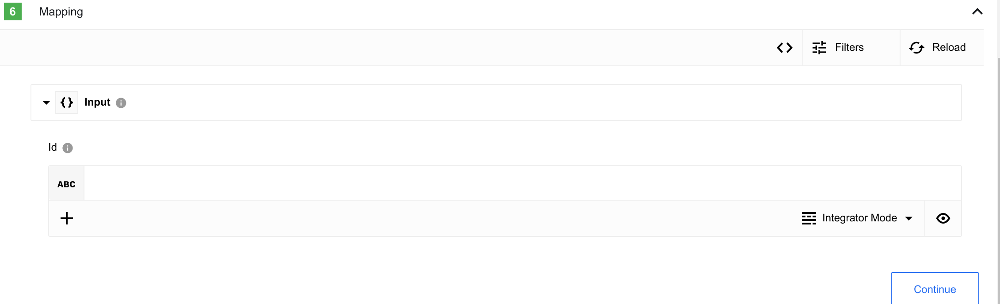

<details close markdown="block"><summary><strong>Example of input metadata to delete a customer</strong></summary>

``` json
{
  "input": {
    "id": "gid://shopify/Customer/6657016299696"
  }
}
```
</details>

<details close markdown="block"><summary><strong>Example of input metadata to delete multiple companies</strong></summary>

``` json
{
  "companyIds": ["gid://shopify/Company/68616368"]
}
```
</details>

<details close markdown="block"><summary><strong>Example of input metadata to bulk delete draft orders using search</strong></summary>

```json
{
  "search": "query=name:\"#D12\""
}
```

</details>

### Create Object

Shopify objects can be created using the [Execute Mutation action](#execute-mutation).

To do this, filter the list of available mutation types in the `Mutation type` configuration field using the `Create` keyword.

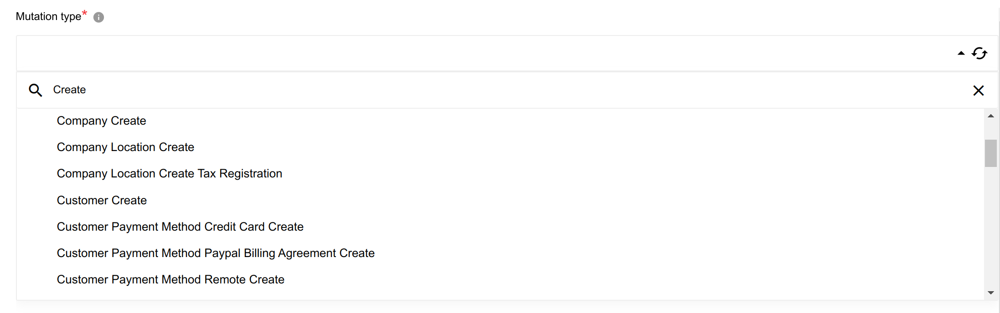

The input metadata will represent all the fields required to create the object.

<details close markdown="block"><summary><strong>Example of input metadata to create a customer</strong></summary>

``` json
{
  "input": {
    "firstName": "NewUser"
  }
}
```

</details>

### Update Object

Shopify objects can be updated using the [Execute Mutation action](#execute-mutation).

To do this, filter the list of available mutation types in the `Mutation type` configuration field using the `Update` keyword.

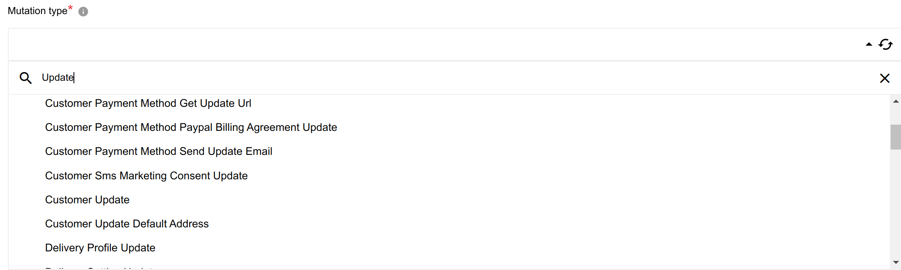

The input metadata will represent all the fields required to update the object.

<details close markdown="block"><summary><strong>Example of input metadata to update a customer</strong></summary>

  ``` json
{
  "input": {
    "firstName": "NewUser2",
    "id": "gid://shopify/Customer/6664472461488"
  }
}
```

</details>

### Upsert Object 

Updates an existing record or creates a new one if no match is found.

#### Configuration Fields

* **Object type** - (dropdown, required): Currently, only `Customers` are supported.
* **Unique field to upsert** - (dropdown, required): This field is used to search for the object. If no object is found or the field is empty, a new object will be created.
* **Select basic fields for resulting object** - (dropdown, optional): Provides basic fields to include in the resulting object. Selecting fewer fields may reduce query costs.
* **You can provide additional fields here** - (string, optional): Expand the resulting object using a GraphQL request. This may affect the query cost.
Example for customer:
  ```
    customer {
      addresses {
        city
      }
    }
  ```
> **Please Note**: You must select basic fields or provide additional fields for the resulting object to execute the mutation.
* **Input as batch** - (checkbox, optional): If checked, the input metadata will be an array instead of a single object.

#### Input Metadata

Dynamically generated fields based on the chosen `Object type`.

#### Output Metadata

The resulting object from the upsert operation. 

### Execute Mutation

Executes any mutation available in the selected API version. This action can be used to `Create`, `Update`, or `Delete` objects and perform any other operations affecting Shopify data.

#### Configuration Fields

* **Mutation type** - (dropdown, required): The type of mutation to execute (e.g., `Customer Create`).
* **Select basic fields for resulting object** - (dropdown, optional): Provides basic fields to include in the resulting object.
* **You can provide additional fields here** - (string, optional): Expand the resulting object using a GraphQL request. 

<details close markdown="block"><summary><strong>Example for customer</strong></summary>

```graphql
    customer {
      metafields(first: 2) {
        edges {
          node {
            namespace
            key
            value
          }
        }
      }
      addresses {
        address1
        country
      }
    }
```

</details>

>**Please Note:** You must select basic fields or provide additional fields for the resulting object to execute the mutation.

#### Input Metadata

Dynamically generated fields based on the chosen `Mutation type`.

#### Output Metadata

The resulting object from the executed mutation. 

### Lookup Objects (plural)

Lookup a set of objects based on defined criteria. Results can be emitted in multiple ways.

#### Configuration Fields

* **Object Type** - (dropdown, required): The type of object to lookup (e.g., `Customers`).
* **Select basic fields for resulting object** - (dropdown, optional): Basic fields to include in the resulting object.
* **You can provide additional fields here** - (string, optional): Expand the resulting object using a GraphQL request.
  <details close markdown="block"><summary><strong>Example for customer</strong></summary>
    ```graphql
         addresses {
        address1
        country
      }
    ```
  </details>  
* **Emit Behavior** - (dropdown, required): Defines how result objects will be emitted: `Emit page` or `Emit individually`.
* **Return Full Response** - (checkbox): Defines whether the emitted result includes service information. Examples for Object type `customers`: 
  <details close markdown="block"><summary><strong>Response with `Return Full Response` enabled and `Emit Behavior` = `Emit page`</strong></summary>
    ```json
    {
      "data": {
        "customers": [
          {
            "id": "gid://shopify/Customer/2444144115794",
            "firstName": "Willy"
          },
          {
            "id": "gid://shopify/Customer/2444144148562",
            "firstName": "Tobi"
          },
          {
            "id": "gid://shopify/Customer/2444144181330",
            "firstName": "Mathilde"
          }
        ]
      },
      "extensions": {
        "cost": {
          "requestedQueryCost": 5,
          "actualQueryCost": 5,
          "throttleStatus": {
            "maximumAvailable": 1000,
            "currentlyAvailable": 40,
            "restoreRate": 50
          }
        }
      }
    }
    ```
   </details>

   <details close markdown="block"><summary><strong>Response with `Return Full Response` disabled and `Emit Behavior` = `Emit page`</strong></summary>
   ```json
   {
    "results": [
      {
        "id": "gid://shopify/Customer/2444144115794",
        "firstName": "Willy"
      },
      {
        "id": "gid://shopify/Customer/2444144148562",
        "firstName": "Tobi"
      },
      {
        "id": "gid://shopify/Customer/2444144181330",
        "firstName": "Mathilde"
      }
    ]
   }
  ```
  </details>

* **Number of search terms** - (number, optional): The number of search terms (positive integer [1-99] or 0).
* **Emit empty object if no entities found** - (checkbox): If enabled, the component will emit an empty object instead of skipping execution when no objects are found.

#### Input Metadata

* **First** - (string, optional): Indicates the number of objects per execution. Defaults to 250.
  Input metadata depends on the `Number of search terms` configuration field.
  - If `Number of search terms` is empty or `0`, additional fields will not be generated.
  - If `Number of search terms` = 1, one search term will be added.
  - If `Number of search terms` > 1, the corresponding number of search terms and logical operators will be created.

Each search term consists of:
* **Field name** - The entity field name. Select a value from the Allowed Values dropdown.
  > **Please Note**: Use the `-` sign for the `NOT` modifier (see [Shopify documentation](https://shopify.dev/docs/api/usage/search-syntax#modifiers)).
* **Condition** - The condition for the search term.
* **Field value** - The value the field must match.
  Search terms are linked by logical operators (e.g., `AND`).


#### Output Metadata

Dynamically generated fields based on the chosen `Object type` and selected fields.
For `Emit Page` mode: An object with a `results` key containing an array.
For `Emit Individually` mode: Each object is emitted as a separate message.

#### Example

To execute the following Shopify query:

```graphql
query{
    customers(first:10 query:"country:Canada AND -state:DISABLED"){
        edges{
            node{
                id
                state
                firstName
                addresses{
                    country
                }
            }
        }
    }
}
```

1. Select `Customers` in `Object type`.
2. From the `Select basic fields` dropdown, select `id`, `state`, and `firstName`.
3. Enter additional fields (e.g., `addresses{country}`) in the `Additional fields` section.
4. Select `Emit Individually` for `Emit Behavior`.
5. Set `Number of search terms` to `2`.
6. Click `Continue` and proceed to metadata mapping.
7. Set `First` to `10`.
8. Map the first condition: `Field name` = `country`, `Condition` = `:`, `Field value` = `Canada`.
9. Set `Logical operator` to `AND`.
10. Map the second condition: `Field name` = `-state`, `Condition` = `:`, `Field value` = `DISABLED`.
11. Click `Continue` to retrieve a sample and finish configuration.

### Lookup Object By ID

Retrieves a single object by its ID.

#### Configuration Fields

* **Object Type** - (dropdown, required): The type of object to lookup (e.g., `Customer`).
* **Select basic fields for resulting object** - (dropdown, optional): Basic fields to include.
* **You can provide additional fields here** - (string, optional): Expand the resulting object using a GraphQL request.

<details close markdown="block"><summary><strong>Example for customer</strong></summary>

  ```graphql
    addresses {
      address1
      country
  }
  ```

</details>

{% include img.html max-width="100%" url="img/lookup-by-id.png" title="Lookup Object By ID" %}

#### Input Metadata

* **ID Value** - (string, required): The ID of the object to lookup.

#### Output Metadata

Dynamically generated fields based on the chosen `Object type` and selected fields.

### Make Raw Request

Executes a custom HTTP request.

#### Configuration Fields

There is no configuration fields in this action.

#### Input Metadata

* **Url** - (string, required): The resource path relative to the base URL (`https://{store_name}.myshopify.com/admin/api/{api_version}/`) or a full URL.
* **Method** - (string, required): The HTTP method (`GET`, `POST`, `PUT`, `PATCH`, `DELETE`).
* **Request Body** - (object, optional): The body of the request.

#### Output Metadata

* **Status Code** - (number, required): The HTTP status code of the response.
* **HTTP headers** - (object, required): The HTTP response headers.
* **Response Body** - (object, optional): The HTTP response body.

> **Please Note:** Both GraphQL and REST API endpoints are supported.

#### GraphQL
* **URL** - `/graphql.json`.
* **Method** - `POST`.
* **Request Body** - `{"query": "query { products(first: 10) { edges { node { id title } } } }"}`.

#### REST
- **URL** - `/products.json?fields=id,title`.
- **Method** - `POST`.
* **Request Body** - `{}`.

## Triggers

### Get New and Updated Objects Polling

Retrieves all updated or created objects within a specified time range.

#### Configuration Fields

* **Object Type** - (dropdown, required): The type of object to lookup (e.g., `Customers`).
* **Timestamp field to poll on** - (dropdown, required): Choose between `Last Modified` or `Created` dates.
* **Select basic fields for resulting object** - (dropdown, optional): Basic fields to include.
* **You can provide additional fields here** - (string, optional): Expand the resulting object. This field represents content from `edges.node`. 
    <details close markdown="block"><summary><strong>Example for Customers</strong></summary>
    ```graphql
    metafields(first: 2) {
      edges {
        node {
          namespace
          key
          value
        }
      }
    }
    addresses {
      address1
      country
    }
  ```
    </details>
* **Size of Polling Page** - (optional, positive integer, defaults to 250, max 250): The number of records to fetch per request. Reduce this if you encounter rate limit issues. 
* **Emit behavior** - (dropdown, optional): Defines the emission behavior: `Emit individually` (default) or `Emit page`.
* **Return Full Response** - (checkbox): Defines whether the emitted result includes service information.
* **Start Time** - (string, optional): The ISO8601 timestamp to start polling from (inclusive). Defaults to the beginning of time (January 1, 1970, 00:00:00.000Z). 
* **End Time** - (string, optional): The ISO8601 timestamp to end at (inclusive). If specified, the trigger will only fetch records up to this time. Once the end time is reached, the trigger will stop fetching new data. Defaults to the current time of execution.

#### Input Metadata

There is no input metadata.

#### Output Metadata

The resulting object represents the content from the path `data\{Object Type}\edges\node`. Output depends on the selected `Object Type`, fields, and `Emit behavior`.

### Webhook

Creates [webhook subscriptions](https://shopify.dev/docs/api/admin-graphql/2024-01/mutations/webhookSubscriptionCreate) for selected topics to receive real-time events.

#### Configuration Fields

* **Select topics** - (multi-select dropdown, required): Choose topics for the subscription.
* **Skip validation** - (checkbox, optional): If enabled, the component will not verify that incoming messages originate from Shopify. Use for testing only.

#### Input Metadata

There is no input metadata.

#### Output Metadata
The event data from the subscription topic.

#### Limitations
* **Generate Stub Sample** works only for commonly used objects.
* This trigger does not support the `Retrieve sample` functionality.
* In standard flows, the flow must be executed once after starting to create the subscription (e.g., by visiting the webhook URL).

## Known limitations

* Refer to the [Shopify API rate limits](https://shopify.dev/api/usage/rate-limits) and [GraphQL Admin API rate limits](https://shopify.dev/api/usage/rate-limits#graphql-admin-api-rate-limits).
* If the component reaches an API rate limit, it will retry the request up to 10 times after waiting for the quota to restore. For example, if a query costs 500 points and only 100 are available with a restore rate of 50 points/second, the component will wait 8 seconds before retrying.
* Multiple flows running simultaneously can impact the total available points. If the component cannot retrieve data after 10 retries, a `"Throttled"` error will be thrown.