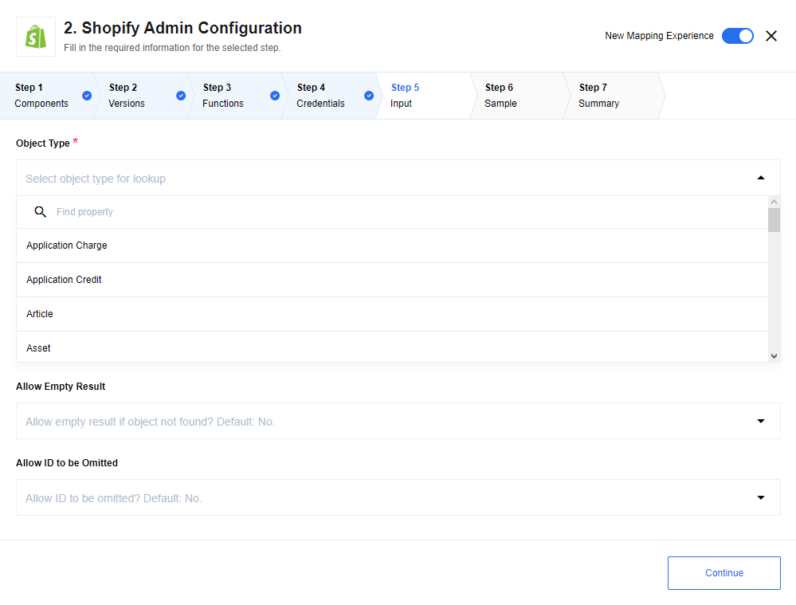
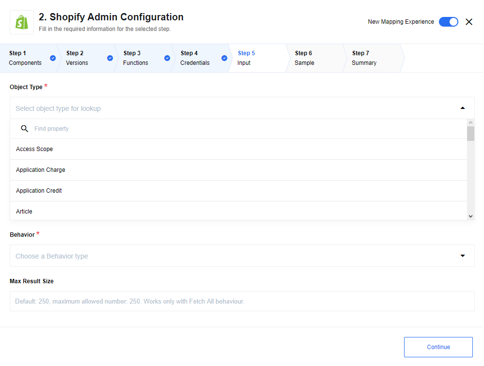
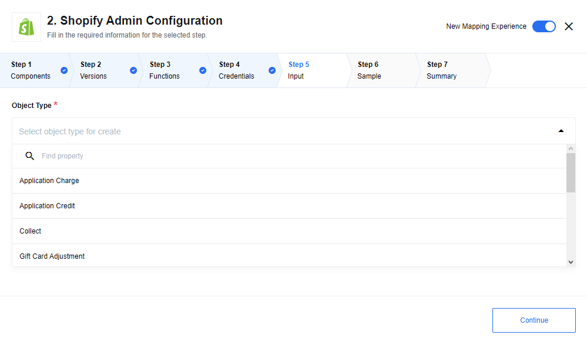
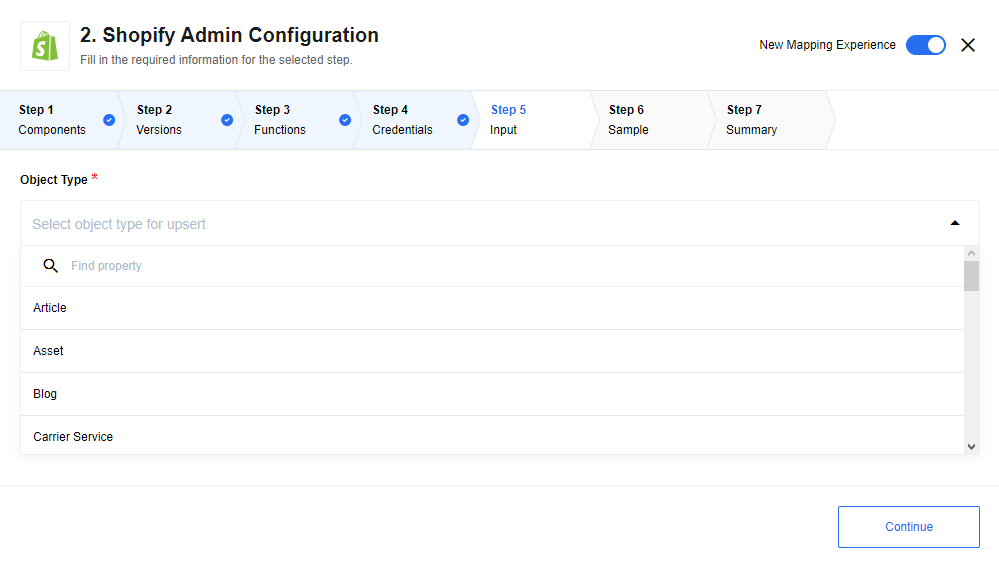
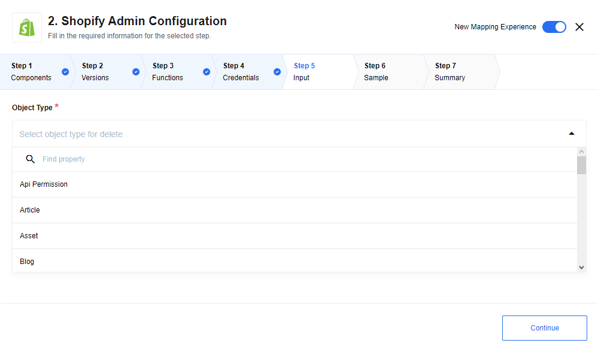

## Lookup Object

Finds object by id.



### List of Expected Config fields

  * **Object Type -** Type of object for polling.

  * **Allow Empty Result -** Default `No`. In case `No` is selected - an error will be thrown when no objects were found, If `Yes` is selected - an empty object will be returned instead of throwing an error.

  * **Allow ID to be Omitted -** Default `No`. In case `No` is selected - an error will be thrown when object id is missing in metadata, if `Yes` is selected - an empty object will be returned instead of throwing an error.

  * **Expected input metadata -** Input metadata contains `id` or several `ids` fields (some object types have complex id):

  1. Object type `Shop` - does not have `id` empty input expected in message.

  2. Type Objects with complex id: `Article`, `Asset`, `Checkout`, `Customer Address`, `Discount Code`, `Fulfillment`, `Fulfillment Event`, `Gift Card Adjustment`, `Inventory Level`,  `Order Risk`,  `Payment`,  `Product Image`,  `Product Listing`,  `Product Variant`, `Province`, `Refund`, `Shop`, `Usage Charge`

  * **Fetch Metafields for Object -** If selected, in addition to returning the built-in fields associated with the object,
  return the metafields.

## Lookup Objects



### List of Expected Config fields

  * **Object Type -** Type of object for polling.

  * **Behavior -** `Fetch All` - fetch all objects in one message in form of array, `Emit Individually` - emit each fetched object as separate message.

  * **Max Size -** Maximum number of objects to fetch. Default `250`, maximum value is `250`.

  * **Fetch Metafields for Objects -** If selected, in addition to returning the built-in fields associated with the objects,
return the metafields.

### Expected Input metadata

1.  `idField` - object types: `Article`, `Asset`, `Article`, `Customer Address`, `Discount Code`, `Inventory Item`, `Inventory Level`, `Fulfillment`, `Order Risk`, `Refund`, `Transaction`, `Fulfillment Event`, `Gift Card Adjustment`, `Payment`, `Product Image`, `Product Variant`, `Province`, `Usage Charge` require id of parent object to be passed in input metadata.

2.  `order` - add ability to sort items.`fieldName`: name of field for sorting objects, only fields of type: `string`, `number`, `boolean` supported. `orderDirection`: asc or desc defines direction of sorting.

3.  `filter` - add ability filter item from result. `searchTerm`: `fieldName` - name of field to apply filter. `condition` - `eq` equal, `ne` not equal, `gt` greater, `ge` greater or equal, `lt` less, `le` less or equal apply provided condition to field. `fieldValue` - value to be used by condition in comparing with `value` in object field. It is possible to chain few conditions via: `criteriaLink` - `and`, `or` chain with previous condition by provided operator.

### Example of usage

1.  Object Type - `Country`,
2.  Behaviour - `Fetch All`,
3.  Max Size - `20`

```json
{
  "order": {
    "fieldName": "code",
    "orderDirection": "desc"
  },
  "filter": [
    {
      "searchTerm": {
        "fieldName": "tax",
        "condition": "gt",
        "fieldValue": "0"
      },
      "criteriaLink": "and"
    }
  ]
}
```

Will return maximum 20 objects of type Country ordered by their code and filtered
where tax value greater then 0.

## Create Object

Action to create new object instance. Only for object that can't be updated.



### List of Expected Config fields

* **Object Type -** Type of object for polling.

 See the section [Metafields Notes](/components/shopify-admin#metafield-notes) for information about setting metafield values.

### Example of usage

Object Type: `Order`

Input message:

```json
{
    "title": "Apple main blog second",
}
```

Output message:

```json
{
  "id": 49341497426,
  "handle": "apple-main-blog-second-9",
  "title": "Apple main blog second",
  "updated_at": "2019-11-14T04:54:30-05:00",
  "commentable": "no",
  "feedburner": null,
  "feedburner_location": null,
  "created_at": "2019-11-14T04:54:30-05:00",
  "template_suffix": null,
  "tags": "",
  "admin_graphql_api_id": "gid://shopify/OnlineStoreBlog/49341497426"
}
```

## Upsert Object

Upsert Object action is useful if it isn't known if there is already an object in the system. Action determines if the data needs to be matched to an existing object or added to a new one.
Only for objects that can be created and updated.



### List of Expected Config fields

* **Object Type -** Type of object for polling.

### Example of usage

Object Type: `Article`

Input message:

```json
{
    "id": 383343525970,
    "blog_id": 47884042322,
    "title": "My new title",
}
```

Output message:

```json
{
  "id": 383343525970,
  "title": "My new Title",
  "created_at": "2019-11-12T08:27:49-05:00",
  "body_html": "Hello, it's a test blog",
  "blog_id": 47884042322,
  "author": "test Admin",
  "user_id": 38430933074,
  "published_at": "2019-11-12T08:27:00-05:00",
  "updated_at": "2019-11-19T10:21:40-05:00",
  "summary_html": "",
  "template_suffix": null,
  "handle": "test-blog-post",
  "tags": "",
  "admin_graphql_api_id": "gid://shopify/OnlineStoreArticle/383343525970"
}
```

## Delete Object



### List of Expected Config fields

* **Object Type -** Type of object for polling.

### Expected input metadata

For most type of objects: `{ "id" : "object id" }`

Special cases:

1. Api Permission - this type of object does not have `id`. Empty object expected as input for this type.

2. Article -  `{ "id" : "object id",  "blodId" : "Blog Id" }`.

3. Asset - `{ "key" : "object id",  "themeId" : "Theme Id" }`.

4. Customer Address - `{ "id" : "object id",  "customerId" : "Customer Id" }`.

5. Discount Code - `{ "id" : "object id",  "priceRuleId" : "Price Rule Id" }`.

6. Fulfillment Event - `{ "id" : "object id",  "orderId" : "Order Id", "fulfillmentId" : "Fulfillment Id" }`.

7. Inventory Level - `{ "params" : { "inventory_item_id" : "Inventory Item Id", "location_id" : "Location Id" }}`.

8. Order Risk - `{ "id" : "object id",  "orderId" : "Order Id" }`.

9. Product Image - `{ "id" : "object id",  "productId" : "Product Id" }`.

10. Product Variant - `{ "id" : "object id",  "productId" : "Product Id" }`.

### Expected output metadata

Output: `{ "id" : "object id" }` means that object was successfully deleted. Output: `{}` means that object hasn`t been deleted.`

Special cases:

1. Api Permission - this type of object does not have `id`, in case of successful deletion of this object type: `{ "id" : "Successfully deleted API Permission object"}` returned.

2. Inventory Level - this type of object does not have `id`, in case of successful deletion of this object type: `{ "id" : { "inventory_item_id" : "Inventory item id", "location_id": "Location id" }}`

### Example of usage

Object Type: `Order`

Input message:

```json
{
    "id" : "1213"
}
```

Output message:

```json
{
    "id" : "1213"
}
```

## List Products(deprecated)

This actions is deprecated. Use [Lookup Object](/components/shopify-admin/actions#lookup-object) action instead.

### Usage example

input message:

```json
{
	"ids": [
		"814083178540"
	],
	"limit": 3,
	"page": 1,
	"since_id": 0,
	"title": "new product",
	"vendor": null,
	"handle": null,
	"product_type": null,
	"collection_id": null,
	"created_at_min": "2018-04-22T11:04:58-04:00",
	"created_at_max": null,
	"updated_at_min": null,
	"updated_at_max": null,
	"published_at_min": null,
	"published_at_max": null,
	"published_status": "any"
}
```

output message:

```json
{
	"result": [
		{
			"id": 814083178540,
			"title": "my new product 1",
			"body_html": "description of my new product 1",
			"vendor": "fredddy123store",
			"product_type": "",
			"created_at": "2018-04-19T09:36:10-04:00",
			"handle": "my-new-product-1",
			"updated_at": "2018-04-23T11:04:58-04:00",
			"published_at": "2018-04-19T09:34:40-04:00",
			"template_suffix": null,
			"published_scope": "web",
			"tags": "",
			"variants": [
				{
					"id": 8771018031148,
					"product_id": 814083178540,
					"title": "Default Title",
					"price": "10.50",
					"sku": "",
					"position": 1,
					"inventory_policy": "deny",
					"compare_at_price": "11.00",
					"fulfillment_service": "manual",
					"inventory_management": null,
					"option1": "Default Title",
					"option2": null,
					"option3": null,
					"created_at": "2018-04-19T09:36:10-04:00",
					"updated_at": "2018-04-19T09:36:10-04:00",
					"taxable": true,
					"barcode": "",
					"grams": 0,
					"image_id": null,
					"inventory_quantity": 1,
					"weight": 0,
					"weight_unit": "kg",
					"inventory_item_id": 8852818395180,
					"old_inventory_quantity": 1,
					"requires_shipping": false
				}
			],
			"options": [
				{
					"id": 1180400189484,
					"product_id": 814083178540,
					"name": "Title",
					"position": 1,
					"values": [
						"Default Title"
					]
				}
			],
			"images": [
				{
					"id": 2887637663788,
					"product_id": 814083178540,
					"position": 1,
					"created_at": "2018-04-19T09:36:12-04:00",
					"updated_at": "2018-04-19T09:36:12-04:00",
					"alt": null,
					"width": 1919,
					"height": 983,
					"src": "Example.jpg",
					"variant_ids": []
				}
			],
			"image": {
				"id": 2887637663788,
				"product_id": 814083178540,
				"position": 1,
				"created_at": "2018-04-19T09:36:12-04:00",
				"updated_at": "2018-04-19T09:36:12-04:00",
				"alt": null,
				"width": 1919,
				"height": 983,
				"src": "Example.jpg",
				"variant_ids": []
			}
		}
	]
}
```

## Upsert Product(deprecated)

This actions is deprecated. Use [Upsert Objects](#upsert-object) action instead.

### Usage example

input message:

```json
{
	"id": "814083178540",
	"body_html": "It's the small iPod with a big idea: Video.",
	"handle": "ipod-nano",
	"images": [
		{
			"position": 1,
			"width": 100,
			"height": 100,
			"src": "Example.jpg",
			"variant_ids": [
				"808950810"
			]
		}
	],
	"options": [
		{
			"name": "Color",
			"values": [
				"Blue",
				"Black"
			]
		}
	],
	"product_type": "Cult Products",
	"published_scope": "global",
	"tags": "Emotive, Flash Memory, MP3, Music",
	"template_suffix": "product.liquid",
	"title": "my new product 1 - ASD",
	"metafields_global_title_tag": "IPod Nano - White, 8GB",
	"metafields_global_description_tag": "It's the small iPod with a big idea: Video.",
	"variants": [
		{
			"barcode": "1234_pink",
			"compare_at_price": 250,
			"fulfillment_service": "manual",
			"grams": 567,
			"weight": 0.2,
			"weight_unit": "kg",
			"inventory_management": "shopify",
			"inventory_policy": "continue",
			"inventory_quantity": 10,
			"option1": "Pink",
			"position": 1,
			"price": 239.99,
			"requires_shipping": true,
			"sku": "IPOD2008PINK",
			"taxable": true,
			"title": "Pink"
		}
	],
	"vendor": "Apple"
}
```

output message:

```json
{
	"result": {
		"id": 814083178540,
		"title": "my new product 1 - ASD",
		"body_html": "It's the small iPod with a big idea: Video.",
		"vendor": "Apple",
		"product_type": "Cult Products",
		"created_at": "2018-04-19T09:36:10-04:00",
		"handle": "ipod-nano-12",
		"updated_at": "2018-04-26T06:12:03-04:00",
		"published_at": "2018-04-19T09:34:40-04:00",
		"template_suffix": "product.liquid",
		"published_scope": "web",
		"tags": "Emotive, Flash Memory, MP3, Music",
		"variants": [
			{
				"id": 8932338991148,
				"product_id": 814083178540,
				"title": "Pink",
				"price": "239.99",
				"sku": "IPOD2008PINK",
				"position": 1,
				"inventory_policy": "continue",
				"compare_at_price": "250.00",
				"fulfillment_service": "manual",
				"inventory_management": "shopify",
				"option1": "Pink",
				"option2": null,
				"option3": null,
				"created_at": "2018-04-26T06:12:03-04:00",
				"updated_at": "2018-04-26T06:12:03-04:00",
				"taxable": true,
				"barcode": "1234_pink",
				"grams": 200,
				"image_id": null,
				"inventory_quantity": 10,
				"weight": 0.2,
				"weight_unit": "kg",
				"inventory_item_id": 9031879360556,
				"old_inventory_quantity": 10,
				"requires_shipping": true
			}
		],
		"options": [
			{
				"id": 1180400189484,
				"product_id": 814083178540,
				"name": "Color",
				"position": 1,
				"values": [
					"Pink"
				]
			}
		],
		"images": [
			{
				"id": 2965072117804,
				"product_id": 814083178540,
				"position": 1,
				"created_at": "2018-04-26T06:12:03-04:00",
				"updated_at": "2018-04-26T06:12:03-04:00",
				"alt": null,
				"width": 626,
				"height": 626,
				"src": "Example.jpg",
				"variant_ids": []
			}
		],
		"image": {
			"id": 2965072117804,
			"product_id": 814083178540,
			"position": 1,
			"created_at": "2018-04-26T06:12:03-04:00",
			"updated_at": "2018-04-26T06:12:03-04:00",
			"alt": null,
			"width": 626,
			"height": 626,
			"src": "Example.jpg",
			"variant_ids": []
		}
	}
}
```

## Delete Product(deprecated)

This actions is deprecated. Use [Delete Object](#delete-object) action instead.

### Usage example

input message:

```json
{
	"id": "814083178540"
}
```

output message:

```json
{
	"deleted": true,
	"productId": "814083178540"
}
```

## Get Product(deprecated)

This actions is deprecated. Use [Lookup Object](/components/shopify-admin/actions#lookup-object) action instead.

### Usage example

input message:

```json
{
	"id": "833638662188",
	"fields": [
		"id",
		"title",
		"createdAt"
	]
}
```

output message:

```json
{
	"result": {
		"id": 833638662188,
		"title": "123 123 IPod Nano - 8GB",
		"created_at": "2018-04-24T11:46:06-04:00"
	}
}
```

## Count Products(deprecated)

This actions is deprecated. Use [Delete Object](/components/shopify-admin/actions#delete-object) action instead.

### Usage example

input message:

```json
{
	"vendor": null,
	"product_type": null,
	"collection_id": null,
	"created_at_min": null,
	"created_at_max": null,
	"updated_at_min": null,
	"updated_at_max": null,
	"published_at_min": null,
	"published_at_max": null,
	"published_status": null
}
```

output message:

```json
{
	"result": 15
}
```

## Create Product Image(deprecated)

This actions is deprecated. Use [Upsert Object](/components/shopify-admin/actions#upsert-object) action instead.

### Usage example

input message:

```json
{
	"productId": "814083178540",
	"position": 2,
	"variant_ids": [
		"8932338991148"
	],
	"src": "Example.jpg",
	"attachment": "",
	"filename": "",
	"alt": "image alt",
	"metafields": [
		{
			"key": "new",
			"value": "newvalue",
			"value_type": "string",
			"namespace": "global"
		}
	],
	"width": 640,
	"height": 480
}
```

output message:

```json
{
	"result": {
		"id": 3004333031468,
		"product_id": 814083178540,
		"position": 2,
		"created_at": "2018-04-30T06:02:06-04:00",
		"updated_at": "2018-04-30T06:02:07-04:00",
		"alt": "image alt",
		"width": 770,
		"height": 433,
		"src": "Example.jpg",
		"variant_ids": []
	}
}
```

## Update Product Image(deprecated)

This actions is deprecated. Use [Upsert Object](/components/shopify-admin/actions#upsert-object) action instead.

### Usage example

input message:

```json
{
	"productId": "814083178540",
	"imageId": "2978401321004",
	"position": 3,
	"variant_ids": [
		"8932338991148"
	],
	"src": "Example.jpg",
	"attachment": "",
	"filename": "",
	"alt": "image alt 2",
	"metafields": [
		{
			"key": "new",
			"value": "newvalue",
			"value_type": "string",
			"namespace": "global"
		}
	],
	"width": 640,
	"height": 480
}
```

output message:

```json
{
	"result": {
		"id": 2978401321004,
		"product_id": 814083178540,
		"position": 3,
		"created_at": "2018-04-27T10:24:34-04:00",
		"updated_at": "2018-04-30T06:07:51-04:00",
		"alt": "image alt 2",
		"width": 770,
		"height": 433,
		"src": "Example.jpg",
		"variant_ids": [
			8932338991148
		]
	}
}
```

## Delete Product Image(deprecated)

This actions is deprecated. Use [Upsert Object](/components/shopify-admin/actions#upsert-object) action instead.

### Usage example

input message:

```json
{
	"productId": "814083178540",
	"imageId": "3004381331500"
}
```

output message:

```json
{
	"result": {
		"deleted": true,
		"productId": "814083178540",
		"imageId": "3004381331500"
	}
}
```

## List Inventory Items(deprecated)

This actions is deprecated. Use [Lookup Object](/components/shopify-admin/actions#lookup-object) action instead.

### Usage example

input message:

```json
{
	"ids": [
		"8994203271212",
		"8994177056812"
	],
	"page": 1,
	"limit": 10
}
```
output message:

```json
{
	"result": [
		{
			"id": 8994177056812,
			"sku": "",
			"created_at": "2018-04-24T11:44:31-04:00",
			"updated_at": "2018-04-24T11:44:31-04:00",
			"tracked": false
		},
		{
			"id": 8994203271212,
			"sku": "IPOD2008PINK",
			"created_at": "2018-04-24T11:46:06-04:00",
			"updated_at": "2018-04-24T11:46:06-04:00",
			"tracked": true
		}
	]
}
```

## Get Inventory Item(deprecated)

This actions is deprecated. Use [Lookup Object](/components/shopify-admin/actions#lookup-object) action instead.

### Usage example

input message:

```json
{
	"id": "8994203271212"
}
```

output message:

```json
{
	"result": {
		"id": 8994203271212,
		"sku": "IPOD2008PINK",
		"created_at": "2018-04-24T11:46:06-04:00",
		"updated_at": "2018-04-24T11:46:06-04:00",
		"tracked": true
	}
}
```

## Update Inventory Item(deprecated)

This actions is deprecated. Use [Upsert Object](/components/shopify-admin/actions#upsert-object) action instead.

### Usage example

input message:

```json
{
	"id": "8994203271212",
	"sku": "new sku",
	"tracked": false
}
```

output message:

```json
{
	"result": {
		"id": 8994203271212,
		"sku": "new sku",
		"created_at": "2018-04-24T11:46:06-04:00",
		"updated_at": "2018-04-30T09:15:05-04:00",
		"tracked": false
	}
}
```

## Create Product Variant(deprecated)

This actions is deprecated. Use [Upsert Object](/components/shopify-admin/actions#upsert-object) action instead.

### Usage example

input message:

```json
{
	"productId": "814083178540",
	"barcode": "1234_pink",
	"compare_at_price": 599.99,
	"fulfillment_service": "manual",
	"grams": 567,
	"image_id": "",
	"inventory_item_id": "",
	"inventory_management": "shopify",
	"inventory_policy": "continue",
	"inventory_quantity": 10,
	"old_inventory_quantity": 5,
	"inventory_quantity_adjustment": 5,
	"metafields": [
		{
			"key": "new",
			"value": "newvalue",
			"value_type": "string",
			"namespace": "global"
		}
	],
	"option1": "new Pink",
	"position": 1,
	"price": 399,
	"requires_shipping": true,
	"sku": "sku 123",
	"taxable": false,
	"tax_code": "",
	"title": "Pink 11",
	"weight": 100,
	"weight_unit": "oz"
}
```

output message:

```json
{
	"result": {
		"id": 9010709037100,
		"product_id": 814083178540,
		"title": "new Pink",
		"price": "399.00",
		"sku": "sku 123",
		"position": 1,
		"inventory_policy": "continue",
		"compare_at_price": "599.99",
		"fulfillment_service": "manual",
		"inventory_management": "shopify",
		"option1": "new Pink",
		"option2": "",
		"option3": "",
		"created_at": "2018-04-30T09:36:58-04:00",
		"updated_at": "2018-04-30T09:36:58-04:00",
		"taxable": false,
		"barcode": "1234_pink",
		"grams": 2835,
		"image_id": "",
		"inventory_quantity": 10,
		"weight": 100,
		"weight_unit": "oz",
		"inventory_item_id": 9120577257516,
		"old_inventory_quantity": 10,
		"requires_shipping": true
	}
}
```

## Update Product Variant(deprecated)

This actions is deprecated. Use [Upsert Object](/components/shopify-admin/actions#upsert-object) action instead.

### Usage example

input message:

```json
{
	"id": "9010709037100",
	"productId": "814083178540",
	"barcode": "1234_pink",
	"compare_at_price": 599.99,
	"fulfillment_service": "manual",
	"grams": 567,
	"image_id": "",
	"inventory_item_id": "",
	"inventory_management": "shopify",
	"inventory_policy": "continue",
	"inventory_quantity": 10,
	"old_inventory_quantity": 5,
	"inventory_quantity_adjustment": 5,
	"metafields": [
		{
			"key": "new1",
			"value": "newvalue1",
			"value_type": "string",
			"namespace": "global"
		}
	],
	"option1": "new Pink",
	"position": 1,
	"price": 399,
	"requires_shipping": true,
	"sku": "sku 123",
	"taxable": false,
	"tax_code": "",
	"title": "Pink 22",
	"weight": 100,
	"weight_unit": "oz"
}
```

output message:

```json
{
	"result": {
		"id": 9010709037100,
		"product_id": 814083178540,
		"title": "new Pink",
		"price": "399.00",
		"sku": "sku 123",
		"position": 1,
		"inventory_policy": "continue",
		"compare_at_price": "599.99",
		"fulfillment_service": "manual",
		"inventory_management": "shopify",
		"option1": "new Pink",
		"option2": "",
		"option3": "",
		"created_at": "2018-04-30T09:36:58-04:00",
		"updated_at": "2018-04-30T09:47:59-04:00",
		"taxable": false,
		"barcode": "1234_pink",
		"grams": 2835,
		"image_id": "",
		"inventory_quantity": 15,
		"weight": 100,
		"weight_unit": "oz",
		"inventory_item_id": 9120577257516,
		"old_inventory_quantity": 15,
		"requires_shipping": true
	}
}
```

## Delete Product Variant(deprecated)

This actions is deprecated. Use [Upsert Object](/components/shopify-admin/actions#upsert-object) action instead.

### Usage example

input message:

```json
{
	"id": "9010709037100",
	"productId": "814083178540"
}
```

output message:

```json
{
	"result": {
		"deleted": true,
		"id": "9010709037100",
		"productId": "814083178540"
	}
}
```
