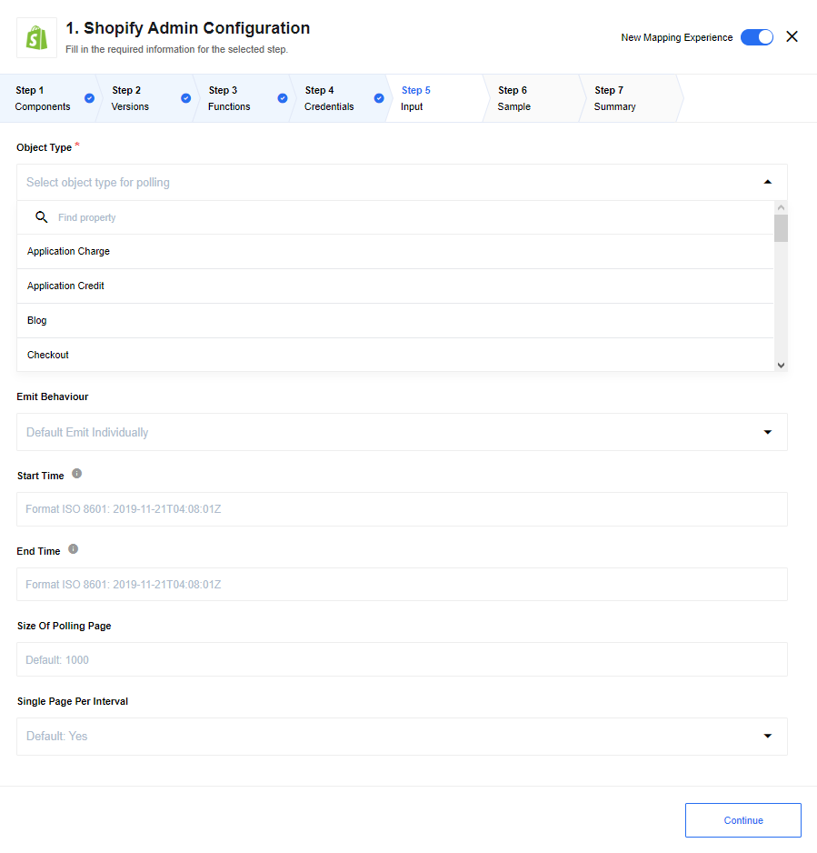

## Polling Trigger

Polls Shopify API for new and updated objects.

### List of Expected Config fields

  * **Object Type -** Type of object for polling.

  * **Emit Behaviour -** Options are: default is `Emit Individually` emits each object in separate message, `Fetch All` emits all objects in one message and `Fetch Page` emits object in messages size of `Size Of Polling Page`

  * **Start Time -** Start datetime of polling. Default min date:`-271821-04-20T00:00:00.000Z`

  * **End Time -** End datetime of polling. Default max date: `+275760-09-13T00:00:00.000Z`

  * **Size Of Polling Page -** Size of polling page, used in Fetch Page behaviour to determine size of emitted message. Default: `1000`

  * **Single Page Per Interval -** If `Yes` polls for one page each execution, if `No` polls for all pages in one execution. Default: `Yes`

  * **Fetch Metafields for Object -** If selected, in addition to returning the built-in fields associated with the object,
  return the metafields.

## Webhook subscription

Creates webhook subscriptions on the Shopify side and receives events to the flow.

### List of Expected Config fields

* **Object Type -** Type of object for polling.

### Links to documentation

You can find more information in the [Webhook Documentation](https://help.shopify.com/en/api/reference/events/webhook).
