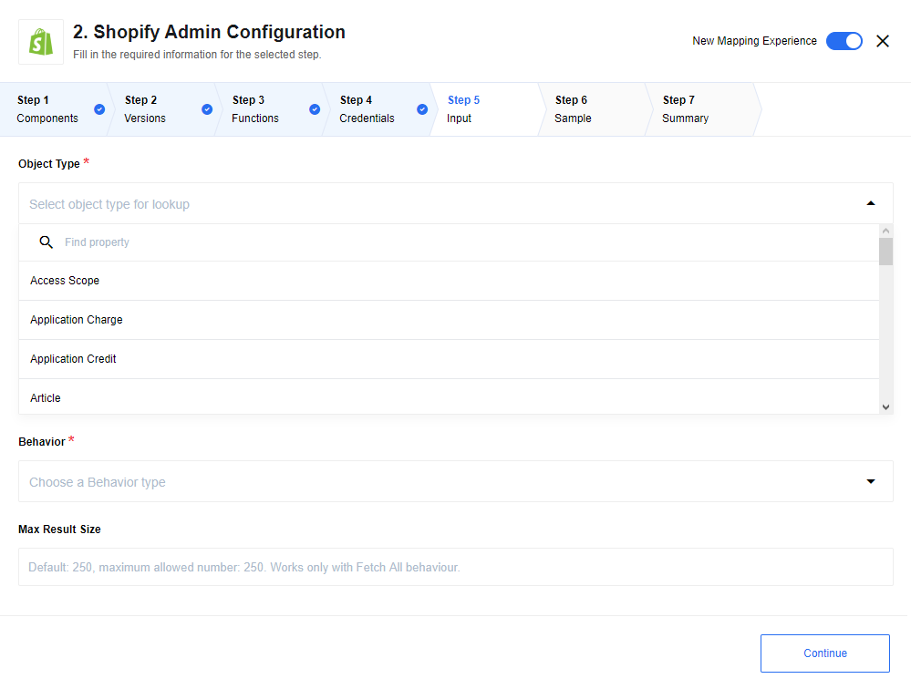

## Lookup Object

Finds object by id.


### List of Expected Configuration fields

*   **Object Type** - Object type for polling.
*   **Allow Empty Result** - Default `No`. In case `No` is selected - an error will be thrown when no objects were found, If `Yes` is selected - an empty object will be returned instead of throwing an error.
*   **Allow ID to be Omitted** - Default `No`. In case `No` is selected - an error will be thrown when object id is missing in metadata, if `Yes` is selected - an empty object will be returned instead of throwing an error.
*   **Expected input metadata** - Input metadata contains `id` or several `ids` fields (some object types have complex id):

  1. Object type `Shop` - does not have `id` empty input expected in message.

  2. Type Objects with complex id: `Article`, `Asset`, `Checkout`, `Customer Address`, `Discount Code`, `Fulfillment`, `Fulfillment Event`, `Gift Card Adjustment`, `Inventory Level`,  `Order Risk`,  `Payment`,  `Product Image`,  `Product Listing`,  `Product Variant`, `Province`, `Refund`, `Shop`, `Usage Charge`

  * **Fetch Metafields for Object -** If selected, in addition to returning the built-in fields associated with the object,
  return the metafields.

## Lookup Objects



### List of Expected Config fields

*   **Object Type** - Object type for polling.
*   **Behavior** - `Fetch All` - fetch all records in one object - `results` in form of array, `Emit Individually` - emit each fetched object as separate message.
*   **Max Size** - Maximum number of objects to fetch. Default `250`, maximum value is `250`.
*   **Fetch Metafields for Objects** - If selected, in addition to returning the built-in fields associated with the objects, return the metafields.

### Expected Input metadata

1.  `idField` - object types: `Article`, `Asset`, `Article`, `Customer Address`, `Discount Code`, `Inventory Item`, `Inventory Level`, `Fulfillment`, `Order Risk`, `Refund`, `Transaction`, `Fulfillment Event`, `Gift Card Adjustment`, `Payment`, `Product Image`, `Product Variant`, `Province`, `Usage Charge` require id of parent object to be passed in input metadata.

2.  `order` - add ability to sort items.`fieldName`: name of field for sorting objects, only fields of type: `string`, `number`, `boolean` supported. `orderDirection`: asc or desc defines direction of sorting.

3.  `filter` - add ability filter item from result. `searchTerm`: `fieldName` - name of field to apply filter. `condition` - `eq` equal, `ne` not equal, `gt` greater, `ge` greater or equal, `lt` less, `le` less or equal apply provided condition to field. `fieldValue` - value to be used by condition in comparing with `value` in object field. It is possible to chain few conditions via: `criteriaLink` - `and`, `or` chain with previous condition by provided operator.

### Example of usage

1.  Object Type - `Country`,
2.  Behaviour - `Fetch All`,
3.  Max Size - `20`

```json
{
  "order": {
    "fieldName": "code",
    "orderDirection": "desc"
  },
  "filter": [
    {
      "searchTerm": {
        "fieldName": "tax",
        "condition": "gt",
        "fieldValue": "0"
      },
      "criteriaLink": "and"
    }
  ]
}
```

Will return maximum 20 objects of type Country ordered by their code and filtered
where tax value greater then 0.

## Create Object

Action to create new object instance. Only for object that can't be updated.


### List of Expected Config fields

* **Object Type -** Type of object for polling.

 See the section [Metafields Notes](/components/shopify-admin#metafield-notes) for information about setting metafield values.

### Example of usage

Object Type: `Order`

Input message:

```json
{
    "title": "Apple main blog second",
}
```

Output message:

```json
{
  "id": 49341497426,
  "handle": "apple-main-blog-second-9",
  "title": "Apple main blog second",
  "updated_at": "2019-11-14T04:54:30-05:00",
  "commentable": "no",
  "feedburner": null,
  "feedburner_location": null,
  "created_at": "2019-11-14T04:54:30-05:00",
  "template_suffix": null,
  "tags": "",
  "admin_graphql_api_id": "gid://shopify/OnlineStoreBlog/49341497426"
}
```

## Update Inventory Level

An action to allow integrators to update the `Inventory level` for products. This acton performs setting updated `Inventory level` for a particular Product by `Product Id` only for those products which has the **Track quantity** checkbox enabled on the UI Shopify admin in Products section. Also `SKU` for this product must be provided. Otherwise an error "Inventory item is missing a sku" will be thrown. Read more about it [here](https://help.shopify.com/en/manual/products/inventory/transfers/enable-tracking)


### Expected input metadata

* **Product Id** (string, required): The `Product Id` to set Inventory level for it (for example: 7027481375264). The `Product Id` can be found in the UI Shopify admin - it's taken from browser's address bar while integrator is on the Product view page (it's the last pert of URL string). More about it can be found [here](https://support.judge.me/support/solutions/articles/44001929364-get-your-shopify-product-id-and-product-handle).
* **Location Id** (string, optional): The `Location Id` (for example: 33381379746). If not provided, the current `Location Id` will be chosen (considering there is only one `Location Id` exists). If there are multiple locations, then the integrator must provide `Location Id` manually. This `Location Id` also can be found in the UI Shopify admin (the same as for `Product Id`) from Settings > Locations page. Explore it in details [here](https://help.smart-tags-app.com/article/73-how-to-find-out-the-location-id-from-shopify-admin).
* **Inventory Level** (number, required): The `Inventory level` to set (for example: 42). This will update the available `Inventory level` of the current Inventory Item.

### Expected output metadata

Response from the request containing response body and status code.

>**Please Note:** If the **Track quantity** on UI Shopify admin is switched off, then as the result of action execution will be: 422 Error - "Inventory item does not have inventory tracking enabled", which means that Inventory Tracking is not enabled for a Product, then it is not possible to set `Inventory level` for that particular product.

>**Please Note:** In the case when the product `SKU` is not specified, error 422 "Inventory item is missing a sku" will be generated.

>**Please Note:** Please be advised that in case when `locationId` is set incorrectly, Shopify API may return error "N".

## Upsert Object

Upsert Object action is useful if it isn't known if there is already an object in the system. Action determines if the data needs to be matched to an existing object or added to a new one.
Only for objects that can be created and updated.


### List of Expected Config fields

* **Object Type -** Type of object for polling.

### Example of usage

Object Type: `Article`

Input message:

```json
{
    "id": 383343525970,
    "blog_id": 47884042322,
    "title": "My new title",
}
```

Output message:

```json
{
  "id": 383343525970,
  "title": "My new Title",
  "created_at": "2019-11-12T08:27:49-05:00",
  "body_html": "Hello, it's a test blog",
  "blog_id": 47884042322,
  "author": "test Admin",
  "user_id": 38430933074,
  "published_at": "2019-11-12T08:27:00-05:00",
  "updated_at": "2019-11-19T10:21:40-05:00",
  "summary_html": "",
  "template_suffix": null,
  "handle": "test-blog-post",
  "tags": "",
  "admin_graphql_api_id": "gid://shopify/OnlineStoreArticle/383343525970"
}
```

## Delete Object


### List of Expected Config fields

* **Object Type -** Type of object for polling.

### Expected input metadata

For most type of objects: `{ "id" : "object id" }`

Special cases:

1. Api Permission - this type of object does not have `id`. Empty object expected as input for this type.

2. Article -  `{ "id" : "object id",  "blodId" : "Blog Id" }`.

3. Asset - `{ "key" : "object id",  "themeId" : "Theme Id" }`.

4. Customer Address - `{ "id" : "object id",  "customerId" : "Customer Id" }`.

5. Discount Code - `{ "id" : "object id",  "priceRuleId" : "Price Rule Id" }`.

6. Fulfillment Event - `{ "id" : "object id",  "orderId" : "Order Id", "fulfillmentId" : "Fulfillment Id" }`.

7. Inventory Level - `{ "params" : { "inventory_item_id" : "Inventory Item Id", "location_id" : "Location Id" }}`.

8. Order Risk - `{ "id" : "object id",  "orderId" : "Order Id" }`.

9. Product Image - `{ "id" : "object id",  "productId" : "Product Id" }`.

10. Product Variant - `{ "id" : "object id",  "productId" : "Product Id" }`.

### Expected output metadata

Output: `{ "id" : "object id" }` means that object was successfully deleted. Output: `{}` means that object hasn`t been deleted.`

Special cases:

1. Api Permission - this type of object does not have `id`, in case of successful deletion of this object type: `{ "id" : "Successfully deleted API Permission object"}` returned.

2. Inventory Level - this type of object does not have `id`, in case of successful deletion of this object type: `{ "id" : { "inventory_item_id" : "Inventory item id", "location_id": "Location id" }}`

### Example of usage

Object Type: `Order`

Input message:

```json
{
    "id" : "1213"
}
```

Output message:

```json
{
    "id" : "1213"
}
```

## Make Raw Request

Make Raw Request allows you to manually construct individual requests to be sent to the API.
The component will handle authentication and error reporting.
Additionally, when making a request to a paged resource,
the component has the ability to fetch all pages and include them in the result set.

> For detailed information on Shopify's API please consult their [documentation](https://shopify.dev/docs/admin-api/rest/reference#selecting-apis-for-your-app).

### List of Expected Config fields

#### Fetch All

_optional_ - Some REST endpoints support [cursor-based pagination](https://shopify.dev/tutorials/make-paginated-requests-to-rest-admin-api).

When you send a request to a REST endpoint that supports cursor-based pagination, the response body returns the first page of results, and a response header returns links to the next page and the previous page of results (if applicable). This method uses the links to iterate through the response pages until all objects are received. All result pages are included in one result set.

The Shopify REST Admin API use [request-based limits](https://shopify.dev/api/usage/rate-limits).</br>
The Apps can make a maximum number of requests per minute.
For example: 40 API requests within 60 seconds. Each request counts equally, regardless of how much or how little data is returned.

The Shopify connector regulate the request rate to avoid hitting the rate limit.</br>
This Auto Limit function is activated together with the GET and Fetch All configuration.
The leaky buckt algorithm is used with the parameters: 2request/second/bucketsize35.

### Expected input metadata

#### HTTP Verb for the request

You can choose from one of the following four HTTP request methods:
* `GET`
* `POST`
* `PUT`
* `DELETE`

#### Request Url

The path of the resource relative to the URL base.</br>
Please note:
* action handles `/admin/api/` (see Shopify API docs) path part by itself, so user do not need to specify this in input.

Example: `GET` a single product</br>

Request Url: `/admin/api/{SHOPIFY_API_VERSION}/products/{product_id}.json`

* /{SHOPIFY_API_VERSION} - the shopify version. Not required, default value `2021-04` is set automatically.</br>
The version can also be overwritten by allowed values from the [official documentation](https://shopify.dev/api/usage/versioning).
* /products - the object type
* /{product_id}.json - the placeholder for e.g. 6690777989296

Request parameters can be entered additionally at the end of the Request Url field.

Example Response Object with additional request parameters:</br>

requestUrl: `/admin/api/2021-04/products/6690777989296.json?fields=id,title,body_html,product_type,vendor,handle`

```json
{
    "statusCode": 200,
    "responseBody": {
        "product": {
            "id": 6690777989296,
            "title": "Burton Custom Freestyle 151",
            "body_html": "<strong>Good snowboard!</strong>",
			"product_type": "Snowboard",
            "vendor": "Burton",
            "handle": "burton-custom-freestyle-151"
        }
    }
}
```

API parameters are the variable parts of a resource. The determine the type of action want to take on the resource.
Each parameter has a name and a value.

Example: `GET` from the product endpoint</br>

Request Url: `admin/api/2021-04/products.json?product_type=Fruits&limit=2&fields=id,title,handle,body_html,vendor,product_type`

* ? - the question mark must always be set and indicates the start of the parameters
* product_type=Fruits - A categorization for the product used for filtering and searching products.
* &limit=2 - A limitation of the number of output objects
* &fields=id,title - Fields filter for showing only some attributes

##### Request Body

The body of the request in JSON object representation.

Example: `POST` for the product endpoint</br>
requestPath: `admin/api/2021-04/products.json`

```json
{
    "product": {
        "title": "Burton Custom Freestyle 152",
        "body_html": "<strong>Good snowboard!</strong>",
        "vendor": "Burton",
        "product_type": "Snowboard",
        "tags": [
          "Barnes & Noble",
          "John's Fav",
          "Big Air"
        ]
      }
}
```

### Expected output metadata

The basic output format is an object with the attributes `statusCode` and `responseBody`.
The responseBody output is not limited, because all endpoints have different output formats.

```
{
    "statusCode": 200,
    "responseBody": { ... }
}
```
